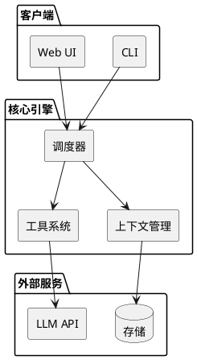
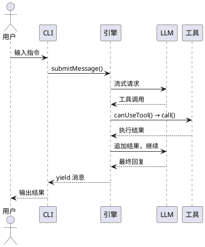
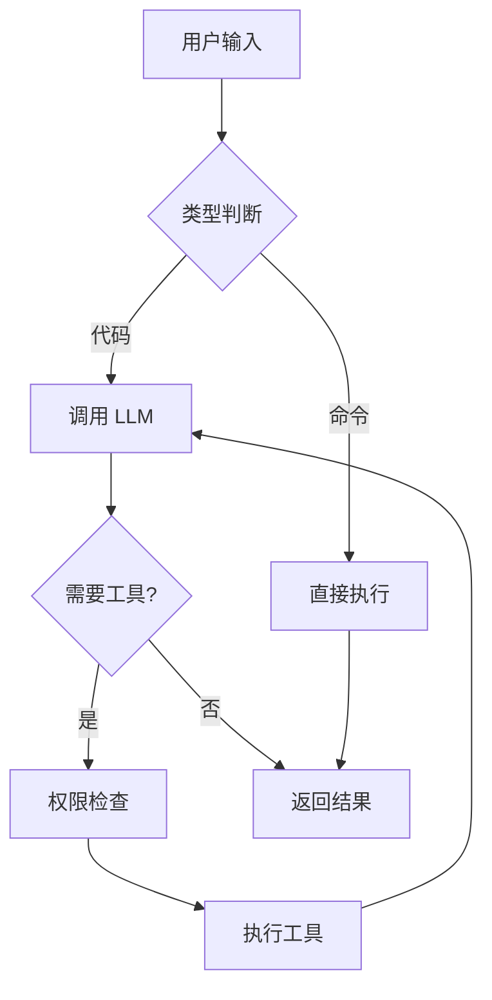
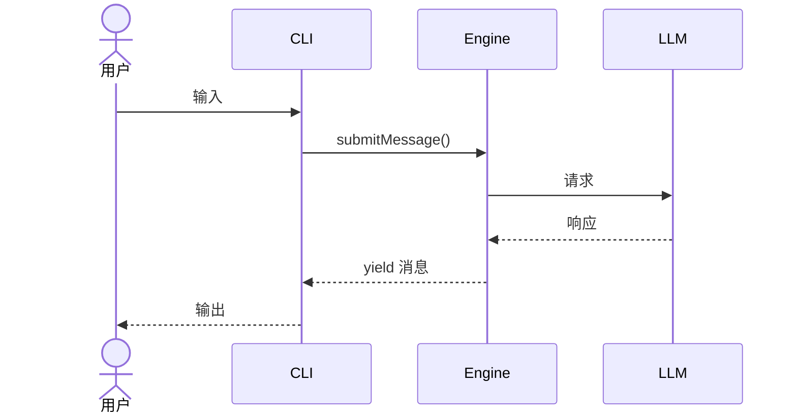

# GitHub 热门项目博客生成

> 从 GitHub Trending 中选择热门项目，生成**有深度**的博客文章草稿。

## 触发

用户输入 `/github-trending-blog` 时执行此工作流。

## 工作流

### Phase 1：抓取热门项目

运行辅助脚本获取 GitHub Trending（默认过滤已写过的项目）：

```bash
pnpm trending --filter 10
```

脚本会自动扫描 `src/content/posts/` 中所有文章提到的 GitHub 仓库，过滤掉已经写过的。被过滤的项目会输出到 stderr。

脚本输出 JSON 数组，每项包含 `rank`, `repo`, `url`, `description`, `language`, `totalStars`, `forks`, `starsToday`, `covered`。

将结果格式化为表格展示给用户：

```
| # | 项目 | 描述 | 语言 | 总星标 | 今日 + |
|---|------|------|------|--------|--------|
| 1 | owner/repo | ... | TypeScript | 123.6k | 1,196 |
```

**暂停，等待用户选择 2-3 个项目编号。**

如果用户不想选择，默认取今日新增星标最多的前 3 个。

如果过滤后结果不足 3 个，提示用户是否关闭过滤看完整列表（`pnpm trending 30`）。

---

### Phase 2：调研选定项目

对用户选择的每个项目，**充分收集信息**（深度文章的基础）：

#### 2.1 仓库基础信息

```bash
curl -s "https://api.github.com/repos/{owner}/{repo}"
```

提取：`stargazers_count`, `forks_count`, `open_issues_count`, `license.spdx_id`, `topics`, `created_at`, `updated_at`, `pushed_at`, `homepage`, `default_branch`, `language`。

#### 2.2 README

```bash
curl -s "https://api.github.com/repos/{owner}/{repo}/readme" \
  -H "Accept: application/vnd.github.raw"
```

**重点提取**：
- 项目定位和核心卖点
- 架构图（如果 README 中有，转化为 PlantUML/Mermaid）
- 安装和使用示例（必须原样保留，不编造）
- 与同类项目的对比
- 已知限制和注意事项

#### 2.3 最新 Release

```bash
curl -s "https://api.github.com/repos/{owner}/{repo}/releases/latest"
```

#### 2.4 项目目录结构（源码分析类型必须）

```bash
curl -s "https://api.github.com/repos/{owner}/{repo}/contents"
```

对关键目录递归获取（限制深度 2 层），重点关注 `src/`, `lib/`, `cmd/`, `pkg/`, `internal/` 等。

#### 2.5 核心源码文件（源码分析类型必须）

根据目录结构和 README，识别并获取 3-5 个核心文件的源码。优先获取：
- 入口文件（`main.ts`, `index.ts`, `cli.ts` 等）
- 核心逻辑文件（`engine.ts`, `core.ts`, `handler.ts` 等）
- 类型定义文件（`types.ts`, `config.ts` 等）
- 配置文件（`package.json`, `Cargo.toml` 等）

#### 2.6 同类项目（如有必要）

通过 README 或 GitHub search 找 1-2 个同类项目，用于对比分析。

---

### Phase 3：生成博客文章

#### 3.1 确定文章类型

根据项目特征选择文章类型：

**项目解读 + 快速上手**（默认）：
- 工具类项目（CLI、库、框架、SaaS）
- 用户可以直接上手使用的项目
- 偏向"是什么、怎么用、为什么这样设计"

**源码分析 / 架构解读**：
- 有独特架构设计的项目（stars > 5k 且有明确的技术亮点）
- 用户选择此类型（可手动指定）
- 偏向"怎么实现、为什么这样设计、有什么权衡"

#### 3.2 文件名

从仓库名生成：
- `owner/repo` → `{repo}-{补充关键词}.md`
- 小写英文 + 连字符
- 示例：`iptv-org/iptv` → `iptv-org-global-iptv-channels.md`

#### 3.3 Frontmatter

```yaml
---
title: "{项目名}：{一句话定位}"
description: "{2-3 句话描述，含星标数和核心能力，用于 SEO}"
date: {YYYY-MM-DD，今天日期}
category: "{从以下 4 个中选 1 个}"
tags: ["{tag1}", "{tag2}", "{tag3}", "{tag4}", "{tag5}"]
draft: true
---
```

**category 合法值**（必须选其一）：
- `AI 工程` — AI Agent、LLM、RAG、MCP 相关
- `工具教程` — 开发/效率工具（大多数 GitHub 项目归此类）
- `前端开发` — 前端框架、样式、静态站点
- `后端开发` — Java、Maven、后端架构

**tags 规则**：
- 小写英文，连字符分隔
- 包含：项目名、主要语言、核心技术、领域关键词
- 建议 3-5 个

#### 3.4 架构图规范（PlantUML / Mermaid）

**选择原则**：

| 场景 | 推荐 | 原因 |
|------|------|------|
| 系统整体架构、组件关系 | **PlantUML** | 布局自动、表达力强、适合复杂架构 |
| 数据流/控制流 | **Mermaid** flowchart | 简洁直观，支持点击放大 |
| 请求处理流程、时序 | **PlantUML** 时序图 | 专业、清晰、支持生命周期 |
| 模块依赖关系 | **PlantUML** 组件图 | 适合展示包/模块间关系 |
| 状态机、生命周期 | **Mermaid** stateDiagram | 语法简洁 |
| 部署架构 | **PlantUML** 部署图 | 有专门的部署元素 |

**PlantUML 示例模板**：

组件/架构图：


时序图：


**Mermaid 示例模板**：

流程图：


时序图：


**使用规则**：
- 每篇文章**至少包含 1 张架构图**（源码分析类型至少 2 张）
- PlantUML 必须包含 `@startuml` / `@enduml`
- Mermaid 不加 `@start` / `@end`
- 图中文字使用**中文**标签
- 保持简洁，一张图只表达一个核心概念
- PlantUML 写完后**必须运行 `pnpm check-plantuml` 验证**

#### 3.5 写作风格（必须严格遵守）

- 中文撰写，技术术语保留英文
- 直接切入主题，不铺垫不废话
- 不用营销语气（"直击痛点"、"非常强大"、"值得关注"）
- 不用 emoji 装饰正文
- 不拉踩竞品
- 正文从 `##` 开始，不用 `#`
- 最深到 `####`
- 代码块始终指定语言
- **要有观点**：对设计决策给出你的判断，不要只罗列事实
- **要有对比**：和同类方案比，或者和"常见做法"比，说清楚差异
- **要有权衡**：每个设计选择都有代价，写出来

#### 3.6 深度模板 — 项目解读 + 快速上手

```markdown
## {项目名}：{一句话定位}

> *"{用一句引言概括项目的设计哲学或核心思想}"*

## 它要解决什么问题

{不要说"XX 已经很流行了"，直接说痛点}
{这个问题为什么难？现有方案差在哪里？}
{2-3 段，建立问题上下文}

## 项目概览

| 项目 | 值 |
|------|-----|
| 仓库 | [{owner}/{repo}](https://github.com/{owner}/{repo}) |
| Stars | {数字}（截至 {日期}） |
| 许可证 | {license} |
| 语言 | {language} |
| 最新版本 | {tag}（{日期}） |
| 架构 | {一句话描述核心架构模式} |

## 核心设计

```plantuml
@startuml
{用组件图展示整体架构}
@enduml
```

### 机制 1：{名称}

{这个机制做什么}
{怎么实现的（代码片段或流程说明）}
{为什么这样设计}

### 机制 2：{名称}

{同上}

## 5 分钟上手

### 安装

{最简方式，一个代码块}

### 基本使用

{2-3 个最常用的场景，每个配代码块}

### 配置要点

{关键配置项}

## 和其他方案的对比

{客观对比，不拉踩}

| 维度 | {本项目} | {方案 B} |
|------|---------|---------|
| {维度 1} | | |
| {维度 2} | | |

## 设计上的权衡

| 决策 | 得到的 | 失去的 |
|------|--------|--------|
| {选择} | {好处} | {代价} |

## 适用场景与边界

| 场景 | 推荐？ | 原因 |
|------|--------|------|

## 参考链接

- [GitHub 仓库](https://github.com/{owner}/{repo})
- [官方文档]({url})
```

#### 3.7 深度模板 — 源码分析 / 架构解读

```markdown
## {项目名}：{一句话定位}

> *"{设计哲学/核心思想}"*

## 它要解决什么问题

{同项目解读模板}

## 项目概览

| 项目 | 值 |
|------|-----|
| 仓库 | [{owner}/{repo}](https://github.com/{owner}/{repo}) |
| Stars | {数字}（截至 {日期}） |
| 许可证 | {license} |
| 语言 | {language} |
| 代码规模 | {文件数} 文件，{代码行数} 行 |
| 核心架构 | {架构模式} |

## 技术栈

| 层 | 选型 | 原因 |
|----|------|------|
| {层 1} | {技术} | {为什么选它} |
| {层 2} | {技术} | {为什么选它} |

## 项目结构

```
{目录树}
├── src/
│   ├── core/        # {职责}
│   ├── tools/       # {职责}
│   └── utils/       # {职责}
├── tests/           # {职责}
└── docs/            # {职责}
```

## 核心架构

```plantuml
@startuml
{系统整体架构图（组件图或包图）}
@enduml
```

{2-3 段解释架构全貌}

## 源码导读

### 1. {核心组件} — {角色}

文件：`src/xxx.ts`

{代码片段（带行号引用），关键实现}

{这段代码解决了什么问题？为什么这样写？}

```plantuml
@startuml
{该组件的时序图或流程图}
@enduml
```

### 2. {核心流程} — {入口}

{教学版 vs 生产版的对比表格，展示复杂度}

| 层 | 简单实现 | 生产实现 |
|----|---------|---------|
| {层} | {做法} | {做法} |

### 3. {有意思的实现细节}

{挑 1-2 个代码亮点，附片段和分析}

## 关键设计决策

| 决策 | 原因 | 权衡 |
|------|------|------|
| {选择 A 而非 B} | {原因} | {代价} |

## 踩过的坑

{项目作者在开发中遇到的难题，或者这个领域常见的反模式}

### 坑 1：{名称}

{什么问题}
{怎么解决的}

## 和其他方案的对比

{技术对比，有数据给数据}

## 适用场景与边界

| 场景 | 推荐？ | 原因 |
|------|--------|------|

## 参考链接

- [GitHub 仓库](https://github.com/{owner}/{repo})
- [官方文档]({url})
```

#### 3.8 保存与验证

将文章写入 `src/content/posts/{文件名}.md`。

**如果文章包含 PlantUML 代码块**，写完后必须运行：

```bash
pnpm check-plantuml
```

验证失败则修复语法，重新验证直到通过。

---

### Phase 4：完成提示

所有文章生成后，输出：

```
已生成 N 篇文章草稿：

1. src/content/posts/{slug1}.md — {title1}
   - 包含 X 张 PlantUML 图，Y 张 Mermaid 图
2. src/content/posts/{slug2}.md — {title2}
   - 包含 X 张 PlantUML 图，Y 张 Mermaid 图

所有文章 draft: true，可用以下命令预览：

  pnpm dev
  # 访问 http://localhost:4321

审阅后将 draft 改为 false 即可发布。
```

---

## 注意事项

1. **星标数格式化**：≥ 1000 的星标使用 k 单位（如 `123.6k`）
2. **日期**：始终使用当天日期
3. **不要编造内容**：API 获取不到的信息，跳过相关章节
4. **代码示例**：从 README 或源码中提取真实命令，不编造
5. **架构图（强制）**：每篇文章至少 1 张图，源码分析类型至少 2 张
6. **PlantUML 验证（强制）**：包含 PlantUML 的文章必须 `pnpm check-plantuml` 通过
7. **文章长度**：项目解读类 2000-3500 字，源码分析类 3000-5000 字
8. **深度要求**：必须有"设计决策"或"权衡"分析，不要只罗列功能
9. **对比要求**：至少有 1 个同类方案对比或教学版 vs 生产版对比
