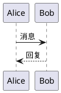
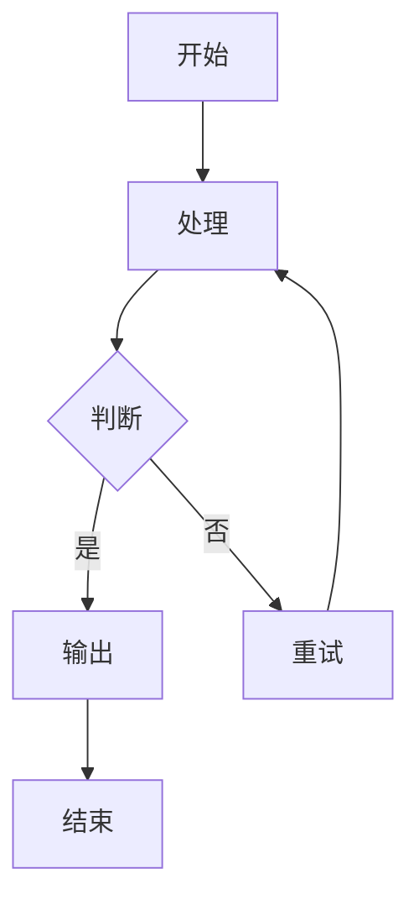

# CLAUDE.md — 书山有路博客项目规则

> 本文件是 AI 模型在本项目中工作的规则手册。每次对话自动加载，务必遵守。

## 项目概览

| 项目 | 值 |
|------|-----|
| 名称 | 书山有路 (mountain-of-book) |
| 框架 | Astro 5 (静态输出) |
| 样式 | Tailwind CSS 3 + @tailwindcss/typography |
| 语言 | TypeScript (strict) |
| 包管理 | pnpm 9 |
| Node.js | ≥ 20（推荐 22+，禁用奇数版本） |
| 部署 | GitHub Pages → `fblog.younote.top` |
| 自定义域名 | `public/CNAME` → `fblog.younote.top` |
| 站点 URL | `https://fblog.younote.top`（astro.config.mjs 中的 `site`） |
| 测试 | Playwright（端口 4322） |

### 核心特性
- Shiki 代码高亮（GitHub Dark 主题）
- PlantUML 图表渲染（远程 SVG，plantuml-encoder）
- Mermaid 图表渲染（客户端，支持点击放大）
- 暗色模式（class 切换）
- 分类归档系统（AI 工程 / 工具教程 / 前端开发 / 后端开发）
- 标签归档系统
- 阅读时间计算
- 目录自动生成（TableOfContents）
- 搜索功能（search-index.json）
- RSS 订阅
- Sitemap 自动生成
- 宝可梦浮动伙伴（FloatingCompanion）
- 草稿/发布工作流

---

## 目录结构

```
├── src/
│   ├── content/posts/     # Markdown 文章（核心内容目录）
│   ├── layouts/           # 页面布局（BaseLayout.astro）
│   ├── pages/             # 路由页面
│   │   ├── posts/[slug].astro       # 文章详情页
│   │   ├── categories/index.astro   # 分类索引页
│   │   ├── categories/[category].astro  # 分类归档页
│   │   ├── tags/[tag].astro         # 标签归档页
│   │   ├── archive.astro       # 归档页
│   │   ├── timeline.astro      # 时间线
│   │   ├── collection.astro    # 合集页
│   │   ├── tools.astro         # 工具页
│   │   ├── todo.astro          # 待办页
│   │   ├── dev/                # 开发模式页面
│   │   └── api/                # API 路由（搜索索引等）
│   ├── components/        # Astro 组件
│   ├── lib/               # 工具函数和 remark 插件
│   └── styles/            # 全局样式
├── public/
│   ├── admin/             # Decap CMS 后台（如使用）
│   ├── CNAME              # 自定义域名
│   └── robots.txt
├── tests/                 # Playwright 端到端测试
├── docs/                  # 项目文档
├── .github/workflows/     # GitHub Actions
├── astro.config.mjs       # Astro 配置（含开发模式中间件）
├── tailwind.config.mjs    # Tailwind 配置
├── wrangler.toml          # Cloudflare Pages 配置（备用）
└── playwright.config.ts   # Playwright 测试配置
```

---

## 一、本地启动规则

### 启动流程

```bash
# 1. 安装依赖（必须用 pnpm）
pnpm install

# 2. 启动开发服务器（端口 4321）
pnpm dev

# 3.（可选）构建并预览（端口 4321）
pnpm build && pnpm preview

# 4.（可选）运行端到端测试（需先启动 dev server，端口 4322）
pnpm test
```

### 关键约束

1. **包管理器**：必须使用 `pnpm`，不要使用 npm 或 yarn。GitHub Actions 也用 pnpm。
2. **开发服务器端口**：Astro 默认 4321，Playwright 测试配置为 4322。
3. **构建输出**：`dist/` 目录，`output: 'static'` 纯静态输出。
4. **环境变量**：如有本地环境变量放在 `.env.local`，已被 gitignore。
5. **开发模式中间件**：`astro.config.mjs` 中内置了 Vite 插件中间件，提供：
   - `POST /api/create-post` — 创建新文章（自动生成 slug 和 frontmatter）
   - `POST /api/publish-post` — 发布文章（draft: true → false）
   - `POST /api/unpublish-post` — 取消发布（draft: false → true）
6. **缓存目录**：`.astro/` 是 Astro 缓存，遇到问题可删除后重启。

### 开发排查

| 问题 | 解决方案 |
|------|---------|
| 依赖安装失败 | 删除 `node_modules/` 和 `pnpm-lock.yaml`，重新 `pnpm install` |
| 构建报错 | 删除 `.astro/` 缓存目录，重新 `pnpm build` |
| 端口被占用 | 检查 4321/4322 端口，或修改 `playwright.config.ts` |
| PlantUML 不渲染 | 检查网络（需要访问 `www.plantuml.com` 远程服务） |
| Mermaid 不渲染 | 检查浏览器控制台，可能是语法错误 |

---

## 二、文档/内容生成规则

### 2.1 文章 Frontmatter 规范

每篇文章必须包含 YAML frontmatter，格式如下：

```yaml
---
title: "文章标题"                    # 必填，字符串
description: "文章描述/摘要"          # 可选，建议填写（用于 SEO 和列表展示）
date: 2026-04-23                    # 必填，ISO 日期格式 YYYY-MM-DD
category: "工具教程"                 # 可选，文章所属分类（见下方合法值）
tags: ["tag1", "tag2"]              # 可选，字符串数组
draft: false                        # 必填，布尔值（默认 false）
---
```

**规则**：
- `title`：使用双引号包裹，标题应简洁明确，不超过 50 字
- `description`：使用双引号包裹，100-200 字为宜，用于 SEO `<meta name="description">` 和社交分享
- `date`：纯日期格式 `YYYY-MM-DD`，不加引号
- `category`：文章分类，从以下 4 个合法值中选择（一篇一个分类）：
  - `AI 工程` — AI Agent、LLM、RAG、MCP 相关的工程实践
  - `工具教程` — 各类开发/效率工具的使用指南
  - `前端开发` — 前端框架、样式、静态站点相关
  - `后端开发` — Java、Maven、后端架构相关
- `tags`：使用小写英文或拼音，用连字符 `-` 连接多词标签（如 `sequence-diagram`），不使用中文
- `draft`：新文章默认 `true`，发布时改为 `false`

### 2.2 文件命名规则

- **文件名**：使用小写英文 + 连字符分隔，如 `maven-settings-xml-config.md`
- **命名模式**：`{主题关键词}-{补充说明}.md`，例如：
  - ✅ `astro-quick-start.md`
  - ✅ `plantuml-sequence-diagram-guide.md`
  - ✅ `jdk-versions-features.md`
  - ❌ `My Article.md`（不要大写、空格、中文）
  - ❌ `2026-04-23-maven.md`（不要在文件名中重复日期）
- **存放路径**：所有文章统一放在 `src/content/posts/` 目录下
- **URL 路径**：自动生成 `/posts/{文件名去掉.md}/`，例如：
  - `src/content/posts/maven-guide.md` → `/posts/maven-guide/`

### 2.3 文章结构

#### 四条结构原则（所有文章都遵守）

1. **价值前置**：开头一段让读者 30 秒内判断要不要读下去——讲清「这是什么」+「读完能得到什么」。不铺垫、不抖包袱（参见 §2.12 文章开头规范）。
2. **结论先行（倒金字塔）**：先给全貌/结论，再展开细节。读者在任意章节停下都不错过核心，最忌「层层铺垫、结论在最后」。
3. **可跳读**：每个 `##` 是独立信息单元，标题写成有信息量的短语而非空泛词（用「多后端路由如何工作」而非「原理」）。扫一遍目录就能掌握全文脉络。
4. **行动闭环**：结尾给「出口」——下一步怎么做、延伸到哪、或作者的一句判断。不要用复述前文的「总结」收尾。

#### 文字简洁（重要）

- **能用图就不用大段文字**：结构、流程、关系、架构一律优先画 PlantUML 图（见 §2.6），图能表达的就不要用文字复述一遍。
- 一个段落只讲一件事，超过 4-5 行就拆分或改成列表。
- 删掉所有不增加信息量的句子（"接下来我们来看看……""值得注意的是……"）。
- 代码/配置用代码块展示，不要用文字描述代码在做什么。

#### 按「写作意图」选骨架

**先判断这篇文章想干什么，再选对应骨架**（一篇选一个主骨架，标 `*` 的为可选段）。正文首个 `##` 直接是骨架的第一项，**不要重复文章标题**。

**① 项目评介型**（介绍一个开源项目 / 工具）
```text
## 简介              —— 1 段讲清定位 + 亮点数据
## 项目概览          —— 一张表（表头统一用 `| 属性 | 详情 |`）：仓库 / 语言 / star / 许可证 / 版本
## 背景与动机        —— 解决什么问题、为什么存在
## 快速上手          —— 最短可跑路径
## 架构与原理*       —— 关键设计，配 PlantUML 组件图或时序图
## 适用场景与局限    —— 什么场景合适、什么不合适，中立陈述
## 参考资料
```

**② 操作教程型**（教读者完成一件事）
```text
## 目标              —— 要做成什么 + 最终效果先给
## 前置条件
## 操作步骤          —— 每步：做什么 → 命令/代码 → 预期结果
## 结果验证
## 常见问题*
## 参考资料
```

**③ 问题排查型**（解决一个具体故障）
```text
## 问题现象          —— 精确描述可复现的问题
## 原因分析          —— 为什么会这样，配 PlantUML 时序图/活动图说明
## 解决方法
## 验证
## 延伸场景*
## 参考资料
```

**④ 原理解析型**（讲清某个东西怎么工作）
```text
## 概述              —— 是什么 + 为什么值得了解
## 整体架构          —— 一句话 + 一张 PlantUML 图给出心智模型
## 核心机制          —— 自顶向下逐层拆解，每层一个 ##，尽量配图
## 设计考量*
## 局限与边界
## 参考资料
```

**⑤ 速查/清单型**（版本特性、语法大全）
```text
## 适用范围          —— 这份清单覆盖什么、怎么用
## 速查表            —— 最常查的内容放最前
## 分主题详解        —— 按版本/语法点编号罗列
## 实践建议*
## 参考资料
```

**统一约定**：
- 文末收尾段统一命名为「参考资料」。
- 章节名用规范、书面的术语（如「架构与原理」「适用场景与局限」），不要用「这是什么」「怎么用」这类过于口语化的命名。
- 章节名应有信息量：同一含义在全站保持统一叫法（参见上方各骨架的标准章节名），不要每篇即兴命名。

#### 📋 文章完成后的强制检查流程

**写完文章后，必须按以下顺序检查：**

1. **Frontmatter 检查**：确认所有必填字段完整且格式正确
2. **内容检查**：确认标题层级、代码块语言、链接格式等
3. **PlantUML 验证**（如果包含 PlantUML 代码块）：
   ```bash
   pnpm check-plantuml
   ```
   - 如果验证失败，根据错误提示修复，重新运行直到通过
   - **不要跳过这一步**
4. **构建测试**：
   ```bash
   pnpm build
   ```
   - 确认构建成功，无错误
5. **本地预览**：
   ```bash
   pnpm preview
   ```
   - 访问 `http://localhost:4321` 检查页面渲染效果

### 2.4 标题层级规则

- 文章正文从 `##`（h2）开始，不使用 `#`（h1，已被文章标题占用）
- 最深到 `####`（h4），避免过深层级
- 每个 `##` 章节之间用 `---` 分隔线隔开（可选但推荐）
- 目录（TableOfContents）会自动从 headings 生成

### 2.5 代码块规范

使用标准 Markdown 围栏代码块，必须指定语言：

````markdown
```javascript
// JavaScript 代码示例
const greeting = 'Hello World';
console.log(greeting);
```

```java
// Java 代码示例
public class Main {
    public static void main(String[] args) {
        System.out.println("Hello World");
    }
}
```

```bash
# Shell 命令
pnpm install
pnpm build
```
````

**规则**：
- 始终指定语言标识符（`javascript`, `java`, `bash`, `yaml`, `xml` 等）
- **目录树、文件结构图、纯文本输出必须标 `text`**（不要留空）。留空的围栏会让 Shiki 失去高亮且语义不清。
  - 例如展示 `src/ ├── ...` 这类目录树、命令的纯文本输出、流程示意，统一用 ` ```text `
  - 展示 XML/HTML 结构片段用 `xml` / `html`，不要留空
- 使用 Shiki GitHub Dark 主题渲染，支持 100+ 语言
- 长代码文件只展示关键片段，用注释 `// ...` 表示省略
- 配置文件应展示完整可用的内容

### 2.6 PlantUML 图表规范

使用 `plantuml` 代码块，通过远程 `plantuml.com` 渲染为 SVG：

````markdown

````

**规则**：
- 必须包含 `@startuml` 和 `@enduml`
- 图表内容保持简洁，避免过于复杂
- PlantUML 渲染依赖外部服务（`www.plantuml.com`），需要网络连接
- 适合：时序图、用例图、类图、活动图、组件图
- 渲染为 `` 标签，自带 `loading="lazy"`

**优先用图替代文字（重要）**：
- 本博客鼓励多配图。凡是涉及以下内容，**优先画一张 PlantUML 图，而不是用大段文字描述**：
  - **流程 / 步骤 / 数据流** → 活动图或时序图
  - **架构 / 模块关系 / 组件依赖** → 组件图
  - **调用过程 / 交互时序** → 时序图
  - **状态变化** → 状态图
  - **类 / 数据结构关系** → 类图
- 判断标准：如果你正在用文字描述「A 调用 B，B 再调用 C」「先做 X 再做 Y 最后 Z」这类结构/流程关系，就改成图。
- 图配一句话说明即可，不要图文重复——图已表达的内容不要再用文字复述一遍。
- 一篇项目评介型 / 原理解析型文章，正文里至少应有一张架构或流程图。

**⚠️ 强制验证**：
- **写完 PlantUML 代码后，必须立即运行 `pnpm check-plantuml` 验证语法**
- 如果验证失败，根据错误提示修复代码，直到验证通过
- 验证工具使用本地 PlantUML JAR（`bin/plantuml.jar`），无需网络
- 示例：
  ```bash
  # 校验所有文章的 PlantUML
  pnpm check-plantuml
  
  # 校验单个文件
  ./scripts/validate-plantuml.sh diagram.puml
  ```

**PlantUML JAR 安装**（仅首次需要）：
```bash
# 下载官方 JAR（约 20MB）
curl -L -o bin/plantuml.jar https://github.com/plantuml/plantuml/releases/download/v1.2025.2/plantuml-1.2025.2.jar

# 验证安装
java -jar bin/plantuml.jar -version
```

**注意**：
- 系统需要安装 Java 11+（推荐 Java 17）
- JAR 文件已添加到 `.gitignore`，不会提交到仓库

### 2.7 Mermaid 图表规范

使用 `mermaid` 代码块，客户端渲染：

````markdown

````

**规则**：
- 不需要 `@start` / `@end` 标记（与 PlantUML 不同）
- 支持的类型：`graph`（流程图）、`sequenceDiagram`、`classDiagram`、`stateDiagram`、`gantt`、`pie` 等
- 客户端渲染，离线可用
- 支持点击放大（模态框查看）
- 中文标签直接使用即可
- 避免过长的节点文本，保持图表可读性

### 2.8 图片处理

- 静态图片放在 `public/` 目录下，使用绝对路径引用：`/images/xxx.png`
- 或使用外部图片 URL
- 始终添加 `alt` 属性描述图片内容
- 大图片建议压缩后使用

### 2.9 SEO 与元数据

- `description` frontmatter 字段会作为页面 meta description
- 页面标题格式：`{文章标题} | 书山有路`
- Open Graph 和 Twitter Card 自动生成（基于 frontmatter）
- `keywords` 可通过 BaseLayout 的 props 手动指定
- 文章 URL 格式：`https://fblog.younote.top/posts/{slug}/`

### 2.10 草稿工作流

1. **新建文章**：`draft: true`，本地开发可见
2. **发布文章**：改为 `draft: false`，推送到 main 自动部署
3. **取消发布**：改回 `draft: true`
4. **注意**：`draft: true` 的文章不会出现在首页列表、标签页、归档页、RSS、sitemap 中
5. **API 快捷操作**：开发模式下可通过 `/api/publish-post` 和 `/api/unpublish-post` 接口切换

### 2.11 标签规范

- 使用小写英文，连字符分隔：`sequence-diagram`，`build-tool`
- 每篇文章建议 1-5 个标签
- 常用标签示例：`astro`, `java`, `maven`, `plantuml`, `uml`, `frontend`, `backend`, `devops`
- 标签页自动生成：`/tags/{tag}/`
- 标签索引页：`/tags/`

### 2.12 写作语言与风格

- 文章使用**中文**撰写
- 技术术语保留英文原文（如 Maven、Astro、PlantUML）
- 代码注释使用中文或英文均可
- 段落不宜过长，善用列表和代码块
- 重要概念使用**加粗**标记
- 客观陈述事实型对比可用表格（如版本特性差异、配置项含义），但不得用表格突出某工具的优势

#### 语气与风格（重要）

**博客定位：个人技术笔记，不是产品宣传稿。** 写作时假想读者是一位同样懂技术的同行，你在向他平实地分享你了解到的东西，而不是向用户推销一款产品。

下面每条都给出**真实反例**（取自本项目历史文章）和**正确写法**，照此执行：

- **禁止推销语气**：不使用"直击痛点""核心卖点""核心优势""核心场景""为什么值得关注""值得一试""适合人群""强烈推荐"等营销话术。
  - 反例：`| 让 Agent 读社交媒体 | 强烈推荐 | 这是它的核心场景 |`
  - 正确：客观描述工具能做什么、不能做什么，让读者自己判断是否适合，不替读者下"推荐/不推荐"结论。

- **禁止"是否适合用 X"推荐表 / 适用人群表**：不要写"是否适合用 X？→ 强烈推荐 / 推荐 / 不推荐"这类决策表，也不要写"适合人群 / 适用场景"小节去引导读者。
  - 反例：`| 需要在多个模型间切换 | 强烈推荐 | 这是 Kilo 的核心优势 |`
  - 正确：如果确实想说明能力边界，改成中性的**能力清单**——"支持：多模型切换、VS Code / JetBrains 扩展；不支持：网页操作（只读不写）"。陈述事实，不带推荐措辞。

- **禁止拉踩竞品**：不做对比表来突出某工具优于竞品。客观的事实差异（如"A 用 Rust，B 用 Go"）可以陈述，但不加"更好/更强/碾压"之类评判。

- **禁止过度修辞**：不用"最有意思的""非常强大""令人惊叹""致命问题""黑洞"等主观夸张评价。用具体数据或事实代替形容词（如不说"非常快"，而说"比 grep 方案少 90% token"）。

- **禁止多余总结段**："总结/小结"段如果只是把前文重说一遍，就删掉。有价值的总结应提炼新观点、点明适用边界、或给出下一步行动建议。

- **禁止无意义的 emoji**：正文（含表格）不用 ✅ ❌ ⚠️ ✨ 💡 等 emoji 装饰。
  - 反例：表格单元格里用 `✅ / ❌` 表示支持与否。
  - 正确：用文字"支持 / 不支持""是 / 否"，或留空。emoji 仅可出现在代码块注释或特殊标记场景。

#### 文章开头规范（重点，历史文章最常犯）

**严禁"能力铺垫 → 但是痛点 → 本工具登场"的三段式套路开场**，也不要用反问、金句引言来铺垫。这是本项目最高频的违规模式。

真实反例（都不要这样写）：
- "AI Agent 能写代码、改文档——但你让它去网上找点东西，它就抓瞎了。"
- "Playwright 和 Puppeteer 是主流工具，但它们有一个致命问题……"
- "你让 AI Agent 帮你调研一个人，它能做什么？Google 搜一下？那得到的是……"（反问铺垫）
- "AI 领域的学习资源浩如烟海，但大部分是碎片化的……"
- 用一句加粗斜体金句（`> *"你不需要另一个 AI 工具……"*`）开场。

**正确做法**：第一句话直接说明①这是什么 或 ②本文解决什么问题。两种合规范式：

```markdown
<!-- 范式 A：直接定义对象（介绍类文章） -->
## Maven 快速上手

Maven 是 Apache 开源的 Java 项目管理和构建工具，基于 POM 模型管理项目的构建、依赖和文档。

<!-- 范式 B：直接陈述问题（排查/方案类文章） -->
## 解决 Astro 开发服务器无法通过 Tailscale 访问

Astro 开发服务器默认绑定 localhost，只接受本机连接，导致通过 Tailscale 或局域网 IP 访问时连接超时。本文说明原因和解决方法。
```

判断标准：把开头第一段读给同行听，如果前两句还没进入"它是什么/要解决什么"，就是在铺垫，删掉重写。

#### 文章长度控制

- 工具介绍类文章：聚焦安装、核心功能、配置，不逐项罗列所有 feature
- 问题排查类文章：问题描述 → 原因 → 解决方案 → 验证，不要每个环节都展开三段
- 全文控制在合理长度内，读者 3-5 分钟内能获取核心信息
- 知识总结型长文（如版本特性、语法大全）可以更长，但应有清晰的章节结构和目录，便于跳读

---


## 三、部署规则（GitHub Pages）

### 3.1 部署流程

```
git push origin main → GitHub Actions 自动触发 → 构建 → 部署到 GitHub Pages
```

### 3.2 GitHub Actions 工作流（`.github/workflows/deploy.yml`）

- **触发条件**：推送到 `main` 分支，或手动 `workflow_dispatch`
- **运行环境**：`ubuntu-latest`
- **构建步骤**：
  1. Checkout 代码
  2. 安装 Node.js 20
  3. 安装 pnpm 9
  4. `pnpm install --frozen-lockfile`（锁定依赖版本）
  5. `pnpm run build`（生成 `dist/` 目录）
  6. 上传 artifact → 部署到 GitHub Pages
- **部署目标**：GitHub Pages，URL 由 `environment` 自动管理

### 3.3 部署前检查清单

推送代码到 main 之前，必须确认：

- [ ] 本地 `pnpm build` 构建成功（零错误）
- [ ] **`pnpm check-plantuml` 验证通过**（所有 PlantUML 语法正确）
- [ ] 新文章的 `draft` 字段已设为 `false`（如果要发布）
- [ ] frontmatter 格式正确（title、date 必填）
- [ ] 文件名符合命名规范（小写 + 连字符）
- [ ] Mermaid 图表语法正确（本地预览验证过）
- [ ] 没有遗留 `console.log` 或调试代码
- [ ] 图片链接可正常访问

### 3.4 部署注意事项

1. **构建失败**：GitHub Actions 会失败，站点保持上一版本不变。检查 Actions 日志排查。
2. **`--frozen-lockfile`**：CI 使用锁定安装，如果依赖变更后需提交更新的 `pnpm-lock.yaml`。
3. **自定义域名**：`public/CNAME` 文件确保存在于仓库中，构建后会复制到 `dist/`。
4. **缓存**：GitHub Pages 有自己的缓存，部署后如果看到旧内容，硬刷新（Ctrl+Shift+R）。
5. **不要手动修改 `dist/`**：它是构建产物，由 CI 自动生成。
6. **Cloudflare Pages**：项目保留了 `wrangler.toml`，但当前主力部署方案是 GitHub Pages，不要随意修改部署配置。

### 3.5 部署后验证

部署完成后检查：
1. 访问 `https://fblog.younote.top` 确认首页正常
2. 检查新文章页面 `/posts/{slug}/` 渲染正确
3. 验证 PlantUML/Mermaid 图表显示正常
4. 检查暗色模式切换正常
5. 确认 RSS 订阅包含新文章

---

## 四、代码规范

### 4.1 Astro 组件

- 组件文件使用 PascalCase 命名：`BaseLayout.astro`、`ThemeToggle.astro`
- 组件放在 `src/components/` 目录
- 布局文件放在 `src/layouts/` 目录
- 使用 Astro 的 `---` frontmatter 块处理组件逻辑
- 样式使用 `<style>` 标签作用域隔离，或 Tailwind 类名

### 4.2 TypeScript

- 使用 `strict` 模式（`tsconfig.json` 继承 `astro/tsconfigs/strict`）
- 路径别名：`@/*` → `src/*`
- 工具函数放在 `src/lib/` 目录
- remark 插件遵循 unified 插件规范

### 4.3 样式

- 全局样式在 `src/styles/global.css`
- 使用 Tailwind CSS 工具类优先
- 暗色模式使用 `dark:` 前缀
- 排版使用 `@tailwindcss/typography` 的 `prose` 类
- 最大内容宽度 `720px`（typography 配置）

### 4.4 测试

- 测试文件放在 `tests/` 目录，命名 `{功能}.spec.ts`
- 使用 Playwright，测试前需要 dev server 运行在 4322 端口
- 运行测试：`pnpm test`
- UI 模式：`pnpm test:ui`
- 调试模式：`pnpm test:debug`
- CI 环境自动重试 2 次

---

## 五、AI 工作约束

### 创建/编辑文章时

1. 始终检查 frontmatter 是否完整和格式正确
2. 文件名遵循命名规范
3. 新文章默认 `draft: true`
4. 正文从 `##` 开始，不使用 `#`
5. 代码块始终指定语言
6. PlantUML 使用 `@startuml`/`@enduml`，Mermaid 不使用
7. 中文撰写，技术术语保留英文
8. 提供有意义的 `description` 用于 SEO
9. **PlantUML 验证（强制）**：
   - 文章中包含 PlantUML 代码块时，写完后**必须立即**运行 `pnpm check-plantuml`
   - 验证失败时，根据错误提示的行号和代码修复语法，重新验证直到通过
   - 不要跳过这一步，不要假设代码是正确的
   - 验证工具使用本地 JAR，速度快，无网络依赖
10. **写作风格自检（强制）**：写完文章后，对照 §2.12 逐项核对：
    - 开头第一段是否在铺垫？（前两句没进入"是什么/解决什么"就重写，见 §2.12 文章开头规范）
    - 是否有"强烈推荐/核心优势/适合人群"等营销话术或"是否适合用 X"推荐表？
    - 正文/表格是否有 ✅❌⚠️ 等 emoji 装饰？
    - 目录树、纯文本、XML 代码块是否都标了语言（`text`/`xml`）？
    - "总结"段是否只是复述前文？是则删除或改为提炼观点/下一步建议。
11. **结构与配图自检（强制）**：对照 §2.3 / §2.6 核对：
    - 是否按「写作意图」选了对应骨架（§2.3 的 5 类之一）？正文首个 `##` 是否直接是骨架第一项、**没有重复文章标题**？
    - 文末收尾段是否命名为「参考资料」？
    - 涉及流程/架构/调用关系的地方，是否用 PlantUML 图替代了大段文字？项目评介型/原理解析型至少有一张架构或流程图？
    - 是否有图文重复（图已表达又用文字复述一遍）？有则删文字。
    - 段落是否过长（超过 4-5 行）？能用列表/图/代码块的不要堆文字。

### 修改代码时

1. 不随意修改 `astro.config.mjs` 中的 `site` 字段
2. 不修改 GitHub Actions 部署配置，除非用户明确要求
3. 保持 Tailwind 暗色模式 `class` 策略不变
4. 新建组件遵循现有命名和目录规范
5. 修改布局时注意 Open Graph / Twitter Card 元数据完整性

### 本地启动指导时

1. 推荐使用 `pnpm`，如用户没有 pnpm，指导先安装：`npm install -g pnpm`
2. 启动命令：`pnpm install && pnpm dev`
3. 访问地址：`http://localhost:4321`
4. 如需测试：先 `pnpm dev`，另开终端 `pnpm test`
