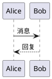
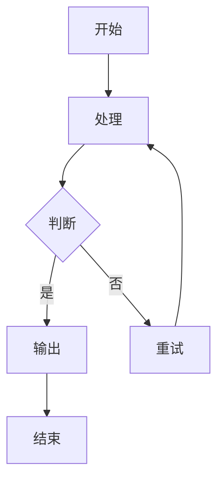

# CLAUDE.md — 书山有路博客项目规则

> 本文件是 AI 模型在本项目中工作的规则手册。每次对话自动加载，务必遵守。

## 项目概览

| 项目 | 值 |
|------|-----|
| 名称 | 书山有路 (mountain-of-book) |
| 框架 | Astro 5 (静态输出) |
| 样式 | Tailwind CSS 3 + @tailwindcss/typography |
| 语言 | TypeScript (strict) |
| 包管理 | pnpm 9 |
| Node.js | ≥ 20（推荐 22+，禁用奇数版本） |
| 部署 | GitHub Pages → `fblog.younote.top` |
| 自定义域名 | `public/CNAME` → `fblog.younote.top` |
| 站点 URL | `https://fblog.younote.top`（astro.config.mjs 中的 `site`） |
| 测试 | Playwright（端口 4322） |

### 核心特性
- Shiki 代码高亮（GitHub Dark 主题）
- PlantUML 图表渲染（远程 SVG，plantuml-encoder）
- Mermaid 图表渲染（客户端，支持点击放大）
- 暗色模式（class 切换）
- 标签归档系统
- 阅读时间计算
- 目录自动生成（TableOfContents）
- 搜索功能（search-index.json）
- RSS 订阅
- Sitemap 自动生成
- 宝可梦浮动伙伴（FloatingCompanion）
- 草稿/发布工作流

---

## 目录结构

```
├── src/
│   ├── content/posts/     # Markdown 文章（核心内容目录）
│   ├── layouts/           # 页面布局（BaseLayout.astro）
│   ├── pages/             # 路由页面
│   │   ├── posts/[slug].astro  # 文章详情页
│   │   ├── tags/[tag].astro    # 标签归档页
│   │   ├── archive.astro       # 归档页
│   │   ├── timeline.astro      # 时间线
│   │   ├── collection.astro    # 合集页
│   │   ├── tools.astro         # 工具页
│   │   ├── todo.astro          # 待办页
│   │   ├── dev/                # 开发模式页面
│   │   └── api/                # API 路由（搜索索引等）
│   ├── components/        # Astro 组件
│   ├── lib/               # 工具函数和 remark 插件
│   └── styles/            # 全局样式
├── public/
│   ├── admin/             # Decap CMS 后台（如使用）
│   ├── CNAME              # 自定义域名
│   └── robots.txt
├── tests/                 # Playwright 端到端测试
├── docs/                  # 项目文档
├── .github/workflows/     # GitHub Actions
├── astro.config.mjs       # Astro 配置（含开发模式中间件）
├── tailwind.config.mjs    # Tailwind 配置
├── wrangler.toml          # Cloudflare Pages 配置（备用）
└── playwright.config.ts   # Playwright 测试配置
```

---

## 一、本地启动规则

### 启动流程

```bash
# 1. 安装依赖（必须用 pnpm）
pnpm install

# 2. 启动开发服务器（端口 4321）
pnpm dev

# 3.（可选）构建并预览（端口 4321）
pnpm build && pnpm preview

# 4.（可选）运行端到端测试（需先启动 dev server，端口 4322）
pnpm test
```

### 关键约束

1. **包管理器**：必须使用 `pnpm`，不要使用 npm 或 yarn。GitHub Actions 也用 pnpm。
2. **开发服务器端口**：Astro 默认 4321，Playwright 测试配置为 4322。
3. **构建输出**：`dist/` 目录，`output: 'static'` 纯静态输出。
4. **环境变量**：如有本地环境变量放在 `.env.local`，已被 gitignore。
5. **开发模式中间件**：`astro.config.mjs` 中内置了 Vite 插件中间件，提供：
   - `POST /api/create-post` — 创建新文章（自动生成 slug 和 frontmatter）
   - `POST /api/publish-post` — 发布文章（draft: true → false）
   - `POST /api/unpublish-post` — 取消发布（draft: false → true）
6. **缓存目录**：`.astro/` 是 Astro 缓存，遇到问题可删除后重启。

### 开发排查

| 问题 | 解决方案 |
|------|---------|
| 依赖安装失败 | 删除 `node_modules/` 和 `pnpm-lock.yaml`，重新 `pnpm install` |
| 构建报错 | 删除 `.astro/` 缓存目录，重新 `pnpm build` |
| 端口被占用 | 检查 4321/4322 端口，或修改 `playwright.config.ts` |
| PlantUML 不渲染 | 检查网络（需要访问 `www.plantuml.com` 远程服务） |
| Mermaid 不渲染 | 检查浏览器控制台，可能是语法错误 |

---

## 二、文档/内容生成规则

### 2.1 文章 Frontmatter 规范

每篇文章必须包含 YAML frontmatter，格式如下：

```yaml
---
title: "文章标题"                    # 必填，字符串
description: "文章描述/摘要"          # 可选，建议填写（用于 SEO 和列表展示）
date: 2026-04-23                    # 必填，ISO 日期格式 YYYY-MM-DD
tags: ["tag1", "tag2"]              # 可选，字符串数组
draft: false                        # 必填，布尔值（默认 false）
---
```

**规则**：
- `title`：使用双引号包裹，标题应简洁明确，不超过 50 字
- `description`：使用双引号包裹，100-200 字为宜，用于 SEO `<meta name="description">` 和社交分享
- `date`：纯日期格式 `YYYY-MM-DD`，不加引号
- `tags`：使用小写英文或拼音，用连字符 `-` 连接多词标签（如 `sequence-diagram`），不使用中文
- `draft`：新文章默认 `true`，发布时改为 `false`

### 2.2 文件命名规则

- **文件名**：使用小写英文 + 连字符分隔，如 `maven-settings-xml-config.md`
- **命名模式**：`{主题关键词}-{补充说明}.md`，例如：
  - ✅ `astro-quick-start.md`
  - ✅ `plantuml-sequence-diagram-guide.md`
  - ✅ `jdk-versions-features.md`
  - ❌ `My Article.md`（不要大写、空格、中文）
  - ❌ `2026-04-23-maven.md`（不要在文件名中重复日期）
- **存放路径**：所有文章统一放在 `src/content/posts/` 目录下
- **URL 路径**：自动生成 `/posts/{文件名去掉.md}/`，例如：
  - `src/content/posts/maven-guide.md` → `/posts/maven-guide/`

### 2.3 文章结构模板

#### 教程/指南型文章

```markdown
---
title: "XXX 快速上手指南"
description: "简明描述"
date: YYYY-MM-DD
tags: ["xxx", "相关技术"]
draft: true
---

## XXX 快速上手指南

简要介绍本文要讲什么，为什么值得学。（2-3 段）

## 前置准备

- 环境要求
- 基础知识

## 核心内容

### 第一部分
...

### 第二部分
...

## 实践示例

具体的代码示例或操作步骤。

## 常见问题

### Q: ...
A: ...

## 总结

回顾要点，给出下一步学习建议。
```

#### 知识总结型文章

```markdown
---
title: "XXX 核心概念与实战总结"
description: "简明描述"
date: YYYY-MM-DD
tags: ["xxx"]
draft: true
---

## 简介

概述主题背景和重要性。

### 核心概念

- 概念 1
- 概念 2

## 详细说明

分点展开。

## 最佳实践

实用建议和注意事项。

## 参考资料

- [资源名](URL)
```

### 2.4 标题层级规则

- 文章正文从 `##`（h2）开始，不使用 `#`（h1，已被文章标题占用）
- 最深到 `####`（h4），避免过深层级
- 每个 `##` 章节之间用 `---` 分隔线隔开（可选但推荐）
- 目录（TableOfContents）会自动从 headings 生成

### 2.5 代码块规范

使用标准 Markdown 围栏代码块，必须指定语言：

````markdown
```javascript
// JavaScript 代码示例
const greeting = 'Hello World';
console.log(greeting);
```

```java
// Java 代码示例
public class Main {
    public static void main(String[] args) {
        System.out.println("Hello World");
    }
}
```

```bash
# Shell 命令
pnpm install
pnpm build
```
````

**规则**：
- 始终指定语言标识符（`javascript`, `java`, `bash`, `yaml`, `xml` 等）
- 使用 Shiki GitHub Dark 主题渲染，支持 100+ 语言
- 长代码文件只展示关键片段，用注释 `// ...` 表示省略
- 配置文件应展示完整可用的内容

### 2.6 PlantUML 图表规范

使用 `plantuml` 代码块，通过远程 `plantuml.com` 渲染为 SVG：

````markdown

````

**规则**：
- 必须包含 `@startuml` 和 `@enduml`
- 图表内容保持简洁，避免过于复杂
- PlantUML 渲染依赖外部服务（`www.plantuml.com`），需要网络连接
- 适合：时序图、用例图、类图、活动图、组件图
- 渲染为 `` 标签，自带 `loading="lazy"`

### 2.7 Mermaid 图表规范

使用 `mermaid` 代码块，客户端渲染：

````markdown

````

**规则**：
- 不需要 `@start` / `@end` 标记（与 PlantUML 不同）
- 支持的类型：`graph`（流程图）、`sequenceDiagram`、`classDiagram`、`stateDiagram`、`gantt`、`pie` 等
- 客户端渲染，离线可用
- 支持点击放大（模态框查看）
- 中文标签直接使用即可
- 避免过长的节点文本，保持图表可读性

### 2.8 图片处理

- 静态图片放在 `public/` 目录下，使用绝对路径引用：`/images/xxx.png`
- 或使用外部图片 URL
- 始终添加 `alt` 属性描述图片内容
- 大图片建议压缩后使用

### 2.9 SEO 与元数据

- `description` frontmatter 字段会作为页面 meta description
- 页面标题格式：`{文章标题} | 书山有路`
- Open Graph 和 Twitter Card 自动生成（基于 frontmatter）
- `keywords` 可通过 BaseLayout 的 props 手动指定
- 文章 URL 格式：`https://fblog.younote.top/posts/{slug}/`

### 2.10 草稿工作流

1. **新建文章**：`draft: true`，本地开发可见
2. **发布文章**：改为 `draft: false`，推送到 main 自动部署
3. **取消发布**：改回 `draft: true`
4. **注意**：`draft: true` 的文章不会出现在首页列表、标签页、归档页、RSS、sitemap 中
5. **API 快捷操作**：开发模式下可通过 `/api/publish-post` 和 `/api/unpublish-post` 接口切换

### 2.11 标签规范

- 使用小写英文，连字符分隔：`sequence-diagram`，`build-tool`
- 每篇文章建议 1-5 个标签
- 常用标签示例：`astro`, `java`, `maven`, `plantuml`, `uml`, `frontend`, `backend`, `devops`
- 标签页自动生成：`/tags/{tag}/`
- 标签索引页：`/tags/`

### 2.12 写作语言与风格

- 文章使用**中文**撰写
- 技术术语保留英文原文（如 Maven、Astro、PlantUML）
- 代码注释使用中文或英文均可
- 语气简洁专业，避免冗余
- 段落不宜过长，善用列表和代码块
- 重要概念使用**加粗**标记
- 适当使用表格整理对比信息

---

## 三、部署规则（GitHub Pages）

### 3.1 部署流程

```
git push origin main → GitHub Actions 自动触发 → 构建 → 部署到 GitHub Pages
```

### 3.2 GitHub Actions 工作流（`.github/workflows/deploy.yml`）

- **触发条件**：推送到 `main` 分支，或手动 `workflow_dispatch`
- **运行环境**：`ubuntu-latest`
- **构建步骤**：
  1. Checkout 代码
  2. 安装 Node.js 20
  3. 安装 pnpm 9
  4. `pnpm install --frozen-lockfile`（锁定依赖版本）
  5. `pnpm run build`（生成 `dist/` 目录）
  6. 上传 artifact → 部署到 GitHub Pages
- **部署目标**：GitHub Pages，URL 由 `environment` 自动管理

### 3.3 部署前检查清单

推送代码到 main 之前，必须确认：

- [ ] 本地 `pnpm build` 构建成功（零错误）
- [ ] 新文章的 `draft` 字段已设为 `false`（如果要发布）
- [ ] frontmatter 格式正确（title、date 必填）
- [ ] 文件名符合命名规范（小写 + 连字符）
- [ ] PlantUML/Mermaid 图表语法正确（本地预览验证过）
- [ ] 没有遗留 `console.log` 或调试代码
- [ ] 图片链接可正常访问

### 3.4 部署注意事项

1. **构建失败**：GitHub Actions 会失败，站点保持上一版本不变。检查 Actions 日志排查。
2. **`--frozen-lockfile`**：CI 使用锁定安装，如果依赖变更后需提交更新的 `pnpm-lock.yaml`。
3. **自定义域名**：`public/CNAME` 文件确保存在于仓库中，构建后会复制到 `dist/`。
4. **缓存**：GitHub Pages 有自己的缓存，部署后如果看到旧内容，硬刷新（Ctrl+Shift+R）。
5. **不要手动修改 `dist/`**：它是构建产物，由 CI 自动生成。
6. **Cloudflare Pages**：项目保留了 `wrangler.toml`，但当前主力部署方案是 GitHub Pages，不要随意修改部署配置。

### 3.5 部署后验证

部署完成后检查：
1. 访问 `https://fblog.younote.top` 确认首页正常
2. 检查新文章页面 `/posts/{slug}/` 渲染正确
3. 验证 PlantUML/Mermaid 图表显示正常
4. 检查暗色模式切换正常
5. 确认 RSS 订阅包含新文章

---

## 四、代码规范

### 4.1 Astro 组件

- 组件文件使用 PascalCase 命名：`BaseLayout.astro`、`ThemeToggle.astro`
- 组件放在 `src/components/` 目录
- 布局文件放在 `src/layouts/` 目录
- 使用 Astro 的 `---` frontmatter 块处理组件逻辑
- 样式使用 `<style>` 标签作用域隔离，或 Tailwind 类名

### 4.2 TypeScript

- 使用 `strict` 模式（`tsconfig.json` 继承 `astro/tsconfigs/strict`）
- 路径别名：`@/*` → `src/*`
- 工具函数放在 `src/lib/` 目录
- remark 插件遵循 unified 插件规范

### 4.3 样式

- 全局样式在 `src/styles/global.css`
- 使用 Tailwind CSS 工具类优先
- 暗色模式使用 `dark:` 前缀
- 排版使用 `@tailwindcss/typography` 的 `prose` 类
- 最大内容宽度 `720px`（typography 配置）

### 4.4 测试

- 测试文件放在 `tests/` 目录，命名 `{功能}.spec.ts`
- 使用 Playwright，测试前需要 dev server 运行在 4322 端口
- 运行测试：`pnpm test`
- UI 模式：`pnpm test:ui`
- 调试模式：`pnpm test:debug`
- CI 环境自动重试 2 次

---

## 五、AI 工作约束

### 创建/编辑文章时

1. 始终检查 frontmatter 是否完整和格式正确
2. 文件名遵循命名规范
3. 新文章默认 `draft: true`
4. 正文从 `##` 开始，不使用 `#`
5. 代码块始终指定语言
6. PlantUML 使用 `@startuml`/`@enduml`，Mermaid 不使用
7. 中文撰写，技术术语保留英文
8. 提供有意义的 `description` 用于 SEO

### 修改代码时

1. 不随意修改 `astro.config.mjs` 中的 `site` 字段
2. 不修改 GitHub Actions 部署配置，除非用户明确要求
3. 保持 Tailwind 暗色模式 `class` 策略不变
4. 新建组件遵循现有命名和目录规范
5. 修改布局时注意 Open Graph / Twitter Card 元数据完整性

### 本地启动指导时

1. 推荐使用 `pnpm`，如用户没有 pnpm，指导先安装：`npm install -g pnpm`
2. 启动命令：`pnpm install && pnpm dev`
3. 访问地址：`http://localhost:4321`
4. 如需测试：先 `pnpm dev`，另开终端 `pnpm test`
