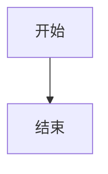
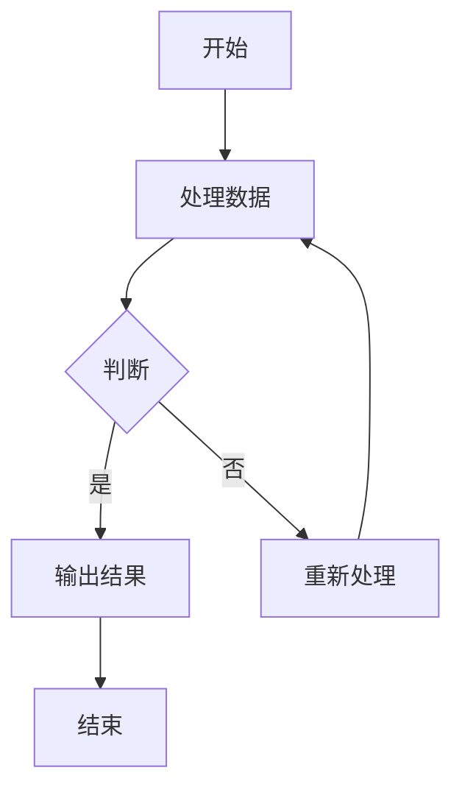
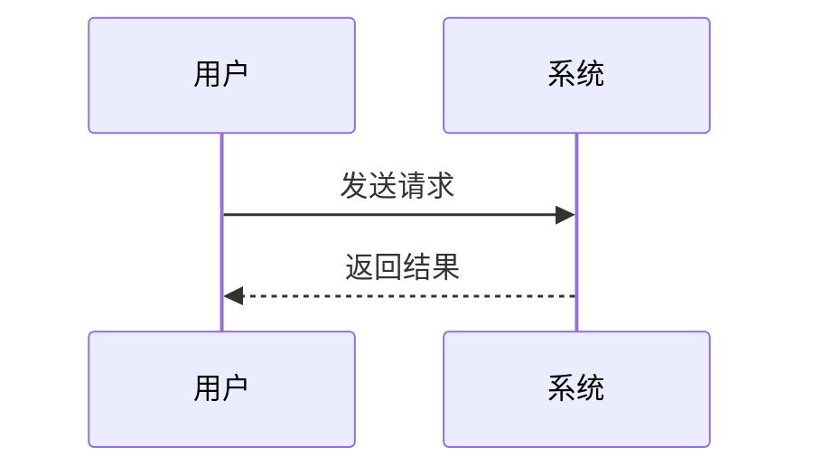
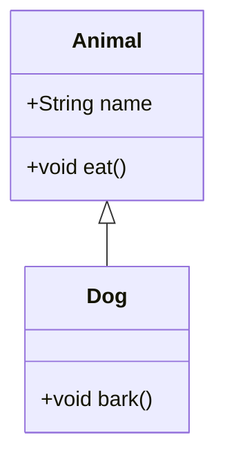
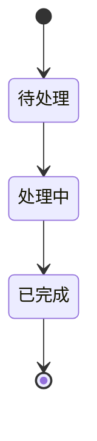
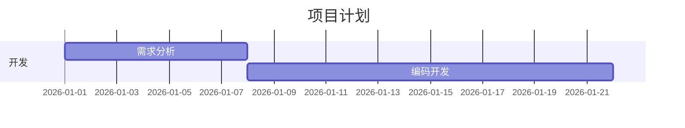
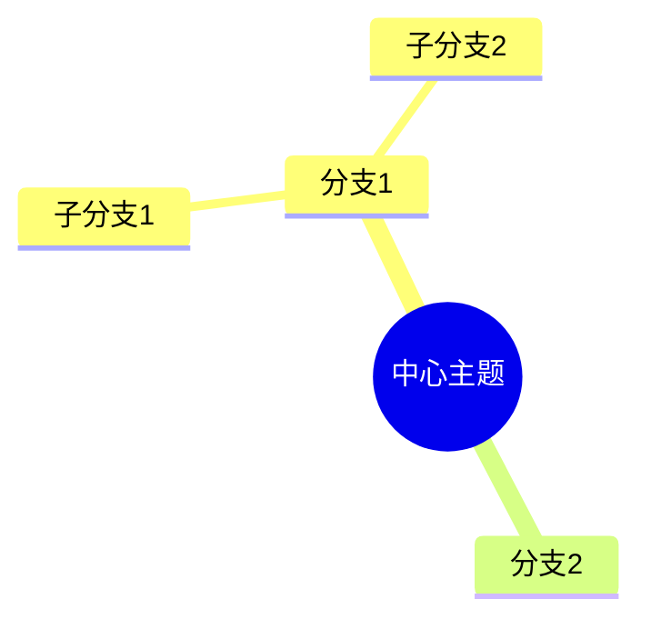
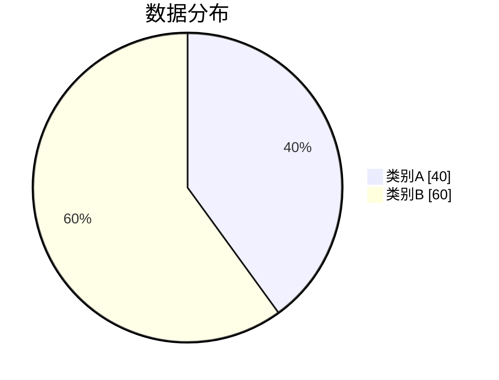

# Mermaid 图表功能使用指南

## 概述

本项目已集成 Mermaid 图表功能,支持在 Markdown 文章中使用 Mermaid 语法创建各种图表,并支持点击放大查看。

## 使用方法

在 Markdown 文件中使用 `mermaid` 代码块即可:

````markdown

````

## 交互功能

### 点击放大

所有 mermaid 图表都支持点击放大功能：

- **点击图表**: 在模态框中放大显示图表
- **关闭方式**: 
  - 点击右上角关闭按钮
  - 点击模态框外的背景区域
  - 按 ESC 键
- **悬停提示**: 鼠标悬停在图表上时会有放大效果提示

## 支持的图表类型

### 1. 流程图 (Flowchart)

````markdown

````

### 2. 序列图 (Sequence Diagram)

````markdown

````

### 3. 类图 (Class Diagram)

````markdown

````

### 4. 状态图 (State Diagram)

````markdown

````

### 5. Gantt 图 (甘特图)

````markdown

````

### 6. 思维导图 (Mindmap)

````markdown

````

### 7. 饼图 (Pie Chart)

````markdown

````

## 特性

- **客户端渲染**: 使用 mermaid.js 在浏览器端实时渲染图表
- **主题支持**: 自动适配网站主题(亮色/暗色)
- **响应式**: 图表自动适配屏幕宽度
- **交互功能**: 支持点击、缩放等交互功能
- **点击放大**: 点击图表可以在模态框中放大查看
- **用户体验**: 
  - 悬停时图表有轻微放大效果提示可点击
  - 多种方式关闭模态框(按钮、背景、ESC键)
  - 主题切换后图表自动重新渲染

## 语法参考

更多 Mermaid 语法请参考官方文档: https://mermaid.js.org/introduction/

## 技术实现

- **remark plugin**: `src/lib/remark-mermaid.ts` - 处理 mermaid 代码块
- **客户端组件**: `src/components/Mermaid.astro` - 初始化和渲染图表
- **放大组件**: `src/components/MermaidModal.astro` - 点击放大功能
- **依赖**: mermaid npm 包