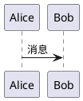

# 开发指南

## 本地开发

1. 启动开发服务器:
   ```bash
   npm run dev
   ```

2. 启动 CMS 服务器 (单独终端):
   ```bash
   npm run dev:cms
   ```

3. 访问:
   - 博客：http://localhost:4321
   - CMS 后台：http://localhost:4321/admin/

## 创建新文章

### 通过 CMS 后台:
1. 访问 /admin/
2. 点击 "新文章"
3. 填写表单
4. 保存为草稿或发布

### 直接创建 Markdown:
1. 在 `src/content/posts/` 创建 `.md` 文件
2. 添加 Frontmatter
3. 编写内容

## PlantUML 语法



## 代码高亮

使用 Shiki GitHub Dark 主题，支持 100+ 语言。
