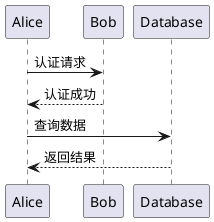
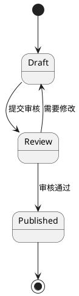

# Astro + Decap CMS 博客实现计划

> **For agentic workers:** REQUIRED SUB-SKILL: Use superpowers:subagent-driven-development (recommended) or superpowers:executing-plans to implement this plan task-by-task. Steps use checkbox (`- [ ]`) syntax for tracking.

**Goal:** 构建一个带后台管理界面的现代静态博客，支持草稿工作流、代码高亮和 PlantUML 本地渲染。

**Architecture:** Astro 5.x 作为静态站点框架，Content Collections 管理 Markdown 内容，Decap CMS 提供 Git 驱动的后台编辑界面，所有内容存储在 GitHub 仓库中。

**Tech Stack:** Astro 5.x, Content Collections, Decap CMS, Tailwind CSS, Shiki (GitHub Dark), node-plantuml, Cloudflare Pages

---

## 文件结构总览

```
blog/
├── src/
│   ├── content/
│   │   ├── config.ts              # Content Collections Schema
│   │   └── posts/                 # Markdown 文章
│   ├── components/
│   │   ├── PlantUml.astro         # PlantUML 渲染组件
│   │   └── CodeBlock.astro        # 代码高亮组件 (可选，Shiki 内置)
│   ├── layouts/
│   │   └── BaseLayout.astro       # 基础布局
│   ├── pages/
│   │   ├── index.astro            # 首页 (文章列表)
│   │   ├── posts/
│   │   │   └── [slug].astro       # 文章详情页
│   │   ├── tags/
│   │   │   └── [tag].astro        # 标签归档页
│   │   └── admin/
│   │       └── index.html         # Decap CMS 入口
│   └── styles/
│       └── global.css             # 全局样式 (Tailwind + 自定义)
├── public/
│   └── admin/
│       ├── index.html             # Decap CMS 入口 (复制)
│       └── config.yml             # Decap CMS 配置
├── astro.config.mjs               # Astro 配置
├── tailwind.config.mjs            # Tailwind 配置
├── tsconfig.json                  # TypeScript 配置
└── package.json
```

---

## Task 1: 项目初始化

**Files:**
- Create: `package.json`
- Create: `astro.config.mjs`
- Create: `tsconfig.json`
- Create: `tailwind.config.mjs`

- [ ] **Step 1: 创建 package.json**

```json
{
  "name": "astro-decap-blog",
  "type": "module",
  "version": "1.0.0",
  "scripts": {
    "dev": "astro dev",
    "build": "astro build",
    "preview": "astro preview",
    "astro": "astro"
  },
  "dependencies": {
    "astro": "^5.0.0",
    "@astrojs/tailwind": "^6.0.0",
    "tailwindcss": "^3.4.0",
    "shiki": "^1.0.0",
    "plantuml-encoder": "^1.4.0"
  }
}
```

- [ ] **Step 2: 创建 astro.config.mjs**

```mjs
import { defineConfig } from 'astro/config';
import tailwind from '@astrojs/tailwind';

export default defineConfig({
  integrations: [tailwind()],
  markdown: {
    shikiConfig: {
      theme: 'github-dark',
      wrap: true
    }
  }
});
```

- [ ] **Step 3: 创建 tsconfig.json**

```json
{
  "extends": "astro/tsconfigs/strict",
  "compilerOptions": {
    "baseUrl": ".",
    "paths": {
      "@/*": ["src/*"]
    }
  }
}
```

- [ ] **Step 4: 创建 tailwind.config.mjs**

```mjs
/** @type {import('tailwindcss').Config} */
export default {
  content: ['./src/**/*.{astro,html,js,jsx,md,mdx,svelte,ts,tsx,vue}'],
  theme: {
    extend: {
      typography: {
        DEFAULT: {
          css: {
            maxWidth: '720px',
            prose: {
              fontSize: '16px',
              lineHeight: '1.6'
            }
          }
        }
      }
    }
  },
  plugins: []
};
```

- [ ] **Step 5: 安装依赖**

```bash
npm install
```

Expected: Dependencies installed successfully

- [ ] **Step 6: 初始化 git 仓库**

```bash
git init
git add .
git commit -m "chore: initialize Astro project with Tailwind CSS"
```

---

## Task 2: Content Collections 配置

**Files:**
- Create: `src/content/config.ts`
- Create: `src/content/posts/hello-world.md`

- [ ] **Step 1: 创建 Content Collections 配置**

```ts
// src/content/config.ts
import { defineCollection, z } from 'astro:content';

const postsCollection = defineCollection({
  type: 'content',
  schema: z.object({
    title: z.string(),
    description: z.string().optional(),
    date: z.date(),
    tags: z.array(z.string()).optional(),
    draft: z.boolean().default(false)
  })
});

export const collections = {
  posts: postsCollection
};
```

- [ ] **Step 2: 创建示例文章**

```markdown
---
# src/content/posts/hello-world.md
title: "Hello World"
description: "这是我的第一篇博客文章"
date: 2026-04-12
tags: ["welcome", "astro"]
draft: false
---

## 欢迎来到我的博客

这是我的第一篇博客文章。使用 **Astro** + **Decap CMS** 构建。

### 特性

- 极简风格
- 代码高亮
- PlantUML 流程图
- 后台管理

```typescript
const hello = () => {
  console.log("Hello, World!");
};
```

期待分享更多有趣的内容！
```

- [ ] **Step 3: 提交**

```bash
git add src/content
git commit -m "feat: add Content Collections with sample post"
```

---

## Task 3: 基础布局组件

**Files:**
- Create: `src/layouts/BaseLayout.astro`
- Create: `src/styles/global.css`

- [ ] **Step 1: 创建全局样式**

```css
/* src/styles/global.css */
@tailwind base;
@tailwind components;
@tailwind utilities;

:root {
  --bg-color: #ffffff;
  --text-color: #1a1a1a;
  --link-color: #0366d6;
}

@media (prefers-color-scheme: dark) {
  :root {
    --bg-color: #0d1117;
    --text-color: #c9d1d9;
    --link-color: #58a6ff;
  }
}

body {
  background-color: var(--bg-color);
  color: var(--text-color);
  font-family: system-ui, -apple-system, sans-serif;
  line-height: 1.6;
}

a {
  color: var(--link-color);
  text-decoration: underline;
}

.prose {
  max-width: 720px;
  margin: 0 auto;
}
```

- [ ] **Step 2: 创建基础布局**

```astro
---
// src/layouts/BaseLayout.astro
import '../styles/global.css';

interface Props {
  title?: string;
  description?: string;
}

const { title = '我的博客', description = '极简技术博客' } = Astro.props;
---

<!doctype html>
<html lang="zh-CN">
  <head>
    <meta charset="UTF-8" />
    <meta name="viewport" content="width=device-width, initial-scale=1.0" />
    <meta name="description" content={description} />
    <title>{title}</title>
  </head>
  <body class="min-h-screen bg-white dark:bg-gray-900 text-gray-900 dark:text-gray-100">
    <header class="border-b border-gray-200 dark:border-gray-800">
      <nav class="max-w-4xl mx-auto px-4 py-4">
        <a href="/" class="text-lg font-bold hover:text-blue-600">{title}</a>
      </nav>
    </header>
    <main class="max-w-4xl mx-auto px-4 py-8">
      <slot />
    </main>
    <footer class="border-t border-gray-200 dark:border-gray-800 mt-16">
      <div class="max-w-4xl mx-auto px-4 py-4 text-sm text-gray-500">
        <p>Built with Astro + Decap CMS</p>
      </div>
    </footer>
  </body>
</html>
```

- [ ] **Step 3: 提交**

```bash
git add src/layouts src/styles
git commit -m "feat: add BaseLayout with dark mode support"
```

---

## Task 4: 首页和文章列表

**Files:**
- Create: `src/pages/index.astro`
- Create: `src/pages/posts/[slug].astro`

- [ ] **Step 1: 创建首页**

```astro
---
// src/pages/index.astro
import { getCollection } from 'astro:content';
import BaseLayout from '../layouts/BaseLayout.astro';

const posts = await getCollection('posts', ({ data }) => !data.draft);
posts.sort((a, b) => b.data.date.getTime() - a.data.date.getTime());
---

<BaseLayout>
  <h1 class="text-3xl font-bold mb-8">最新文章</h1>
  
  {posts.length === 0 ? (
    <p class="text-gray-500">还没有文章，快去写一篇吧！</p>
  ) : (
    <ul class="space-y-6">
      {posts.map((post) => (
        <li>
          <article class="border-b border-gray-200 dark:border-gray-800 pb-6">
            <time class="text-sm text-gray-500">
              {post.data.date.toLocaleDateString('zh-CN', {
                year: 'numeric',
                month: 'long',
                day: 'numeric'
              })}
            </time>
            <h2 class="text-xl font-semibold mt-2">
              <a
                href={`/posts/${post.id}/`
                class="hover:text-blue-600 dark:hover:text-blue-400"
              >
                {post.data.title}
              </a>
            </h2>
            {post.data.description && (
              <p class="text-gray-600 dark:text-gray-400 mt-2">
                {post.data.description}
              </p>
            )}
            {post.data.tags && (
              <div class="flex gap-2 mt-3">
                {post.data.tags.map((tag) => (
                  <a
                    href={`/tags/${tag}/`}
                    class="px-2 py-1 bg-gray-100 dark:bg-gray-800 rounded text-sm hover:bg-gray-200 dark:hover:bg-gray-700"
                  >
                    #{tag}
                  </a>
                ))}
              </div>
            )}
          </article>
        </li>
      ))}
    </ul>
  )}
</BaseLayout>
```

- [ ] **Step 2: 创建文章详情页**

```astro
---
// src/pages/posts/[slug].astro
import { getCollection } from 'astro:content';
import BaseLayout from '../../layouts/BaseLayout.astro';

export async function getStaticPaths() {
  const posts = await getCollection('posts');
  return posts.map((post) => ({
    params: { slug: post.id },
    props: { post }
  }));
}

interface Props {
  post: any;
}

const { post } = Astro.props;
---

<BaseLayout title={post.data.title}>
  <article class="prose dark:prose-invert max-w-none">
    <header class="mb-8">
      <h1 class="text-4xl font-bold mb-4">{post.data.title}</h1>
      <div class="flex items-center gap-4 text-gray-500">
        <time>
          {post.data.date.toLocaleDateString('zh-CN', {
            year: 'numeric',
            month: 'long',
            day: 'numeric'
          })}
        </time>
        {post.data.tags && (
          <div class="flex gap-2">
            {post.data.tags.map((tag) => (
              <a
                href={`/tags/${tag}/`}
                class="hover:text-blue-600"
              >
                #{tag}
              </a>
            ))}
          </div>
        )}
      </div>
    </header>
    <Content />
  </article>
</BaseLayout>
```

- [ ] **Step 3: 提交**

```bash
git add src/pages
git commit -m "feat: add homepage and post detail pages"
```

---

## Task 5: 标签归档页面

**Files:**
- Create: `src/pages/tags/[tag].astro`

- [ ] **Step 1: 创建标签页面**

```astro
---
// src/pages/tags/[tag].astro
import { getCollection } from 'astro:content';
import BaseLayout from '../../layouts/BaseLayout.astro';

export async function getStaticPaths() {
  const posts = await getCollection('posts', ({ data }) => !data.draft);
  const tags = new Set<string>();
  
  posts.forEach((post) => {
    post.data.tags?.forEach((tag) => tags.add(tag));
  });
  
  return Array.from(tags).map((tag) => ({
    params: { tag },
    props: { tag }
  }));
}

interface Props {
  tag: string;
}

const { tag } = Astro.props;
const posts = await getCollection('posts', ({ data }) => 
  !data.draft && data.tags?.includes(tag)
);
posts.sort((a, b) => b.data.date.getTime() - a.data.date.getTime());
---

<BaseLayout title={`#${tag} 标签`}>
  <div class="mb-8">
    <a href="/" class="text-blue-600 hover:underline">&larr; 返回首页</a>
  </div>
  
  <h1 class="text-3xl font-bold mb-6">#{tag}</h1>
  
  {posts.length === 0 ? (
    <p class="text-gray-500">该标签下没有文章</p>
  ) : (
    <ul class="space-y-4">
      {posts.map((post) => (
        <li>
          <article>
            <time class="text-sm text-gray-500">
              {post.data.date.toLocaleDateString('zh-CN', {
                year: 'numeric',
                month: 'long',
                day: 'numeric'
              })}
            </time>
            <h2 class="text-xl font-semibold mt-2">
              <a
                href={`/posts/${post.id}/`
                class="hover:text-blue-600"
              >
                {post.data.title}
              </a>
            </h2>
          </article>
        </li>
      ))}
    </ul>
  )}
</BaseLayout>
```

- [ ] **Step 2: 提交**

```bash
git add src/pages/tags
git commit -m "feat: add tag archive pages"
```

---

## Task 6: Decap CMS 配置

**Files:**
- Create: `public/admin/index.html`
- Create: `public/admin/config.yml`

- [ ] **Step 1: 创建 Decap CMS 入口 HTML**

```html
<!-- public/admin/index.html -->
<!doctype html>
<html lang="zh-CN">
  <head>
    <meta charset="UTF-8" />
    <meta name="viewport" content="width=device-width, initial-scale=1.0" />
    <title>博客后台管理</title>
    <script src="https://unpkg.com/decap-cms@^3.0.0/dist/decap-cms.js"></script>
  </head>
  <body>
    <!-- Decap CMS 自动挂载 -->
  </body>
</html>
```

- [ ] **Step 2: 创建 Decap CMS 配置**

```yaml
# public/admin/config.yml
backend:
  name: git-gateway
  branch: main

media_folder: "src/assets/images"
public_folder: "/assets/images"

collections:
  - name: "posts"
    label: "文章"
    folder: "src/content/posts"
    create: true
    slug: "{{slug}}"
    fields:
      - { label: "标题", name: "title", widget: "string" }
      - { label: "描述", name: "description", widget: "string", required: false }
      - { label: "发布日期", name: "date", widget: "datetime" }
      - { label: "标签", name: "tags", widget: "list", default: [] }
      - { label: "草稿", name: "draft", widget: "boolean", default: false }
      - { label: "正文", name: "body", widget: "markdown" }
```

- [ ] **Step 3: 提交**

```bash
git add public/admin
git commit -m "feat: add Decap CMS configuration"
```

- [ ] **Step 4: 配置 Git Gateway（Netlify）**

> 注意：Decap CMS 需要 Git Gateway 进行身份验证。如果使用 Cloudflare Pages，需要配置替代方案：
> 
> 选项 A: 使用 Netlify 作为 CMS 后端（推荐）
> 选项 B: 使用 decap-server 本地运行
> 选项 C: 使用 GitHub API 直接认证

暂时使用选项 B（decap-server）进行本地开发：

```bash
npm install -g decap-server
```

- [ ] **Step 5: 提交 decap-server 配置**

```bash
git commit -m "chore: add decap-server for local CMS development"
```

---

## Task 7: 代码高亮（Shiki GitHub Dark）

**Files:**
- Modify: `astro.config.mjs`
- Create: `src/components/CodeBlock.astro` (可选)

- [ ] **Step 1: 确认 Shiki 配置**

检查 `astro.config.mjs` 中已有 Shiki 配置：

```mjs
// astro.config.mjs - 已配置
export default defineConfig({
  integrations: [tailwind()],
  markdown: {
    shikiConfig: {
      theme: 'github-dark',
      wrap: true
    }
  }
});
```

- [ ] **Step 2: 创建测试文章验证代码高亮**

```markdown
---
# src/content/posts/code-highlight-test.md
title: "代码高亮测试"
date: 2026-04-12
tags: ["test", "code"]
draft: false
---

## TypeScript 示例

```typescript
interface User {
  id: number;
  name: string;
  email: string;
}

const users: User[] = [
  { id: 1, name: "Alice", email: "alice@example.com" }
];

export default users;
```

## JavaScript 示例

```javascript
function hello(name) {
  console.log(`Hello, ${name}!`);
}

hello("World");
```

## Python 示例

```python
def greet(name: str) -> str:
    return f"Hello, {name}!"

print(greet("World"))
```
```

- [ ] **Step 3: 测试并验证**

```bash
npm run build
```

Expected: Build succeeds, code blocks are highlighted with GitHub Dark theme

- [ ] **Step 4: 提交**

```bash
git add src/content/posts/code-highlight-test.md
git commit -m "feat: verify Shiki code highlighting with GitHub Dark theme"
```

---

## Task 8: PlantUML 本地渲染

**Files:**
- Create: `src/components/PlantUml.astro`
- Create: `src/lib/plantuml.ts`

- [ ] **Step 1: 安装 PlantUML 依赖**

```bash
npm install plantuml-encoder
```

- [ ] **Step 2: 创建 PlantUML 工具函数**

```ts
// src/lib/plantuml.ts
import plantumlEncoder from 'plantuml-encoder';

export function encodePlantUml(code: string): string {
  const encoded = plantumlEncoder.encode(code);
  return `https://www.plantuml.com/plantuml/svg/${encoded}`;
}
```

- [ ] **Step 3: 创建 PlantUML 组件**

```astro
---
// src/components/PlantUml.astro
import { encodePlantUml } from '../lib/plantuml';

interface Props {
  code: string;
  alt?: string;
}

const { code, alt = "PlantUML diagram" } = Astro.props;
const svgUrl = encodePlantUml(code);
---

<figure class="my-8">
  
  <figcaption class="text-center text-gray-500 text-sm mt-2">
    {alt}
  </figcaption>
</figure>
```

- [ ] **Step 4: 创建 PlantUML 测试文章**

```markdown
---
# src/content/posts/plantuml-test.md
title: "PlantUML 流程图测试"
date: 2026-04-12
tags: ["test", "plantuml"]
draft: false
---

## 序列图示例



## 状态图示例


```

- [ ] **Step 5: 创建 Markdown 处理器（集成 PlantUML）**

由于 Astro 默认不处理 PlantUML 代码块，需要创建自定义 rehype 插件：

```ts
// src/lib/rehype-plantuml.ts
import { visit } from 'unist-util-visit';
import { encodePlantUml } from './plantuml';

export function rehypePlantUml() {
  return (tree: any) => {
    visit(tree, 'element', (node) => {
      if (
        node.tagName === 'pre' &&
        node.children?.[0]?.properties?.className?.includes('language-plantuml')
      ) {
        const code = node.children[0].children?.[0]?.value || '';
        const svgUrl = encodePlantUml(code);
        
        // 替换为 img 标签
        node.tagName = 'figure';
        node.children = [
          {
            type: 'element',
            tagName: 'img',
            properties: {
              src: svgUrl,
              alt: 'PlantUML Diagram',
              class: 'max-w-full h-auto border rounded-lg',
              loading: 'lazy'
            }
          },
          {
            type: 'element',
            tagName: 'figcaption',
            properties: { class: 'text-center text-gray-500 text-sm mt-2' },
            children: [{ type: 'text', value: 'PlantUML Diagram' }]
          }
        ];
      }
    });
  };
}
```

- [ ] **Step 6: 配置 Astro 使用自定义插件**

```mjs
// astro.config.mjs
import { defineConfig } from 'astro/config';
import tailwind from '@astrojs/tailwind';
import rehypePlantUml from './src/lib/rehype-plantuml';

export default defineConfig({
  integrations: [tailwind()],
  markdown: {
    shikiConfig: {
      theme: 'github-dark',
      wrap: true
    },
    rehypePlugins: [rehypePlantUml]
  }
});
```

- [ ] **Step 7: 安装 rehype 依赖**

```bash
npm install unist-util-visit
```

- [ ] **Step 8: 测试并验证**

```bash
npm run dev
```

访问 http://localhost:4321/posts/plantuml-test/ 验证流程图渲染

- [ ] **Step 9: 提交**

```bash
git add src/lib src/components src/content/posts/plantuml-test.md astro.config.mjs
git commit -m "feat: add PlantUML local rendering with rehype plugin"
```

---

## Task 9: 部署配置（Cloudflare Pages）

**Files:**
- Create: `.github/workflows/deploy.yml`
- Create: `wrangler.toml` (可选)

- [ ] **Step 1: 创建 GitHub Actions 部署工作流**

```yaml
# .github/workflows/deploy.yml
name: Deploy to Cloudflare Pages

on:
  push:
    branches: [main]
  workflow_dispatch:

jobs:
  deploy:
    runs-on: ubuntu-latest
    permissions:
      contents: read
      deployments: write
    
    steps:
      - name: Checkout
        uses: actions/checkout@v4
      
      - name: Setup Node.js
        uses: actions/setup-node@v4
        with:
          node-version: '20'
      
      - name: Install dependencies
        run: npm ci
      
      - name: Build
        run: npm run build
      
      - name: Deploy to Cloudflare Pages
        uses: cloudflare/wrangler-action@v3
        with:
          apiToken: ${{ secrets.CLOUDFLARE_API_TOKEN }}
          command: pages deploy dist --project-name=blog
```

- [ ] **Step 2: 创建 Cloudflare 配置文件**

```toml
# wrangler.toml
name = "blog"
compatibility_date = "2024-01-01"
pages_build_output_dir = "./dist"
```

- [ ] **Step 3: 创建部署说明文档**

```markdown
# 部署指南

## Cloudflare Pages 部署

1. 安装 Wrangler CLI:
   ```bash
   npm install -g wrangler
   ```

2. 登录 Cloudflare:
   ```bash
   wrangler login
   ```

3. 创建 Pages 项目:
   ```bash
   wrangler pages project create blog
   ```

4. 手动部署:
   ```bash
   npm run build
   wrangler pages deploy dist --project-name=blog
   ```

## GitHub Actions 自动部署

1. 在 Cloudflare 获取 API Token
2. 在 GitHub 仓库设置中添加 `CLOUDFLARE_API_TOKEN` Secret
3. 推送到 main 分支自动部署
```

- [ ] **Step 4: 提交**

```bash
git add .github wrangler.toml
git commit -m "chore: add Cloudflare Pages deployment configuration"
```

---

## Task 10: 本地开发和测试

**Files:**
- Modify: `package.json` (添加 CMS 脚本)

- [ ] **Step 1: 添加 CMS 启动脚本**

```json
// package.json
{
  "scripts": {
    "dev": "astro dev",
    "dev:cms": "decap-server",
    "build": "astro build",
    "preview": "astro preview"
  }
}
```

- [ ] **Step 2: 创建开发说明文档**

```markdown
# 开发指南

## 本地开发

1. 启动开发服务器:
   ```bash
   npm run dev
   ```

2. 启动 CMS 服务器 (单独终端):
   ```bash
   npm run dev:cms
   ```

3. 访问:
   - 博客：http://localhost:4321
   - CMS 后台：http://localhost:4321/admin/

## 创建新文章

通过 CMS 后台:
1. 访问 /admin/
2. 点击 "新文章"
3. 填写表单
4. 保存为草稿或发布

直接创建 Markdown:
1. 在 `src/content/posts/` 创建 `.md` 文件
2. 添加 Frontmatter
3. 编写内容
```

- [ ] **Step 3: 创建 README.md**

```markdown
# 我的博客

基于 Astro + Decap CMS 的静态博客，支持后台管理、代码高亮和 PlantUML 流程图。

## 特性

- ✅ 极简设计风格
- ✅ Decap CMS 后台管理
- ✅ 草稿/发布工作流
- ✅ Shiki 代码高亮 (GitHub Dark 主题)
- ✅ PlantUML 流程图渲染
- ✅ 暗色模式支持
- ✅ 标签归档
- ✅ Cloudflare Pages 部署

## 快速开始

```bash
# 安装依赖
npm install

# 本地开发
npm run dev

# 启动 CMS 后台 (单独终端)
npm run dev:cms

# 构建
npm run build

# 预览构建结果
npm run preview
```

## 部署

自动部署：推送到 main 分支
手动部署：`wrangler pages deploy dist --project-name=blog`
```

- [ ] **Step 4: 最终测试**

```bash
npm run dev
```

访问以下页面验证:
- http://localhost:4321 - 首页
- http://localhost:4321/posts/hello-world/ - 文章详情
- http://localhost:4321/admin/ - CMS 后台

- [ ] **Step 5: 最终提交**

```bash
git add README.md
git commit -m "docs: add development and deployment guide"
```

---

## 完成检查清单

- [ ] 项目初始化完成
- [ ] Content Collections 配置完成
- [ ] BaseLayout 组件完成
- [ ] 首页和文章列表完成
- [ ] 标签归档页面完成
- [ ] Decap CMS 配置完成
- [ ] Shiki 代码高亮完成
- [ ] PlantUML 本地渲染完成
- [ ] Cloudflare Pages 部署配置完成
- [ ] 本地开发和测试通过

---

**计划完成。** 

两个执行选项：

1. **Subagent-Driven (推荐)** - 每个 Task 由独立子代理执行，任务间进行审核，快速迭代
2. **Inline Execution** - 在当前会话中使用 executing-plans 批量执行，设置检查点

选择哪种方式？
