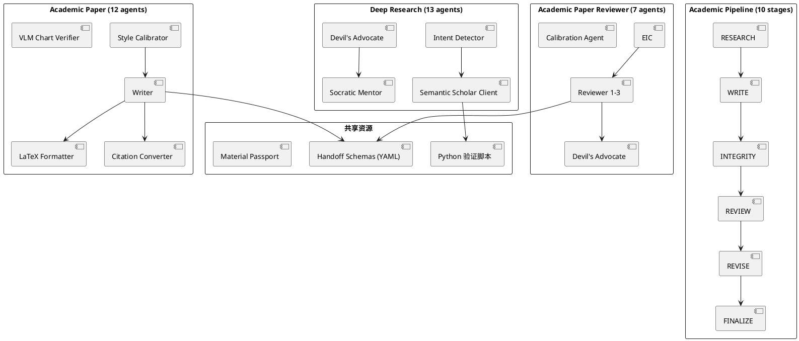
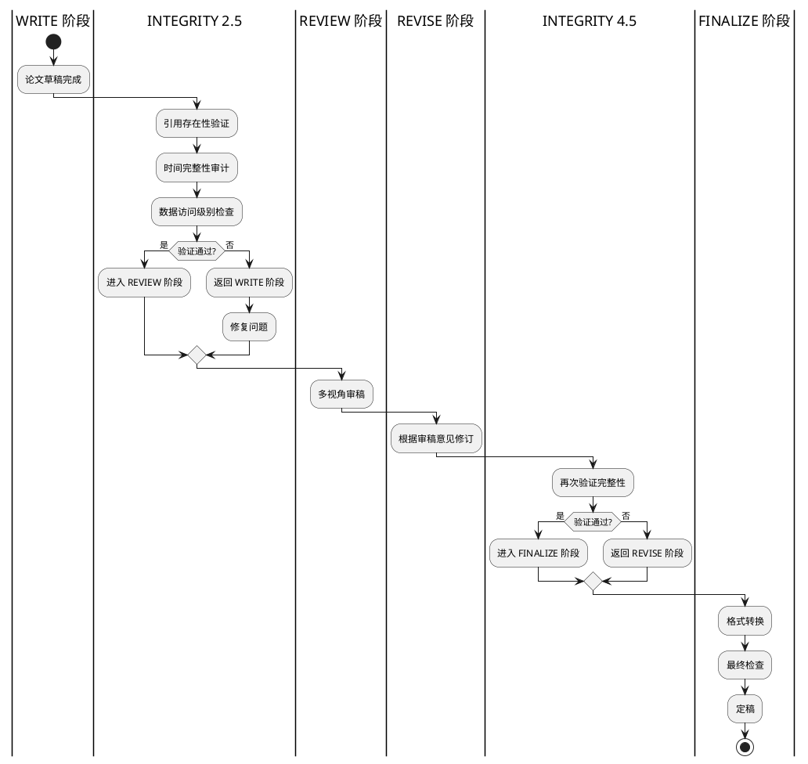

## 简介

AI 写论文有一个危险的诱惑：它太容易了。几秒钟就能生成一篇看起来像模像样的文章，但仔细检查会发现引用幻觉、逻辑跳跃、时间错置等问题。Lu et al. (2026, Nature) 的研究显示，全自动 AI 研究系统（"The AI Scientist"）有一系列结构性失败模式。

Academic Research Skills（ARS）的做法不是让 AI 替你写论文，而是让 AI 成为你的**学术研究副驾驶**。它处理苦力活——查找文献、格式化引用、验证数据、检查逻辑一致性——让你专注需要大脑的部分：定义问题、选择方法、解读数据。

31.3k stars，40+ 个专业 agent，4 个核心 skill（深度研究、论文写作、学术审稿、学术流水线），每 2-4 天发布一个版本。这是一个严肃的、学术导向的 Claude Code 技能工程。

## 项目概览

| 项目 | 值 |
|------|-----|
| 仓库 | [Imbad0202/academic-research-skills](https://github.com/Imbad0202/academic-research-skills) |
| Stars | 31.3k（截至 2026-06-14） |
| 许可证 | CC BY-NC 4.0（非商业使用） |
| 语言 | Python + Markdown |
| 作者 | Cheng-I Wu（吳政宜，Imbad0202） |
| 最新版本 | v3.12.0（2026-06-08） |
| 创建时间 | 2026-02-26 |
| 更新频率 | 平均每 2-4 天一版 |
| 要求 | Claude Code v3.7.0+ |

## 核心功能

ARS 由 **4 个核心 skill** 组成，共包含 **40+ 个专业 agent**：

### 1. Deep Research（深度研究）— v2.9.4

13 个 agent 组成的研究团队，7 种模式：

| 模式 | 用途 |
|------|------|
| `full` | 完整研究流程 |
| `quick` | 快速简报 |
| `review` | 文献评审 |
| `lit-review` | 文献综述 |
| `fact-check` | 事实核查 |
| `socratic` | 苏格拉底式引导 |
| `systematic-review` | PRISMA 系统综述 |

特性：意图检测、对话健康监测、可选跨模型 Devil's Advocate（魔鬼代言人）、Semantic Scholar API 验证。

### 2. Academic Paper（学术论文写作）— v3.2.0

12 个 agent 的论文写作流水线，10 种模式：

| 模式 | 用途 |
|------|------|
| `full` | 完整论文写作 |
| `plan` | 仅规划 |
| `outline-only` | 仅大纲 |
| `revision` | 修订 |
| `revision-coach` | 修订指导 |
| `abstract-only` | 仅摘要 |
| `lit-review` | 文献综述章节 |
| `format-convert` | 格式转换 |
| `citation-check` | 引用检查 |
| `disclosure` | 利益声明 |

输出：MD + DOCX（Pandoc）+ LaTeX（APA 7.0 / IEEE / Chicago）→ PDF（tectonic）。

### 3. Academic Paper Reviewer（学术审稿）— v1.10.0

7 个 agent 的多视角同行评审，6 种模式：

| 模式 | 用途 |
|------|------|
| `full` | EIC + 3 位动态审稿人 + Devil's Advocate |
| `quick` | 快速评审 |
| `guided` | 引导式评审 |
| `methodology-focus` | 方法论聚焦 |
| `re-review` | 重新评审 |
| `calibration` | 校准评审 |

评分标准：0-100 分
- ≥80：Accept
- 65-79：Minor Revision
- 50-64：Major Revision
- <50：Reject

### 4. Academic Pipeline（学术流水线）— v3.12.0

10 阶段编排器：

```text
RESEARCH → WRITE → INTEGRITY (2.5) → REVIEW → RE-REVIEW →
REVISE → INTEGRITY (4.5) → FINALIZE → PUBLISH → PROCESS SUMMARY
```

特性：自适应检查点、声明验证、Material Passport、可选 repro_lock、跨模型完整性验证、分数轨迹追踪。每阶段强制用户确认；完整性验证门不可跳过。

## 快速上手

### 安装（30 秒）

需要 Claude Code v3.7.0+（CLI / VS Code / JetBrains）：

```text
/plugin marketplace add Imbad0202/academic-research-skills
/plugin install academic-research-skills
```

### 前置条件

- Claude Code 最新版
- `ANTHROPIC_API_KEY` 已导出或首次运行时设置
- 可选：Pandoc（生成 DOCX）、tectonic + Source Han Serif TC（APA 7.0 PDF）

### 典型使用流程

#### 完整流水线

```text
You: "I want to write a complete research paper on AI's impact on higher education QA"
```

ARS 会自动启动完整流水线：研究 → 写作 → 完整性验证 → 审稿 → 修订 → 定稿。

#### 苏格拉底式引导

```text
You: "Guide my research on AI in educational evaluation"
```

Deep Research 进入 socratic 模式，通过提问引导你澄清研究问题。

#### 单独调用 skill

```text
You: "Research the impact of AI on higher education"  → Deep Research (full mode)
You: "Write a paper on X"                            → Academic Paper (full mode)
You: "Review this paper"                             → Reviewer (full mode)
You: "Give me a quick brief on X"                    → Deep Research (quick mode)
You: "Do a systematic review on X with PRISMA"       → Deep Research (systematic-review)
```

### 验证安装

运行 `/ars-plan` 描述论文主题，ARS 会通过苏格拉底对话映射章节结构。

## 架构与原理

### 整体架构



### 多 Agent 协作

ARS 的核心不是单一模型调用，而是通过**角色分工的多 agent 编排**：

- 每个 agent 有明确的职责边界和只读/写入约束
- v3.10 的 scoped-write guard 用 PreToolUse hook 将 23 个单阶段 agent 限制在各自 phase 目录
- agent 之间通过 Material Passport（YAML）传递状态
- 流水线通过 orchestrator agent 驱动，每阶段有强制 checkpoint

### 反 AI 失败模式的设计

ARS 针对几类 AI 结构性限制做了专门工程：

#### Frame-lock（框架锁定）

Devil's Advocate 必须对每次反驳打 1-5 分，只有 ≥4 分才能让步，防止被用户推着走。

#### Sycophancy（谄媚）

让步阈值协议 + 连续让步禁止 + 框架锁定检测。如果 agent 连续让步超过 3 次，会触发校准。

#### 引用幻觉

三层锚点 + 四库交叉验证 + Claim-Faithfulness 审计：

1. **三层引用锚点**：每个引用携带 quote/page/section/paragraph 定位器
2. **四库交叉验证**：Semantic Scholar + OpenAlex + Crossref + arXiv
3. **Claim-Faithfulness 审计**：可选 `ARS_CLAIM_AUDIT=1` 通过检索原文判断引用是否支持论点

#### 时间错置

5 种时间失败模式的确定性审计脚本：

1. 回溯算术错误
2. 时代错置引用
3. 因果倒置
4. 预测性陈述被当作历史事实
5. 技术成熟度时间线错误

### 跨模型验证

支持 `ARS_CROSS_MODEL` 环境变量，让不同 agent 调用不同 Claude 模型（Opus vs Sonnet）或外部模型（GPT-5.5）做独立验证，降低同模型盲点风险。

### 完整性验证门



## 关键设计决策

**1. 为什么是 CC BY-NC（非商业）许可证？**

作者明确反对"AI 代写论文"的滥用。非商业许可证确保这个工具不会被论文工厂商业化。

**2. 为什么不直接让 AI 写论文？**

"AI is your copilot, not the pilot." ARS 帮你处理苦力活，但定义问题、选择方法、解读数据这些需要人类判断的部分，必须由你完成。

**3. 为什么需要 Devil's Advocate？**

AI 有谄媚倾向，会顺着用户的思路走。Devil's Advocate 角色负责挑战假设、指出盲点，确保研究的严谨性。

**4. 为什么要四库交叉验证引用？**

单一数据库可能有遗漏或错误。Semantic Scholar + OpenAlex + Crossref + arXiv 四个库交叉验证，大幅降低引用幻觉的风险。

**5. 为什么每阶段强制用户确认？**

学术研究需要人类的判断和决策。ARS 不自动推进，而是在每个关键节点等待用户确认。

**6. 为什么成本约 $4-6/篇？**

完整流水线涉及 40+ 个 agent、多次 LLM 调用、外部 API 查询（Semantic Scholar 等）。对于一篇 15k 字的论文，这个成本是合理的。

## 适用场景与局限

### 适用场景

- **学术研究者**：加速文献调研、论文写作、审稿修订流程
- **研究生**：学习学术写作规范，获得虚拟审稿反馈
- **非英语母语者**：改进学术英语表达
- **跨学科研究**：快速了解其他领域的文献
- **教学**：让学生练习审稿和修订

### 局限

- **非商业许可证**：商业场景不可用
- **成本**：完整流水线约 $4-6/篇
- **依赖外部服务**：Semantic Scholar、OpenAlex、Crossref、arXiv
- **不能替代人类判断**：ARS 是副驾驶，不是主驾驶
- **学习曲线**：需要理解 40+ 个 agent 的角色和使用场景
- **项目仅 4 个月大**：star 增长曲线极陡，长期稳定性有待观察

## 参考资料

- 官方仓库：[Imbad0202/academic-research-skills](https://github.com/Imbad0202/academic-research-skills)
- Lu et al. (2026, Nature)：The AI Scientist
- Zhao et al. (2026-05)：对 111M 引用的大规模审计
- PaperOrchestra（Google, 2026）：Semantic Scholar API 验证
- 配套项目：[academic-research-skills-codex](https://github.com/Imbad0202/academic-research-skills-codex)（Codex CLI 版本）
