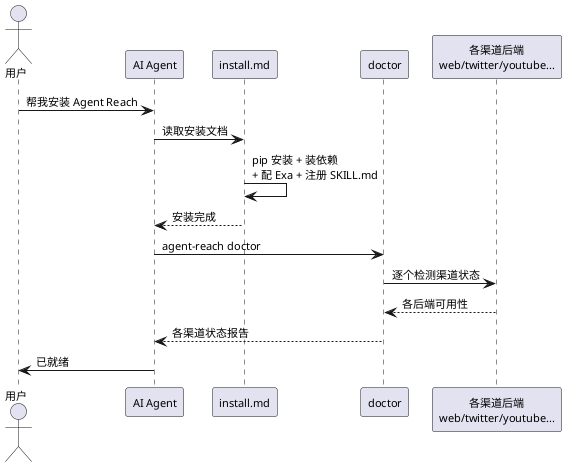
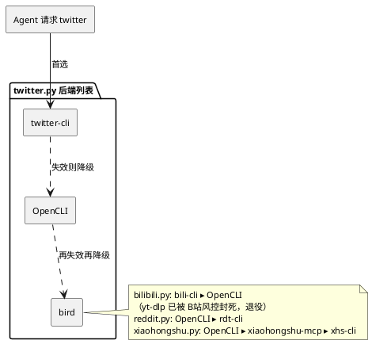
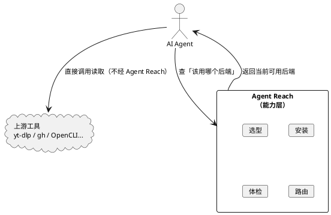

## 简介

Agent Reach 是一个给 AI Agent 用的**互联网访问能力层**（capability layer），31.7k stars。它不做读取本身，只负责选型、安装、体检、路由——把一句话复制给 Agent，几分钟后它就能读 Twitter、Reddit、YouTube、小红书、B站等 13+ 个平台。

零配置即可用网页、YouTube、RSS、B站搜索和 GitHub 公开仓库；配好 Cookie 后解锁 Twitter 搜索、小红书、Reddit 等。

## 项目概览

| 属性 | 详情 |
|------|-----|
| 仓库 | [Panniantong/Agent-Reach](https://github.com/Panniantong/Agent-Reach) |
| Stars | 31.7k（截至 2026-06-16） |
| 许可证 | MIT |
| 语言 | Python 3.10+ |
| 最新版本 | v1.5.0（2026-06-11） |
| 架构 | 能力层 + 多后端路由 + 渠道注册 + 真体检系统 |

## 背景与动机

AI Agent 访问互联网内容时面临一道现实门槛：看不了 YouTube 字幕，搜不了 Twitter，Reddit 返回 403，小红书要登录，B站被风控拦截。每个平台都有自己的障碍——付费 API、反爬封锁、登录认证、数据清洗。

Agent Reach 把这些门槛抹平：它替你选好每个平台当前最稳的接入方式，一键装好依赖，并在接入方式失效时自动切换。

## 快速上手

安装只需把一句话复制给 Agent：

```text
帮我安装 Agent Reach：https://raw.githubusercontent.com/Panniantong/Agent-Reach/main/docs/install.md
```

Agent 读取安装文档后自动完成 pip 安装、环境检测、依赖安装、Exa 搜索引擎配置和 SKILL.md 注册。装好后运行体检：

```bash
agent-reach doctor
```

零配置即可用的平台：

| 平台 | Agent 调用方式 |
|------|------|
| 网页 | `curl https://r.jina.ai/URL` |
| YouTube | `yt-dlp` 提取字幕 |
| B站搜索 | `bili search`（无需登录） |
| GitHub | `gh repo view owner/repo` |
| RSS | `feedparser` 解析 |
| 全网搜索 | Exa 语义搜索 |

需要配置的平台（告诉 Agent「帮我配 XXX」即可）：Twitter/X 需 Cookie，小红书/Reddit 需桌面装 OpenCLI 用浏览器登录态，LinkedIn 由 Agent 引导配置。

## 架构与原理

整体流程是「一句话安装 → 体检各渠道 → Agent 直接读取」：



### 多后端有序路由

最核心的设计：每个平台不是一个固定工具，而是一个**有序的后端列表**，首选失效就自动降级到下一个。



接入方式失效时，换接入方式只是调整列表顺序，不用改代码。2026 年 6 月 yt-dlp 被 B站风控封死，Agent Reach 切到 bili-cli，用户零操作。`agent-reach doctor` 会显示每个平台当前在用哪个后端。

### 能力层而非工具层

Agent Reach 只做选型、安装、体检、路由四件事，读取交给 Agent 直接调用上游工具，中间不加包装层：



这层分离让 Agent Reach 不会成为读取瓶颈，也不必维护一层包装抽象。

## 适用场景与局限

定位清晰的「只读」能力层：

- **擅长**：让 Agent 读取社交媒体内容（Twitter、Reddit、B站、小红书、YouTube 字幕等）。
- **不做网页操作**：只读不写，不支持登录、填表单这类交互。
- **不是爬虫框架**：面向 Agent 的能力调用，不适合高并发批量爬取。
- **部署差异**：本地直接可用；服务器部署需配代理（约 $1/月）。

几个设计权衡：不做读取包装层换来零性能开销，代价是 Agent 需知道上游工具的具体命令；用 Cookie 认证而非 API Key 换来免费，代价是 Cookie 有时效需定期更新；有序后端列表让切换行为可预测，代价是新增后端要手动改列表。

## 参考资料

- [GitHub 仓库](https://github.com/Panniantong/Agent-Reach)
- [安装文档](https://raw.githubusercontent.com/Panniantong/Agent-Reach/main/docs/install.md)
- [更新日志](https://github.com/Panniantong/Agent-Reach/blob/main/CHANGELOG.md)
