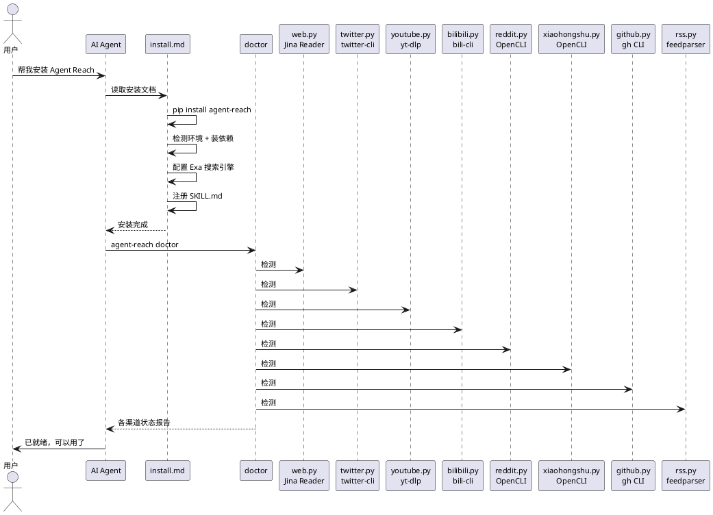

## Agent Reach：一句话给 AI Agent 装上全互联网访问能力

AI Agent 能写代码、改文档、管项目——但你让它去网上找点东西，它就抓瞎了。看不了 YouTube 字幕，搜不了 Twitter，Reddit 403，小红书要登录，B站被风控拦截。每个平台都有自己的门槛——付费 API、反爬封锁、登录认证、数据清洗。

Agent Reach 把这些门槛全部抹平了。它不是一个新工具，而是一个**能力层**（capability layer）——负责选型、安装、体检、路由，不负责底层读取本身。你把一句话复制给你的 Agent，几分钟后它就能读推特、搜 Reddit、看 YouTube、刷小红书了。

31.7k stars，13+ 个平台，零配置即可使用网页、YouTube、RSS、B站搜索和 GitHub 公开仓库。配好 Cookie 后解锁 Twitter 搜索、小红书、Reddit 等。

## 项目概览

| 项目 | 值 |
|------|-----|
| 仓库 | [Panniantong/Agent-Reach](https://github.com/Panniantong/Agent-Reach) |
| Stars | 31.7k（截至 2026-06-16） |
| 许可证 | MIT |
| 语言 | Python 3.10+ |
| 最新版本 | v1.5.0（2026-06-11） |
| 架构 | 能力层 + 多后端路由 + 渠道注册 + 真体检系统 |

## 核心设计



### 关键机制 1：多后端有序路由

这是 Agent Reach 最核心的设计。每个平台不是一个固定工具，而是一个**有序的后端列表**：

```
twitter.py → twitter-cli ▸ OpenCLI ▸ bird
bilibili.py → bili-cli ▸ OpenCLI（yt-dlp 已被 B站风控封死，退役）
reddit.py → OpenCLI ▸ rdt-cli（无零配置路径，必须登录态）
xiaohongshu.py → OpenCLI ▸ xiaohongshu-mcp ▸ xhs-cli
```

某个接入方式失效了？换接入方式是调整列表顺序，不是重写代码。2026 年 6 月，yt-dlp 被 B站风控封死，Agent Reach 切换到 bili-cli，用户零操作。

`agent-reach doctor` 会告诉你每个平台**当前在用哪个后端**，以及坏掉的怎么修。

### 关键机制 2：能力层而非工具层

Agent Reach 不是一个读取工具。它不做读取本身——读取由 Agent 直接调用上游工具完成，没有包装层。

```
Agent Reach 的职责：
  ✅ 选型 — 当前最稳的工具是哪个
  ✅ 安装 — 一键装好所有依赖
  ✅ 体检 — doctor 命令检测每个渠道状态
  ✅ 路由 — 首选失效自动切换备选
  ❌ 读取 — 不做，交给 Agent 直接调用上游工具
```

这个分层很重要。它意味着 Agent Reach 不会因为自己成为瓶颈而拖慢 Agent，也不会在上游工具和 Agent 之间加一层需要维护的抽象。

### 关键机制 3：一句话安装

安装只需要复制一句话给 Agent：

```
帮我安装 Agent Reach：https://raw.githubusercontent.com/Panniantong/agent-reach/main/docs/install.md
```

Agent 读取安装文档后自动完成：
1. `pip install agent-reach` 装 CLI 工具
2. 检测环境（本地 vs 服务器），安装 Node.js、gh CLI、mcporter
3. 配置 Exa 搜索引擎（MCP 接入，免费无需 API Key）
4. 注册 SKILL.md 到 Agent 的 skills 目录
5. 列出可选的额外平台，问你要不要装

## 5 分钟上手

### 安装

```bash
# 复制这句话给你的 Agent：
帮我安装 Agent Reach：https://raw.githubusercontent.com/Panniantong/Agent-Reach/main/docs/install.md
```

### 装好就能用的（零配置）

| 平台 | 命令 |
|------|------|
| 网页 | Agent 自动用 `curl https://r.jina.ai/URL` 读任意网页 |
| YouTube | Agent 自动用 `yt-dlp` 提取字幕 |
| B站搜索 | Agent 自动用 `bili search`（无需登录） |
| GitHub | Agent 自动用 `gh repo view owner/repo` |
| RSS | Agent 自动用 `feedparser` 解析 |
| 全网搜索 | Agent 自动用 Exa 语义搜索 |

### 需要配置的平台

告诉 Agent "帮我配 XXX" 即可，Agent 会引导你完成：

- **Twitter/X**：需要 Cookie（浏览器登录 → Cookie-Editor 导出 → 发给 Agent）
- **小红书**：桌面装 OpenCLI，刷过小红书即可用
- **Reddit**：桌面装 OpenCLI 用浏览器登录态
- **LinkedIn**：告诉 Agent "帮我配 LinkedIn"

### 体检

```bash
agent-reach doctor
```

输出每个渠道的状态、当前使用的后端、以及坏掉的怎么修。

## 和其他方案的对比

| 维度 | Agent Reach | 自己装各平台 CLI | MCP Servers |
|------|------------|-----------------|-------------|
| 安装成本 | 一句话 | 每个平台单独踩坑 | 每个 server 单独配置 |
| 故障恢复 | 自动切换备选后端 | 自己发现 + 自己修 | 自己修 |
| 平台覆盖 | 13+ 个统一接口 | 各 CLI 接口不同 | 各 server 接口不同 |
| 体检 | `doctor` 一键检测 | 自己写脚本 | 无统一体检 |
| Agent 兼容性 | 所有能跑命令行的 Agent | 同上 | 仅支持 MCP 的 Agent |

Agent Reach 的核心优势是**统一的能力层抽象**。你不需要知道 Twitter 该用 twitter-cli 还是 OpenCLI，不需要知道 yt-dlp 还能不能用在 B站，不需要知道 Reddit 匿名接口什么时候被封。这些它都替你想好了。

## 设计上的权衡

| 决策 | 得到的 | 失去的 |
|------|--------|--------|
| 不做读取包装层 | 零性能开销、不成为瓶颈 | Agent 需要知道上游工具的具体命令 |
| Cookie 认证而非 API Key | 免费、绕过付费 API | Cookie 有时效性，需要定期更新 |
| 有序后端列表而非自动发现 | 切换行为可预测、可调试 | 新增后端需要手动修改列表 |
| SKILL.md 作为 Agent 接口 | 跨平台兼容 | Agent 对命令的理解依赖模型能力 |

## 适用场景与边界

| 场景 | 推荐？ | 原因 |
|------|--------|------|
| 让 Agent 能读社交媒体 | 强烈推荐 | 这是它的核心场景 |
| 需要操作网页（登录、表单） | 不推荐 | Agent Reach 只做"读"，不做"操作" |
| 服务器部署 | 推荐（需代理） | 本地电脑不需要代理，服务器需要（约 $1/月） |
| 需要高并发爬取 | 不推荐 | 它是给 Agent 用的能力层，不是爬虫框架 |

## 参考链接

- [GitHub 仓库](https://github.com/Panniantong/Agent-Reach)
- [安装文档](https://raw.githubusercontent.com/Panniantong/Agent-Reach/main/docs/install.md)
- [更新日志](https://github.com/Panniantong/Agent-Reach/blob/main/CHANGELOG.md)
