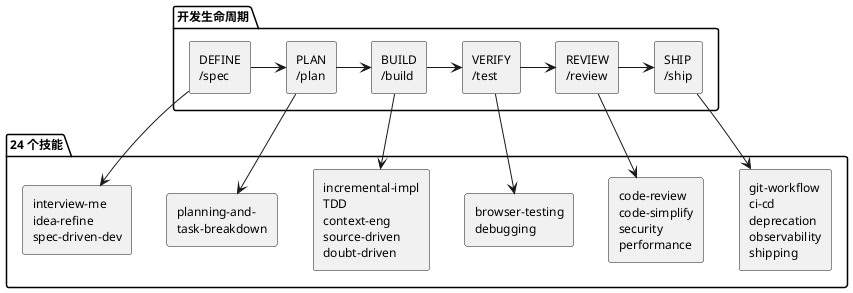

## Agent Skills：让 AI 编程 Agent 按工程规范干活的 24 个工作流

AI 编程 Agent 能写代码、改文件、跑测试——但你怎么确保它写出的代码符合你的工程规范？怎么防止它跳过测试、忽略安全审查、直接提交一个大而全的 commit？

Agent Skills 的答案是：把高级工程师的工作流编码成 Agent 可执行的结构化技能。不是参考文档让 Agent 读，而是步骤、检查点、退出条件都定义清楚的流程，Agent 必须跟着走。

61k stars，覆盖从 `/spec` 到 `/ship` 的 7 个开发生命周期阶段，24 个技能，支持 Claude Code、Cursor、Gemini CLI、Windsurf、Copilot 等 10+ 个平台。这是 Addy Osmani（Google Chrome 团队前工程经理）维护的项目。

## 项目概览

| 项目 | 值 |
|------|-----|
| 仓库 | [addyosmani/agent-skills](https://github.com/addyosmani/agent-skills) |
| Stars | 61.0k（截至 2026-06-16） |
| 许可证 | MIT |
| 语言 | Shell / Markdown |
| 最新版本 | v0.6.2（2026-06-11） |
| 架构 | 24 个独立 SKILL.md + 7 个 slash commands + 4 个 Agent personas |

## 核心设计



这个项目的设计思路可以用一句话概括：**流程，不是文档**。

传统做法是给 Agent 写一份 CLAUDE.md 或 .cursorrules，告诉它"要注意测试""要写文档"。Agent 读了，然后该跳过的还是跳过。Agent Skills 的做法不同——每个技能是一个可执行的工作流，有明确的步骤、验证门和反合理化表格。

### 反合理化：堵住 Agent 偷懒的借口

每个技能都包含一张"反合理化表"（Anti-rationalization Table），列出 Agent 常用的跳过步骤的借口和对应的反驳：

| Agent 的借口 | 反驳 |
|-------------|------|
| "我后面再加测试" | 不写测试就不能算完成。Red-Green-Refactor 是流程，不是建议 |
| "这个改动太小，不需要 review" | 没有"太小"的改动。所有变更都要过 review 门 |
| "我先跑通再清理代码" | 清理是流程的一部分，不是可选项 |

这张表的设计很有意思。它本质上是在做一件传统软件工程里靠团队文化和 code review 习惯来保障的事情——防止工程师走捷径。区别在于，Agent 不会"自觉遵守"，你必须把规则硬编码到流程里。

### 技能的解剖结构

每个 SKILL.md 遵循统一的结构：

```
SKILL.md
├── Frontmatter（name, description, 触发条件）
├── Overview（做什么）
├── When to Use（什么时候触发）
├── Process（分步骤工作流）
├── Rationalizations（借口 + 反驳）
├── Red Flags（异常信号）
└── Verification（证据要求）
```

关键设计选择：Verification 是不可协商的。每个技能结束时有明确的证据要求——测试通过、构建成功、运行时数据。"看起来对"永远不够。

## 7 个阶段 24 个技能

### Define — 搞清楚要做什么

| 技能 | 用途 |
|------|------|
| interview-me | 一问一答式需求访谈，提取用户真正想要的东西 |
| idea-refine | 结构化发散/收敛思维，把模糊想法变成具体提案 |
| spec-driven-development | 写 PRD：目标、命令、结构、代码风格、测试、边界 |

### Plan — 拆解任务

| 技能 | 用途 |
|------|------|
| planning-and-task-breakdown | 把 spec 拆成小的、可验证的任务，带验收标准和依赖排序 |

### Build — 写代码

| 技能 | 用途 |
|------|------|
| incremental-implementation | 薄垂直切片：实现→测试→验证→提交 |
| test-driven-development | Red-Green-Refactor，测试金字塔 80/15/5 |
| context-engineering | 在正确的时间给 Agent 喂正确的信息 |
| source-driven-development | 每个框架决策基于官方文档，引用来源 |
| doubt-driven-development | 对抗性审查：CLAIM → EXTRACT → DOUBT → RECONCILE |
| frontend-ui-engineering | 组件架构、设计系统、状态管理、WCAG 2.1 AA |
| api-and-interface-design | 契约优先设计、Hyrum's Law、错误语义 |

### Verify — 证明它能用

| 技能 | 用途 |
|------|------|
| browser-testing-with-devtools | Chrome DevTools MCP：DOM 检查、网络追踪、性能分析 |
| debugging-and-error-recovery | 五步排查：复现→定位→缩小→修复→加守卫 |

### Review — 合并前的质量门

| 技能 | 用途 |
|------|------|
| code-review-and-quality | 五轴 review，变更大小约 100 行，严重度标签 |
| code-simplification | Chesterton's Fence 原则，500 规则 |
| security-and-hardening | OWASP Top 10 防护，认证模式，依赖审计 |
| performance-optimization | 测量优先：Core Web Vitals 目标、profiling |

### Ship — 有 confidence 地部署

| 技能 | 用途 |
|------|------|
| git-workflow-and-versioning | Trunk-based 开发，原子 commit |
| ci-cd-and-automation | Shift Left，feature flags，质量门流水线 |
| deprecation-and-migration | 代码即负债，僵尸代码清理 |
| documentation-and-adrs | 架构决策记录，API 文档 |
| observability-and-instrumentation | 结构化日志、RED 指标、OpenTelemetry |
| shipping-and-launch | 预发布检查单、分阶段发布、回滚流程 |

## 快速上手

### 安装（Claude Code）

```bash
# 方式一：Marketplace（推荐，自动更新）
/plugin marketplace add addyosmani/agent-skills
/plugin install agent-skills@addy-agent-skills

# 方式二：本地克隆
git clone https://github.com/addyosmani/agent-skills.git
claude --plugin-dir /path/to/agent-skills
```

### 安装（Cursor）

把 `skills/` 下的 `SKILL.md` 文件复制到 `.cursor/rules/` 目录。

### 安装（Gemini CLI）

```bash
gemini skills install https://github.com/addyosmani/agent-skills.git --path skills
```

### 使用

7 个 slash commands 对应开发生命周期的 7 个阶段：

```
/spec        → 定义要做什么
/plan        → 规划怎么做
/build       → 增量实现
/test        → 证明能用
/review      → 代码审查
/code-simplify → 简化代码
/ship        → 发布
```

还有一个快捷方式：`/build auto`。给定 spec 后，它自动生成 plan 并逐个实现所有任务——你只需批准 plan 一次。每个任务仍然是测试驱动、独立提交的，遇到失败或高风险步骤会暂停。

## 和其他方案的对比

| 维度 | Agent Skills | CLAUDE.md / .cursorrules | 手写 prompt |
|------|-------------|--------------------------|------------|
| 粒度 | 24 个独立技能，按需触发 | 一个大文件，全量加载 | 每次手写 |
| 执行约束 | 步骤 + 验证门 + 反合理化 | 靠 Agent 自觉 | 无 |
| 跨平台 | Claude Code / Cursor / Gemini / Copilot / Windsurf 等 | 平台特定 | 不通用 |
| 可组合性 | 技能间可组合，command 自动编排 | 无编排 | 无 |
| 维护成本 | 社区维护，持续更新 | 自己维护 | 自己维护 |

Agent Skills 的核心优势在于**可执行性**。它不是一个"最佳实践列表"，而是一个 Agent 必须遵循的工作流引擎。CLAUDE.md 说"要写测试"，Agent Skills 的 TDD 技能说"先写一个失败的测试（Red），再写最少的代码让测试通过（Green），再重构（Refactor），三个步骤缺一不可，证据是测试输出"。

## 设计上的权衡

| 决策 | 得到的 | 失去的 |
|------|--------|--------|
| Markdown 作为技能格式 | 跨平台兼容、人类可读、版本控制友好 | 无法做复杂的条件逻辑和动态编排 |
| 反合理化表 | 堵住 Agent 偷懒的路径 | 技能文件更长，token 消耗更高 |
| 技能按需加载（progressive disclosure） | 减少上下文占用 | 需要 Agent 正确判断何时加载哪个技能 |
| 验证门不可协商 | 输出质量有保障 | 灵活性降低，简单任务也要走完整流程 |

## 适用场景与边界

| 场景 | 推荐？ | 原因 |
|------|--------|------|
| 中大型项目开发 | 推荐 | 流程保障能显著减少返工 |
| 快速原型 / hackathon | 不推荐 | 流程开销大于收益 |
| 多人协作项目 | 推荐 | 统一 Agent 行为标准 |
| 个人小脚本 | 不推荐 | 杀鸡用牛刀 |
| 安全敏感项目 | 强烈推荐 | security-and-hardening 技能覆盖 OWASP Top 10 |

## 参考链接

- [GitHub 仓库](https://github.com/addyosmani/agent-skills)
- [技能列表与安装文档](https://github.com/addyosmani/agent-skills#all-24-skills)
- [Addy Osmani 的博客介绍](https://addyosmani.com/blog/agent-skills/)
