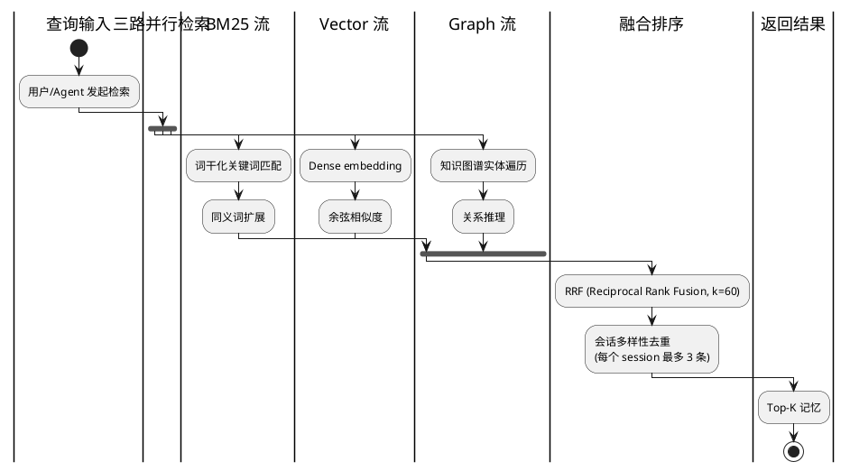
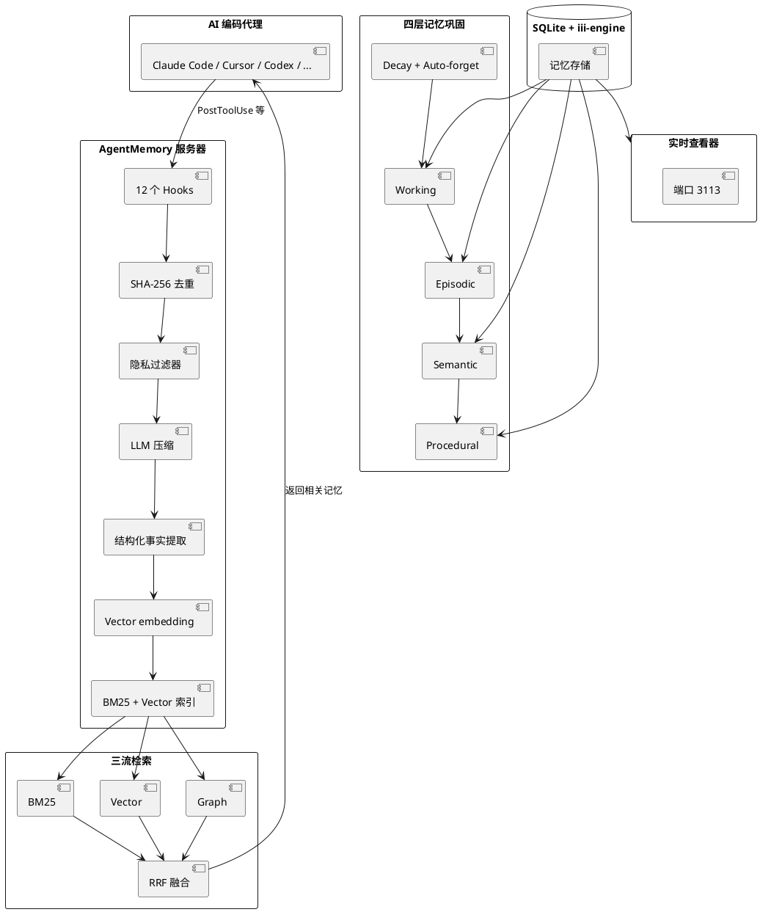
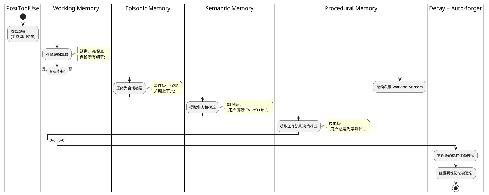

## 简介

AI 编程代理（Claude Code、Cursor、Codex）有一个普遍的问题：每次新会话都要重新解释项目背景、技术栈、代码规范。虽然有些工具提供了"记忆"功能，但大多是简单的对话历史存储，缺乏真正的语义理解和长期记忆巩固。

AgentMemory 的做法是模仿人类记忆的分层巩固机制。它通过 12 个 Hook 自动捕获工具调用和会话上下文，将原始观察压缩为结构化知识，存入三流检索系统（BM25 + Vector + Graph）。下次会话时，agent 可以精准召回相关记忆，不用再重复解释。

22.8k stars，在 LongMemEval-S（ICLR 2025，500 个问题）基准测试中，R@5 达到 95.2%，R@10 达到 98.6%，MRR 达到 88.2%，排名第一。

## 项目概览

| 项目 | 值 |
|------|-----|
| 仓库 | [rohitg00/agentmemory](https://github.com/rohitg00/agentmemory) |
| Stars | 22.8k（截至 2026-06-14） |
| 许可证 | Apache 2.0 |
| 语言 | TypeScript |
| 主要维护者 | rohitg00（Rohit Gupta，389 commits） |
| 官网 | [agent-memory.dev](https://agent-memory.dev) |
| 创建时间 | 2026-02-25 |
| 底层引擎 | iii 引擎 |
| 存储 | SQLite + iii-engine |

## 核心功能

### 自动捕获（12 个 Hook，零手动操作）

| Hook | 触发时机 |
|------|---------|
| SessionStart | 会话开始 |
| UserPromptSubmit | 用户提交 prompt |
| PreToolUse | 工具调用前 |
| PostToolUse | 工具调用后 |
| PostToolUseFailure | 工具调用失败 |
| PreCompact | 上下文压缩前 |
| SubagentStart | 子 agent 启动 |
| SubagentStop | 子 agent 停止 |
| Stop | 会话停止 |
| SessionEnd | 会话结束 |
| ... | 其他生命周期事件 |

每次工具调用自动记录，无需用户干预。

### 三流检索融合（Triple-Stream Retrieval）



| 检索流 | 方法 | 优势 |
|--------|------|------|
| **BM25** | 词干化关键词匹配 + 同义词扩展 | 精确匹配 |
| **Vector** | Dense embedding + 余弦相似度 | 语义相似度 |
| **Graph** | 知识图谱实体遍历 | 关系推理 |

三路结果通过 **RRF（Reciprocal Rank Fusion, k=60）** 融合，并做会话多样性去重（每个 session 最多 3 条结果）。

### 四层记忆巩固（4-Tier Consolidation）

| 层级 | 内容 | 类比 |
|------|------|------|
| **Working（工作记忆）** | 工具调用的原始观察 | 短期记忆 |
| **Episodic（情景记忆）** | 压缩后的会话摘要 | 事件记忆 |
| **Semantic（语义记忆）** | 提取的事实和模式 | 知识记忆 |
| **Procedural（程序记忆）** | 工作流和决策模式 | 技能记忆 |

配合 decay（衰减）和 auto-forget（自动遗忘）机制，模拟人类记忆的自然消退。

### Token 高效

- 每个 session 约 ~1,900 tokens
- 年成本约 $10
- 相比全量上下文注入，**节省 92% tokens**（170K tokens/年 vs 19.5M+ tokens/年）

### 多 Agent 支持

通过 MCP + REST + leases + signals 协议，支持团队记忆和命名空间隔离。

### 实时查看器

端口 3113，提供实时观察流、session 浏览器、memory 浏览器。

## 快速上手

### 安装

```bash
# 全局安装
npm install -g @agentmemory/agentmemory

# 启动服务器（监听 :3111）
agentmemory

# 或 npx 免安装
npx @agentmemory/agentmemory

# 种子示例数据 + 验证召回
agentmemory demo
```

### 连接 Agent

```bash
# 连接 Claude Code（自动配置 MCP + hooks）
agentmemory connect claude-code
```

### 安装 Skills

```bash
npx skills add rohitg00/agentmemory -y
# 15 个原生 skills（8 个可调用，7 个参考）
```

### 支持的 Agent

- **原生支持**：Claude Code（12 hooks + MCP）、Codex CLI、GitHub Copilot CLI、Cursor、Gemini CLI、OpenClaw、Hermes、OpenCode（22 hooks）
- **REST API**：Cline、Goose、Kilo Code、Aider
- **MCP 支持**：Claude Desktop、Windsurf、Roo Code、Warp
- **其他**：任何支持 MCP 或 HTTP 的 Agent

### 使用流程

```text
1. 启动 agentmemory 服务器
2. 连接你的 AI 编码 agent
3. 正常使用 agent，agentmemory 自动捕获和存储记忆
4. 下次会话时，agent 自动召回相关记忆
```

## 架构与原理

### 整体架构



### 记忆存储管线

```text
PostToolUse hook
  ↓
SHA-256 去重（5分钟窗口）
  ↓
隐私过滤器（移除敏感信息）
  ↓
原始观察（Raw observation）
  ↓
LLM 压缩（提取关键信息）
  ↓
结构化事实提取（实体、关系）
  ↓
Vector embedding（语义向量化）
  ↓
BM25 + Vector 索引构建
  ↓
存入 SQLite
```

### iii 引擎

AgentMemory 本质上是一个运行中的 **iii 实例**。iii 引擎有三个原语：

| 原语 | 说明 |
|------|------|
| **Worker** | 执行任务的单元 |
| **Function** | 可调用的函数 |
| **Trigger** | 触发条件（Hook 事件） |

整个运行时是**单进程**，**无外部依赖**（无 Redis、Kafka、Postgres），存储层使用 **SQLite + iii-engine**。

### 端口分配

| 端口 | 用途 |
|------|------|
| 3111 | REST API + MCP HTTP |
| 3112 | 内部流（iii-engine） |
| 3113 | 实时查看器 |
| 49134 | WebSocket 桥接 |

### Embedding 提供商

| 提供商 | 说明 |
|--------|------|
| **all-MiniLM-L6-v2** | 本地，免费，默认 |
| Gemini | Google |
| OpenAI | GPT 系列 |
| Voyage AI | 专业 embedding |
| Cohere | 多语言 |
| OpenRouter | 路由 |
| Ollama / LM Studio / vLLM | 本地模型 |

### 基准测试结果

**LongMemEval-S（ICLR 2025，500 个问题）**：

| 系统 | R@5 | R@10 | MRR |
|------|-----|------|-----|
| **agentmemory** | **95.2%** | **98.6%** | **88.2%** |
| BM25-only fallback | 86.2% | 94.6% | 71.5% |

**coding-agent-life-v1 基准**：100% top-5 命中率，P@5 达到数学上限。

### 四层记忆巩固详解



## 关键设计决策

**1. 为什么用三流检索而非单一检索？**

单一检索有盲区：
- BM25 只能精确匹配，无法理解语义
- Vector 检索语义相似度，但对精确关键词不敏感
- Graph 能做关系推理，但需要预先构建图谱

三流融合覆盖了所有场景，通过 RRF 加权平均，避免单一检索的偏差。

**2. 为什么用四层记忆巩固？**

模仿人类记忆的分层机制：
- Working Memory 像短期记忆，保留原始细节
- Episodic Memory 像事件记忆，记住"发生了什么"
- Semantic Memory 像知识记忆，记住"事实是什么"
- Procedural Memory 像技能记忆，记住"怎么做"

这种分层让 agent 可以在不同粒度上检索记忆。

**3. 为什么用 iii 引擎？**

iii 引擎是 agentmemory 作者自研的轻量级运行时，单进程、零外部依赖。这让部署极其简单——不需要 Redis、Kafka、Postgres，只需要 Node.js。

**4. 为什么用 SQLite？**

SQLite 足够强大，100% 本地，零部署成本。对于记忆存储（数十万条记录），SQLite 的性能绰绰有余。

**5. 为什么有 12 个 Hook？**

覆盖完整的会话生命周期，确保不遗漏任何重要事件。每次工具调用、每次用户输入、每次会话开始/结束都会被捕获。

**6. 为什么支持多 Agent？**

现代开发中，工程师可能同时使用 Claude Code、Cursor、Codex 等多个 agent。AgentMemory 通过 MCP + REST 协议，让这些 agent 共享同一套记忆。

## 适用场景与局限

### 适用场景

- **长期项目开发**：让 agent 记住项目背景、技术栈、代码规范
- **团队协作**：多个 agent 共享项目记忆
- **代码审查**：agent 记住之前的审查意见和决策
- **Bug 修复**：agent 记住类似 bug 的修复历史
- **知识积累**：将个人经验沉淀为 agent 的长期记忆

### 局限

- **个人项目**：主要由一人维护（389/389 commits），长期可持续性存疑
- **仅 4 个月大**：2026-02-25 创建，长期稳定性有待观察
- **302 个 open issues**：积压较多，维护压力大
- **部分高级功能默认关闭**：LLM 压缩、知识图谱提取需要手动配置 API key
- **Token 成本**：虽然节省 92%，但仍有 ~1,900 tokens/session 的开销
- **依赖 iii 引擎**：iii 是作者自研，生态有限

## 参考资料

- 官方仓库：[rohitg00/agentmemory](https://github.com/rohitg00/agentmemory)
- 官网：[agent-memory.dev](https://agent-memory.dev)
- iii 引擎：[iii.dev](https://iii.dev)
- 配套项目：[ai-engineering-from-scratch](https://github.com/rohitg00/ai-engineering-from-scratch)（同一作者）
- LongMemEval-S：ICLR 2025 论文
