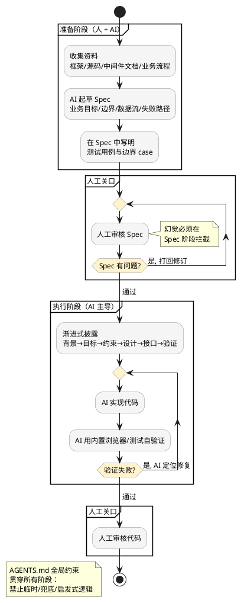

## 简介

把一个需求直接丢给 AI，它能很快生成代码——但这种代码往往业务边界不清、状态一致性不足、为了"跑通"塞进一堆临时兼容和兜底逻辑。问题不在模型不会写，而在于你没给它稳定的上下文、规约、工具链和验证环境。

本文把"AI 编程做得好"这件事拆成 10 个环节，每个环节都给出可以直接复制到项目里的模板、约束文件、检查清单或命令。内容整理自一篇京东内部的 AI Coding 实践分享，去掉了产品相关部分，只保留对任意团队都通用的方法。

## 整体流程

先看这套实践串起来是什么样子。核心是：**写代码之前先沉淀 Spec，Spec 经过人工审核后再让 AI 执行，执行完用浏览器/测试自己验证，最后人工审核代码**。`AGENTS.md` 作为全局约束层，贯穿始终。



下面逐个环节展开。

---

## 1. 先做资料收集，不要一上来就写代码

AI 产出的质量上限，基本由你喂给它的上下文质量决定。第一步不是 Coding，而是把"这个领域的合理实现长什么样、哪些是不能碰的边界、哪些能力应该复用"准备好。

落地做法：在仓库里建一个 `docs/context/` 目录，把 AI 需要的背景资料结构化地放进去，而不是每次对话临时口述。

```text
docs/context/
├── 00-overview.md         # 项目是什么、解决什么问题、当前阶段
├── 01-tech-stack.md       # 技术框架、版本、为什么选它
├── 02-architecture.md     # 现有稳定架构、可复用模块清单
├── 03-business-flow.md    # 业务流程、权限模型、数据流转
├── 04-constraints.md      # 系统约束、不能碰的边界
├── 05-references/         # 优秀案例、示例项目的关键代码摘录
└── 06-glossary.md         # 领域术语表（避免 AI 自己脑补字段名）
```

收集资料时按这四类覆盖，缺哪类就补哪类：

| 资料类别 | 具体内容 | 作用 |
|---------|---------|------|
| 技术框架 | 用到的框架/库的官方文档、版本约定 | 让 AI 用对 API，不凭记忆瞎写 |
| 参考源码 | 同类优秀项目的源码或关键片段 | 建立"什么是好实现"的坐标系 |
| 内部中间件 | 公司内部组件/服务的接入文档 | 避免 AI 发明不存在的接口 |
| 业务背景 | 流程、权限、数据流转方式 | 让 AI 理解业务边界 |

在对话开始时，让 AI 先读这个目录：`先阅读 docs/context/ 下的全部文档，理解项目背景后再开始，不要急着写代码`。

---

## 2. 从"让 AI 写代码"升级为"让 AI 写 Spec"

"我描述需求，AI 生成代码"这种方式短期快、长期危险——代码背后的设计意图、边界条件、业务约束没有被稳定记录下来。更好的方式是 **Spec Coding（规约编程）**：先让 AI 写 Spec，你 Review 的是 Spec，Merge 的也是 Spec。

关键原则：

- **Review 对象从代码变成 Spec**——代码是 Spec 的产物，源头对了产物才可能对
- **Spec 纳入版本控制**——和代码一样放进 git，不能有脏内容、旧内容、重复内容、历史临时方案
- **Spec 先行**——没有通过审核的 Spec，不允许进入编码

一份合格的 Spec 至少回答这些问题，可以直接用作模板：

```markdown
# Spec: <功能名称>

## 1. 背景与目标
- 解决什么业务问题？
- 不做会怎样？

## 2. 系统边界
- 这个功能负责什么？不负责什么？
- 与哪些现有模块交互？交互契约是什么？

## 3. 数据流
- 数据从哪里来？（接口/数据库/事件）
- 数据到哪里去？
- 中间经过哪些转换？

## 4. 稳定性约束
- 哪些逻辑必须稳定、不允许推断？
- 哪些场景必须失败（fail fast）？哪些场景必须继续？
- 是否存在多实例部署 / 刷新浏览器 / 切换会话后的状态一致性问题？

## 5. 接口定义
- 输入：字段、类型、约束
- 输出：字段、类型、错误码语义

## 6. 测试用例与边界 case
（见第 5 节模板，必须逐条列出）

## 7. 非目标
- 明确本次不做什么，避免范围蔓延
```

Spec 清晰之后，AI 才有可能写出稳定的代码。让 AI 写 Spec 的提示词也很简单：`不要写代码。先根据 docs/context/ 和我的需求，按 docs/spec-template.md 的结构产出一份 Spec，我们先对齐设计。`

---

## 3. 用渐进式披露组织复杂任务

复杂项目不适合一次性把所有内容塞给 AI：上下文太多时模型抓不住重点，太少时又会自己脑补。解决办法是**渐进式披露（Progressive Disclosure）**——把需求拆成层级，让 AI 在关键决策点拿到足够信息，而不是一开始就看到全部。

把一个需求按六层组织，每层是一个可独立审阅的小文档：

| 层级 | 回答的问题 | 什么时候给 AI |
|------|-----------|--------------|
| 背景层 | 为什么要做？ | 任务开始 |
| 目标层 | 最终要达成什么？ | 任务开始 |
| 约束层 | 什么不能做？ | 任务开始 |
| 设计层 | 模块如何拆分？ | 进入设计时 |
| 接口层 | 输入输出是什么？ | 进入编码时 |
| 验证层 | 怎么证明实现是对的？ | 编码前+完成后 |

工具上可以用 [OpenSpec](https://github.com/Fission-AI/OpenSpec) 这类规约工具，也可以用自定义的目录约定。一个轻量的自定义版本：

```text
specs/
└── feature-task-execution/
    ├── 1-background.md
    ├── 2-goals.md
    ├── 3-constraints.md
    ├── 4-design.md
    ├── 5-interface.md
    └── 6-verification.md
```

执行时分阶段引用，而不是一次性 `@` 整个目录：

```text
# 设计阶段
先只读 1-background、2-goals、3-constraints，产出 4-design.md

# 编码阶段
基于已确认的 4-design 和 5-interface，实现模块 X
```

渐进式披露的价值是同时控制了上下文噪音和脑补空间——这比把一堆文档全丢进去然后期待模型"自动理解"可靠得多。

---

## 4. 用 AGENTS.md 约束全局行为

AI 编程最容易出问题的地方不是语法错误，而是它为了"完成任务"私自加入临时逻辑、兜底逻辑、兼容逻辑和启发式推断——这些看起来贴心，实际会破坏系统稳定性。因为 **AI 的默认倾向是"尽量帮你跑通"**，而工程更关心逻辑是否稳定、边界是否清晰、状态是否一致。

把全局约束写进仓库根目录的 `AGENTS.md`（Claude Code、Cursor、Codex CLI 等主流工具都会自动读取），让 AI 在整个代码库范围内遵守。下面是一份可以直接用的模板：

```markdown
# AGENTS.md

本文件是 AI 在本仓库工作的硬约束，优先级高于"尽快跑通"。

## 禁止项
- 禁止用临时逻辑替代稳定业务逻辑
- 禁止用推断、启发式、兜底方式补齐缺失的事实；
  缺数据就报错或明确标注，不要猜
- 不需要兼容历史数据时，不要写兼容分支
- Breaking Change 就按 Breaking Change 实现，
  不要偷偷做旧逻辑适配
- 禁止为了快速通过测试而堆 if/else 条件分支
- 禁止引入"看起来合理但系统里根本不存在"的字段/接口/状态

## 要求项
- 能复用已有能力就复用；不能复用时做合理拆分，并说明理由
- 不确定的设计先停下来问，不要自行决定后继续
- 失败要 fail fast，并给出明确的错误信息
- 改动遵循现有代码风格与目录约定

## 边界
- 不修改部署配置 / CI 配置，除非被明确要求
- 涉及数据迁移、删除操作前必须先确认
```

这类约束的本质是把"防止工程师走捷径"这件原本靠团队文化保障的事，硬编码进流程。区别在于 AI 不会"自觉遵守"，你必须把规则写明白。

> 注意：`AGENTS.md` 是约束不是保证——它影响 AI 的决策，但不能 100% 强制。所以第 6、第 10 条的人工关口仍然必要。

---

## 5. Spec 里必须写测试用例和边界 case

让 AI 写代码时补一句"注意边界情况"基本没用。正确做法是**在 Spec 里把测试用例和边界 case 逐条列出**，让 AI 在实现前就知道哪些情况必须被覆盖。否则它会按最简单路径实现一个"能跑"的版本——但"能跑"不等于"能上线"。

很多边界 case 来自分布式和前端状态一致性，下面这份清单可以作为 Spec 第 6 节的起点，逐条标注"预期行为"：

```markdown
## 状态一致性 / 边界 case 清单

| # | 场景 | 预期行为 |
|---|------|---------|
| 1 | 用户刷新浏览器后 | 任务状态是否仍然一致？ |
| 2 | 多实例同时处理同一任务 | 是否会重复执行？如何去重？ |
| 3 | 工具/接口调用失败 | 中断 / 重试 / 记为观察结果？ |
| 4 | 历史记录展示 | 展示最终状态还是中间状态？ |
| 5 | 权限变化后 | 已有会话能否继续访问？ |
| 6 | 流式 vs 非流式返回 | 两种模式状态是否一致？ |
| 7 | 任务恢复 | 是否依赖本地内存？进程重启后呢？ |
| 8 | 并发写同一资源 | 如何处理竞态？ |
| 9 | 空状态 / 超长输入 / 异常字符 | 如何展示与校验？ |
```

不是每个功能都要覆盖全部 9 条，但每条都要主动判断"适用还是不适用"，而不是默认忽略。把这张表填好放进 Spec，AI 的实现质量会有质的差别。

---

## 6. 人工严格审核 Spec，避免幻觉前置

AI 写错代码很常见，但更危险的是 **AI 写错 Spec**——一旦 Spec 错了，后面的代码、测试、文档、接口都会沿着错误方向扩展，AI 不是在犯局部错误，而是在系统性放大错误。所以幻觉必须在 Spec 阶段拦截，而不是等到代码阶段。

把 Spec 当成 PR 来审，用固定的检查清单：

```markdown
## Spec 审查清单（人工，逐条打勾）

- [ ] 业务目标是否真实？（不是 AI 想象出来的需求）
- [ ] 数据来源是否可靠？字段是否真实存在于系统中？
- [ ] 模块边界是否合理？有没有越界或职责不清？
- [ ] 是否有模型自行脑补的字段 / 接口 / 状态？
- [ ] 是否把临时方案写成了正式方案？
- [ ] 是否遗漏了关键失败路径？
- [ ] 是否引入了不必要的兼容逻辑？
- [ ] 是否存在"看起来合理但系统里根本没有"的设计？
- [ ] 测试用例 / 边界 case 是否覆盖充分？
```

清单里最值得警惕的是"脑补字段/接口"和"临时方案当正式方案"——这两类问题在代码里很难一眼看出，但在 Spec 里相对容易识别。

这条也定义了 AI 时代工程师的角色变化：**人不是被 AI 替代，而是从写代码的人，升级为定义系统方向和审核关键决策的人。** AI 可以帮你推演逻辑闭环、发现隐藏问题，但最终业务判断必须由人负责。

---

## 7. 给 AI 示例项目，而不是只给抽象要求

对于没有行业成熟方案的产品，只给抽象描述是不够的。"做一个 Agent 协作系统""做一个可观测的任务执行框架"——这些说法对人来说勉强能懂，对 AI 仍然太抽象，它只能凭空发明架构。

更好的方式是**提供示例项目作为参照物**。示例不是答案，而是帮 AI 建立"什么是好实现"的坐标系。具体怎么给：

1. 把参考仓库 clone 到本地或作为 submodule，让 AI 能直接读源码
2. 在 `docs/context/05-references/` 里写明**从每个项目学什么**，而不是泛泛地说"参考它"

```markdown
## 参考项目与学习点

| 项目 | 学习点 | 对应到我们的模块 |
|------|--------|----------------|
| OpenClaw | 本地 Agent 的工具链组织方式 | tools/ 模块 |
| DeerFlow | 多步骤任务编排方式 | orchestrator/ |
| Claude Code | CLI Agent 的交互与上下文管理 | cli/ + context/ |
| mem0 | 记忆系统的抽象方式 | memory/ |
| LangGraph | 图式状态流转 | state-machine/ |
| LangFuse | 可观测性设计 | observability/ |
```

给 AI 的提示词要具体到学习点：`参考 reference/deerflow 的任务编排实现，但不要照抄——理解它如何处理步骤依赖和失败回退，然后按我们的 Spec 重新设计 orchestrator 模块`。

明确"参照而非复制"这个边界很重要，否则 AI 容易把示例项目的实现细节连同它的业务假设一起搬过来。

---

## 8. 给足交互示意图和 UI 约束

AI 做前端最常见的问题是：功能大概对了，但页面不像一个完整产品，每个页面像不同开发者写的。这通常不是模型不会写前端，而是输入信息不够。

要让 AI 产出统一、稳定、可用的 UI，需要给它页面布局、交互描述和通用约束。建一份 `docs/ui-spec.md`：

```markdown
# UI 规约

## 全局
- 设计系统 / 组件库：<例如 shadcn/ui、Ant Design>
- 主色 / 间距 / 圆角规范：<token 或参考链接>
- 表格、卡片、筛选器、弹窗必须复用同一套组件

## 每个页面必须定义
- 页面分区：<头部 / 侧边 / 主区 / ...>
- 主操作按钮位置与样式
- 空状态如何展示
- 加载状态如何展示（骨架屏 / spinner）
- 错误信息出现在哪里、什么样式
- 刷新后状态如何恢复

## 交互约束
- 哪些交互必须即时反馈（乐观更新）？
- 哪些操作需要二次确认（删除 / 不可逆操作）？
- 流式内容如何滚动？
```

能给截图、示意图、组件规范或已有页面参考就一并给上。提示词里直接引用：`按 docs/ui-spec.md 的规范实现这个页面，空状态和加载状态必须处理，复用现有的 Table/Modal 组件，不要新造`。

这一步能显著提升 UI 一致性，把"每个页面风格不一"的问题挡在生成阶段。

---

## 9. 善用内置浏览器，让 AI 自己验证结果

AI Coding 不应该停在"代码写完了"。尤其是 Web 应用，很多问题只看代码发现不了——布局错位、弹窗层级不对、按钮状态没更新、刷新后状态丢失、控制台报错。让 AI 具备"看见结果"的能力，它才从代码生成器变成更完整的工程协作者。

现在主流工具都支持内置/接入浏览器。以 Claude Code 接入 [Chrome DevTools MCP](https://github.com/ChromeDevTools/chrome-devtools-mcp) 为例：

```bash
# 安装 Chrome DevTools MCP（让 AI 能开浏览器、点击、截图、读控制台）
claude mcp add chrome-devtools npx chrome-devtools-mcp@latest
```

配好之后，给 AI 一个明确的验证闭环，而不是让它"自己看着办"：

```markdown
## 浏览器验证清单（让 AI 逐项执行并截图）

- [ ] 打开页面，截图，确认布局无错位
- [ ] 走一遍主操作链路（golden path），确认按钮状态正确更新
- [ ] 触发一次表单校验错误，确认提示明显
- [ ] 刷新页面，确认状态正确恢复
- [ ] 检查浏览器控制台，确认无 error
- [ ] 流式内容场景：确认正确滚动、无截断
```

提示词：`用浏览器打开 http://localhost:4321，按上面的验证清单逐项操作并截图，发现问题就定位并修复，修完重新验证，直到清单全部通过`。

让 AI 自己跑这个闭环，能消化掉大量原本要人工来回反馈的低级问题。

---

## 10. Harness Engineering：人主导，给 Agent 足够空间

最后一条也是统领性的：AI 编程的核心不是 Prompt Engineering，而是 **Harness Engineering**——在人主导的前提下，尽可能给 Agent 自由发挥的空间，并为它准备好完成任务所需的一切环境。

如果只把 AI 当"代码补全工具"，它的价值会被大幅限制。真正高效的 AI Coding，是让 Agent 在一个被设计好的工程环境里工作：不是让它随便发挥，也不是把所有决策都交给它，而是给它明确的边界 + 足够大的执行空间。

前面 9 条其实都是在搭这个 harness。把它们对应回来，就是一张"开工前自检表"：

| Harness 要素 | 对应实践 | 落地物 |
|-------------|---------|--------|
| 资料 | 实践 1 | `docs/context/` |
| 规约 | 实践 2、3 | Spec 模板 + 分层目录 |
| 全局约束 | 实践 4 | `AGENTS.md` |
| 测试用例 | 实践 5 | 边界 case 清单 |
| 人工关口 | 实践 6 | Spec / 代码审查清单 |
| 示例项目 | 实践 7 | `reference/` + 学习点表 |
| UI 约束 | 实践 8 | `docs/ui-spec.md` |
| 浏览器/验证 | 实践 9 | DevTools MCP + 验证清单 |
| 工具链 / Skill / 插件 | 全程 | MCP、Skill、CI |
| 执行空间 | 实践 10 | 明确边界内放手让 Agent 跑 |

分工很清晰：**人负责定义方向、业务判断、最终审核；AI 负责快速探索、实现、验证、补充细节。**

## 小结

"月均 5w 行有效代码"不是靠不停催 AI"多写一点"。关键在于你是否为 AI 构建了稳定的工程上下文，是否把需求沉淀成可审查的 Spec，是否用约束文件管住它的行为，是否让它能验证自己的输出，是否在人主导的前提下释放了 Agent 的执行能力。

落地顺序建议：先建 `AGENTS.md`（成本最低、收益最直接），再建 Spec 模板和审查清单（解决幻觉前置），最后接入浏览器验证（关掉低级问题的反馈循环）。这三件事做完，AI 编程的稳定性会有肉眼可见的提升。

未来的软件开发不会是"人写"或"AI 写"的二选一，更可能是：人定义方向、AI 扩展执行力；人审核关键决策、AI 推演实现细节。

## 参考资料

- [OpenSpec — 规约驱动的 AI 协作工具](https://github.com/Fission-AI/OpenSpec)
- [Chrome DevTools MCP — 让 AI 接入浏览器](https://github.com/ChromeDevTools/chrome-devtools-mcp)
- [AGENTS.md 约定](https://agents.md/)
- [superpowers：给 AI 编码 Agent 一套软件工程方法论](/posts/superpowers-agentic-engineering-methodology/)
- [Agent Skills：让 AI 编程 Agent 按工程规范干活的 24 个工作流](/posts/agent-skills-engineering-workflows/)
