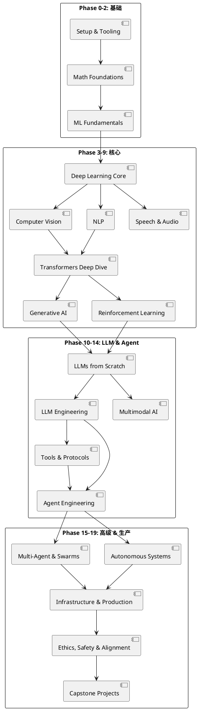
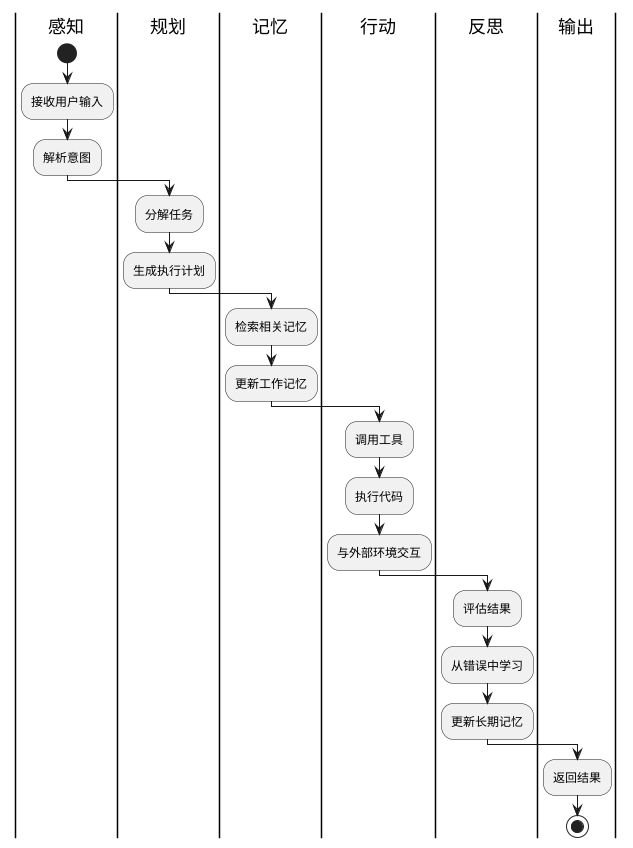

## 简介

AI 领域的学习资源浩如烟海，但大部分是碎片化的——一篇论文解读、一个微调教程、一个 Agent demo。学习者很难建立系统化的知识体系。

ai-engineering-from-scratch 试图解决这个问题。它是一套**完整的 AI 工程课程体系**，503 节课、20 个阶段、约 320 学时，覆盖从基础数学到自主多智能体系统的全链路。核心理念是**"先手写再调库"**——每个算法都从数学推导开始，用纯代码从零实现，等到 PyTorch 出现时，你已经知道它底层在做什么。

32.2k stars，2026 年 3 月创建，不到 3 个月就成为 GitHub 上增长最快的 AI 教育项目之一。

## 项目概览

| 项目 | 值 |
|------|-----|
| 仓库 | [rohitg00/ai-engineering-from-scratch](https://github.com/rohitg00/ai-engineering-from-scratch) |
| Stars | 32.2k（截至 2026-06-14） |
| 许可证 | MIT |
| 语言 | Python、TypeScript、Rust、Julia |
| 作者 | Rohit Ghumare（rohitg00） |
| 官网 | [aiengineeringfromscratch.com](https://aiengineeringfromscratch.com) |
| 创建时间 | 2026-03-18 |
| 规模 | 503 节课 / 20 个阶段 / ~320 学时 |

## 核心功能

### 20 个阶段

| 阶段 | 主题 | 课时 |
|------|------|------|
| Phase 0 | Setup & Tooling（开发环境、Git、GPU、Docker） | 12 |
| Phase 1 | Math Foundations（线性代数、微积分、概率、优化、信息论、傅里叶变换） | 22 |
| Phase 2 | ML Fundamentals（回归、决策树、SVM、集成方法、时间序列） | 18 |
| Phase 3 | Deep Learning Core（感知机、反向传播手写、激活/损失函数、优化器、自建 mini-framework） | 13 |
| Phase 4 | Computer Vision（CNN 全系列、YOLO、GAN、扩散模型、Stable Diffusion、ViT、3D 视觉） | 28 |
| Phase 5 | NLP（分词、Word2Vec、seq2seq、注意力、BERT、RAG、知识图谱、评估） | 29 |
| Phase 6 | Speech & Audio（Whisper、TTS、语音克隆、神经音频编解码、流式语音对话） | 17 |
| Phase 7 | Transformers Deep Dive（手写 Transformer、BERT/GPT/T5、MoE、KV Cache、Flash Attention） | 14 |
| Phase 8 | Generative AI（VAE、GAN、DDPM、Latent Diffusion、ControlNet、Flow Matching） | 14 |
| Phase 9 | Reinforcement Learning（MDP、DQN、PPO、RLHF、多智能体 RL） | 12 |
| Phase 10 | LLMs from Scratch（分词器、预训练 mini-GPT 124M、分布式训练、RLHF/DPO、量化、推理优化） | 22 |
| Phase 11 | LLM Engineering（提示工程、RAG、LoRA 微调、函数调用、MCP、LangGraph） | 17 |
| Phase 12 | Multimodal AI（CLIP、LLaVA、Qwen-VL、视频-语言、具身 VLA） | 25 |
| Phase 13 | Tools & Protocols（MCP 全系列、A2A 协议、OpenTelemetry、Agent SDK） | 23 |
| Phase 14 | Agent Engineering（Agent 循环、记忆系统、规划、各大框架、computer use、语音 Agent、可观测性） | 42 |
| Phase 15 | Autonomous Systems（AlphaEvolve、Darwin Gödel Machine、AI Scientist、安全框架） | 22 |
| Phase 16 | Multi-Agent & Swarms（通信协议、群体智能、MARL、Agent 经济） | 25 |
| Phase 17 | Infrastructure & Production（推理引擎 vLLM/SGLang/TensorRT-LLM、边缘推理、SRE、合规） | 28 |
| Phase 18 | Ethics, Safety & Alignment（RLHF/DPO、红队测试、越狱、水印、监管框架） | 30 |
| Phase 19 | Capstone Projects（17 个端到端产品 + 9 个深度构建方向） | 85 |

### 每节课的结构

```text
phases/<NN>-<phase-name>/<NN>-<lesson-name>/
├── code/      # 可运行实现（Python/TypeScript/Rust/Julia）
├── docs/
│   └── en.md  # 课程叙述
└── outputs/   # 本课产出的提示词/技能/Agent/MCP 服务器
```

每节课遵循统一循环：**读问题 → 推数学 → 写代码 → 跑测试 → 保留制品**。

### 技术栈

- **语言**：Python、TypeScript、Rust、Julia
- **框架**：PyTorch、JAX、LangGraph、AutoGen、CrewAI、OpenAI Agents SDK、Claude Agent SDK
- **推理服务**：vLLM、SGLang、TensorRT-LLM、llama.cpp、Ollama、NVIDIA Dynamo
- **协议**：MCP（Model Context Protocol）、A2A
- **基础设施**：Kubernetes、Karpenter、Docker、Modal、各大云平台
- **安全/评估**：Garak、Llama Guard、PyRIT、RAGAS、DeepEval

## 快速上手

### 克隆仓库

```bash
git clone https://github.com/rohitg00/ai-engineering-from-scratch.git
cd ai-engineering-from-scratch
```

### 学习路径

#### 方式一：按阶段顺序学习

从 Phase 0 开始，按顺序学习每个阶段的课程。这是最系统的方式。

```bash
# 从第一阶段开始
cd phases/00-setup-tooling/01-development-environment
python code/setup.py
```

#### 方式二：用 `/find-your-level` 测试水平

项目内置了一个 10 题测试，根据你的回答推荐个性化学习路径。

#### 方式三：直接跳到感兴趣的阶段

如果你有基础，可以直接跳到特定阶段。例如，已经懂 ML 基础，可以从 Phase 7（Transformers）开始。

### 安装 Agent 技能

```bash
python3 scripts/install_skills.py
```

这会安装项目内置的交互技能到 Claude Code 中。

## 架构与原理

### 课程架构



### 设计哲学

项目的核心设计哲学是**"先手写再调库"**：

1. **每个算法从数学推导开始**
2. **用纯代码从零实现**（不依赖框架）
3. **等到 PyTorch 出现时，你已经知道它底层在做什么**

例如，在 Phase 3（Deep Learning Core）中：
- 第 1 课：手动实现感知机（纯 Python）
- 第 2 课：手写反向传播（纯 NumPy）
- 第 3 课：实现各种激活函数和损失函数
- 第 4 课：实现 SGD、Adam 等优化器
- 第 5 课：构建自己的 mini-framework

到 Phase 10（LLMs from Scratch）时，你已经从零实现了一个 mini-GPT 124M。

### 制品驱动学习

每节课产出的制品（Prompt / Skill / Agent / MCP Server）可以直接在其他项目中使用。这不是"学完就忘"的教程，而是边学边建一个可复用的工具库。

### 多 Agent 流水线

Phase 14（Agent Engineering）深入讲解了 Agent 的构建：



### 关键技术点

#### Phase 7：手写 Transformer

```python
# 简化的自注意力机制实现
def self_attention(Q, K, V):
    # Q, K, V: (seq_len, d_model)
    scores = Q @ K.T / math.sqrt(d_model)  # (seq_len, seq_len)
    attn = softmax(scores, dim=-1)
    output = attn @ V  # (seq_len, d_model)
    return output
```

#### Phase 10：预训练 mini-GPT

从零实现一个 124M 参数的 GPT 模型，包括：
- 分词器（BPE）
- Transformer 架构
- 预训练循环
- 分布式训练（DeepSpeed）
- RLHF / DPO 对齐
- 量化（GPTQ、AWQ）
- 推理优化（KV Cache、Flash Attention）

## 关键设计决策

**1. 为什么要从零实现，而不是直接调库？**

调库只能学会"怎么用"，从零实现才能理解"为什么"。当你自己实现了反向传播，你就真正理解了梯度是如何流动的。

**2. 为什么要 4 种语言？**

不同语言有不同的适用场景：
- Python：ML/DL 主力
- TypeScript：前端 + Agent
- Rust：高性能推理
- Julia：科学计算

**3. 为什么要产出制品？**

制品（Prompt / Skill / Agent / MCP Server）是可复用的。你在学习过程中建立的工具库，可以在实际工作中直接使用。

**4. 为什么要紧跟 2026 年最前沿技术？**

很多课程还在教 2020 年的技术（BERT、GPT-2）。这个项目覆盖了 MCP 协议、Agent SDK、AlphaEvolve、具身智能等最新内容。

**5. 为什么免费开源？**

AI 教育不应该有门槛。MIT 许可证意味着任何人都可以使用、修改、分发。

## 适用场景与局限

### 适用场景

- **系统性学习 AI**：从基础数学到生产部署的全链路
- **转行 AI 工程师**：补齐理论 + 实践的双重短板
- **在职工程师进阶**：深入理解 LLM、Agent、多模态等前沿技术
- **教学参考**：大学教授可以参考课程设计
- **面试准备**：覆盖 ML/DL 的核心知识点

### 局限

- **内容量巨大**：503 节课，320 学时，需要长期投入
- **要求较高**：需要编程基础和数学基础
- **部分课程依赖 GPU**：训练大模型需要计算资源
- **更新速度快**：AI 领域变化快，课程内容可能需要频繁更新
- **缺乏互动**：没有作业批改、答疑等教学服务

## 参考资料

- 官方仓库：[rohitg00/ai-engineering-from-scratch](https://github.com/rohitg00/ai-engineering-from-scratch)
- 官网：[aiengineeringfromscratch.com](https://aiengineeringfromscratch.com)
- 作者：[Rohit Ghumare](https://github.com/rohitg00)
- 配套项目：[agentmemory](https://github.com/rohitg00/agentmemory)
