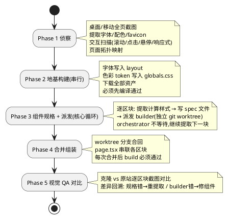

## ai-website-cloner-template：用 AI 编程 agent 把网站逆向成 Next.js 代码

ai-website-cloner-template 是一个 GitHub 模板仓库，让 AI 编程 agent 用一条命令把任意网站"克隆"成一个干净、现代的 Next.js 代码库。注意：它**不是抓 HTML，也不是截图转图片复刻**，而是通过浏览器自动化提取真实的计算样式和资产，把页面逆向重建成结构化、强类型的 React 组件代码。

## 它要解决什么问题

"克隆一个网站"这件事，过去有两条常见路径，各有硬伤：

- **HTML 抓取**：把渲染后的 DOM 扒下来。得到的是一堆纠缠的内联样式、自动生成的类名、写死的结构——能跑，但不是人能维护的代码。
- **截图 + 视觉复刻**：让模型看图重画。得到的是"看起来像"的近似品，像素对不齐，交互行为全丢。

这个模板走的是第三条路：**逆向工程**。它让 agent 像一个"工地工头"一样，用浏览器逐区块检查真实页面——读 `getComputedStyle()` 拿到精确的样式值、下载真实的图片视频资产、记录滚动/点击/悬停触发的交互行为——再把每个区块重建成手写质量的 React 组件。产出是真实的、类型安全的、按组件拆分的框架代码。

## 项目概览

| 属性 | 详情 |
|------|-----|
| 仓库 | [JCodesMore/ai-website-cloner-template](https://github.com/JCodesMore/ai-website-cloner-template) |
| Stars | 约 20.5k（截至 2026-06-26） |
| 许可证 | MIT |
| 语言 | TypeScript |
| 形态 | GitHub 模板仓库（"Use this template"） |
| 产出技术栈 | Next.js 16 + React 19 + shadcn/ui + Tailwind v4 |
| 支持 agent | Claude Code（推荐）/ Cursor / Copilot / Gemini 等 12+ |
| 最新版本 | v0.3.1 |

它本身不是 CLI 工具，而是一个**模板仓库** + 一份 **AI agent 指令负载**（核心是约 30KB 的 `SKILL.md`）。

## "一条命令"到底是什么

真实命令，来自 README。点 "Use this template" 创建你自己的仓库后：

```bash
git clone https://github.com/YOUR-USERNAME/YOUR-NEW-REPOSITORY.git
cd YOUR-NEW-REPOSITORY
npm install
claude --chrome          # 启动带浏览器访问的 Claude Code
```

然后在 agent 里：

```text
/clone-website <target-url1> [<target-url2> ...]
```

`/clone-website` **不是脚本**，而是一个由 prompt 支撑的 slash command——它解析到 `.claude/skills/clone-website/SKILL.md`，一份约 474 行的指令文档，agent 读取并执行其中的五阶段流水线。所谓"一条命令"，本质是"加载这份巨型编排 prompt 并运行它"。多个 URL 会并行处理，各自输出到独立目录。

浏览器自动化是硬性前提（"This skill cannot work without browser automation"），优先用 Chrome MCP，也接受 Playwright/Browserbase/Puppeteer MCP。

## 核心机制：五阶段逆向流水线

整个流程的心智模型是"工头巡视工地"——**检查和施工是交织并行的，不是先查完再建**。



### Phase 1：侦察

桌面（1440px）和移动（390px）全页截图；全局提取字体、配色（映射到 shadcn 的 token）、favicon/OG。关键是一轮**强制的"交互扫描"**：分别做滚动扫描、点击扫描、悬停扫描、响应式扫描，发现截图里看不见的行为（比如它会专门检查 Lenis/Locomotive 这类平滑滚动库的 `.lenis` 类）。所有发现写进 `docs/research/BEHAVIORS.md`（"行为圣经"）和 `PAGE_TOPOLOGY.md`（页面拓扑：每个区块、sticky vs flow、z-index 层级、交互模型）。

### Phase 2：地基构建（串行，orchestrator 亲自做）

更新字体、把色彩 token 和 keyframes 写进 `globals.css`、在 `src/types/` 建 TypeScript 接口、把内联 `<svg>` 提取成命名 React 组件、写并运行 `scripts/download-assets.mjs` 下载所有图片视频。地基必须先 `npm run build` 通过，才允许后续并行。

### Phase 3：组件规格与派发（核心）

每个区块三步：**提取 → 写 spec → 派发 builder**。

- **提取**：用嵌入的 CSS 提取脚本遍历 DOM（深度 ≤ 4），对约 50 个属性调 `getComputedStyle()`，过滤掉默认值。对有状态的元素，捕获状态 A 和状态 B（如滚动 0 vs 100、tab 点击前后、悬停前后），把**差异**记为行为规格。
- **写 spec**：每个组件一个 `docs/research/components/<name>.spec.md`，按严格模板写（交互模型、DOM 结构、精确计算样式、状态与行为、逐字文本内容、响应式）。这份 spec 是"提取与 builder 之间的契约，是事实来源"。
- **派发**：builder agent 在**独立 git worktree** 里运行，一个区块一个。有一条"复杂度预算规则"：如果 builder 的 spec 超过约 150 行，这个区块必须拆分。每个 builder 收到的是**内联在 prompt 里的完整 spec**（明确不是"去读那个文件"），且必须通过 `npx tsc --noEmit` 才算完成。orchestrator 不等待，继续提取下一块。

这里的 worktree 隔离设计很关键：多个 builder 并行写代码，各自在物理隔离的工作目录里，天然避免冲突——这和后面要提的 Orca 用 worktree 隔离并行 agent 是同一个思路。

### Phase 4-5：合并与 QA

worktree 分支合回主干（orchestrator 用完整上下文解决冲突），`page.tsx` 串联所有区块。最后 Phase 5 做视觉对比：克隆站 vs 原站在 1440px 和 390px 逐区块截图对比，差异回溯到是规格错（重新提取）还是 builder 错（修组件），所有交互重新测一遍才算完成。

`SKILL.md` 里有一长段"What NOT to Do"，记录了踩过的坑。排第一位、最昂贵的错误是：**原站是滚动驱动的交互，却被建成了点击式 tab**——所以有条原则叫"Don't click first"（先滚动，再点击，以免漏掉滚动驱动行为）。

## 一份 SKILL，12 个平台

这个模板支持 12+ 个 AI agent（Claude Code、Codex、Copilot、Cursor、Windsurf、Gemini CLI、Cline 等）。它的做法很值得借鉴——**两个事实来源 + 两个同步脚本**，自动生成各平台的副本：

| 事实来源 | 同步命令 | 生成 |
|----------|----------|------|
| `.claude/skills/clone-website/SKILL.md` | `node scripts/sync-skills.mjs` | 9 个平台的命令文件 |
| `AGENTS.md` | `bash scripts/sync-agent-rules.sh` | 4 个平台的指令文件 |

`sync-skills.mjs` 解析 SKILL.md，按各平台的参数语法生成变体：Cursor/Windsurf 把 `$ARGUMENTS` 替换成自然语言，Gemini 生成 TOML（`{{args}}`），Amazon Q 生成 JSON agent 定义。`CLAUDE.md` 和 `GEMINI.md` 只是一行 `@AGENTS.md` 的指针文件。生成的文件都带"AUTO-GENERATED, do not edit"头。

顺带一提，`AGENTS.md` 开头有句很有意思的提醒："This is NOT the Next.js you know"——因为 Next.js 16 有破坏性变更，它要求 agent 先读 `node_modules/next/dist/docs/` 里的文档，避免用训练数据里过时的 Next.js 知识写代码。

## 产出的技术栈

| 层 | 选型 |
|----|------|
| 框架 | Next.js 16.2 + React 19 + TypeScript 5 strict（禁 `any`） |
| 组件 | shadcn/ui（基于 Base UI）+ CVA + tailwind-merge |
| 样式 | Tailwind CSS v4 + oklch 设计 token |
| 图标 | Lucide React（克隆时被提取的 SVG 替换） |
| 部署 | Vercel（也带 Dockerfile） |

模板自带的脚手架大多是空占位，`button.tsx` 是唯一预置组件，`cn()` 是唯一预置工具函数——真正的内容由克隆流程填充。

## 适用场景与边界

README 给出的合规用途：**平台迁移**（把你自己拥有的站点从 WordPress/Webflow 重建成代码）、**找回丢失的源码**（针对你拥有的站点）、**学习与拆解**。

需要明确的边界和法律风险：

- **只克隆前端**。SKILL.md 明确范围内只含视觉布局、样式、组件结构、交互、响应式和 mock 数据；范围外是真实后端、数据库、认证、SEO、无障碍审计。
- **依赖外部浏览器 MCP**，没配就无法工作。
- **质量取决于模型**。README 推荐 "Opus 4.7"，更便宜的模型产出会更弱；且 LLM 输出非确定性，必须靠 Phase 5 的人工 QA 对比兜底。
- **法律/伦理风险被显式推给用户**。README 专门有 "Not Intended For" 一节：不得用于钓鱼或仿冒、不得把他人设计据为己有（logo、品牌资产、原创文案归属原主）、不得违反目标站点的服务条款（有些站点明确禁止抓取或复制）。克隆第三方站点存在明确的版权、商标、ToS 风险。

这个项目真正有参考价值的，是它把"逆向一个网站"这件模糊的事，拆解成了一套可执行、可审查、可并行的工程流水线——计算样式提取 + 资产下载 + worktree 并行 builder + 视觉 QA 回溯。即使你不克隆网站，这套"把模糊任务结构化成 agent 流水线"的方法也值得一看。

## 参考资料

- [GitHub 仓库](https://github.com/JCodesMore/ai-website-cloner-template)
- 关键文件：`.claude/skills/clone-website/SKILL.md`、`AGENTS.md`、`scripts/sync-skills.mjs`
