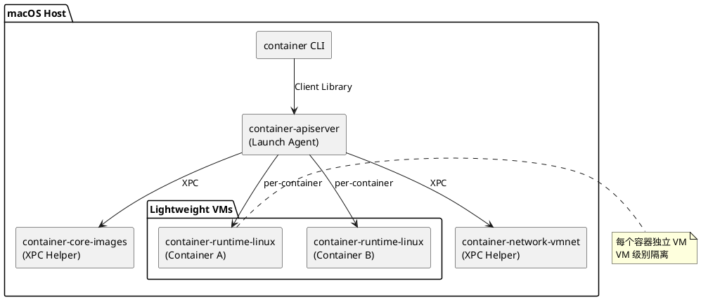

## 简介

Apple Container 是 Apple 开源的 Linux 容器工具，用 Swift 编写，针对 Apple Silicon 优化。与 Docker Desktop 等工具的"所有容器共享一个 Linux VM"不同，container 为每个容器运行一个独立的轻量级虚拟机，在保持 OCI 标准兼容的同时提供 VM 级别的隔离。

## 项目概览

| 属性 | 详情 |
|------|------|
| 仓库 | [apple/container](https://github.com/apple/container) |
| 语言 | Swift (98%) |
| Star | 46.6k |
| 许可证 | Apache-2.0 |
| 最新版本 | 1.0.0 (2026-06-09) |
| 系统要求 | Apple Silicon + macOS 26 |

---

## 背景与动机

传统容器工具在 macOS 上的做法是：启动一个 Linux 虚拟机，在其中运行所有容器。这带来两个问题——所有容器共享同一个内核和网络命名空间，隔离性取决于 Linux 自身的 cgroup/namespace 机制；宿主机的数据需要全量挂载到 VM 中，再由各容器选择性访问。

Apple Container 的方案是：每个容器独立运行在一个轻量 VM 中，利用 macOS 原生的 Virtualization 框架直接管理。

---

## 架构与原理



核心组件：

- **container CLI** — 用户入口，通过 client library 与 apiserver 通信
- **container-apiserver** — Launch Agent，提供容器和网络资源管理 API，通过 `container system start` 激活
- **container-core-images** — XPC helper，管理镜像 API 和本地 content store
- **container-network-vmnet** — XPC helper，管理虚拟网络（基于 macOS vmnet 框架）
- **container-runtime-linux** — 每个容器对应一个实例，管理该容器的生命周期

### 三个设计优势

1. **安全隔离** — VM 级别隔离，每个容器的 rootfs 只包含最小工具集和动态库，减少攻击面
2. **数据隐私** — 只挂载必要数据到各 VM，而非暴露所有数据给一个共享环境
3. **轻量启动** — 内存占用低于完整 VM，启动速度与共享 VM 方案中的容器相当

### macOS 原生集成

| 系统框架 | 用途 |
|---------|------|
| Virtualization framework | 管理 Linux VM 和设备 |
| vmnet framework | 管理容器虚拟网络 |
| XPC | 进程间通信 |
| Launchd | 服务管理 |
| Keychain | Registry 凭证存储 |
| Unified Logging | 日志系统 |

---

## 快速上手

### 安装

从 [GitHub Releases](https://github.com/apple/container/releases) 下载签名安装包，双击安装（需要管理员密码），文件安装到 `/usr/local`。

```bash
container system start
```

首次启动时如果没有 Linux 内核，工具会提示安装。验证安装：

```bash
container list --all
```

### 构建镜像

创建项目目录和 Dockerfile：

```bash
mkdir web-demo && cd web-demo
```

```dockerfile
FROM docker.io/python:alpine
WORKDIR /content
RUN apk add --no-cache curl
RUN echo "<h1>Hello from Apple Container</h1>" > index.html
CMD ["python3", "-m", "http.server", "80", "--bind", "0.0.0.0"]
```

构建：

```bash
container build --tag web-test --file Dockerfile .
```

查看镜像列表：

```bash
container image list
```

### 运行容器

```bash
container run --name my-web-server --detach --rm web-test
```

- `--detach` — 后台运行
- `--rm` — 停止后自动删除

查看资源使用：

```bash
container stats my-web-server
```

在容器内执行命令：

```bash
container exec my-web-server ls /content
container exec -ti my-web-server sh
```

### 容器间通信

配置本地 DNS（macOS 26）：

```bash
sudo container system dns create test
```

启动另一个容器访问 web server：

```bash
container run -it --rm web-test curl http://my-web-server.test
```

### 发布镜像

```bash
container registry login some-registry.example.com
container image tag web-test some-registry.example.com/user/web-test:latest
container image push some-registry.example.com/user/web-test:latest
```

### 停止和清理

```bash
container stop my-web-server
container system stop
```

---

## 系统配置

配置文件位于 `~/.config/container/config.toml`，TOML 格式，省略的段落使用默认值。

```toml
[build]
rosetta = true
cpus = 2
memory = "2048mb"

[container]
cpus = 4
memory = "1g"

[dns]
domain = "test"

[network]
subnet = "192.168.100.0/24"

[registry]
domain = "docker.io"
```

关键配置项说明：

- `[build]` — 控制构建时的 builder VM 资源（CPU、内存、是否启用 Rosetta 翻译）
- `[container]` — `container run` 未指定 `--cpus` / `--memory` 时的默认值
- `[dns]` — 设置后容器可通过 `{name}.{domain}` 访问
- `[network]` — 新建网络的默认子网 CIDR
- `[registry]` — 镜像引用省略 registry 时的默认域（如 `alpine` 解析为 `docker.io/library/alpine`）

内存大小格式支持 `b`/`kb`/`mb`/`gb`/`tb`（全部是 1024 进制）。

---

## 适用场景与局限

**能力范围**：

- 在 Mac 上运行 Linux 容器（开发、测试、CI）
- 拉取/构建/推送 OCI 标准镜像
- 容器间网络通信（macOS 26）
- 通过 Rosetta 运行 x86_64 镜像

**当前限制**：

- 仅支持 Apple Silicon + macOS 26，不支持 Intel Mac 或更早系统
- 容器内释放的内存页不会归还宿主（macOS Virtualization 框架限制），长时间运行内存密集型容器可能需要重启
- macOS 15 上容器间无法互相通信（vmnet 框架限制）
- 项目仍在活跃开发中，minor 版本间可能有破坏性变更

---

## 升级与卸载

```bash
container system stop

# 升级到最新版
/usr/local/bin/update-container.sh

# 降级到指定版本
/usr/local/bin/uninstall-container.sh -k
/usr/local/bin/update-container.sh -v 0.3.0

# 卸载（保留用户数据）
/usr/local/bin/uninstall-container.sh -k

# 卸载（删除用户数据）
/usr/local/bin/uninstall-container.sh -d
```

---

## 参考资料

- [GitHub 仓库](https://github.com/apple/container)
- [Containerization Swift 包](https://github.com/apple/containerization)（底层虚拟化管理库）
- [API 文档](https://apple.github.io/container/documentation/)
