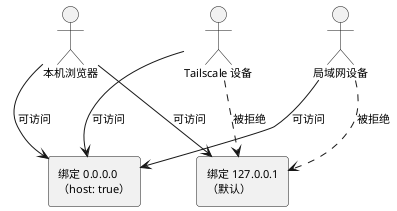

## 问题现象

Astro 开发服务器默认绑定 `localhost`（127.0.0.1），只接受本机连接。通过 Tailscale IP 或局域网 IP 访问时连接超时。

启动 `pnpm dev` 后终端只显示 `Local http://localhost:4321/`，没有 `Network` 行。用 `lsof` 确认：

```bash
$ lsof -i :4321
node  12345  user  23u  IPv4  ...  TCP 127.0.0.1:4321 (LISTEN)
#                                      ^^^^^^^^^^^ 只绑定了 127.0.0.1
```

---

## 原因分析

Astro（以及 Vite、Next.js 等框架）出于安全考虑，开发服务器默认绑定 `localhost`，只有本机进程能连接。其他网络接口（包括 Tailscale 虚拟网卡）被排除在外。

绑定地址决定了哪些来源能连上：



默认的 `127.0.0.1` 只放行本机，把绑定地址改成 `0.0.0.0`（监听所有接口）后，局域网和 Tailscale 设备才能连上。

---

## 解决方法

### 方法一：命令行加 `--host`（临时）

```bash
pnpm dev -- --host
```

启动后终端会显示 `Network` 行，包含局域网 IP 和 Tailscale IP。缺点是每次都需要手动加参数。

### 方法二：修改配置文件（永久）

在 `astro.config.mjs` 中添加：

```js
export default defineConfig({
  site: 'https://your-site.com',
  server: { host: true },  // 监听所有网络接口
  // ...
});
```

`host: true` 等价于 `host: '0.0.0.0'`。修改后重启 dev server 即可。

---

## 验证

重启后终端输出包含 `Network` 行即表示成功：

```text
┃ Local    http://localhost:4321/
 Network  http://192.168.68.132:4321/
           http://100.65.227.42:4321/
```

用 `lsof` 确认绑定地址变为 `*:4321`（所有接口）：

```bash
$ lsof -i :4321
node  12345  user  23u  IPv4  ...  TCP *:4321 (LISTEN)
```

---

## 延伸场景

| 框架 | 配置方式 |
|------|---------|
| Astro | `server: { host: true }` |
| Vite | `server: { host: '0.0.0.0' }` |
| Next.js | `next dev -H 0.0.0.0` |
| Nuxt | `nuxt dev --host` |

本质都是将绑定地址从 `localhost` 改为 `0.0.0.0`。

---

## 注意事项

开放 `0.0.0.0` 监听后，任何能到达本机 IP 的设备都能访问开发服务器。建议仅在 Tailscale 等受控网络环境下使用，避免在公共 Wi-Fi 暴露端口。生产环境不要使用此配置，应通过 Nginx/Caddy 反向代理。

---

## 参考资料

- [Astro 官方文档 — server.host](https://docs.astro.build/en/reference/configuration-reference/#serverhost)
- [Vite 官方文档 — server.host](https://vitejs.dev/config/server-options.html#server-host)
