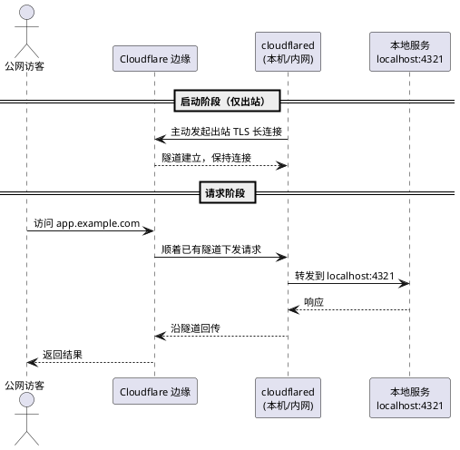
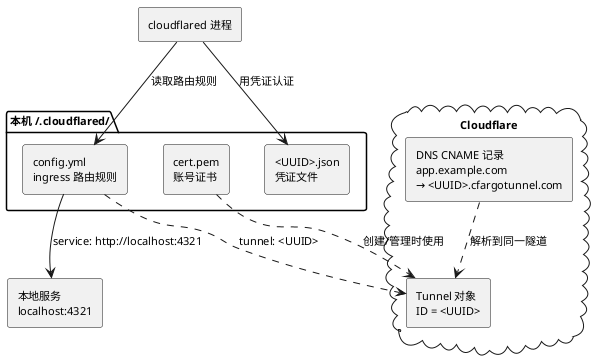

## 目标

把一个跑在本地或内网的服务（例如 `localhost:4321` 的开发服务器、家里的 NAS、Home Assistant），通过你自己的域名安全地暴露到公网，且满足：

- 不在路由器/防火墙上开放任何入站端口
- 不需要公网 IP（家庭宽带 NAT、CGNAT 环境也能用）
- 不暴露源站真实 IP，流量先经 Cloudflare 边缘
- 配置为系统服务，开机自启、长期运行

完成后，访问 `https://app.example.com` 即可直达本机的 `localhost:4321`。

### 工作原理

理解一件事就够了：**隧道是 `cloudflared` 主动向外建立的，不是 Cloudflare 反向连接你**。`cloudflared` 发起一条出站的 TLS 长连接到 Cloudflare 边缘并保持着，之后所有访客流量都顺着这条已建立的连接下发到本地——所以全程不需要任何入站端口。



## 前置条件

- 一个 **Cloudflare 账号**（免费版即可）
- 一个**已托管在 Cloudflare 的域名**：域名的 NS（名称服务器）已指向 Cloudflare，能在 Cloudflare 后台管理其 DNS。这是必需条件——Tunnel 要靠 Cloudflare 管理 DNS 记录来路由
- 本机有一个**正在运行的服务**（本文以 `localhost:4321` 为例）
- 操作系统：Linux / macOS / Windows 均可

## 操作步骤

### 1. 安装 cloudflared

`cloudflared` 是隧道的客户端守护进程，按系统选择安装方式：

```bash
# macOS（Homebrew）
brew install cloudflared

# Debian / Ubuntu
curl -L https://pkg.cloudflare.com/cloudflared.deb -o cloudflared.deb
sudo dpkg -i cloudflared.deb

# 其他 Linux：直接下载二进制
sudo curl -L -o /usr/local/bin/cloudflared \
  https://github.com/cloudflare/cloudflared/releases/latest/download/cloudflared-linux-amd64
sudo chmod +x /usr/local/bin/cloudflared
```

验证安装：

```bash
cloudflared --version
# 预期输出：cloudflared version 2025.x.x ...
```

### 2. 登录授权

把本机的 `cloudflared` 与你的 Cloudflare 账号关联：

```bash
cloudflared tunnel login
```

命令会打开浏览器，让你登录并**选择要授权的域名**。授权成功后，会在本地 `~/.cloudflared/` 目录下生成一个 `cert.pem` 证书文件，后续创建隧道、绑定 DNS 都依赖它。

### 3. 创建命名隧道

```bash
cloudflared tunnel create my-tunnel
```

预期输出类似：

```text
Created tunnel my-tunnel with id 6ff42ae2-765d-4adf-8112-31c55c1551ef
Tunnel credentials written to /Users/you/.cloudflared/6ff42ae2-765d-4adf-8112-31c55c1551ef.json
```

记下这个 **Tunnel ID**（UUID）。同时生成的 `<UUID>.json` 是这条隧道的**凭证文件**，运行隧道时要用到。

> **快速隧道（临时分享）**：如果只是临时把服务分享出去、不在意域名，可跳过创建步骤，直接 `cloudflared tunnel --url http://localhost:4321`。它会随机分配一个 `*.trycloudflare.com` 域名，进程关掉即失效，适合调试和演示。下面继续讲长期可用的命名隧道。

### 4. 编写配置文件

命名隧道由一个 `config.yml` 描述「哪个域名的流量转发到哪个本地服务」。在 `~/.cloudflared/config.yml` 创建：

```yaml
# 隧道 ID 和凭证文件
tunnel: 6ff42ae2-765d-4adf-8112-31c55c1551ef
credentials-file: /Users/you/.cloudflared/6ff42ae2-765d-4adf-8112-31c55c1551ef.json

# ingress 路由规则：自上而下匹配，第一条命中的生效
ingress:
  # 把 app.example.com 的流量转发到本地 4321 端口
  - hostname: app.example.com
    service: http://localhost:4321
  # 兜底规则（必需）：未匹配的请求返回 404
  - service: http_status:404
```

`ingress` 是核心：它是一个**自上而下匹配**的规则列表，最后一条必须是不带 `hostname` 的兜底规则。你可以配多条 `hostname` 把不同子域名指向不同本地服务：

```yaml
ingress:
  - hostname: app.example.com
    service: http://localhost:4321
  - hostname: api.example.com
    service: http://localhost:8080
  - hostname: ssh.example.com
    service: ssh://localhost:22
  - service: http_status:404
```

这套配置把三个角色绑在了一起——隧道、凭证文件、`config.yml` 路由规则、以及下一步要建的 DNS 记录。它们的关系如下：



### 5. 绑定 DNS 记录

让域名指向这条隧道。`cloudflared` 会自动在 Cloudflare 后台创建一条 CNAME 记录：

```bash
cloudflared tunnel route dns my-tunnel app.example.com
```

这条命令在 DNS 里写入 `app.example.com → <UUID>.cfargotunnel.com` 的 CNAME。多个子域名就分别执行多次。

### 6. 运行隧道

```bash
cloudflared tunnel run my-tunnel
```

看到类似 `Connection registered` / `Registered tunnel connection` 的日志，说明隧道已建立。此时访问 `https://app.example.com` 就能打开本地服务——HTTPS 证书由 Cloudflare 边缘自动提供，无需自己配。

### 7. 配置为系统服务（开机自启）

前台运行只适合测试。长期使用应安装为系统服务，它会读取 `~/.cloudflared/config.yml` 并在后台常驻、开机自启：

```bash
# 安装为服务
sudo cloudflared service install

# Linux（systemd）管理
sudo systemctl start cloudflared
sudo systemctl enable cloudflared      # 开机自启
sudo systemctl status cloudflared      # 查看状态

# macOS（launchd）会随安装自动启动
```

## 结果验证

逐项确认：

```bash
# 1. 查看隧道状态，应显示活跃连接
cloudflared tunnel info my-tunnel

# 2. 命令行访问域名，应返回本地服务的内容
curl -I https://app.example.com
# 预期：HTTP/2 200，且响应头含 server: cloudflare
```

3. 浏览器打开 `https://app.example.com`，确认看到的是本地 `localhost:4321` 的页面，且地址栏是有效的 HTTPS（锁图标正常）。

## 常见问题

| 现象 | 原因与解决 |
|------|-----------|
| `curl` 返回 502 Bad Gateway | 本地服务没在跑，或 `config.yml` 里的端口/协议写错。确认 `service:` 地址本机能直接访问 |
| 访问返回 404 | 请求未匹配任何 `hostname`，命中了兜底规则。检查域名拼写、`ingress` 顺序 |
| DNS 解析不生效 | CNAME 未创建成功，重新执行 `cloudflared tunnel route dns`；新记录可能需要几分钟生效 |
| 服务安装后不读配置 | `config.yml` 不在默认路径。用 `cloudflared --config /path/to/config.yml service install` 显式指定 |
| 隧道连上但页面打不开 | 检查本地服务是否只绑定了 `127.0.0.1`；若 `cloudflared` 与服务不在同一主机，需用内网 IP 而非 `localhost` |

## 延伸场景

- **替代 VPN 做零信任访问**：配合 Cloudflare Access，给隧道上的服务加一层身份验证（邮箱 OTP、SSO），内部系统不必再开 VPN。
- **暴露非 HTTP 服务**：`ingress` 的 `service` 支持 `ssh://`、`rdp://`、`tcp://` 等，配合客户端的 `cloudflared access` 命令可代理 SSH/RDP。
- **多隧道分流**：不同机器各跑一条命名隧道，用不同子域名区分，集中在一个域名下管理。

## 参考资料

- [Cloudflare Tunnel 官方文档](https://developers.cloudflare.com/cloudflare-tunnel/)
- [cloudflared 安装指南](https://developers.cloudflare.com/cloudflare-tunnel/downloads/)
- [ingress 路由规则配置](https://developers.cloudflare.com/cloudflare-tunnel/configure-tunnels/local-management/configuration-file/)
- [Cloudflare Access（零信任）](https://developers.cloudflare.com/cloudflare-one/policies/access/)
