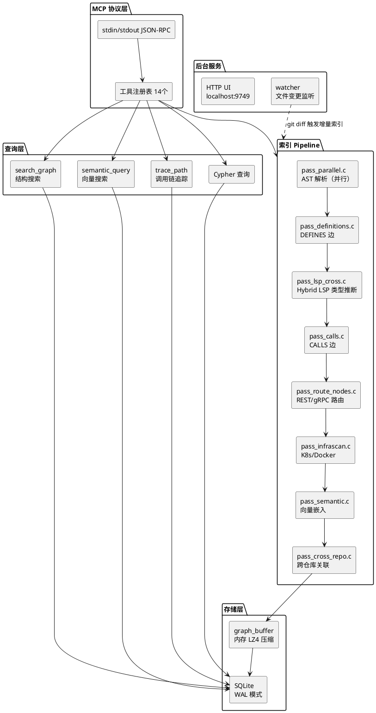

## codebase-memory-mcp：用纯 C 把代码库变成知识图谱

> *"用 5 次图查询替代 412,000 token 的逐文件 grep——这不是 LLM 的功劳，是图数据结构的选择。"*

## 它要解决什么问题

AI 编码 Agent（Claude Code、Cursor、Copilot 等）面对大型代码库时，通常的工作模式是"搜 → 读 → 搜 → 读"的循环。Agent 发出一条 `grep "ProcessOrder"`，得到 20 个文件匹配，然后逐个 Read，再 grep 下一个关键词。一个中等规模的代码库探索任务，动辄消耗数十万 token，其中大部分是对同一文件上下文窗口的重复加载。

codebase-memory-mcp 的思路是：与其让 LLM 一遍遍读文件，不如提前把代码结构建成一张图，Agent 只需要问图就够了。一次 `trace_path(function_name="ProcessOrder", direction="inbound")` 返回的是完整调用链，而不是 20 个文件路径让 LLM 自己拼。

这个项目的核心数据：5 次结构化查询消耗约 3,400 token，对比逐文件 grep 的 412,000 token，减少 99.2%。

## 项目概览

| 项目 | 值 |
|------|-----|
| 仓库 | [DeusData/codebase-memory-mcp](https://github.com/DeusData/codebase-memory-mcp) |
| Stars | 7.2k（截至 2026-06-19） |
| 许可证 | MIT |
| 语言 | 纯 C（zero dependencies，vendored tree-sitter） |
| 最新版本 | v0.8.1（2026-06-12） |
| 核心架构 | 多 pass pipeline + SQLite 知识图谱 + MCP JSON-RPC |
| 支持语言 | 158 种（tree-sitter 语法内置） |
| Hybrid LSP | 11 种（TypeScript、Python、Go、Rust、Java 等） |
| 代码规模 | src/ 下 12 个子目录，pipeline/ 下约 30 个 pass 文件 |

## 技术栈

| 层 | 选型 | 原因 |
|----|------|------|
| 语法解析 | tree-sitter（158 种语法内置） | 增量解析、容错、跨语言统一 API |
| 图存储 | SQLite（单文件） | 嵌入式、零部署、WAL 模式并发读 |
| 语义解析 | 自研 Hybrid LSP（C 实现） | 不依赖外部 LSP 进程，跨文件类型推断 |
| 向量搜索 | 内置 nomic-embed-code 模型 | 无 API 依赖，768 维 int8，本地推理 |
| 协议 | MCP（JSON-RPC 2.0 over stdin/stdout） | 与 Claude Code、Cursor 等 11 种 Agent 对接 |
| 图可视化 | 内嵌 HTTP 服务器 + 3D UI | localhost:9749，可选 UI 二进制 |

## 项目结构

```
src/
├── main.c              # 入口：信号处理、模式分发、看门狗
├── mcp/                # MCP 协议层（JSON-RPC 解析、工具注册）
│   └── mcp.c           # 188KB，14 个 MCP 工具的实现
├── pipeline/           # 索引流水线（核心）
│   ├── pipeline.c      # 编排器：管理所有 pass 的执行顺序
│   ├── pass_parallel.c # 并行 AST 解析（113KB，最大的 pass）
│   ├── pass_lsp_cross.c # Hybrid LSP 跨文件语义解析
│   ├── pass_calls.c    # 构建 CALLS 边
│   ├── pass_definitions.c # 构建 DEFINES 边
│   ├── pass_route_nodes.c # REST/gRPC 路由提取
│   ├── pass_infrascan.c # K8s/Docker 基础设施扫描
│   ├── pass_cross_repo.c # 跨仓库关联
│   ├── pass_semantic.c # 向量嵌入（nomic-embed-code）
│   └── ...             # 共 20+ 个 pass
├── store/              # SQLite 图存储层
├── cli/                # CLI 模式（直接运行单个工具）
├── watcher/            # 文件变更监听（git-based）
├── semantic/           # 语义搜索（11 信号综合评分）
├── simhash/            # MinHash 近似重复检测
├── cypher/             # Cypher 查询解析器
├── graph_buffer/       # 图缓冲区（内存压缩）
├── ui/                 # 内嵌 HTTP 服务器 + 3D UI
├── foundation/         # 基础库（日志、内存、平台抽象）
└── discover/           # Agent 配置自动检测
```

这个结构揭示了一个重要设计：**pipeline 目录下每个 `pass_*.c` 都是流水线的一个阶段**，`pipeline.c` 负责编排它们的执行顺序和依赖关系。这是一种典型的编译器式架构。

## 核心架构



整个系统分三层：**MCP 协议层**（对接 Agent）、**Pipeline 层**（构建知识图谱）、**存储/查询层**（SQLite 图 + 多种查询接口）。Pipeline 的每个 pass 是一个独立的转换阶段，前一阶段的输出是后一阶段的输入。

这里有一个值得注意的设计决策：**为什么每个 pass 是独立的 .c 文件，而不是在单次遍历中完成所有工作？** 答案是依赖关系——构建 `CALLS` 边需要先有所有函数的定义（`DEFINES`），而 Hybrid LSP 类型推断需要跨文件的全局视图。拆分为独立 pass 允许 pipeline.c 按依赖顺序编排，同时让每个 pass 可以并行处理（`pass_parallel.c` 就是干这个的）。

## 源码导读

### 1. 入口点 main.c — 模式分发与生命周期管理

文件：`src/main.c`（20KB）

main.c 的核心逻辑可以用一句话概括：**解析命令行参数，决定运行模式，然后启动对应的主循环**。

```c
/* Modes:
 *   (default)       Run as MCP server on stdin/stdout (JSON-RPC 2.0)
 *   cli <tool> <json>  Run a single tool call and print result
 *   --version       Print version and exit
 *   --help          Print usage and exit
 *   --ui=true/false Enable/disable HTTP UI server (persisted)
 *   --port=N        Set HTTP UI port (persisted, default 9749)
 */
```

这段注释说明了五种运行模式，其中默认模式（MCP server）是最核心的。main.c 在这里做了一个有意思的选择：**信号处理函数直接关闭 stdin**。

```c
static void request_shutdown(void) {
    if (atomic_exchange(&g_shutdown, 1)) {
        return; /* already shutting down */
    }
    /* Cancel any in-progress pipeline */
    if (g_server) {
        cbm_pipeline_t *p = cbm_mcp_server_active_pipeline(g_server);
        if (p) cbm_pipeline_cancel(p);
    }
    cbm_pipeline_unlock();
    if (g_watcher) cbm_watcher_stop(g_watcher);
    if (g_http_server) cbm_http_server_stop(g_http_server);
    /* Close stdin to unblock getline in the MCP server loop */
    (void)fclose(stdin);
}
```

为什么要 `fclose(stdin)` 而不是直接 `exit()`？因为 MCP server 的主循环是阻塞式 `getline()`，直接 exit 会跳过资源清理。关闭 stdin 让 getline 返回 EOF，主循环自然退出。这是一个在 C 程序里比较优雅的异步关闭模式。

### 2. Pipeline — 编译器式多阶段流水线

文件：`src/pipeline/pipeline.c`（42KB）+ 30 个 `pass_*.c` 文件

Pipeline 是整个系统最复杂的部分。`pipeline.c` 是编排器，负责按正确顺序执行所有 pass，每个 pass 完成一个具体的图构建任务。

以 pass 执行顺序为例，简化后的流程：

```
1. pass_parallel.c      → 并行解析所有文件的 AST，提取函数/类定义
2. pass_definitions.c   → 将定义写入图的节点（Function, Class, Module...）
3. pass_pkgmap.c        → 扫描 package.json/go.mod/Cargo.toml，建立包映射
4. pass_lsp_cross.c     → Hybrid LSP 跨文件类型推断，解析 import 目标
5. pass_calls.c         → 基于类型推断结果，构建 CALLS 边
6. pass_route_nodes.c   → 提取 REST/gRPC 路由节点
7. pass_infrascan.c     → 扫描 K8s/Docker 配置，建立 Resource 节点
8. pass_semantic.c      → 计算向量嵌入，写入 SEMANTICALLY_RELATED 边
9. pass_cross_repo.c    → 如果有多个仓库，建立 CROSS_* 跨仓库边
```

注意 pass_lsp_cross.c 和 pass_calls.c 的依赖关系——**CALLS 边的构建必须等 LSP 类型推断完成**，因为 `foo.bar()` 到底调用哪个函数，需要知道 `foo` 的类型。这就是为什么拆分为独立 pass 而不是单次遍历：不同阶段有严格的先后依赖。

`pass_parallel.c` 是 113KB 的大文件，它做的事情是**并行化 AST 解析**。具体实现是启动一个 worker pool（`worker_pool.c`），把文件分块分发给多个线程，每个线程用 tree-sitter 解析自己负责的文件块，然后把结果合并到共享的图缓冲区。

### 3. Hybrid LSP — 最有意思的实现细节

文件：`src/pipeline/pass_lsp_cross.c`（24KB）+ `pass_lsp_cross.h`

"Hybrid LSP" 是这个项目最有技术含量的部分。标准做法是让 Agent 启动一个外部 LSP 进程（如 tsserver、pyright），通过 LSP 协议查询类型信息。codebase-memory-mcp 选择用纯 C 重新实现了这些语言的核心类型推断逻辑：

```c
/* Hybrid LSP semantic type resolution for:
 * Python, TypeScript/JavaScript/JSX/TSX, PHP, C#, Go,
 * C, C++, Java, Kotlin, and Rust
 *
 * Structurally inspired by and compatible with:
 * tsserver, pyright, gopls, Roslyn, Eclipse JDT, rust-analyzer
 */
```

这个选择的代价是巨大的实现工作量（11 种语言的类型系统各写一遍），但收益也很明显：

| 维度 | 外部 LSP | Hybrid LSP（内置） |
|------|----------|------------------|
| 部署 | 需要安装 Node.js、Python 等运行时 | 单二进制，零依赖 |
| 启动 | 每个语言启动独立进程，几秒到几十秒 | 直接在进程内完成 |
| 跨语言 | 每个 LSP 只懂自己的语言 | 一次遍历同时处理所有语言 |
| 维护 | 跟随上游 LSP 版本 | 需要自己跟进语言规范变更 |

从 README 的描述来看，它实现的不只是简单的符号查找，而是包括：参数绑定、返回类型推断、泛型替换、JSX 组件派发、JSDoc 推断（纯 JS 文件）、PHP 的 namespace + trait + 晚期静态绑定、C# 的文件范围命名空间 + record + LINQ、Java 的类层级 + 重载、Kotlin 的扩展函数、Rust 的 UFCS 等。

这是一个大胆的工程决策——把原本需要多个 LSP 进程的工作，用 C 在一个二进制里实现。性能收益是确定的（进程间通信的开销被完全消除），但维护成本也是真实的。

## 关键设计决策

| 决策 | 原因 | 权衡 |
|------|------|------|
| 纯 C 实现，零依赖 | 单二进制分发、启动快、内存可控 | 开发效率低，维护成本高（5604 个测试用例说明一切） |
| tree-sitter 而非语言专有解析器 | 统一 158 种语言的 AST API | tree-sitter 不提供语义信息，需要自建 Hybrid LSP |
| SQLite 存储图 | 嵌入式、零部署、WAL 并发读 | 不适合超大规模并发查询（但 Agent 场景本来就不是） |
| RAM-first 索引 | 磁盘 I/O 是瓶颈，内存带宽更高 | 大仓库索引时内存占用高，但完成后立即释放 |
| 不内置 LLM | 避免 API key 依赖和额外成本 | Agent 必须是 MCP 兼容的，无法独立使用 |
| 多 pass pipeline | 清晰的依赖管理、可并行化 | 文件多、代码量大（pipeline/ 下 ~700KB C 代码） |

## 和其他方案的对比

| 维度 | codebase-memory-mcp | 逐文件 grep + Read | repo-map（Aider） |
|------|-------------------|-------------------|-----------------|
| 索引时间（Linux 内核） | 3 分钟 | 无需索引，但查询慢 | 无公开基准 |
| 查询延迟 | < 1ms（图遍历） | 秒级（多次 grep + LLM 处理） | 取决于 LLM 上下文 |
| Token 消耗 | ~3,400（5 次查询） | ~412,000（同一任务） | 较高（需传入完整 map） |
| 部署 | 单二进制，零依赖 | 内置于所有 Agent | 需要 Python 环境 |
| 语言支持 | 158 种（tree-sitter） | 取决于 grep | 主要支持主流语言 |
| 语义理解 | Hybrid LSP（11 种语言） | 无 | 无 |

codebase-memory-mcp 和 Aider 的 repo-map 解决的是同一类问题（减少 Agent 的 token 消耗），但路径完全不同。repo-map 是把代码结构压缩成文本传给 LLM，codebase-memory-mcp 是把代码结构建成图让 Agent 查询。前者依赖 LLM 的理解能力，后者依赖图数据库的查询能力。

## 适用场景与边界

| 场景 | 推荐？ | 原因 |
|------|--------|------|
| 大型代码库探索（> 10 万行） | 强烈推荐 | 索引一次，后续查询 token 节约显著 |
| 微服务架构跨仓库分析 | 推荐 | CROSS_* 边天然支持跨仓库关联 |
| 小型脚本项目（< 1000 行） | 不推荐 | 索引成本超过收益，直接 grep 更快 |
| 需要实时类型推断的场景 | 视语言而定 | Hybrid LSP 覆盖 11 种主流语言，其他语言只有 AST 级精度 |
| 纯静态代码分析 | 推荐 | 图结构天然支持调用链、影响面分析 |
| 动态语言（Ruby、Perl 等） | 可用但精度有限 | tree-sitter 可以解析语法，但缺少 LSP 语义层 |

## 参考链接

- [GitHub 仓库](https://github.com/DeusData/codebase-memory-mcp)
- [官方文档](https://deusdata.github.io/codebase-memory-mcp/)
- [arXiv 论文：Codebase-Memory: Tree-Sitter-Based Knowledge Graphs for LLM Code Exploration via MCP](https://arxiv.org/abs/2603.27277)
- [MCP 协议规范](https://modelcontextprotocol.io/)
