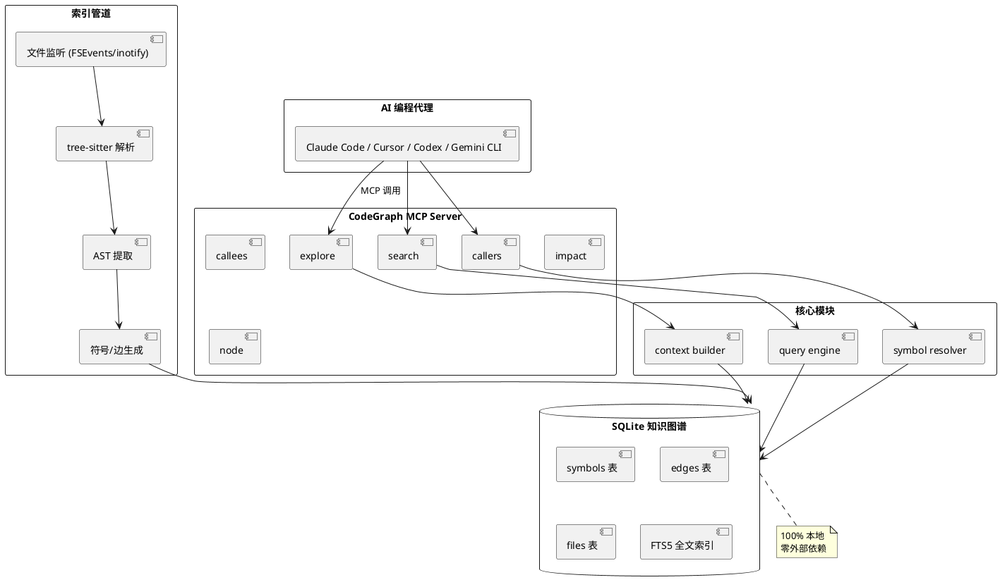
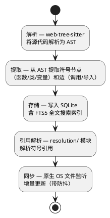
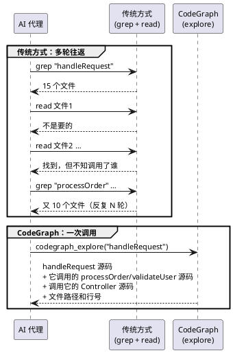

## 简介

AI 编程代理（Claude Code、Cursor、Codex）在理解代码时，通常靠 `grep` 搜索 + `read` 读文件的方式。这有两个问题：一是 token 消耗大（反复搜索、读错文件、重读文件），二是缺乏全局视图（不知道函数之间的调用关系）。

CodeGraph 的做法是**预先构建代码的知识图谱**。它用 tree-sitter 解析代码，提取所有符号（函数、类、变量）和关系（调用、导入、继承），存入 SQLite 数据库。然后 AI 代理通过 MCP（Model Context Protocol）协议直接查询图谱，一次调用就能获得完整的上下文。

48.9k stars，在 7 个真实代码库上的基准测试显示：减少约 16% 的成本、47% 的 token 用量、58% 的工具调用次数，提升约 22% 的响应速度。

## 项目概览

| 属性 | 详情 |
|------|-----|
| 仓库 | [colbymchenry/codegraph](https://github.com/colbymchenry/codegraph) |
| Stars | 48.9k（截至 2026-06-14） |
| 许可证 | MIT |
| 语言 | TypeScript |
| 维护者 | Colby McHenry（@colbymchenry） |
| 最新版本 | v1.0.1（2026-06-13） |
| npm 包名 | `@colbymchenry/codegraph` |
| 兼容 Agent | Claude Code、Cursor、Codex CLI、opencode、Hermes Agent、Gemini CLI、Kiro 等 |

## 核心功能

### 6 个 MCP 工具

| 工具 | 用途 |
|------|------|
| `codegraph_explore` | **主力工具**——一次调用返回入口点、相关符号和代码片段 |
| `codegraph_node` | 获取单个符号的完整源码 + 调用者信息 |
| `codegraph_search` | 按名称查找符号 |
| `codegraph_callers` | 查找所有调用点（含回调注册） |
| `codegraph_callees` | 查找某函数调用了哪些其他函数 |
| `codegraph_impact` | 分析变更影响范围 |

### 关键特性

- **Smart Context Building**：一次工具调用即可返回完整上下文，取代多次 grep + read
- **全文搜索（FTS5）**：基于 SQLite 的 FTS5 扩展实现代码全文搜索
- **影响分析**：追踪 callers、callees 和完整影响半径
- **实时同步**：使用原生 OS 文件监听（macOS FSEvents / Linux inotify / Windows ReadDirectoryChangesW），带防抖自动同步
- **100% 本地**：仅使用 SQLite 数据库，无需外部服务
- **零配置**：自动识别 `.gitignore`，内置依赖和构建目录排除
- **框架感知路由检测**：支持 17 个框架（Django、Flask、FastAPI、Express、NestJS、Rails、Spring 等）
- **语言支持 20+**：TypeScript、JavaScript、Python、Go、Rust、Java、C#、PHP、Ruby、C/C++、Swift、Kotlin 等

## 快速上手

### 安装

```bash
# 方式一：一键安装脚本（无需 Node.js）
# macOS/Linux
curl -fsSL https://raw.githubusercontent.com/colbymchenry/codegraph/main/install.sh | sh

# Windows
irm https://raw.githubusercontent.com/colbymchenry/codegraph/main/install.ps1 | iex

# 方式二：npm 安装
npm i -g @colbymchenry/codegraph
```

### 初始化

```bash
# 配置 AI 代理集成（会自动配置 MCP）
codegraph install

# 初始化当前项目（构建知识图谱）
codegraph init
```

### 使用（Claude Code）

安装完成后，Claude Code 会自动通过 MCP 连接到 CodeGraph。你可以直接提问：

```text
> "一个 HTTP 请求是如何到达数据库的？"
```

Claude Code 会调用 `codegraph_explore` 工具，一次性获取路由定义、Controller、Service、Repository 的完整代码，而不需要反复 grep。

### 使用（Cursor）

在 Cursor 的 MCP 配置文件中添加：

```json
{
  "mcpServers": {
    "codegraph": {
      "command": "codegraph",
      "args": ["mcp"]
    }
  }
}
```

### 环境变量

```bash
# 文件监听防抖时间（默认 2000ms）
export CODEGRAPH_WATCH_DEBOUNCE_MS=2000

# 禁用后台文件监听
export CODEGRAPH_NO_DAEMON=1

# 自定义可用工具
export CODEGRAPH_MCP_TOOLS="explore,search,callers,callees,impact,node"

# 关闭遥测
export CODEGRAPH_TELEMETRY=0
# 或
export DO_NOT_TRACK=1
```

## 架构与原理

### 整体架构



### 索引流程



### 源码结构

| 模块 | 路径 | 职责 |
|------|------|------|
| 代码解析 | `extraction/` | AST 提取 |
| 关系建模 | `graph/` | 符号、边 |
| 查询引擎 | `search/` | FTS5 全文搜索 |
| 持久化 | `db/` | SQLite schema |
| 文件同步 | `sync/` | 文件监听、增量更新 |
| 引用解析 | `resolution/` | 符号引用解析 |
| MCP 服务 | `mcp/` | MCP 服务器实现 |
| 上下文构建 | `context/` | Smart Context Building |
| 安装 | `installer/` | 安装逻辑 |
| 遥测 | `telemetry/` | 可通过环境变量关闭 |

### SQLite Schema（简化）

```sql
-- 符号表
CREATE TABLE symbols (
  id INTEGER PRIMARY KEY,
  name TEXT NOT NULL,
  kind TEXT,        -- 'function', 'class', 'variable', etc.
  file_id INTEGER,
  line INTEGER,
  column INTEGER,
  signature TEXT,
  docstring TEXT
);

-- 边表（关系）
CREATE TABLE edges (
  id INTEGER PRIMARY KEY,
  source_id INTEGER,
  target_id INTEGER,
  kind TEXT         -- 'calls', 'imports', 'extends', etc.
);

-- 文件表
CREATE TABLE files (
  id INTEGER PRIMARY KEY,
  path TEXT NOT NULL,
  language TEXT,
  hash TEXT,        -- 用于增量更新
  last_modified INTEGER
);

-- FTS5 全文搜索索引
CREATE VIRTUAL TABLE fts USING fts5(
  name, signature, docstring,
  content='symbols',
  content_rowid='id'
);
```

### Smart Context Building

这是 CodeGraph 最核心的功能。传统 AI 编程代理探索代码要反复 grep + read，而 CodeGraph 一次调用就能拿到完整上下文：



"一次调用、完整上下文"的模式，大幅减少了 token 消耗和工具调用次数。

## 关键设计决策

**1. 为什么用 SQLite 而非 Neo4j / Postgres？**

SQLite 足够强大（支持 FTS5、JSON），100% 本地，零部署成本。代码知识图谱的规模通常不会超过 SQLite 的能力上限（数十万节点、数百万边）。

**2. 为什么用 tree-sitter 而非 LSP / 正则？**

tree-sitter 提供精确的 AST 解析，支持 20+ 种语言，且性能极好（增量解析）。LSP 需要启动语言服务器，开销大；正则无法处理嵌套结构和多行定义。

**3. 为什么文件监听用原生 API？**

FSEvents（macOS）、inotify（Linux）、ReadDirectoryChangesW（Windows）是 OS 原生的文件监听机制，性能最优，且能感知文件系统级别的变更（包括其他进程的写入）。

**4. 为什么要防抖？**

编辑器保存文件时，可能触发多次快速写入（如自动保存）。防抖（默认 2000ms）把这些写入合并为一次索引更新，避免资源浪费。

**5. 为什么支持 17 个框架的路由检测？**

路由文件（如 Django 的 `urls.py`、Express 的 `app.get()`）是 API 入口，对理解代码流至关重要。但它们的语法各不相同，需要专门的解析规则。

## 适用场景与局限

### 适用场景

- **大型代码库**：数万文件的 monorepo，传统 grep 效率低下
- **跨语言项目**：前后端一体、多语言微服务
- **频繁迭代**：实时同步让知识图谱始终最新
- **团队协作**：所有成员共享同一个知识图谱
- **AI 辅助开发**：让 Claude Code / Cursor 更准确地理解代码

### 局限

- **首次索引耗时**：大型项目（数万文件）首次索引可能需要几分钟
- **不支持所有语言**：虽然支持 20+ 种语言，但对小语种（如 Haskell、Elixir）支持有限
- **不支持动态代码**：eval、动态 import 等运行时生成的代码无法静态分析
- **跨仓库分析有限**：每个仓库独立建图，跨仓库的调用关系需要额外配置
- **macOS 补丁差异**：macOS 的 tree-sitter 支持比 Linux/Windows 略少（但仍在持续改进）

## 参考资料

- 官方仓库：[colbymchenry/codegraph](https://github.com/colbymchenry/codegraph)
- MCP 协议：[modelcontextprotocol.io](https://modelcontextprotocol.io/)
- tree-sitter：[tree-sitter.github.io](https://tree-sitter.github.io/)
- npm 包：[@colbymchenry/codegraph](https://www.npmjs.com/package/@colbymchenry/codegraph)
