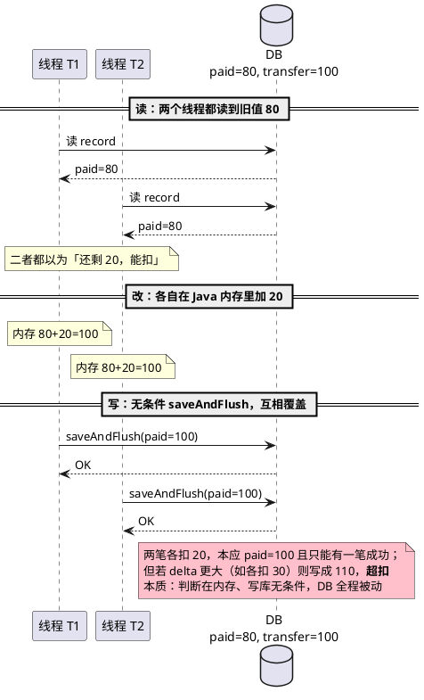
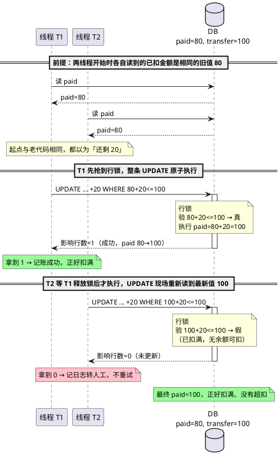

## 问题现象

财务系统里有一张「分次扣款申请」表，记录一笔「应从用户账户分多次扣到某个总额」的任务。两个关键字段：

- `transfer_amount`：应扣总额（目标，固定）
- `paid_amount`：已扣金额（进度，从 0 逐次累加到总额）

扣款由定时任务驱动：每轮捞出未扣完的记录，划款成功后把 `paid_amount` 累加上本次金额。线上偶发两类数据异常：

- **丢失更新**：明明扣了两笔，`paid_amount` 只增加了一笔的量，对不上账（账记少了）。
- **超扣**：`paid_amount` 被累加到超过 `transfer_amount`，即扣的钱比该扣的总额还多（账记多了，直接资损）。

两者都在并发扣款时出现，单线程跑从不复现。

---

## 原因分析

老代码用 JPA 实体的「读 - 改 - 写」方式更新：先把整条记录读进内存，在内存里加上本次金额，再把整条实体覆盖写回。

```java
// 读
PaymentPlan p = repository.findById(id);
// 改（在 Java 内存里算）
p.setPaidAmount(p.getPaidAmount().add(delta));
// 写（无条件覆盖整条记录）
repository.saveAndFlush(p);
```

「够不够扣」的判断在更前面的 Java 内存里完成，而最后的写库是**无条件覆盖**——数据库只是被动接受内存算好的值，自己不做任何校验。并发下两个线程读到同一个旧值，各自在内存里算、各自覆盖写回，于是出错。

> 场景：`transfer=100, paid=80`（只剩 20 可扣），两个线程 T1、T2 各想扣 20。



病根有两点，缺一不可：

1. **判断与写库分离**：是否超扣在 Java 内存里判断，但判断用的是可能已经过期的快照值。
2. **写库无条件**：`saveAndFlush` 把内存值整条覆盖，数据库不校验、不拦截。

加业务层的锁（如 Redis 分布式锁按用户串行）能缓解，但锁一旦因抖动、过期、key 维度疏漏而失效，这两点缺陷就直接暴露成资损。需要在数据库层再设一道兜底。

---

## 解决方法

把「判断 + 累加」合并成**一条带条件的原子 UPDATE**，让数据库在写之前自己校验：

```sql
update payment_plan
   set paid_amount = paid_amount + #{delta},
       record_status = #{status}
 where id = #{id}
   and paid_amount + #{delta} <= transfer_amount;
```

对应到 Spring Data JPA：

```java
@Query(value = "update payment_plan p "
    + "set p.paid_amount = p.paid_amount + ?2, p.record_status = ?3 "
    + "where p.id = ?1 and p.paid_amount + ?2 <= p.transfer_amount",
    nativeQuery = true)
@Modifying(clearAutomatically = true)
@Transactional
int increasePaidAmount(Integer id, BigDecimal delta, Byte recordStatus);
```

这条语句靠两个机制同时解决丢失更新和超扣：

**机制一：`paid_amount = paid_amount + delta` 根治丢失更新。** 累加在数据库内完成，InnoDB 对该行加行锁，把「读当前值 → 加 → 写」锁成一个不可分割的整体。并发的两次累加被串行执行、各自基于最新值，不会互相覆盖。

**机制二：`where paid_amount + delta <= transfer_amount` 根治超扣。** 数据库执行更新前先验这个条件，为假就一行不改、返回影响行数 0。会导致超扣的更新在 SQL 层被直接拒绝，根本写不进库。

下图是同样的并发场景在新方案下的执行过程——注意两个线程**起点和老代码完全一样**（都先读到旧值 80），区别只在写库那一步：



关键在 T2：它执行 UPDATE 时，行锁内**现场重新读到的是 T1 改后的最新值 100**（不是它开始时读到的 80），`100+20<=100` 为假，被拦下返回 0。**差别不在读到的初值，而在写库那一步是否由数据库现场校验。**

### 为什么不需要版本号

乐观锁的典型做法是加一个 `version` 列，更新时 `where version = #{oldVersion}`，版本不匹配就失败。但对「累加金额」这个具体场景，版本号不是必需的：

- **防丢失更新**靠的是 `paid_amount = paid_amount + delta` 的行锁原子性，与是否有 version 无关。
- **防超扣**靠的是 `paid_amount + delta <= transfer_amount` 这个业务条件，version 也帮不上忙。

version 的作用仅是「探测两次读之间记录被人改过」。但累加场景下，我们关心的不是「记录变没变」，而是「加完会不会超」——后者用业务字段本身做条件更直接。引入 version 还要付出代价：加 DDL、改实体、新建记录时初始化、且其他全量覆盖式的写入路径（如某些 `saveAndFlush`）会把 version 一起覆盖掉，反而埋坑。**能用业务字段表达的约束，就不必引入额外的版本字段。**

### 配套：返回 0 时怎么处理

`increasePaidAmount` 返回 0 意味着「这笔没记上」。在「先划款、后记账」的流程里，这一步尤其要小心：

```java
boolean transferOk = doTransfer(...);   // 先真实划款，钱已划出
if (transferOk) {
    int updated = repository.increasePaidAmount(id, delta, PROCESSING);
    if (updated == 0) {
        // 钱已划出但记账失败：不能重试划款，否则重复扣款
        log.error("记账失败(累加将超扣)，划款已成功需人工核对！id={}, delta={}", id, delta);
        // 落明细保留排查线索，转人工对账
        return true;   // 划款确实成功了
    }
    // 记账成功：同步内存实体，供后续判断使用
    record.setPaidAmount(record.getPaidAmount().add(delta));
}
```

铁律：**划款已成功时，记账失败绝不重试划款**——重试会再划一次钱，变成重复扣款。返回 0 只记日志、落明细、转人工对账。WHERE 条件只能保证「账面不超」，无法追回「已经划出去的钱」，这条人工兜底不能省。

---

## 验证

不依赖真实数据库，也能用一个内存桩模拟「行锁下读-比较-写原子」的语义，验证返回值契约。核心是用 `synchronized` 复刻行锁：

```java
synchronized int increasePaidAmount(int id, BigDecimal delta, byte status) {
    Record r = store.get(id);
    if (r.paid.add(delta).compareTo(r.transfer) > 0) {
        return 0;                      // 会超扣，拒绝
    }
    r.paid = r.paid.add(delta);
    r.status = status;
    return 1;
}
```

关键并发用例：

- **并发不丢失**：`transfer=100`，4 个线程各扣 25，应全部成功、最终 `paid=100`。
- **并发防超扣**：`transfer=100`，8 个线程各扣 30，应只有 3 次成功（90），其余被拦，最终 `paid` 不超过 100。

```java
@Test
public void concurrent_overpay_blocked() throws Exception {
    // transfer=100, paid=0, 8 线程各扣 30
    ExecutorService pool = Executors.newFixedThreadPool(8);
    List<Callable<Integer>> tasks = new ArrayList<>();
    for (int i = 0; i < 8; i++) {
        tasks.add(() -> repo.increasePaidAmount(1, new BigDecimal("30"), PROCESSING));
    }
    int success = pool.invokeAll(tasks).stream().mapToInt(this::get).sum();
    assertEquals(3, success);                                  // 只有 3 次成功
    assertTrue(repo.get(1).paid.compareTo(new BigDecimal("100")) <= 0);  // 不超扣
}
```

内存桩验证的是「SQL 应具备的语义」。真实 MySQL 行锁下 `paid = paid + delta` 的原子性，仍需在测试库压一遍真实并发确认，内存桩替代不了。

---

## 延伸场景

这条思路适用于一切「带上限的并发累加」：

- **库存扣减**：`set stock = stock - n where stock - n >= 0`，防超卖。
- **账户余额扣款**：`set balance = balance - n where balance - n >= 0`，防透支。
- **配额 / 限额消费**：`set used = used + n where used + n <= quota`。

共同模式：**把约束写进 UPDATE 的 WHERE，让数据库在行锁内现场校验，用影响行数判断成败。** 比「先 SELECT 查余量、再 UPDATE 写回」的两步法更安全——后者的查与写之间存在并发窗口，正是丢失更新的温床。

一个边界要注意：这套方案保护的是**单行**的并发更新（一条申请记录、一个库存行）。如果约束跨多行（如「同一用户所有未完成订单总额不超过授信额度」），单条 UPDATE 的行锁覆盖不到，需要更上层的锁或事务隔离级别配合。

---

## 参考资料

- MySQL 官方文档：[InnoDB Locking](https://dev.mysql.com/doc/refman/8.0/en/innodb-locking.html)
- Spring Data JPA：[`@Modifying` Queries](https://docs.spring.io/spring-data/jpa/reference/jpa/query-methods.html)
- 乐观锁与悲观锁的取舍：[Optimistic vs. Pessimistic Locking](https://en.wikipedia.org/wiki/Lock_(computer_science))
