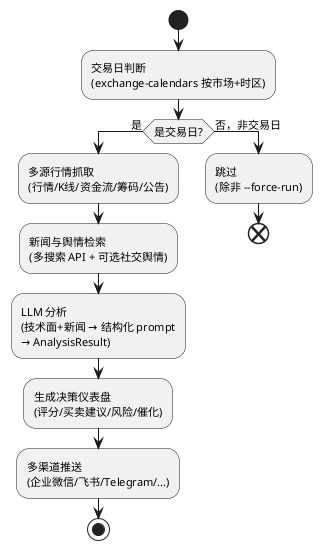
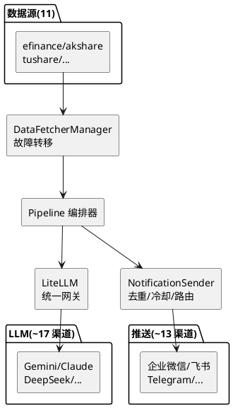

## daily_stock_analysis：LLM 驱动的多市场股票分析系统

daily_stock_analysis 是一个自部署的自选股智能分析系统：你给它一份股票清单，它每个交易日自动抓取行情和新闻、用大模型逐只分析，再把「决策仪表盘」（买入/观望/卖出 + 评分 + 风险 + 催化）推送到企业微信、飞书、Telegram 等聊天工具。支持 A 股、港股、美股，以及新加入的日股、韩股。整套流程可以跑在 GitHub Actions 的免费额度上，实现零服务器、零成本的定时运行。

## 一个反常的 fork 比例

先说一个有意思的现象。这个仓库 49.5k stars，forks 却有 43.5k——**fork 数是 star 数的约 88%**。正常仓库的 fork/star 比例在 10–20%。

原因不是刷数据，而是它的**分发模式就是"fork 即部署"**：官方推荐的部署路径是「Fork 本仓库 → 配置 GitHub Secrets → 启用 Actions」。每个用这条路径部署的用户都*必须* fork。所以这里的 fork 数本质上是**部署量/安装量**，而不是"开发者在此基础上二次开发"的信号。这是一个很典型的、由分发方式塑造的指标artefact。

## 项目概览

| 属性 | 详情 |
|------|-----|
| 仓库 | [ZhuLinsen/daily_stock_analysis](https://github.com/ZhuLinsen/daily_stock_analysis) |
| Stars | 约 49.5k（截至 2026-06-26） |
| 许可证 | MIT |
| 语言 | Python |
| 支持市场 | A 股 / 港股 / 美股（完整）；日股 / 韩股（MVP） |
| LLM 网关 | LiteLLM（统一调用 Gemini/Claude/OpenAI 等） |
| 部署方式 | GitHub Actions（推荐）/ Docker / 本地 |
| 最新版本 | v3.23.0（2026-06-20） |

## 端到端流程：数据 → LLM → 决策 → 推送

系统的主流程在 `AGENTS.md` 里写得很直白：**抓取数据 → 技术分析/新闻检索 → LLM 分析 → 生成报告 → 通知推送**。落到代码上是 `main.py → src/core/pipeline.py` 这个编排器驱动的六个阶段：



值得注意的工程取舍：交易日判断是 **fail-open** 的——如果日历库不可用，系统选择继续运行而不是中断。这是个务实的选择：宁可在非交易日多跑一次（结果为空），也不要因为日历库的问题漏掉一个真正的交易日。

## 三层「插件化」是它的真正骨架

这个项目最值得学的不是 LLM 调用本身，而是它把**数据源、LLM provider、推送渠道**三类外部依赖全部做成了可插拔、可降级的抽象层。

### 数据源：策略模式 + 自动故障转移

`data_provider/` 下有 11 个数据源（efinance / tencent / akshare / tushare / pytdx / baostock / yfinance / longbridge / finnhub / alphavantage / tickflow），由 `DataFetcherManager` 统一调度。优先级是**动态**的——取决于你是否配置了 `TUSHARE_TOKEN`：

```text
有 TUSHARE_TOKEN：Tushare(P0) → Efinance(P0) → AkShare(P1) → Pytdx(P2) → ...
无 TUSHARE_TOKEN：Efinance(P0) → AkShare(P1) → Pytdx(P2) → ... → Longbridge(P5, 美港股兜底)
```

带自动 failover 和防封禁限流，一个源挂了自动切下一个。

### LLM：LiteLLM 统一网关

`src/analyzer.py`（`GeminiAnalyzer` 类）通过 **LiteLLM** 统一调用各家模型，外加 `src/llm/` 的可插拔后端抽象（含支持 Codex CLI 的本地后端）。支持的 provider 多达十几家：Anspire、AIHubMix、Gemini、DeepSeek、通义千问、Claude、Ollama、Moonshot、智谱、MiniMax、火山、SiliconFlow、OpenRouter 等，每家都有完整的渠道配置块和主/备/兜底路由。

输出被强制塞进 `AnalysisReportSchema`，并用 `json-repair` 抢救大模型偶尔吐出的非法 JSON——这是与 LLM 打交道的实用细节。

### 推送：约 13 个渠道 + 路由

`src/notification_sender/` 有约 13 个发送器：企业微信、飞书（含云文档）、Telegram、Discord、Slack、邮箱、Pushover、ntfy、Gotify、PushPlus、Server酱3、AstrBot，以及自定义 webhook（钉钉/Bark）。配套有去重、冷却、静默时段、按严重程度路由的逻辑。



## 零代码自然语言策略

`strategies/` 目录里有 15 个内置策略，全部是**自然语言 YAML**，用户可以零代码写自己的策略。以缠论策略 `chan_theory.yaml` 为例，它用自然语言编码了"分型→笔→线段→中枢→趋势"的识别、背驰检测、一买/二买/三买买点，甚至给出明确的情绪分调整规则（如"底背驰 + 一买信号：sentiment_score +15"）。

用户写自定义策略只需一个 YAML，填 `name` / `display_name` / `instructions`（自然语言），引用工具名即可。背后是 `src/agent/` 的完整 agent 子系统（编排器、执行器、记忆、工具集），支撑"策略问股"的对话式分析。

## 零成本定时运行靠什么

"零成本"的核心机制是 **GitHub Actions cron**，定义在 `.github/workflows/00-daily-analysis.yml`：

```yaml
on:
  schedule:
    - cron: '0 10 * * 1-5'     # 周一到周五 UTC 10:00 = 北京时间 18:00
  workflow_dispatch:
    inputs:
      mode: [full, market-only, stocks-only]
      force_run: boolean        # 跳过交易日检查
```

"零成本"= 跑在 GitHub 免费 Actions runner 上（工作日 cron，无需服务器）+ 用有免费额度的 LLM provider（Gemini 免费层、Anspire/DeepSeek 免费额度）。几个细节：`concurrency` 防止任务重叠；启动时 `sleep $((RANDOM % 60))` 随机延迟，避免固定时间访问；报告作为 artifact 保留 30 天。

## 快速上手

GitHub Actions 路径（推荐）：Fork 仓库 → 在 `Settings → Secrets and variables → Actions` 配置密钥 → 启用 Actions → 手动 `Run workflow` 或等工作日 18:00 自动跑。

本地 / Docker 路径：

```bash
git clone https://github.com/ZhuLinsen/daily_stock_analysis.git && cd daily_stock_analysis
pip install -r requirements.txt
cp .env.example .env && vim .env
python main.py
```

常用命令：

```bash
python main.py --stocks 600519,hk00700,AAPL   # 指定股票
python main.py --market-review                 # 大盘复盘
python main.py --webui                         # 启动 Web 工作台(http://127.0.0.1:8000)
python main.py --dry-run                        # 试运行不推送
```

核心配置：`STOCK_LIST` 必填（跨市场可混写，如 `600519,hk00700,AAPL,7203.T,005930.KS`），AI provider 和推送渠道各至少配一个。

决策仪表盘的实际输出长这样：

```text
🎯 2026-02-08 决策仪表盘
共分析3只股票 | 买入:0 观望:2 卖出:1
中钨高新(000657): 观望 | 评分 65 | 看多
新莱应材(300260): 卖出 | 评分 35 | 看空
```

## 适用场景与边界

这套系统适合作为个人自选股的"每日盯盘助手"——把分散在行情软件、新闻、研报里的信息聚合成一份结构化的每日简报。它的工程亮点（多源故障转移、统一 LLM 网关、零代码策略）也很适合作为"如何把 LLM 接进真实业务流水线"的参考样本。

需要清楚的边界：

- **日股/韩股是 MVP**，只有 YFinance 日线 + 基础行情，资金流、龙虎榜等高级分析降级为 `not_supported`。
- **筹码分布默认关闭**（云端接口不稳定）。
- **数据、搜索、LLM 全依赖外部网络**，免费层都有限流（如 Finnhub 60/min、AlphaVantage 25/day）。
- 社交舆情（Reddit/X/Polymarket）仅限美股且可选。

最后是必须强调的免责声明，README 原文：**本项目仅供学习和研究使用，不构成任何投资建议。股市有风险，投资需谨慎。** LLM 的分析输出是基于公开信息的概率性生成，不应作为交易决策的唯一依据。

## 参考资料

- [GitHub 仓库](https://github.com/ZhuLinsen/daily_stock_analysis)
- 关键文件：`src/core/pipeline.py`、`src/analyzer.py`、`data_provider/__init__.py`、`.github/workflows/00-daily-analysis.yml`
