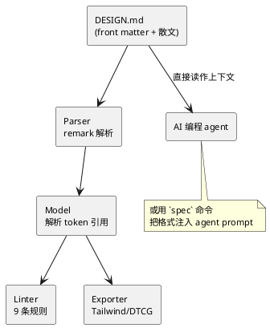

## DESIGN.md：给 AI 编程 agent 描述视觉身份的格式规范

DESIGN.md 是 Google Labs 开源的一份格式规范，用一个结构化的 Markdown 文件给 AI 编程 agent（Claude Code、Cursor、Gemini 等）提供对设计系统的持久理解。可以把它理解成"设计系统版的 CLAUDE.md"——让 agent 在每次生成 UI 时都知道你的配色、字体、间距、组件和品牌调性，从而产出风格一致、符合品牌的界面。

## 它要解决什么问题

AI 编程 agent 生成 UI 时有个通病：**千篇一律、偏离品牌、前后不一致**。因为它对项目的视觉身份没有持久的理解，每次生成会话都是从零开始"盲猜"。你这次让它做个按钮是圆角紫色，下次它可能给你方角蓝色。

DESIGN.md 用一个纯文本、人和机器都能读的"事实来源"解决这个问题：把视觉身份结构化地写下来，让风格选择在不同设计会话之间、不同 AI agent/工具之间保持一致。

## 一个反直觉的主张：散文重于 token

这是整个项目最有价值、也最值得单独拎出来讲的观点。大多数"设计 token"格式本质是一个**数值数据库**（一堆 hex 色值和尺寸）。DESIGN.md 的 `PHILOSOPHY.md` 提出了相反的看法：

> **"生成设计的质量，更多取决于意图描述得多清楚，而不是数值有多精确。"**

> **"规范的重点是散文（prose），不是 token。"** token 值"作为上下文存在，不是渲染指令。"

它有三条很精炼的原则：

- **一个具体的参照，胜过一串形容词**。"现代、干净、可信、高级"——这些词什么也没唤起，模型只会生成"这些词所描述区域的正中心"，也就是最平庸的结果。而"一所历史悠久的大学里、一份 1970 年代研究生讲座的讲义"唤起的是一个完整的世界。**形容词描述一个区域，具体参照描述一个点。**
- **负约束：你排除掉的东西定义了性格**。一个足够强的参照会自带限制——"一份讲座讲义"自然意味着"不会发光、不用渐变"。"命名那个对象，就等于命名了它们——就像告诉模型'狗'，它就知道狗不会喵喵叫。"
- **格式靠用户而非规范来生长**。规范只标准化一个通用的最小集，任何 key、任何 section、任何结构都允许。

这个主张对所有跟 LLM 打交道的人都有启发：与其堆砌精确参数，不如给一个足够具体、自带语境的参照。

## 项目概览

| 属性 | 详情 |
|------|-----|
| 仓库 | [google-labs-code/design.md](https://github.com/google-labs-code/design.md) |
| Stars | 约 19.3k（截至 2026-06-26） |
| 许可证 | Apache-2.0 |
| 语言 | TypeScript（规范 + CLI） |
| 维护方 | Google Labs（关联 Stitch UI 生成产品） |
| 工具包 | `@google/design.md`（npm，v0.3.0） |
| 状态 | alpha（格式仍在演进） |

## 格式规范

一个 DESIGN.md 文件 = **可选的 YAML front matter**（机器可读的 token，用 `---` 围栏）+ **Markdown 正文**（人可读的 `##` 章节，讲应用语境和理由）。token 是规范化的值，散文提供应用上下文。

### Token 模式（YAML front matter）

```yaml
version: "alpha"
name: <string>
colors:
  <token-name>: <Color>      # 任意合法 CSS 颜色：hex / 命名 / rgb() / oklch() / color-mix()
typography:
  <token-name>: <Typography> # fontFamily/fontSize/fontWeight/lineHeight/letterSpacing...
rounded:
  <scale-level>: <Dimension> # 单位仅限 px / em / rem
spacing:
  <scale-level>: <Dimension | number>
components:
  <component-name>:
    <token-name>: <string | token 引用>
```

Token 引用语法是 `{path.to.token}`（花括号对象路径），比如 `{colors.primary}`。在 `components` 内部，允许引用复合值（如 `{typography.label-md}`）。

### 8 个规范章节

正文用 8 个标准 `##` 章节（必须按此顺序，但任意章节可省略）：

| # | 章节 | 语义 |
|---|------|------|
| 1 | Overview | 品牌性格、受众、情绪反应（俏皮 vs 专业、紧凑 vs 宽松） |
| 2 | Colors | 至少需要 `primary`，约定 primary/secondary/tertiary/neutral |
| 3 | Typography | 多数设计系统有 9-15 个字体层级 |
| 4 | Layout | 网格与间距策略 |
| 5 | Elevation & Depth | 阴影，或（扁平设计的）替代层级方法 |
| 6 | Shapes | 圆角语言 |
| 7 | Components | 原子级 token 组 |
| 8 | Do's and Don'ts | 护栏 |

### 一个真实例子

来自仓库自带的 `paws-and-paths`（遛狗 App）示例：

```yaml
---
name: Paws & Paths
colors:
  primary: "#855300"
  on-primary: "#ffffff"
  secondary: "#0058be"
  surface: "#f9f9ff"
  # … 约 50 个 token（Material 3 风格的角色命名）
typography:
  display:    { fontFamily: Plus Jakarta Sans, fontSize: 44px, fontWeight: "800", lineHeight: 52px, letterSpacing: -0.02em }
  body-md:    { fontFamily: Plus Jakarta Sans, fontSize: 16px, fontWeight: "400", lineHeight: 24px }
components:
  button-primary:
    backgroundColor: "{colors.primary}"
    textColor: "{colors.on-primary}"
    typography: "{typography.label-md}"
    rounded: "{rounded.lg}"
    padding: "{spacing.md}"
  button-primary-hover:
    backgroundColor: "{colors.primary-container}"
---

## Brand & Style
本设计系统意在唤起公园散步的欢快能量，平衡以高级专业服务的可靠感……
"现代企业"风格，带亲和、以人为本的转折……

## Colors
配色以"金毛犬"橙色为中心来驱动行动……以"天空漫步"蓝色平衡……
```

注意散文部分用了"金毛犬橙""天空漫步蓝"这样的描述性命名——这正是"散文重于 token"的体现：颜色名字本身在传递语境，而不只是 `#855300`。

## agent 如何消费它，以及配套工具

DESIGN.md 主要是一个 **Markdown 约定**——agent 直接读这个文件当上下文。但仓库还提供了一个真实的 **CLI + linter + exporter**，发布为 npm 包 `@google/design.md`（TypeScript + Bun + Turbo，用 unified/remark 解析）。



### 四个 CLI 命令

```bash
npm install @google/design.md
npx @google/design.md lint DESIGN.md                      # 校验结构正确性，输出 JSON findings
npx @google/design.md diff DESIGN.md DESIGN-v2.md          # 对比两版，报告 token/散文回归
npx @google/design.md export --format css-tailwind DESIGN.md > theme.css   # 导出 Tailwind v4
npx @google/design.md spec                                 # 输出规范本身（注入 agent prompt 用）
```

`spec` 命令是关键的 agent 集成机制：它把规范文本本身打印出来，让你管道注入到 agent 的 prompt 里，agent 才"理解"这个格式怎么读。`export` 支持导出成 Tailwind v3（`theme.extend`）、Tailwind v4（`@theme{}` CSS 变量）和 DTCG（W3C 设计 token 标准格式），与 Figma 变量、Style Dictionary 互通。

### 9 条 linting 规则

linter 不只是语法检查，还做了一些对 agent 友好的校验，比如 `contrast-ratio`（组件的背景/文字配色低于 WCAG AA 4.5:1 就告警）、`broken-ref`（引用了不存在的 token）、`orphaned-tokens`（定义了却从未被组件引用的颜色）、`unknown-key`（用 Levenshtein 距离检测 `colours:` 这类拼写错误，但自定义 key 不报警）。

forward-compatibility 规则也体现了"格式靠用户生长"的理念：遇到未知章节（如 `## Iconography`）保留不报错，遇到未知组件属性接受但告警，但**重复的同名章节会直接拒绝文件**。

## 适用场景与边界

DESIGN.md 适合的场景是：你用 AI agent 反复生成 UI，又希望产出在品牌调性上保持一致。把视觉身份写成一份 DESIGN.md，配合 `spec` 命令注入，能显著减少"每次生成都跑偏"的问题。

需要清楚的边界：

- **格式是 alpha**，规范、token 模式、CLI 都在活跃变动，components 部分被明确标注"正在演进"。
- **Dimension 单位仅限 px/em/rem**，不支持 %、vw、ch 等。
- **token 是上下文，不是渲染指令**——这是设计哲学决定的。DESIGN.md 不会产出像素精确的输出，它引导的是 agent 的"解读"。如果你要的是确定性的、可执行的 token 系统，它不是为此设计的。
- **仓库内没有生成器**——它是规范 + linter/exporter，不从现有站点或 Figma 反向生成 DESIGN.md。不过 homepage 指向 Google Stitch，那里很可能是 DESIGN.md 的生产级生成/消费方，但属于本仓库之外。
- Tailwind 导出不含组件 token（Tailwind 的工具类模型用原子组合处理组件）。

抛开工具本身，DESIGN.md 最值得带走的是它的核心洞察：**当你向 LLM 描述任何创意意图时，一个足够具体、自带语境和负约束的参照，比一串精确但抽象的参数更有效。** 这个道理不止适用于设计系统。

## 参考资料

- [GitHub 仓库](https://github.com/google-labs-code/design.md)
- [规范文档（Google Stitch）](https://stitch.withgoogle.com/docs/design-md/specification)
- 关键文件：`docs/spec.md`、`PHILOSOPHY.md`、`examples/paws-and-paths/DESIGN.md`
