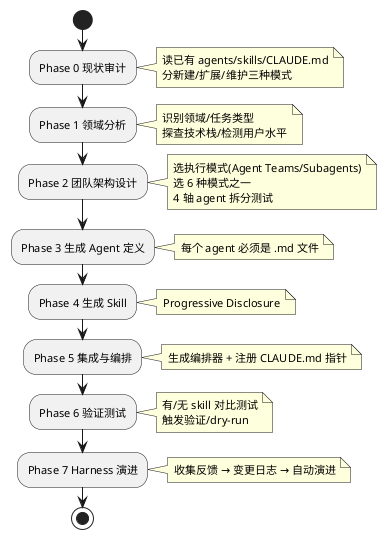
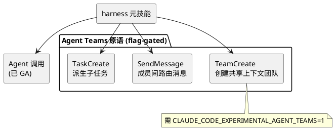

## harness：一个生成 agent 团队和 skill 的元技能

harness 是一个 Claude Code 的"元技能"（meta-skill）：你给它一句领域描述（比如"给金融风控团队搭一个 harness"），它就为你设计一支专家 agent 团队、生成每个 agent 的定义文件、生成它们使用的 skill 文件，再写好一个协调全队的编排器 skill。一句话概括它的核心思想——**一个 skill，专门用来生成其他 skill 和 agent 团队**。

## 元技能到底产出什么

理解 harness 的关键，是看它具体往你项目里写了什么文件。给定一句领域描述，它生成：

```text
your-project/
├── .claude/
│   ├── agents/          # Agent 定义文件
│   │   ├── analyst.md
│   │   ├── builder.md
│   │   └── qa.md
│   └── skills/          # Skill 文件
│       ├── analyze/
│       │   └── SKILL.md
│       └── build/
│           ├── SKILL.md
│           └── references/
└── CLAUDE.md            # 注册触发规则 + 变更日志
```

它的核心设计哲学是**把"谁来做"（agents）和"怎么做"（skills）分离**：agent 定义角色和协作协议，skill 定义可复用的工作方法。harness 把自己定位成"L3 元工厂"——生成其他 harness 的那一层。

## 项目概览

| 属性 | 详情 |
|------|-----|
| 仓库 | [revfactory/harness](https://github.com/revfactory/harness) |
| Stars | 约 7.9k（截至 2026-06-26） |
| 许可证 | Apache-2.0 |
| 形态 | Claude Code 插件 / 全局 skill |
| 版本 | 1.2.0 |
| 强依赖 | Claude Code v2.x+ 的实验性 Agent Teams |
| 语言 | 主体是 Markdown skill 文件（GitHub 显示 HTML 是因为有个落地页） |

> 注意：`skills/harness/SKILL.md` 及其 references 全部用韩文写成，本文涉及机制的引用为翻译。README 和 quickstart 是英文。

## 完整工作流：从一句话到一支团队

harness 的 `SKILL.md` 定义了 8 个阶段（Phase 0–7），比 README 描述的更细：



Phase 0 的现状审计很务实：它会检测 CLAUDE.md 记录和实际文件之间的"漂移"（drift），并据此分流到新建、扩展、维护三种模式，而不是每次都从零生成。

## Agent 是怎么定义的

harness 有一条硬规则：**每个 agent 必须是 `.claude/agents/{name}.md` 文件**，禁止把角色直接塞进 Agent 工具的 prompt 里。理由是文件持久化才能跨会话复用，显式的团队协议才能保证协作质量。

agent 定义模板（译自 `agent-design-patterns.md`）：

```markdown
---
name: agent-name
description: "1-2 句角色描述。列出触发关键词。"
---

# Agent Name — 角色一行摘要
你是 [领域] 的 [角色] 专家。
## 核心职责
## 工作原则
## 输入/输出协议
## 团队通信协议（agent 团队模式）
  - 消息接收：[从谁那里接收什么消息]
  - 消息发送：[向谁发送什么消息]
  - 任务请求：[从共享任务列表请求什么类型的任务]
## 错误处理
## 协作
```

注意"团队通信协议"这一节——这是 harness 区别于"随手开几个子 agent"的地方。它强制每个 agent 显式声明自己跟谁通信、收发什么消息，让多 agent 协作从"碰运气"变成"有契约"。

## Skill 是怎么生成的（核心机制）

Skill 生成的技术核心是 **Progressive Disclosure（渐进式披露）**——一套三层上下文加载机制，解决"既要让 agent 知道有这个能力，又不能把所有细节都塞进上下文"的矛盾：

| 层级 | 何时加载 | 体量目标 |
|------|----------|----------|
| Metadata（name + description） | 始终在上下文中 | ~100 词 |
| SKILL.md 正文 | skill 被触发时 | < 500 行 |
| references/ | 仅在需要时 | 无限（脚本可直接运行而不加载进上下文） |

harness 总结了四条 skill 生成原则，每条都附"为什么"：

- **description 是唯一的触发机制，所以要写得"有攻击性"**。反例："处理 PDF 文档的 skill"；正例："读取 PDF、提取文本/表格、合并、拆分……只要提到 .pdf 文件或要求 PDF 产出就必须使用本 skill。"
- **用"为什么"而非"永远/绝不"**——理解了原因的 LLM 才能正确处理边界情况。
- **泛化，不要过拟合**——在原则层面修复，而非针对具体例子。
- **祈使语气，正文 ≤ 500 行**，超出移到 references/。

## 六种团队架构模式

Phase 2 会从六种模式里选一种，这是 harness 沉淀的多 agent 协作经验：

| 模式 | 适用场景 |
|------|----------|
| Pipeline | 串行依赖任务（小说：世界观→人物→情节→写作→编辑） |
| Fan-out/Fan-in | 并行独立任务（全面调研），最适合 Agent Teams |
| Expert Pool | 按上下文选择性调用（按领域做代码评审） |
| Producer-Reviewer | 生成后质检（绘师→审查，最多 2-3 次返工） |
| Supervisor | 中央 agent 动态分配（代码迁移分批） |
| Hierarchical Delegation | 自顶向下递归（全栈应用） |

## 它和 Claude Code Agent Teams 的关系

harness 构建在 Claude Code **实验性的 Agent Teams** 之上，内部用到这些受 flag 控制的原语：



这里有个硬依赖必须强调：**必须 `export CLAUDE_CODE_EXPERIMENTAL_AGENT_TEAMS=1`**。如果不设这个变量，harness 生成的团队会静默退化成单 agent 执行，悄悄破坏 Pipeline、Fan-out/Fan-in、Supervisor 等依赖团队协作的模式——而且没有报错。

两种执行模式的区别：**Agent Teams**（默认）下成员是独立的 Claude Code 实例，通过共享任务列表自协调，能互相发消息；**Subagents** 模式下子 agent 结果只返回给主 agent，agent 之间无法通信。

## 安装与触发

```shell
/plugin marketplace add revfactory/harness
/plugin install harness@harness-marketplace
```

CLI 形式：

```bash
claude plugin marketplace add revfactory/harness
claude plugin install harness@harness
export CLAUDE_CODE_EXPERIMENTAL_AGENT_TEAMS=1
claude "build a harness for a fintech risk-assessment team"
```

触发短语内置多语言："Build a harness for this project"、"하네스 구성해줘"（韩）、"ハーネスを構成して"（日）。配套仓库 `revfactory/harness-100` 提供了 100 个生产级 harness（覆盖 10 个领域，英韩双语共 200 个包），全部由这个插件生成——可以当作产出样本来看。

## 适用场景与边界

harness 适合需要反复搭建多 agent 工作流的场景——与其每次手写一堆 agent 定义和 skill，不如让元技能按沉淀好的模式生成一套结构化、可复用、带协作协议的脚手架。

需要清楚的边界：

- **仅支持 Claude Code**，没有 Gemini/Codex 支持（作者选择了"Claude 原生且深"而非"多运行时但浅"）。
- **强依赖实验性 flag**，flag 未设则价值静默失效。
- **成本高**。quickstart 明确写：多 agent 团队单个任务可能扇出 5+ 个并行 Claude 调用，一个复杂工单消耗 50K–200K token。
- **Agent Teams 有结构限制**：一个会话同时只能有一个活跃团队，不能嵌套团队，leader 固定。
- **"+60% 质量提升"是作者自测**。README 醒目地标出这个数字，又大段免责："作者自测的 A/B（n=15），第三方复现待补"，并建议用户自己跑 2-4 周试点。
- **仓库自身没有测试/CI/release**——它甚至 dogfood 自己生成了一份仓库审计，给自己打了 5.5/10。

抛开这些数字争议，harness 真正有价值的是它把"如何设计一支 agent 团队"这件经验性的事，固化成了可执行的 8 阶段流程和 6 种模式。即使你不用这个插件，它对 agent 定义、skill 的 Progressive Disclosure、团队通信协议的思考，也是当下设计多 agent 系统很好的参考。

## 参考资料

- [GitHub 仓库](https://github.com/revfactory/harness)
- 关键文件：`skills/harness/SKILL.md`、`references/agent-design-patterns.md`、`references/team-examples.md`、`docs/experimental-dependency.md`
