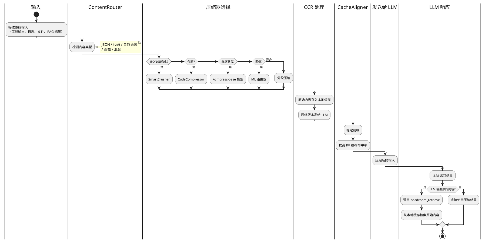

## 简介

AI Agent 有一个隐性的成本黑洞：上下文。当 agent 处理工具输出、日志、文件、RAG 检索结果时，动辄数万 tokens 的内容被塞进 LLM 的 context window。这不仅贵，还慢。

Headroom 在内容到达 LLM **之前**进行压缩。它不是简单的截断或摘要，而是 6 种针对不同内容类型的压缩算法，配合可逆压缩（CCR）和 KV 缓存对齐技术，实现 60-95% 的 token 节省，同时保持回答质量不变。

27k stars，2026 年 1 月创建，5 个月就成为 GitHub 上最火的 LLM 优化工具之一。它不是一个单一的库，而是提供了多种使用模式：Python/TypeScript 库、代理服务器、Agent 包装器、MCP 服务器。

## 项目概览

| 项目 | 值 |
|------|-----|
| 仓库 | [chopratejas/headroom](https://github.com/chopratejas/headroom) |
| Stars | 27k（截至 2026-06-14） |
| 许可证 | Apache 2.0 |
| 语言 | Python（78%）、Rust（17.3%）、TypeScript（2.5%） |
| 核心作者 | chopratejas（964 commits） |
| 最新版本 | v0.25.0（2026-06-12） |
| 文档 | [headroom-docs.vercel.app](https://headroom-docs.vercel.app/docs) |
| 创建时间 | 2026-01-07 |

## 核心功能

### 6 种压缩算法

| 算法 | 适用内容 | 原理 |
|------|---------|------|
| **SmartCrusher** | JSON、结构化数据 | 通用 JSON 压缩，处理数组、嵌套对象、混合类型 |
| **CodeCompressor** | 代码 | AST 感知，支持 Python/JS/Go/Rust/Java/C++ |
| **Kompress-base** | 自然语言文本 | 基于 HuggingFace 文本压缩模型（ONNX Runtime） |
| **CacheAligner** | 所有输入 | 稳定前缀以提高 KV 缓存命中率 |
| **CCR（可逆压缩）** | 所有输入 | 原始内容本地缓存，LLM 需要时可检索 |
| **图像压缩** | 图像 | 通过 ML 路由器实现 40-90% 压缩 |

### 多种使用模式

| 模式 | 命令 | 说明 |
|------|------|------|
| **Agent 包装器** | `headroom wrap claude` | 一行命令包装主流 AI 编码工具 |
| **代理服务器** | `headroom proxy --port 8787` | 零代码修改，任何语言都能用 |
| **MCP 服务器** | `headroom mcp install` | 提供 `headroom_compress`、`headroom_retrieve`、`headroom_stats` 工具 |
| **Python/TS 库** | `compress(messages)` | 直接在代码中调用 |

### 跨 Agent 共享记忆

Claude、Codex、Gemini 之间共享上下文存储，自动去重。

### `headroom learn`

挖掘失败的会话记录，自动将修正写入 `CLAUDE.md` / `AGENTS.md`。

## 快速上手

### 安装

```bash
# Python（全量安装）
pip install "headroom-ai[all]"

# Node/TypeScript
npm install headroom-ai

# Docker
docker pull ghcr.io/chopratejas/headroom:latest
```

要求 Python 3.10+。支持细粒度的可选依赖：`[proxy]`、`[mcp]`、`[ml]`、`[code]`、`[memory]`、`[relevance]`、`[image]`、`[agno]`、`[langchain]`、`[evals]`、`[pytorch-mps]`（Apple GPU 加速）等。

### 方式一：Agent 包装器（最简单）

```bash
# 包装 Claude Code
headroom wrap claude

# 包装 Cursor
headroom wrap cursor

# 包装 Codex
headroom wrap codex

# 包装 Aider
headroom wrap aider

# 包装 Copilot
headroom wrap copilot
```

包装后，正常使用 agent，headroom 会自动压缩所有输入。

### 方式二：代理服务器（零代码修改）

```bash
# 启动代理服务器
headroom proxy --port 8787

# 把你的应用指向 http://localhost:8787
# headroom 会透明地压缩所有请求
```

### 方式三：Python API

```python
from headroom import compress

messages = [
    {"role": "user", "content": very_long_text}
]

compressed = compress(messages)
# compressed 的 token 数减少 60-95%
```

### 方式四：集成到现有框架

#### Anthropic/OpenAI SDK

```python
from headroom.integrations.anthropic import withHeadroom
import anthropic

client = withHeadroom(anthropic.Anthropic())
```

#### Vercel AI SDK

```typescript
import { wrapLanguageModel } from 'headroom-ai/vercel';
import { headroomMiddleware } from 'headroom-ai/vercel';

const model = wrapLanguageModel({
  model: yourModel,
  middleware: headroomMiddleware()
});
```

#### LiteLLM

```python
import litellm
from headroom.integrations.litellm import HeadroomCallback

litellm.callbacks = [HeadroomCallback()]
```

#### LangChain

```python
from headroom.integrations.langchain import HeadroomChatModel

llm = HeadroomChatModel(your_llm)
```

### 查看节省效果

```bash
headroom perf
```

输出示例：

```
Total tokens saved: 1,234,567
Cost saved: $45.67
Compression ratio: 78%
```

## 架构与原理

### 压缩管线



### 核心组件

#### ContentRouter（内容路由器）

检测输入内容的类型，自动选择对应的压缩器。它使用轻量级的启发式规则：

- 包含 `{` 和 `}` 且格式合法 → JSON → SmartCrusher
- 包含函数定义、import 语句 → 代码 → CodeCompressor
- 包含自然语言句子 → 文本 → Kompress-base
- 是图像数据 → 图像 → ML 路由器

#### SmartCrusher（JSON 压缩）

针对 JSON 和结构化数据的压缩算法：

- 移除空数组和空对象
- 压缩长数组（保留前 N 个元素 + 摘要）
- 移除冗余字段
- 合并相似对象

#### CodeCompressor（代码压缩）

AST 感知的代码压缩，支持 Python、JavaScript、Go、Rust、Java、C++：

- 移除注释（可选保留）
- 压缩长函数体（保留签名 + 关键逻辑）
- 移除未使用的 import
- 压缩重复代码块

#### Kompress-base（文本压缩模型）

基于 HuggingFace 的文本压缩模型（`chopratejas/kompress-v2-base`），在 agentic 场景的轨迹数据上训练，使用 ONNX Runtime 推理。

它不是简单的摘要，而是**语义保留压缩**——移除冗余信息，保留关键语义。

#### CacheAligner（KV 缓存对齐）

Anthropic 和 OpenAI 的 API 支持 KV 缓存（prompt caching），但要求前缀完全匹配。CacheAligner 通过稳定化前缀（固定 system prompt、固定顺序的工具定义），让缓存能实际命中。

#### CCR（可逆压缩）

可逆压缩的核心思路：

```
1. 原始内容 → 本地缓存（SQLite）
2. 压缩版本 → 发给 LLM
3. LLM 返回结果
4. 如果 LLM 说"我需要更多细节" → 调用 headroom_retrieve 检索原始内容
```

这样，大部分情况下 LLM 只需要压缩版本（省 token），少数情况下需要原始内容时才检索。

### 管线生命周期

```
Setup → Pre-Start → Post-Start → Input Received → Input Cached →
Input Routed → Input Compressed → Input Remembered → Pre-Send →
Post-Send → Response Received
```

每个阶段有对应的 Transform 处理。核心编排（`wrap.py`、`client.py`、`cli/proxy.py`）只负责生命周期和策略，提供商特定的逻辑隔离在 `headroom/providers/` 下。

### 精度基准测试

| Benchmark | 类别 | 基线 | Headroom | 差异 |
|-----------|------|------|----------|------|
| GSM8K | 数学 | 0.870 | 0.870 | ±0.000 |
| TruthfulQA | 事实性 | 0.530 | 0.560 | +0.030 |
| SQuAD v2 | 问答 | — | 97% 准确率 | 19% 压缩率 |
| BFCL | 工具调用 | — | 97% 准确率 | 32% 压缩率 |

实际工作负载节省效果：

| 场景 | 原始 tokens | 压缩后 tokens | 节省 |
|------|------------|--------------|------|
| 代码搜索 100 条结果 | 17,765 | 1,408 | **92%** |
| SRE 事故调试 | 65,694 | 5,118 | **92%** |
| GitHub Issue 分类 | — | — | **73%** |
| 代码库探索 | — | — | **47%** |

## 关键设计决策

**1. 为什么有 6 种压缩算法？**

不同内容类型有不同的压缩策略。JSON 需要保留结构，代码需要保留语义，自然语言需要保留关键信息。一种通用的压缩算法无法在所有场景都表现良好。

**2. 为什么用可逆压缩（CCR）？**

压缩可能会丢失细节。CCR 的思路是：先压缩，如果 LLM 需要更多细节再检索原始内容。这样大部分情况下省 token，少数情况下保证精度。

**3. 为什么需要 CacheAligner？**

KV 缓存是 LLM API 的重要优化，但要求前缀完全匹配。CacheAligner 通过稳定化前缀，让缓存能实际命中，间接减少 token 消耗。

**4. 为什么用 Rust 写性能关键部分？**

Python 的 GIL 限制了多线程性能。Rust 可以无 GIL 地并行处理多个压缩任务，且内存安全。

**5. 为什么支持这么多集成方式？**

不同用户有不同的技术栈和使用场景。代理服务器适合零代码修改，Python API 适合深度集成，MCP 工具适合 AI agent。

## 适用场景与局限

### 适用场景

- **RAG 系统**：压缩检索结果，减少 context window 占用
- **AI Agent**：压缩工具输出，降低 token 成本
- **日志分析**：压缩大量日志，保留关键信息
- **代码库探索**：压缩代码搜索结果
- **跨 Agent 共享记忆**：多个 agent 共享压缩后的上下文

### 局限

- **压缩可能丢失细节**：虽然 CCR 提供回退，但大部分情况下 LLM 只能看到压缩版本
- **Kompress-base 模型需要下载**：首次使用需要下载 HuggingFace 模型
- **性能开销**：压缩本身需要计算时间，可能增加延迟
- **不支持所有语言**：CodeCompressor 目前支持 6 种语言
- **图像压缩仍在实验阶段**：效果可能不稳定

## 参考资料

- 官方仓库：[chopratejas/headroom](https://github.com/chopratejas/headroom)
- 文档：[headroom-docs.vercel.app](https://headroom-docs.vercel.app/docs)
- Kompress-base 模型：[chopratejas/kompress-v2-base](https://huggingface.co/chopratejas/kompress-v2-base)
- Discord 社区：[headroom-ai discord](https://discord.gg/headroom-ai)
