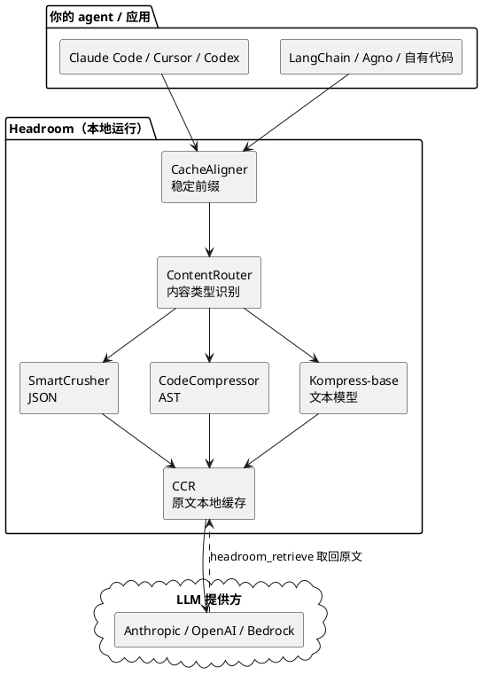
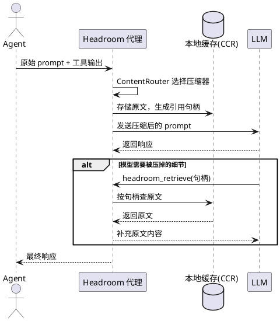
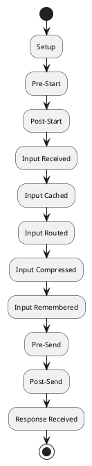

## 简介

Headroom 是一个上下文压缩层（context compression layer），它在 AI agent 读取的所有内容——工具输出、命令行日志、RAG 检索片段、源文件、对话历史——送达 LLM 之前先做压缩。官方给出的数字是在真实 agent 工作负载上减少 60-95% 的 token，同时保持答案不变；压缩全程在本地完成，原文可按需取回。它提供库、代理、MCP server 和 agent 包装四种接入方式，核心文本压缩用的是自训练并发布在 HuggingFace 上的 Kompress-base 模型。

## 项目概览

| 属性 | 详情 |
|------|-----|
| 仓库 | [headroomlabs-ai/headroom](https://github.com/headroomlabs-ai/headroom) |
| Stars | 约 51.3k（截至 2026-06-26） |
| 许可证 | Apache 2.0 |
| 语言 | Python 为主 + Rust 核心 + TypeScript SDK |
| 最新版本 | v0.27.0（2026-06-22） |
| 创建时间 | 2026-01-07 |
| 包名 | PyPI: `headroom-ai`；npm: `headroom-ai` |
| 运行环境 | 本地运行，Python 3.10+ |
| 压缩模型 | [Kompress-v2-base](https://huggingface.co/chopratejas/kompress-v2-base)（HuggingFace） |

## 背景与动机

AI agent 在运行时会把大量原始文本塞进上下文：工具调用返回的 JSON、`grep`/构建/测试的命令行输出、RAG 检索回来的文档片段、被读取的整个源文件。这些内容大多高度冗余——一次代码搜索 100 条结果可能就是几万 token。它们带来两个直接代价：token 直接对应 API 账单（输出 token 在 Opus 级模型上还要贵 5 倍），以及过长的上下文会稀释模型注意力。

Headroom 的思路是在这些内容进入 LLM 之前先压缩，并且做了三个关键取舍：

- **本地运行**：压缩在你自己的机器上完成，数据不经过第三方 API，区别于把文本发到托管服务再压缩的方案。
- **可逆**：原文在本地缓存，模型若发现压缩丢了关键信息，可以主动调工具取回原文（即下文的 CCR）。
- **覆盖全部内容类型**：不只是对话历史，工具输出、日志、RAG 片段、文件都在压缩范围内。

## 快速上手

```bash
# 1 — 安装
pip install "headroom-ai[all]"          # Python，全功能
npm install headroom-ai                 # Node / TypeScript
docker pull ghcr.io/chopratejas/headroom:latest   # Docker

# 2 — 选择接入形态
headroom wrap claude                    # 包装一个编码 agent
headroom proxy --port 8787              # 直接做代理，零代码改动

# 3 — 查看节省
headroom perf
headroom dashboard                      # 实时节省看板（需代理在运行）
```

安装需要 Python 3.10+。可选 extras 按需安装：`[proxy]`、`[mcp]`、`[ml]`（Kompress 模型）、`[code]`、`[memory]`、`[relevance]`、`[image]`、`[agno]`、`[langchain]`、`[evals]`、`[pytorch-mps]`（Apple GPU 加速）等。

四种接入形态对应不同侵入程度：

- **agent 包装**：`headroom wrap claude|codex|aider|copilot|opencode` 一条命令拉起，之后正常用 agent 即可；Cursor 需手动把代理设置粘贴进 App。
- **代理**：`headroom proxy --port 8787`，任何 OpenAI 兼容客户端把 base URL 指过来即可，零代码改动、不限语言。
- **MCP server**：`headroom mcp install` 后暴露 `headroom_compress`、`headroom_retrieve`、`headroom_stats` 三个工具给任意 MCP 客户端。
- **库**：在 Python 或 TypeScript 代码里内联调用 `compress(messages)`。

库模式的最小调用：

```python
from headroom import compress

messages = [{"role": "user", "content": very_long_text}]
compressed = compress(messages)   # token 数减少 60-95%
```

也能挂进现有框架，不改业务逻辑：

```python
# Anthropic / OpenAI SDK：包装 client
from headroom.integrations.anthropic import withHeadroom
import anthropic
client = withHeadroom(anthropic.Anthropic())

# LiteLLM：注册 callback
import litellm
from headroom.integrations.litellm import HeadroomCallback
litellm.callbacks = [HeadroomCallback()]

# LangChain：包装 chat model
from headroom.integrations.langchain import HeadroomChatModel
llm = HeadroomChatModel(your_llm)
```

```typescript
// Vercel AI SDK：作为 middleware
import { wrapLanguageModel } from 'headroom-ai/vercel';
import { headroomMiddleware } from 'headroom-ai/vercel';

const model = wrapLanguageModel({
  model: yourModel,
  middleware: headroomMiddleware(),
});
```

此外还支持 Agno（`HeadroomAgnoModel`）、Strands、ASGI 中间件（`CompressionMiddleware`）等接入点。

## 架构与原理

整体数据流是：agent 的内容先经 CacheAligner 稳定前缀，再由 ContentRouter 按类型分发给不同压缩器，原文存入 CCR 本地缓存后，压缩结果发往 LLM 提供方。



### 六类压缩能力

Headroom 不用单一算法压所有东西，而是按内容类型选择处理方式。官方将其归纳为六种能力：

| 能力 | 适用内容 | 做法 |
|------|---------|------|
| SmartCrusher | JSON、结构化数据 | 通用 JSON 压缩，处理数组、嵌套对象、混合类型 |
| CodeCompressor | 代码 | AST 感知，支持 Python/JS/Go/Rust/Java/C++ |
| Kompress-base | 自然语言文本 | HuggingFace 文本压缩模型，ONNX Runtime 推理 |
| 图像压缩 | 图像 | 经训练的 ML 路由器，宣称 40-90% 缩减 |
| CacheAligner | 所有输入 | 稳定前缀以提高 KV 缓存命中率 |
| CCR | 所有输入 | 原文本地缓存，LLM 需要时按句柄取回 |

其中 SmartCrusher、CodeCompressor、Kompress-base 是三个主力压缩器，由 ContentRouter 根据内容类型分发：

- **SmartCrusher** 处理工具输出最常见的 JSON 形态——字典数组、嵌套对象、混合类型。
- **CodeCompressor** 基于 AST 而非字符做删减，按语法结构压缩代码。
- **Kompress-base** 处理散文/自然语言，是项目在 agentic 轨迹上自训练的模型，做的是语义保留压缩而非简单摘要。

后两者（CacheAligner、CCR）严格说不是「压缩算法」，而是让压缩可用、可逆的配套机制，下面单独说。

### CacheAligner：让 KV 缓存真正命中

这是容易被忽略的一环。Anthropic、OpenAI 等提供方对稳定的 prompt 前缀有 KV 缓存，命中能省下重复计算的费用，但要求前缀完全匹配。问题在于：压缩若改动了前缀，缓存就失效了。CacheAligner 的作用是稳定化前缀（固定 system prompt、固定顺序的工具定义），让压缩与提供方的 KV 缓存机制不互相打架。

### CCR：可逆压缩

CCR（可逆压缩）是 Headroom 区别于一次性压缩方案的关键。压缩时原文不会丢弃，而是存入本地缓存并生成引用句柄；如果 LLM 在推理中发现需要被压掉的细节，可以调用 `headroom_retrieve` 按句柄取回原文。



原文按配置的 TTL 缓存，超时后失效。大部分情况下 LLM 只需要压缩版本，少数需要原始内容时才检索——这套机制让「激进压缩」变得相对安全：压错了还能补救，而不是信息永久丢失。

### 统一的管线生命周期

无论从 `compress()`、SDK 还是代理进入，输入到响应都经过同一条固定流水线，每个阶段有对应的 Transform：



核心编排文件（`wrap.py`、`client.py`、`cli/proxy.py`、`proxy/server.py`）只负责生命周期、排序和策略，提供商特定的逻辑隔离在 `headroom/providers/` 下（Claude、Gemini、Copilot、Codex 等各一个 slice）。这种「编排与提供商解耦」的分层是它能同时支持多种 agent 和接入形态的原因。

### 输出 token 压缩

上面压的都是「发出去」的 prompt，Headroom 还能压「模型写回来」的内容，从代理侧开启、无需改代码：

- **冗长度引导（verbosity steering）**：在系统提示末尾追加一段「简洁作答、不要复述上下文」的提示（放末尾是为了不破坏 prompt 缓存）。
- **思考力度路由（effort routing）**：当某一轮只是模型在工具结果（如读完文件、测试通过）后继续时，调低思考力度；遇到新问题和报错则保持全力度。

通过 `export HEADROOM_OUTPUT_SHAPER=1` 开启（默认关闭）。由于无法得知模型「本来会写多少」，输出节省是反事实估算，Headroom 报告的是带置信区间的估计值而非编造的确定数字；若要测量值，可用 `HEADROOM_OUTPUT_HOLDOUT=0.1` 留 10% 对话作为对照组。

### 设计考量

几个设计取舍背后的理由：

- **为什么按内容类型分多个压缩器**：JSON 要保结构、代码要保语义、自然语言要保关键信息，单一通用算法无法在所有场景都好用。
- **为什么要可逆（CCR）**：压缩必然有丢信息的风险，CCR 用「先压、需要再取回」把这个风险兜住，让压缩可以更激进。
- **为什么有 Rust 核心**：Python 的 GIL 限制并行，性能关键路径（如压缩、ONNX 推理调度）放在 Rust 里可以无 GIL 并行且内存安全。
- **为什么支持这么多接入形态**：代理适合零代码改动、库适合深度集成、MCP 适合 agent 调用、wrap 适合命令行工具，覆盖不同技术栈。

### 其他能力

- **跨 agent 记忆**：Claude、Codex、Gemini 之间共享的记忆存储，带 agent 来源标记和自动去重。
- **`headroom learn`**：挖掘失败的会话，把纠正写进 `CLAUDE.md` / `AGENTS.md` / `GEMINI.md`。
- **SharedContext**：在多 agent 工作流之间传递压缩后的上下文。

## 实测数据

项目给出的真实 agent 工作负载压缩数据：

| 工作负载 | 压缩前 | 压缩后 | 节省 |
|----------|-------:|-------:|-----:|
| 代码搜索（100 条结果） | 17,765 | 1,408 | 92% |
| SRE 事故排查 | 65,694 | 5,118 | 92% |
| GitHub issue 分类 | 54,174 | 14,761 | 73% |
| 代码库探索 | 78,502 | 41,254 | 47% |

在标准基准上的准确率（验证压缩未损失答案质量）：

| 基准 | 类别 | N | 基线 | Headroom | 差值 |
|------|------|--:|-----:|---------:|------|
| GSM8K | 数学 | 100 | 0.870 | 0.870 | ±0.000 |
| TruthfulQA | 事实 | 100 | 0.530 | 0.560 | +0.030 |
| SQuAD v2 | 问答 | 100 | — | 97% | 压缩 19% |
| BFCL | 工具调用 | 100 | — | 97% | 压缩 32% |

数据可用 `python -m headroom.evals suite --tier 1` 复现。需要注意的是，节省比例高度依赖工作负载类型：冗余的结构化输出（代码搜索、日志）压缩率最高，而本就信息密集的内容（代码库探索）压缩空间有限。

## 适用场景与局限

能力边界（中性陈述）：

- **支持的接入**：库（Python/TS）、OpenAI 兼容代理、MCP server、对 Claude Code / Codex / Aider / Copilot CLI / OpenCode 的一键包装；Cursor 需手动配置代理。
- **支持的内容类型**：JSON 工具输出、代码（Python/JS/Go/Rust/Java/C++）、自然语言文本、图像、对话历史。
- **框架集成**：Anthropic/OpenAI SDK、Vercel AI SDK、LiteLLM、LangChain、Agno、Strands、ASGI 中间件。

可能不适合或需要注意的情况：

- 只用单一提供方的原生压缩（如 OpenAI Compaction）、又不需要跨 agent 记忆时，额外引入一层的收益有限。
- 在沙箱环境里无法运行本地进程时无法使用——Headroom 的本地运行特性此时反而是约束。
- 压缩本身有计算开销，会引入一定延迟；Kompress-base 模型首次使用需下载。
- 企业 SSL 拦截环境下安装可能遇到证书问题（`maturin` 下载 Rust、ONNX Runtime 与 HuggingFace 模型走 TLS），README 给出了 `HEADROOM_TLS_STRICT=0`、预装 Rust、离线提供模型等绕过方案。

从工程角度看，Headroom 最值得借鉴的设计是「按内容类型路由到不同压缩器 + 原文本地可逆缓存 + 编排与提供商解耦」这套组合：它既避免了用单一算法压所有东西的粗暴，又用 CCR 把激进压缩的风险兜住，还靠分层把多 agent、多接入形态的复杂度收敛在 `providers/` 里。如果你在为 agent 系统设计上下文管理层，这套分而治之 + 可回溯 + 分层的思路比具体的压缩率数字更有参考价值。

## 参考资料

- [GitHub 仓库](https://github.com/headroomlabs-ai/headroom)
- [官方文档](https://headroom-docs.vercel.app/docs)
- [Kompress-v2-base 模型卡](https://huggingface.co/chopratejas/kompress-v2-base)
- [CCR 可逆压缩文档](https://headroom-docs.vercel.app/docs/ccr)
