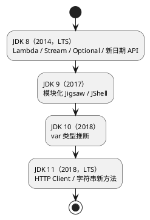

## 简介

Java 从 JDK 8 开始进入快速迭代时代，每六个月发布一个新版本。本系列按阶段梳理 JDK 8 到 21 的重要特性，本篇覆盖 **JDK 8-11**——奠定现代 Java 基础的四个版本，包含两个 LTS（JDK 8 和 JDK 11）。

> 系列导航：
> - **（一）JDK 8-11 现代化基础**（本文）
> - [（二）JDK 12-17 语言增强](/posts/jdk-versions-12-to-17/)
> - [（三）JDK 18-21 并发与新特性](/posts/jdk-versions-18-to-21/)

## 版本总览

### 核心特性一览表

本篇覆盖的四个版本：

| 版本 | 发布时间 | 类型 | 核心特性 |
|------|----------|------|----------|
| JDK 8 | 2014-03 | LTS | **Lambda 表达式**<br>**Stream API**<br>**Optional 类**<br>**新日期时间 API**<br>**接口默认方法** |
| JDK 9 | 2017-09 | 非LTS | **模块化系统(Jigsaw)**<br>**JShell 交互式工具**<br>**集合工厂方法**<br>**接口私有方法**<br>**Stream API 增强** |
| JDK 10 | 2018-03 | 非LTS | **var 局部变量类型推断**<br>**不可变集合增强**<br>**Parallel GC 改进** |
| JDK 11 | 2018-09 | LTS | **HTTP Client API**<br>**字符串新方法**<br>**文件读写便捷方法**<br>**运行单文件程序** |

JDK 12 及之后的版本特性见系列后续篇目。

### 本阶段的两个 LTS

JDK 8 和 JDK 11 都是 LTS（长期支持）版本，是这一阶段生产环境的主要选择：

| LTS 版本 | 发布时间 | 支持截止 | 推荐使用场景 |
|----------|----------|----------|--------------|
| JDK 8 | 2014-03 | 2030-12 | 传统企业系统维护、遗留系统 |
| JDK 11 | 2018-09 | 2026-09 | 企业级应用、微服务架构 |



### 特性分类

本篇涉及的特性按类别归纳：

| 特性类别 | 相关版本 | 特性名称 | 主要用途 |
|----------|----------|----------|----------|
| **函数式编程** | JDK 8 | Lambda、Stream | 简化代码、集合操作 |
| **空值处理** | JDK 8 | Optional | 安全处理 null，避免 NPE |
| **日期时间** | JDK 8 | java.time | 线程安全的日期时间 API |
| **类型推断** | JDK 10 | var | 减少冗余代码 |
| **模块化** | JDK 9 | Jigsaw | 依赖管理、安全性 |
| **集合增强** | JDK 9-10 | 工厂方法/copyOf | 便捷创建不可变集合 |
| **网络** | JDK 11 | HTTP Client | HTTP/2、WebSocket |
| **字符串处理** | JDK 11 | strip/lines/repeat | 文本处理便捷方法 |

---

## 一、JDK 8 (2014年3月) - Java 语言的革命性更新

JDK 8 是 Java 历史上最重要的版本之一，引入了函数式编程范式，彻底改变了 Java 的编码风格。

### JDK 8 特性概览

| 特性名称 | 状态 | 功能描述 | 重要程度 |
|----------|------|----------|----------|
| **Lambda 表达式** | 正式 | 函数式编程，简化匿名内部类 | 高 |
| **Stream API** | 正式 | 集合的函数式操作，支持链式调用和并行处理 | 高 |
| **Optional 类** | 正式 | 安全的空值处理，避免 NPE | 高 |
| **新日期时间 API** | 正式 | java.time 包，线程安全、设计合理 | 高 |
| **接口默认方法** | 正式 | 接口可定义默认实现，支持接口演进 | 中 |

### 1.1 Lambda 表达式

Lambda 表达式让 Java 支持函数式编程，代码更加简洁优雅。

```java
import java.util.*;

public class LambdaDemo {
    public static void main(String[] args) {
        List<String> names = Arrays.asList("Alice", "Bob", "Charlie", "David");
        
        // 传统方式：匿名内部类
        Collections.sort(names, new Comparator<String>() {
            @Override
            public int compare(String a, String b) {
                return a.compareTo(b);
            }
        });
        
        // Lambda 表达式方式
        Collections.sort(names, (a, b) -> a.compareTo(b));
        
        // 更简洁的写法
        Collections.sort(names, String::compareTo);
        
        // 遍历集合
        names.forEach(name -> System.out.println(name));
        names.forEach(System.out::println);
    }
}
```

### 1.2 Stream API

Stream API 提供了对集合进行函数式操作的能力，支持链式调用和并行处理。

```java
import java.util.*;
import java.util.stream.*;

public class StreamDemo {
    public static void main(String[] args) {
        List<Integer> numbers = Arrays.asList(1, 2, 3, 4, 5, 6, 7, 8, 9, 10);
        
        // 过滤偶数并求和
        int sum = numbers.stream()
            .filter(n -> n % 2 == 0)   // 过滤偶数
            .mapToInt(n -> n * n)       // 平方
            .sum();                     // 求和
        System.out.println("偶数平方和: " + sum); // 220
        
        // 并行流处理
        long count = numbers.parallelStream()
            .filter(n -> n > 5)
            .count();
        System.out.println("大于5的数量: " + count); // 5
        
        // 收集结果
        List<Integer> filtered = numbers.stream()
            .filter(n -> n > 3)
            .collect(Collectors.toList());
        
        // 分组操作
        Map<Boolean, List<Integer>> partitioned = numbers.stream()
            .collect(Collectors.partitioningBy(n -> n % 2 == 0));
        System.out.println("偶数: " + partitioned.get(true));
        System.out.println("奇数: " + partitioned.get(false));
        
        // 自定义聚合
        String joined = numbers.stream()
            .map(String::valueOf)
            .collect(Collectors.joining(", ", "[", "]"));
        System.out.println(joined); // [1, 2, 3, 4, 5, 6, 7, 8, 9, 10]
    }
}
```

### 1.3 Optional 类

Optional 解决了空指针异常问题，提供了更安全的空值处理方式。

```java
import java.util.Optional;

public class OptionalDemo {
    public static void main(String[] args) {
        // 创建 Optional
        Optional<String> opt1 = Optional.of("Hello");      // 必须非空
        Optional<String> opt2 = Optional.ofNullable(null); // 可为空
        Optional<String> opt3 = Optional.empty();          // 空值
        
        // 基本操作
        if (opt1.isPresent()) {
            System.out.println(opt1.get());
        }
        
        // 推荐的函数式操作
        opt1.ifPresent(System.out::println);
        
        // 默认值
        String value = opt2.orElse("Default Value");
        String lazyValue = opt2.orElseGet(() -> "Lazy Default");
        
        // 异常处理
        String result = opt2.orElseThrow(() -> 
            new RuntimeException("Value is null"));
        
        // 转换操作
        Optional<Integer> length = opt1.map(String::length);
        Optional<String> filtered = opt1.filter(s -> s.length() > 3);
        
        // 链式调用示例
        User user = getUser();
        String email = Optional.ofNullable(user)
            .map(User::getEmail)
            .orElse("no-email@example.com");
    }
    
    static User getUser() {
        return new User("Alice", "alice@example.com");
    }
}

class User {
    private String name;
    private String email;
    
    User(String name, String email) {
        this.name = name;
        this.email = email;
    }
    
    public String getName() { return name; }
    public String getEmail() { return email; }
}
```

### 1.4 新的日期时间 API

JDK 8 引入了全新的日期时间 API，解决了旧 API 的线程安全和设计问题。

```java
import java.time.*;
import java.time.format.DateTimeFormatter;
import java.time.temporal.ChronoUnit;

public class DateTimeDemo {
    public static void main(String[] args) {
        // LocalDate - 日期
        LocalDate date = LocalDate.now();
        LocalDate specificDate = LocalDate.of(2024, 12, 25);
        
        System.out.println("当前日期: " + date);
        System.out.println("特定日期: " + specificDate);
        
        // 日期运算
        LocalDate nextWeek = date.plusWeeks(1);
        LocalDate lastMonth = date.minusMonths(1);
        LocalDate nextYear = date.plusYears(1);
        
        // LocalTime - 时间
        LocalTime time = LocalTime.now();
        LocalTime specificTime = LocalTime.of(14, 30, 0);
        System.out.println("当前时间: " + time);
        
        // LocalDateTime - 日期时间
        LocalDateTime dateTime = LocalDateTime.now();
        LocalDateTime specificDateTime = LocalDateTime.of(
            2024, 12, 25, 14, 30
        );
        
        // 格式化与解析
        DateTimeFormatter formatter = DateTimeFormatter
            .ofPattern("yyyy-MM-dd HH:mm:ss");
        String formatted = dateTime.format(formatter);
        LocalDateTime parsed = LocalDateTime.parse(
            "2024-12-25 14:30:00", formatter
        );
        
        // Instant - 时间戳
        Instant instant = Instant.now();
        Instant epoch = Instant.EPOCH;
        
        // Duration - 时间差
        Duration duration = Duration.between(time, specificTime);
        long hours = duration.toHours();
        long minutes = duration.toMinutes();
        
        // Period - 日期差
        Period period = Period.between(date, specificDate);
        int days = period.getDays();
        int months = period.getMonths();
        
        // 时区处理
        ZonedDateTime zoned = ZonedDateTime.now();
        ZonedDateTime tokyo = zoned.withZoneSameInstant(
            ZoneId.of("Asia/Tokyo")
        );
        
        // 时钟
        Clock clock = Clock.systemUTC();
        Instant utcInstant = clock.instant();
    }
}
```

### 1.5 接口默认方法

接口可以定义默认实现，解决了接口演进的问题。

```java
public interface DefaultMethodDemo {
    // 抽象方法
    void abstractMethod();
    
    // 默认方法
    default void defaultMethod() {
        System.out.println("默认方法实现");
    }
    
    // 静态方法
    static void staticMethod() {
        System.out.println("接口静态方法");
    }
}

class Implementation implements DefaultMethodDemo {
    @Override
    public void abstractMethod() {
        System.out.println("抽象方法实现");
    }
    
    // 可以选择重写默认方法
    @Override
    public void defaultMethod() {
        System.out.println("重写的默认方法");
    }
}

// 多接口默认方法冲突解决
interface InterfaceA {
    default void method() {
        System.out.println("InterfaceA.method");
    }
}

interface InterfaceB {
    default void method() {
        System.out.println("InterfaceB.method");
    }
}

class MultipleInterface implements InterfaceA, InterfaceB {
    @Override
    public void method() {
        // 必须显式选择
        InterfaceA.super.method();
        // 或者 InterfaceB.super.method();
        // 或者自定义实现
    }
}
```

---

## 二、JDK 9 (2017年9月) - 模块化时代

### JDK 9 特性概览

| 特性名称 | 状态 | 功能描述 | 重要程度 |
|----------|------|----------|----------|
| **模块化系统(Jigsaw)** | 正式 | 解决"JAR地狱"，提升安全性和可维护性 | 高 |
| **JShell** | 正式 | 交互式编程工具，快速测试代码片段 | 中 |
| **集合工厂方法** | 正式 | List.of/Set.of/Map.of 创建不可变集合 | 高 |
| **接口私有方法** | 正式 | 接口内复用公共逻辑 | 中 |
| **Stream API 增强** | 正式 | takeWhile/dropWhile/ofNullable/iterate | 中 |

### 2.1 模块化系统 (Project Jigsaw)

JDK 9 最大的变化是引入了模块化系统，解决了"JAR地狱"问题。

```java
// module-info.java
module com.example.myapp {
    requires java.base;              // 默认必需
    requires java.sql;               // 需要 SQL 模块
    requires transitive java.logging; // 传递依赖
    
    exports com.example.api;         // 导出包
    exports com.example.internal to com.example.other; // 限定导出
    
    uses com.example.Service;        // 使用服务
    provides com.example.Service     // 提供服务
        with com.example.impl.ServiceImpl;
}

// 模块中的类
package com.example.api;

public class ApiService {
    public void process() {
        System.out.println("Processing...");
    }
}
```

### 2.2 JShell - 交互式编程工具

JShell 提供了交互式的 Java 编程环境。

```java
// 在终端中启动 jshell
// $ jshell

jshell> int x = 10
x ==> 10

jshell> int y = 20
y ==> 20

jshell> int sum = x + y
sum ==> 30

jshell> System.out.println(sum)
30

jshell> List.of(1, 2, 3, 4, 5)
$5 ==> [1, 2, 3, 4, 5]

jshell> $5.stream().filter(n -> n > 2).toList()
$6 ==> [3, 4, 5]

jshell> /save my-session.jsh    // 保存会话
jshell> /open my-session.jsh    // 打开会话
jshell> /exit                   // 退出
```

### 2.3 集合工厂方法

更便捷的不可变集合创建方式。

```java
import java.util.*;

public class CollectionFactoryDemo {
    public static void main(String[] args) {
        // 创建不可变 List
        List<String> list = List.of("a", "b", "c");
        // list.add("d"); // UnsupportedOperationException
        
        // 创建不可变 Set
        Set<Integer> set = Set.of(1, 2, 3, 4);
        // Set.of(1, 1, 2); // IllegalArgumentException - 重复元素
        
        // 创建不可变 Map
        Map<String, Integer> map1 = Map.of("a", 1, "b", 2, "c", 3);
        
        // 使用 Map.ofEntries 创建更大的 Map
        Map<String, Integer> map2 = Map.ofEntries(
            Map.entry("a", 1),
            Map.entry("b", 2),
            Map.entry("c", 3),
            Map.entry("d", 4),
            Map.entry("e", 5)
        );
        
        // 注意：这些集合是不可变的
        // 以下操作会抛出 UnsupportedOperationException
        // list.add("d");
        // set.add(5);
        // map1.put("d", 4);
        
        // 如果需要可变集合
        List<String> mutableList = new ArrayList<>(List.of("a", "b", "c"));
        mutableList.add("d"); // 正常工作
    }
}
```

### 2.4 接口私有方法

接口可以定义私有方法用于复用代码。

```java
public interface PrivateMethodDemo {
    default void publicMethod1() {
        commonSetup();
        System.out.println("Method 1 execution");
        commonCleanup();
    }
    
    default void publicMethod2() {
        commonSetup();
        System.out.println("Method 2 execution");
        commonCleanup();
    }
    
    // 私有方法 - 公共逻辑复用
    private void commonSetup() {
        System.out.println("Common setup");
    }
    
    private void commonCleanup() {
        System.out.println("Common cleanup");
    }
    
    // 私有静态方法
    private static void staticHelper() {
        System.out.println("Static helper");
    }
}
```

### 2.5 Stream API 增强

新增了 `takeWhile`、`dropWhile`、`iterate` 等方法。

```java
import java.util.stream.*;
import java.util.Optional;

public class StreamEnhancementDemo {
    public static void main(String[] args) {
        // takeWhile - 取到条件不满足为止
        Stream<Integer> takeWhile = Stream.of(1, 2, 3, 4, 5, 6, 3, 2, 1)
            .takeWhile(n -> n < 4);
        System.out.println("takeWhile: " + takeWhile.toList()); // [1, 2, 3]
        
        // dropWhile - 丢弃到条件不满足为止
        Stream<Integer> dropWhile = Stream.of(1, 2, 3, 4, 5, 6, 3, 2, 1)
            .dropWhile(n -> n < 4);
        System.out.println("dropWhile: " + dropWhile.toList()); // [4, 5, 6, 3, 2, 1]
        
        // iterate 的重载版本 - 支持终止条件
        Stream<Integer> iterate = Stream.iterate(1, n -> n <= 10, n -> n + 1);
        System.out.println("iterate: " + iterate.toList()); // [1..10]
        
        // ofNullable - 处理可能为空的元素
        Stream<String> stream1 = Stream.ofNullable(null);
        Stream<String> stream2 = Stream.ofNullable("value");
        
        System.out.println("ofNullable(null): " + stream1.toList()); // []
        System.out.println("ofNullable(value): " + stream2.toList()); // [value]
    }
}
```

---

## 三、JDK 10 (2018年3月) - 局部变量类型推断

### JDK 10 特性概览

| 特性名称 | 状态 | 功能描述 | 重要程度 |
|----------|------|----------|----------|
| **var 关键字** | 正式 | 局部变量类型推断，减少冗余代码 | 高 |
| **不可变集合增强** | 正式 | List.copyOf/Set.copyOf/Map.copyOf | 中 |
| **Parallel GC 改进** | 正式 | G1 GC 性能优化 | 中 |

### 3.1 var 关键字

引入 `var` 关键字，让编译器自动推断局部变量类型。

```java
import java.util.*;
import java.util.stream.*;

public class VarDemo {
    public static void main(String[] args) {
        // 基本使用
        var list = new ArrayList<String>();  // 推断为 ArrayList<String>
        var map = new HashMap<String, Integer>(); // 推断为 HashMap<String, Integer>
        var stream = list.stream();          // 推断为 Stream<String>
        
        // 在循环中使用
        for (var element : list) {
            System.out.println(element);
        }
        
        // 在 Stream 中使用
        var result = list.stream()
            .filter(s -> s.length() > 3)
            .collect(Collectors.toList());
        
        // try-with-resources
        try (var input = new Scanner(System.in)) {
            var line = input.nextLine();
        }
        
        // 注意限制
        // ❌ 不能用于字段
        // private var field; // 编译错误
        
        // ❌ 不能用于方法参数
        // public void method(var param) {} // 编译错误
        
        // ❌ 不能用于方法返回类型
        // public var getValue() {} // 编译错误
        
        // ❌ 初始化时不能为 null
        // var x = null; // 编译错误
        
        // ❌ 不能用于 Lambda 表达式
        // var func = () -> {}; // 编译错误
        
        // ✅ Lambda 返回值可以推断
        var runnable = (Runnable) () -> System.out.println("Running");
        
        // ✅ 数组可以推断
        var array = new int[]{1, 2, 3};
    }
}
```

### 3.2 不可变集合增强

新增 `copyOf` 方法，创建不可变集合的副本。

```java
import java.util.*;

public class CollectionCopyDemo {
    public static void main(String[] args) {
        // 创建可变集合
        List<String> mutableList = new ArrayList<>();
        mutableList.add("a");
        mutableList.add("b");
        
        // 创建不可变副本
        List<String> immutableCopy = List.copyOf(mutableList);
        // immutableCopy.add("c"); // UnsupportedOperationException
        
        // 与 List.of 的区别
        // List.of 直接创建新集合
        // List.copyOf 从现有集合创建副本
        
        // Set 和 Map 同样支持
        Set<Integer> setCopy = Set.copyOf(Set.of(1, 2, 3));
        Map<String, Integer> mapCopy = Map.copyOf(Map.of("a", 1));
        
        // 注意：如果原集合已经是不可变的，copyOf 可能直接返回原集合
        List<String> original = List.of("x", "y");
        List<String> copy = List.copyOf(original);
        // 可能 original == copy（同一个对象）
    }
}
```

### 3.3 Parallel GC 改进

G1 GC 成为默认垃圾收集器，Parallel GC 性能优化。

```java
// JDK 10 之前
// 默认 GC: Parallel GC (吞吐量优先)

// JDK 10+
// 默认 GC: G1 GC (平衡吞吐量和延迟)

// G1 GC 优势：
// - 更可控的停顿时间
// - 大堆内存支持
// - 并行与并发回收

// 启动参数示例
// java -XX:+UseG1GC MyApp          // 使用 G1 GC
// java -XX:+UseParallelGC MyApp    // 使用 Parallel GC
// java -XX:MaxGCPauseMillis=200    // 设置最大停顿时间
```

---

## 四、JDK 11 (2018年9月) - 长期支持版本

### JDK 11 特性概览

| 特性名称 | 状态 | 功能描述 | 重要程度 |
|----------|------|----------|----------|
| **HTTP Client API** | 正式 | 支持 HTTP/2 和 WebSocket，替代 HttpURLConnection | 高 |
| **字符串新方法** | 正式 | strip/stripLeading/stripTrailing/isBlank/lines/repeat | 高 |
| **文件读写便捷方法** | 正式 | Files.readString/writeString | 中 |
| **运行单文件程序** | 正式 | java HelloWorld.java 直接运行 | 中 |

### 4.1 HTTP Client API

全新的 HTTP Client，支持 HTTP/2 和 WebSocket。

```java
import java.net.http.*;
import java.net.URI;
import java.time.Duration;

public class HttpClientDemo {
    public static void main(String[] args) throws Exception {
        // 创建 HTTP Client
        HttpClient client = HttpClient.newBuilder()
            .version(HttpClient.Version.HTTP_2)  // HTTP/2
            .connectTimeout(Duration.ofSeconds(10))
            .followRedirects(HttpClient.Redirect.NORMAL)
            .build();
        
        // GET 请求
        HttpRequest getRequest = HttpRequest.newBuilder()
            .uri(URI.create("https://httpbin.org/get"))
            .header("Accept", "application/json")
            .GET()
            .build();
        
        HttpResponse<String> getResponse = client.send(
            getRequest, HttpResponse.BodyHandlers.ofString()
        );
        System.out.println("GET Status: " + getResponse.statusCode());
        System.out.println("GET Body: " + getResponse.body());
        
        // POST 请求
        HttpRequest postRequest = HttpRequest.newBuilder()
            .uri(URI.create("https://httpbin.org/post"))
            .header("Content-Type", "application/json")
            .POST(HttpRequest.BodyPublishers.ofString("{\"name\":\"test\"}"))
            .build();
        
        HttpResponse<String> postResponse = client.send(
            postRequest, HttpResponse.BodyHandlers.ofString()
        );
        System.out.println("POST Status: " + postResponse.statusCode());
        
        // 异步请求
        client.sendAsync(getRequest, HttpResponse.BodyHandlers.ofString())
            .thenApply(HttpResponse::body)
            .thenAccept(body -> System.out.println("Async: " + body))
            .join();
        
        // 并行请求
        var requests = List.of(
            HttpRequest.newBuilder().uri(URI.create("https://httpbin.org/get")).build(),
            HttpRequest.newBuilder().uri(URI.create("https://httpbin.org/ip")).build()
        );
        
        var responses = requests.stream()
            .map(req -> client.sendAsync(req, HttpResponse.BodyHandlers.ofString()))
            .toList();
        
        responses.forEach(future -> 
            System.out.println(future.join().body())
        );
    }
}
```

### 4.2 字符串新方法

新增多个实用的字符串方法。

```java
public class StringMethodsDemo {
    public static void main(String[] args) {
        String text = "  Hello World  ";
        
        // strip - 去除空白（比 trim 更智能，处理 Unicode 空白）
        String stripped = text.strip();
        String strippedLeading = text.stripLeading();
        String strippedTrailing = text.stripTrailing();
        
        System.out.println("strip: '" + stripped + "'");
        System.out.println("stripLeading: '" + strippedLeading + "'");
        System.out.println("stripTrailing: '" + strippedTrailing + "'");
        
        // isBlank - 检查是否为空白字符串
        String blank = "   ";
        System.out.println("isBlank: " + blank.isBlank()); // true
        System.out.println("isEmpty: " + blank.isEmpty()); // false
        
        // lines - 按行分割
        String multiline = "Line 1\nLine 2\nLine 3";
        multiline.lines().forEach(System.out::println);
        
        // repeat - 重复字符串
        String repeated = "abc".repeat(3);
        System.out.println("repeat: " + repeated); // abcabcabc
        
        // strip 与 trim 的区别（Unicode 空白字符）
        String unicodeSpace = "\u2003Hello\u2003"; // EM SPACE
        System.out.println("trim: '" + unicodeSpace.trim() + "'");    // 保留 Unicode 空白
        System.out.println("strip: '" + unicodeSpace.strip() + "'");  // 移除 Unicode 空白
    }
}
```

### 4.3 文件读写便捷方法

```java
import java.nio.file.*;

public class FileMethodsDemo {
    public static void main(String[] args) throws Exception {
        Path path = Path.of("test.txt");
        
        // 写文件
        Files.writeString(path, "Hello, JDK 11!\n");
        
        // 读文件
        String content = Files.readString(path);
        System.out.println(content);
        
        // 与旧 API 的对比
        // 旧方式：
        // List<String> lines = Files.readAllLines(path);
        // String content = lines.stream().collect(Collectors.joining("\n"));
        
        // 新方式：一行搞定
        String sameContent = Files.readString(path);
    }
}
```

### 4.4 运行 Java 文件

JDK 11 支持直接运行单文件 Java 程序。

```bash
# 传统方式
$ javac HelloWorld.java
$ java HelloWorld

# JDK 11 新方式 - 直接运行
$ java HelloWorld.java

# 带参数运行
$ java HelloWorld.java arg1 arg2

# 使用 --source 运行特定版本
$ java --source 11 HelloWorld.java
```

---


## 下一篇

继续阅读 [JDK 版本特性详解（二）：JDK 12-17 语言增强](/posts/jdk-versions-12-to-17/)，了解 Switch 表达式、文本块、Records、Sealed Classes 等特性。

## 参考资料

- [Oracle JDK 官方文档](https://docs.oracle.com/en/java/javase/)
- [OpenJDK 项目](https://openjdk.org/)
- [JDK Enhancement Proposals (JEPs)](https://openjdk.org/jeps/)
