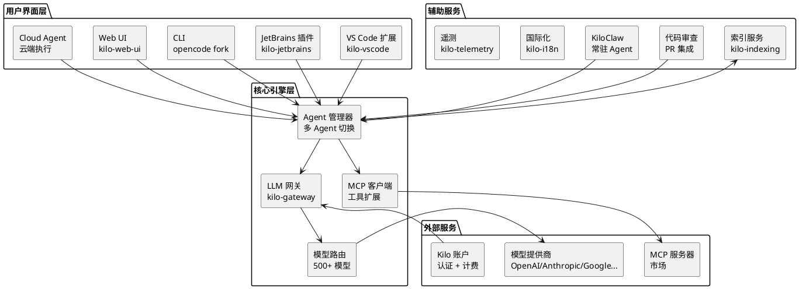

## Kilo Code：开源的多模型 AI 编码 Agent 平台

> *"你不需要另一个 AI 编码工具，你需要一个可以换模型的 AI 编码工具。"*

## 它要解决什么问题

当前 AI 编码工具的商业模式有两种：要么绑定单一模型提供商（Cursor 绑定 Claude/GPT，Windsurf 绑定自研模型），要么让你自带 API key 但界面体验粗糙。

绑定单一模型的问题是：不同任务适合不同模型。复杂的架构设计用 Opus 级别模型，简单的变量重命名用 Haiku 级别模型就够了。但绑定模型的工具不允许你按需选择，你只能接受工具预设的模型。

自带 key 的问题是：你需要手动管理每个提供商的 API key，配置繁琐，而且多数工具在不同模型之间切换时需要重新配置。

Kilo Code 的做法是：**开源、多模型、零加价**。你注册 Kilo 账户后可以使用 500+ 模型（包括 GPT-5.5、Claude Opus 4.7、Gemini 3.1 Pro 等），按提供商原价计费，Kilo 不加价。你也可以中途切换模型——同一个任务，开始用 Opus 做架构设计，切到 Haiku 做批量重构。

## 项目概览

| 项目 | 值 |
|------|-----|
| 仓库 | [Kilo-Org/kilocode](https://github.com/Kilo-Org/kilocode) |
| Stars | 22.2k（截至 2026-06-19） |
| 许可证 | MIT |
| 语言 | TypeScript（monorepo，bun + turbo） |
| 最新版本 | v7.3.46（2026-06-15） |
| 核心架构 | Monorepo：VS Code 扩展 + JetBrains 插件 + CLI + 网关 |
| 来源 | OpenCode 的 fork，增加了 Kilo 平台集成 |
| 支持模型 | 500+（GPT-5.5、Claude Opus 4.7、Gemini 3.1 Pro 等） |

## 核心设计



Kilo 的架构是一个典型的 monorepo，核心在 `packages/` 目录下：

- `kilo-vscode/` — VS Code 扩展（用户最多）
- `kilo-jetbrains/` — JetBrains 原生插件
- `opencode/` — CLI 实现（fork 自 OpenCode）
- `kilo-gateway/` — LLM 网关（模型路由、认证、计费）
- `kilo-ui/` — 共享 UI 组件
- `kilo-web-ui/` — Web 界面
- `kilo-indexing/` — 代码索引服务
- `sdk/` — 插件 SDK

### 机制 1：5 种专用 Agent

Kilo 的一个核心设计是**按任务类型切换 Agent**，而不是一个通用 Agent 做所有事：

| Agent | 职责 | 触发场景 |
|-------|------|---------|
| **Code** | 默认，生成和编辑代码 | "实现这个功能" |
| **Plan** | 架构设计和实现计划 | "设计这个系统的架构" |
| **Ask** | 只读问答，不修改文件 | "这个函数做什么？" |
| **Debug** | 问题追踪和诊断 | "为什么这个测试失败？" |
| **Review** | 代码审查（性能/安全/风格/测试覆盖） | "审查这个 PR" |

这个设计的逻辑是：**不同任务需要不同的系统提示和工具权限**。Ask Agent 不应该有文件编辑权限（避免意外修改），Code Agent 不需要代码审查提示词。通过预定义角色，减少提示词污染，提高每个任务的执行质量。

用户也可以创建自定义 Agent，定义自己的系统提示和工具权限。

### 机制 2：模型路由与中途切换

Kilo 的 `kilo-gateway` 是一个 LLM 代理层，所有模型请求通过它路由到对应的提供商。这带来两个好处：

1. **统一认证**：用户只需要 Kilo 账户，不需要分别注册 OpenAI、Anthropic、Google 的账号
2. **中途切换**：同一个会话中，可以根据任务阶段选择不同模型

```
任务：重构用户模块
  ├─ 阶段 1（架构设计）：Claude Opus 4.7（推理能力强）
  ├─ 阶段 2（批量重命名）：Claude Haiku 4.5（便宜快速）
  └─ 阶段 3（代码审查）：GPT-5.5（审查提示词优化）
```

代价是中间多了一层代理，但 Kilo 声称按提供商原价计费，不加价——收入来源可能来自企业版服务或未来的增值服务。

### 机制 3：自主模式（CI/CD 集成）

```bash
kilo run --auto "run tests and fix any failures"
```

`--auto` 模式禁用所有权限确认，Agent 完全自主执行。这是为 CI/CD 管道设计的——在 GitHub Actions 中，Kilo 可以自动跑测试，发现失败后分析原因并修复，然后提交 PR。

这个模式的风险很明确：Agent 可以执行任何操作，不需要人工确认。文档里写了"Only use it in trusted environments"，这不是一个可以在生产环境直接开放的功能，更适合在 staging 分支或 CI 隔离环境中使用。

## 5 分钟上手

### VS Code

```bash
# 从市场安装
# 在 VS Code 中搜索 "Kilo Code" 并安装
# 或者直接：
code --install-extension kilocode.Kilo-Code
```

### CLI

```bash
# npm
npm install -g @kilocode/cli

# 或 curl
curl -fsSL https://kilo.ai/cli/install | bash

# 或 Homebrew
brew install Kilo-Org/tap/kilo

# 启动
cd your-project
kilo
```

### JetBrains

`Settings → Plugins` 搜索 "Kilo Code" 安装。

### 基本使用

安装 VS Code 扩展后：
1. 打开命令面板（Cmd+Shift+P），搜索 "Kilo Code: Open"
2. 登录 Kilo 账户（或配置自有 API key）
3. 选择 Agent（Code/Plan/Ask/Debug/Review）
4. 在输入框中描述任务

切换模型：在聊天界面顶部有模型选择器，随时可以切换。

## 项目结构（monorepo）

```
packages/
├── kilo-vscode/       # VS Code 扩展入口
├── kilo-jetbrains/    # JetBrains 插件
├── opencode/          # CLI 核心（fork 自 OpenCode）
├── kilo-gateway/      # LLM 网关（认证、路由、计费）
├── kilo-ui/           # 共享 UI 组件
├── kilo-web-ui/       # Web 界面
├── kilo-indexing/     # 代码索引
├── kilo-i18n/         # 国际化
├── kilo-telemetry/    # 遥测
├── kilo-console/      # 控制台输出
├── kilo-docs/         # 文档站
├── core/              # 核心逻辑（Agent 管理、工具系统）
├── containers/        # 容器相关
├── extensions/        # 扩展机制
├── plugin/            # 插件系统
├── sdk/               # 插件 SDK
├── llm/               # LLM 客户端抽象
└── http-recorder/     # HTTP 请求录制（测试用）
```

## 和其他方案的对比

| 维度 | Kilo Code | Cursor | Claude Code | Aider |
|------|-----------|--------|-------------|-------|
| 开源 | MIT | 否 | 否 | MIT |
| 模型选择 | 500+（通过 Kilo 账户） | 有限（Claude/GPT） | 仅 Claude | 自带 key（多家） |
| 中途换模型 | 支持 | 不支持 | 不支持 | 需要重启 |
| 价格 | 提供商原价 | 订阅制（含加价） | Anthropic 定价 | 自带 key，无平台费 |
| IDE 支持 | VS Code + JetBrains + CLI | VS Code fork | CLI | CLI + IDE 插件 |
| 代码审查 | 内置（PR 集成） | 有限 | 内置 | 无 |
| CI/CD 自主模式 | `kilo run --auto` | 无 | `claude --dangerously-skip-permissions` | 有 |

Kilo 和 Cursor 的核心差异在于**开放性**。Cursor 是一个完整的产品，模型选择和定价由 Cursor 控制；Kilo 是一个开源平台，模型通过网关路由，用户可以自带 key 或用 Kilo 账户。

Kilo 和 Claude Code 的差异在于**模型多样性**。Claude Code 只能用 Claude 模型，但 Kilo 可以用任何提供商的模型。如果你需要深度使用 Claude 的特定能力（如 extended thinking），Claude Code 的原生支持会更完整；如果你想在成本和性能之间灵活权衡，Kilo 的多模型路由更有优势。

## 设计上的权衡

| 决策 | 得到的 | 失去的 |
|------|--------|--------|
| fork OpenCode 而非从头开始 | 快速起步，复用成熟 CLI 实现 | 继承了 OpenCode 的架构包袱 |
| 通过网关统一管理模型 | 用户体验统一、支持中途切换 | 中间多一层，延迟和故障点增加 |
| 5 种预定义 Agent 角色 | 提示词精准、权限隔离 | 不如单 Agent 灵活（跨角色任务需要切换） |
| 不加价（按提供商原价） | 用户成本透明 | 盈利依赖企业版或增值服务 |
| monorepo（turbo + bun） | 跨包代码共享方便 | 构建系统复杂，新人贡献门槛高 |

## 适用场景与边界

| 场景 | 推荐？ | 原因 |
|------|--------|------|
| 需要在多个模型间灵活切换 | 强烈推荐 | 这是 Kilo 的核心优势 |
| VS Code / JetBrains 用户 | 推荐 | 原生扩展体验好 |
| 需要 CI/CD 集成 | 推荐 | `kilo run --auto` 原生支持 |
| 深度依赖 Claude 特定能力 | 可选 | Claude Code 的原生支持更完整 |
| 预算敏感、需要成本控制 | 推荐 | 按使用量计费，没有月费锁定 |
| 需要 JetBrains 原生体验 | 推荐 | 目前少数支持 JetBrains 的 AI Agent |

## 参考链接

- [GitHub 仓库](https://github.com/Kilo-Org/kilocode)
- [官方网站](https://kilo.ai)
- [文档](https://kilo.ai/docs)
- [VS Code 市场](https://marketplace.visualstudio.com/items?itemName=kilocode.Kilo-Code)
- [Discord 社区](https://kilo.ai/discord)
