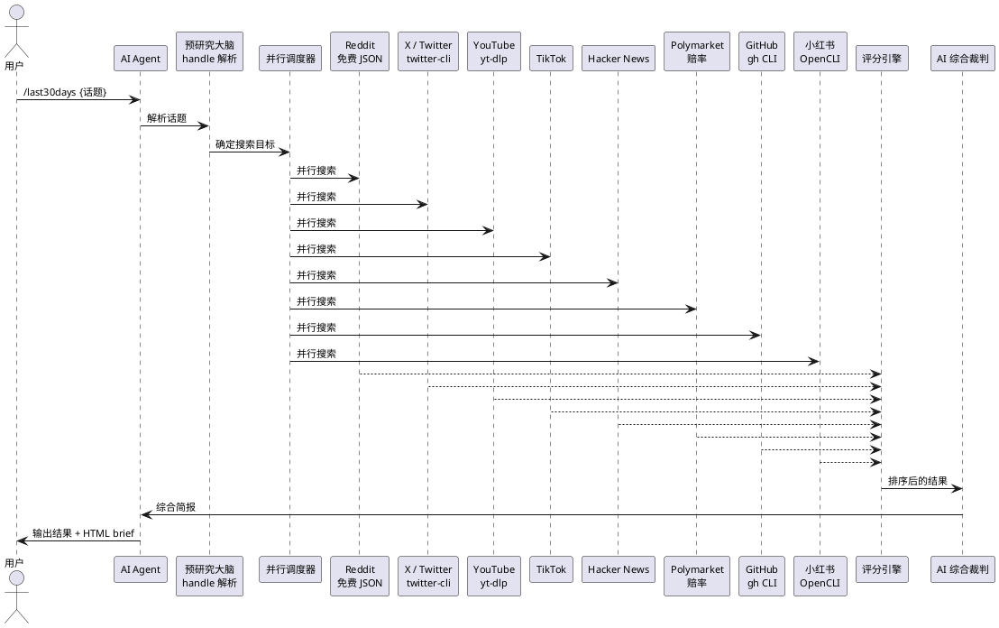

## last30days-skill：让 AI Agent 搜遍全网社交平台，用真人互动数据打分

你让 AI Agent 帮你调研一个人或一个话题，它能做什么？Google 搜一下？那得到的是 2023 年的 LinkedIn 和几篇 SEO 文章。Reddit 上的人怎么说？X 上有什么讨论？YouTube 有没有深度评测？Polymarket 上的预测赔率是多少？

每个平台都是一座围城——自己的 API、自己的认证、自己的反爬。ChatGPT 和 Reddit 有合作但搜不了 X，Gemini 有 YouTube 但没 Reddit，Claude 原生一个都没有。

last30days-skill 的做法是：一个 Agent 技能，并行搜索 14+ 个平台，用真人投票、点赞、真金白银的下注来评分，然后让 AI 裁判综合成一份简报。

43.3k stars，零配置即可使用 Reddit、HN、Polymarket 和 GitHub。配好 Cookie 后还能解锁 X、YouTube、TikTok、小红书。

## 项目概览

| 项目 | 值 |
|------|-----|
| 仓库 | [mvanhorn/last30days-skill](https://github.com/mvanhorn/last30days-skill) |
| Stars | 43.3k（截至 2026-06-16） |
| 许可证 | MIT |
| 语言 | Python |
| 最新版本 | v3.3.0（2026-05-17） |
| 架构 | AI Agent 技能 + 多平台搜索引擎 + 评分裁判系统 |

## 核心设计



### 关键机制 1：预研究大脑

v3 的核心改进是搜索前先"理解"你的话题。不是拿关键词直接去搜，而是先用一个 Python 预研究模块解析话题：

```
"Peter Steinberger"
  → @steipete (X)
  → steipete (GitHub)  
  → r/ClaudeCode, r/openclaw (Reddit)
  → 相关 YouTube 频道和 TikTok 标签
```

这个解析是双向的：人名 → 公司 → 产品 → GitHub → 社交媒体。搜索还没开始，引擎已经知道该去哪些平台、找哪些账号、搜哪些社区。

### 关键机制 2：社交相关性评分

Google 用 PageRank 评分——编辑和站长投票。last30days 用**真人互动**评分：

| 平台 | 信号 | 权重逻辑 |
|------|------|---------|
| Reddit | upvotes + 评论数 | 1500 upvotes > 没人读的博客 |
| X / Twitter | likes + retweets | 专家 thread > 新闻稿 |
| YouTube | 观看量 + 转录引用 | 45 分钟深度评测按引用密度提取关键句 |
| TikTok | 播放量 + 评论 | 3.6M 播放 = 文化信号 |
| Polymarket | 赔率 + 下注量 | 真金白银 > 专家猜测 |
| GitHub | star 增速 + PR 合并率 | 实时 API 数据，非过期文章 |

一个 Reddit 帖子 1500 票比一篇没人读的博客更有信息量。Polymarket 上 96% 的赔率比专栏作家的猜测更难反驳。

### 关键机制 3：跨平台聚合去重

同一条消息出现在 Reddit、X 和 YouTube 上时，v3 引擎会把它们合并成一个 cluster，而不是展示三条重复内容。基于实体的重叠检测，即使标题用了不同的词也能匹配。

## 5 分钟上手

### 安装（Claude Code）

```bash
/plugin marketplace add mvanhorn/last30days-skill
/plugin install last30days
```

### 安装（Cursor / Copilot / Gemini CLI 等）

```bash
npx skills add mvanhorn/last30days-skill -g
```

### 基本使用

```
/last30days Peter Steinberger
```

开会前调研一个人：他最近加入了 OpenAI 的 Codex 团队、在 X 上和 Anthropic 的第三方 Agent 禁令争论、GitHub 上 23 个 PR 以 85% 合并率合入、r/ClaudeCode 有 569 票的帖子讨论他是不是英雄。这些在 Google 和 LinkedIn 上都找不到。

```
/last30days OpenClaw vs Hermes vs Paperclip
```

对比工具：v3 单次 pass 同时搜索两个实体，3 分钟出结果（v2 串行要 12 分钟）。

```
/last30days Universal Epic Universe
```

旅行前调研：哪个项目在建、哪个项目停运、排队时间多长、当地人怎么看年卡政策。

### HTML Brief

```
/last30days OpenClaw --emit=html
```

生成一个自包含的 HTML 文件：暗色主题、打印友好、可离线查看。可以直接丢到 Slack、邮件或 Notion 里。

## 和其他方案的对比

| 维度 | last30days | Google | ChatGPT with browsing | Perplexity |
|------|-----------|--------|----------------------|------------|
| 数据源 | 14+ 社交平台并行 | 网页 | 网页 + Reddit（独家） | 网页 + 引用 |
| 评分依据 | 真人互动量 | PageRank | 编辑选择 | 编辑选择 |
| X / Twitter | 支持 | 不索引实时推文 | 不支持 | 不支持 |
| TikTok / 小红书 | 支持 | 不索引 | 不支持 | 不支持 |
| Polymarket 赔率 | 支持 | 不支持 | 不支持 | 不支持 |
| GitHub 实时数据 | 支持 | 缓存 | 不支持 | 不支持 |
| 价格 | 免费（Reddit/HN/GitHub）| 免费 | 付费 | 付费 |

last30days 的核心差异在于：它不是又一个搜索引擎，而是**一座桥**。把十几个互不相通的社交平台桥接起来，让一个 AI Agent 能同时搜索、统一评分、综合输出。

## 设计上的权衡

| 决策 | 得到的 | 失去的 |
|------|--------|--------|
| 社交平台 Cookie 认证 | 解锁 X/小红书/Reddit 等付费 API 才能拿到的数据 | 需要用户手动导出 Cookie |
| Python 引擎 + AI 裁判分离 | 引擎可独立运行和测试 | 需要 LLM 调用，有 API 成本 |
| 评分基于互动量而非编辑质量 | 反映真实关注度 | 高互动不等于高质量（标题党也能拿高票） |
| 14+ 平台并行搜索 | 速度快、覆盖广 | 单个平台故障可能影响整体延迟（有 timeout 预算缓解） |

## 适用场景与边界

| 场景 | 推荐？ | 原因 |
|------|--------|------|
| 会议前调研对方背景 | 强烈推荐 | 比 LinkedIn 实时 10 倍 |
| 技术选型前看社区反馈 | 推荐 | Reddit + HN + GitHub 数据最真实 |
| 竞品对比 | 推荐 | 单次 pass 并行对比，自动发现竞品 |
| 学术调研 | 不推荐 | 社交平台数据不适合学术场景 |
| 实时新闻 | 部分推荐 | 覆盖社交平台但不替代专业新闻源 |

## 参考链接

- [GitHub 仓库](https://github.com/mvanhorn/last30days-skill)
- [v3 更新日志](https://github.com/mvanhorn/last30days-skill/blob/main/CHANGELOG.md)
- [Agent Skills 生态](https://agentskills.io)
