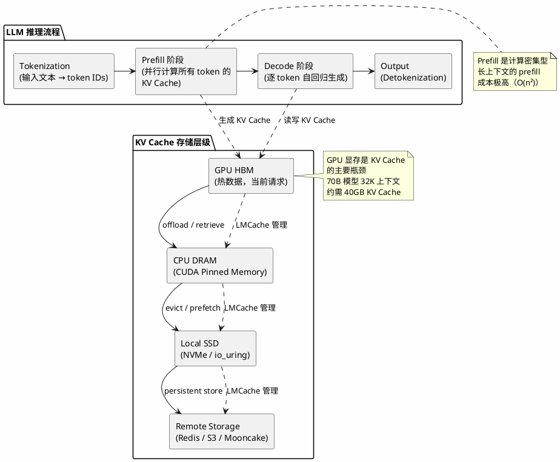

## 简介

LLM 推理中的 KV Cache 是 Transformer 自回归生成的核心数据结构——它缓存每一层 Attention 已经计算过的 Key 和 Value 张量，避免重复计算。但当上下文变长、并发变高时，KV Cache 本身会成为显存瓶颈和性能瓶颈。LMCache（GitHub 9.2k stars，Apache 2.0 协议，最新 v0.4.7）是一个独立于推理引擎的 KV Cache 管理层，目标是将 KV Cache 从"临时状态"变成可持久化、可复用、可观测、可变换的"AI-native 知识"。

本文从 KV Cache 的基本原理出发，分析 LMCache 的设计选择和实现机制。

---

## 项目概览

| 属性 | 详情 |
|------|-----|
| GitHub | [LMCache/LMCache](https://github.com/LMCache/LMCache) |
| Stars | 9.2k |
| 语言 | Python + C++/CUDA/ROCm kernels |
| 协议 | Apache 2.0 |
| 最新版本 | v0.4.7（2026-06-13） |
| 创建时间 | 2024-05-28 |
| 维护方 | 社区驱动，部分由 Tensormesh 支持 |
| 硬件支持 | NVIDIA CUDA、AMD ROCm、Moore Threads MUSA、Ascend |
| 引擎集成 | vLLM（主要）、NVIDIA Dynamo |
| 存储后端 | CPU RAM、SSD、Redis/Valkey、Mooncake、InfiniStore、S3、NIXL、GDS、Cloud Bigtable |
| 论文 | arXiv:2510.09665 |
| PyTorch 生态 | 2025/10 加入 PyTorch Foundation |

---

## KV Cache 在 LLM 推理中的位置

理解 LMCache 解决什么问题，需要先理解 KV Cache 在推理流程中的位置。



LLM 推理分为两个阶段：Prefill 处理整个输入 prompt，并行计算所有 token 在各层的 KV 表示，计算复杂度与序列长度的平方成正比；Decode 阶段逐个生成输出 token，每生成一个 token 都需要读取之前所有 token 的 KV Cache，此时推理变为访存密集型，瓶颈在于从显存中加载庞大的 KV 张量。对于 70B 参数模型、32K 上下文长度的场景，仅 KV Cache 就可能占用 40GB 以上的显存——这还没有算模型权重本身。

在单请求场景下，KV Cache 的生命周期与请求绑定，请求结束后即可释放。但在高并发服务场景中，大量请求共享相同的 system prompt、few-shot examples 或 RAG 文档前缀，每次都从头计算这些公共部分的 KV Cache 是巨大的浪费。更极端的情况是 Agentic 工作流：一个 Agent 任务可能包含十几轮对话，每轮的 system prompt 和工具定义完全相同，如果每次都要重新 prefill，计算成本线性增长。

LMCache 介入的位置是 GPU 显存之外的所有层级——它管理 KV Cache 从 GPU 到 CPU、SSD、远程存储的卸载（offload）和回取（retrieve），使得跨请求、跨实例的 KV Cache 复用成为可能。本质上，LMCache 将 KV Cache 从"请求级别的临时缓冲区"升级为"服务级别的可复用资产"。

---

## 架构与原理

### 引擎无关的独立进程架构

LMCache 采用 Multi-Process（MP）架构，以独立的 daemon 进程运行，与推理引擎（如 vLLM）进程分离。这是一个关键的架构选择：KV Cache 不与推理引擎共享生命周期。推理引擎崩溃重启后，之前缓存的 KV 数据不会丢失。

MP 架构通过 POSIX SHM（共享内存）和 CUDA IPC 实现 GPU/CPU 之间的高效数据传输。v0.4.7 新增了 `mp_transfer_mode` 配置和基于 SHM 的数据传输路径，进一步优化了进程间通信性能。

这种设计的代价是额外的序列化/反序列化和 IPC 开销。LMCache 通过自定义的 SERDE 接口和 CUDA kernel 来最小化这个开销，核心传输路径使用 C++/CUDA 实现而非纯 Python。

### 分层 KV Cache 卸载

LMCache 的核心能力是将 KV Cache 从 GPU 显存卸载到多级存储：

- **L0 GPU HBM**：当前正在使用的 KV Cache，零延迟访问
- **L1 CPU Pinned Memory**：通过 CUDA Pinned Memory 分配，PCIe 传输延迟
- **L2 Local SSD**：NVMe 存储，支持 io_uring 和 GDS（cuFile DMA）
- **L3 Remote Storage**：Redis/Valkey、S3 兼容对象存储、Mooncake、Cloud Bigtable 等

每一层都有独立的 eviction 策略。v0.4.7 引入了 bitmap-based prefetch 和 pluggable TrimPolicy，支持稀疏预取（Sparse Prefetch），可以根据访问模式智能决定哪些 KV block 需要提前加载回 GPU。

### 非前缀 KV 复用（CacheBlend）

传统的 prefix caching 只能复用 prompt 前缀相同的 KV Cache。LMCache 通过 CacheBlend 技术将复用范围扩展到 prompt 的任意位置。

CacheBlend 的原理是：当复用的 KV block 不连续时，选择性重算部分 token 来恢复生成质量。v0.4.7 中 CacheBlend 升级到 v3，支持 token-level matching 和 per-token slot scatter，可以处理非 block 对齐的 KV 复用场景。这对 RAG 工作负载尤其重要——不同文档片段的 KV Cache 可以被独立缓存和复用，无需完整前缀匹配。

### PD 分离与 KV Transfer

在 Prefill-Decode 分离（PD Disaggregation）架构中，Prefill 和 Decode 运行在不同的 GPU 实例上。LMCache 支持通过 NVLink、RDMA 或 TCP 将 Prefill 节点生成的 KV Cache 传输到 Decode 节点，传输层支持 NIXL 等协议。

v0.4.7 新增了 `multi_layer_block_kv_transfer` 统一传输原语，以及 NIXL DOCA_MEMOS（NVIDIA CMX）存储后端，进一步丰富了 PD 分离场景下的传输选项。

### 混合内存分配器（HMA）

v0.4.7 引入了 Hybrid Memory Allocator（HMA），支持为不同的模型层组（group）配置不同的 block size，并支持 per-group 的 `tokens_per_chunk` 和 `slots_per_chunk` 参数。这对混合架构模型尤其重要——例如 Qwen3.5 同时包含 Mamba 层和标准 Attention 层，Mamba 的 state 维度和 Attention 的 KV 维度完全不同，统一 block size 会导致严重的内存碎片和浪费。HMA 让每种层用最适合自己的粒度来管理缓存。

---

## 与其他推理优化方案的对比

LLM 推理优化是一个多层次的问题，KV Cache 管理只是其中一环。

| 优化方向 | 代表方案 | 作用层 | 与 LMCache 的关系 |
|---------|---------|--------|------------------|
| KV Cache 管理 | LMCache、PagedAttention (vLLM) | 内存/存储层 | LMCache 是引擎无关的外部管理层，vLLM 的 PagedAttention 是引擎内部分配 |
| KV Cache 压缩 | CacheGen、KIVI、KVQuant | 数据压缩 | LMCache 通过 SERDE 接口支持插件式压缩，CacheGen 是其团队的前置研究 |
| 量化推理 | GPTQ、AWQ、llama.cpp | 模型权重 | 与 LMCache 正交，可同时使用 |
| 投机解码 | Medusa、Eagle | 解码策略 | 与 LMCache 正交，投机解码减少 decode 步数，LMCache 减少 prefill 重复 |
| 算子优化 | FlashAttention、FlashDecoding | CUDA kernel | 与 LMCache 正交，FlashAttention 加速单次 attention 计算 |
| 调度优化 | continuous batching、chunked prefill | 请求调度 | 与 LMCache 互补，调度决定"先服务谁"，LMCache 减少每个请求的 prefill 成本 |
| 多模态缓存 | vLLM V1 multimodal | 输入处理 | LMCache v0.4.x 已支持多模态模型的 KV Cache 管理 |

---

## 设计权衡

| 设计选择 | 收益 | 代价 |
|---------|------|------|
| 独立进程（MP 架构） | KV Cache 不随引擎崩溃丢失；可跨引擎复用 | IPC 开销；部署复杂度增加 |
| 分层存储卸载 | 大幅扩展可用缓存容量；降低 GPU 显存压力 | CPU/SSD/远程存储的访问延迟远高于 GPU HBM |
| 非前缀复用（CacheBlend） | RAG 场景下缓存命中率显著提高 | 需要额外重算部分 token；实现复杂度高 |
| PD 分离 + KV Transfer | 异构硬件利用；Prefill/Decode 独立扩缩 | 引入网络传输延迟；需要额外的基础设施 |
| 自定义 C++/CUDA kernel | 核心路径性能最优 | 编译部署复杂；跨硬件适配成本高（CUDA/ROCm/MUSA） |
| 引擎无关设计 | 切换推理引擎时可复用已有 KV Cache | 需要为每个引擎开发适配层（connector） |

---

## 适用场景与局限

LMCache 的收益取决于「请求间能否复用 KV Cache」，因此场景差异很大：

- **收益显著**：长上下文多轮对话（历史轮次 KV 可复用）、RAG / 知识增强生成（文档片段 KV 独立缓存，CacheBlend 支持非前缀复用）、Agentic 工作流（system prompt 和工具描述 KV 可复用）。
- **收益中等偏高**：高并发在线服务（共享前缀的请求复用 KV，降低 TTFT）、多节点分布式推理（P2P CPU 内存共享和远程存储后端支持跨节点共享）。
- **收益有限**：短上下文单轮问答（prefill 成本本就低）、单次离线批处理（请求间无共享前缀，复用率低）。

---

## 快速上手

```bash
# 安装
pip install lmcache

# 与 vLLM 集成（MP 模式）
# 启动 LMCache daemon 后，vLLM 通过 connector 自动连接

# 运行内置 benchmark
python -m lmcache.server.server_bench --mode cpu --transfer-mode shm
```

更多配置选项和部署指南参考 [官方文档](https://docs.lmcache.ai/)。v0.4.7 新增了 MP Coordinator 和 CLI 工具，支持 quota 管理、L2  eviction 策略配置、运行时 DAX 热插拔等生产级功能。

---

## 小结

LMCache 的定位很明确：不做推理引擎，不做模型量化，不做调度——只做 KV Cache 的管理。这种专注让它能在不侵入推理引擎的前提下，提供分层卸载、跨请求复用、非前缀缓存、PD 分离传输等能力。独立进程架构带来了部署复杂度，但换来了引擎无关性和故障隔离。

从社区活跃度看（9.2k stars、1334 forks、v0.4.7 单次 release 包含 80+ PR），LMCache 已经从一个学术原型演变为生产级基础设施组件，被 NVIDIA Dynamo、Cohere 等采用，并加入了 PyTorch Foundation。如果你的场景需要优化长上下文推理性能或降低 prefill 计算成本，它是一个可以纳入技术选型的方案。

## 参考资料

- [GitHub 仓库](https://github.com/LMCache/LMCache)
- [官方文档](https://docs.lmcache.ai/)
- [论文 arXiv:2510.09665](https://arxiv.org/abs/2510.09665)
