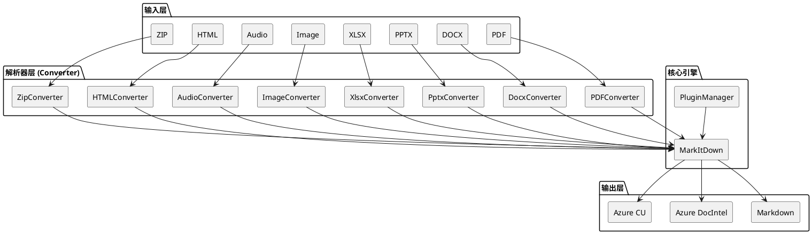

## 简介

MarkItDown 是微软 AutoGen 团队开发的文档转换工具，把 PDF、Word、PPT、Excel 等格式转成 Markdown。它的目标是**给机器消费**而非人类阅读：用最少的标记保留最多的结构信息。

在 LLM 时代这个需求很实用——Markdown 是 GPT-4o、Claude 等主流模型原生"说"的格式，token 效率高，又能保留文档结构（标题、列表、表格）。该项目有 153k stars，是 2026 年 GitHub 上增长最快的开源项目之一。

本文从安装使用到架构原理，完整拆解这个项目。

## 项目概览

| 属性 | 详情 |
|------|-----|
| 仓库 | [microsoft/markitdown](https://github.com/microsoft/markitdown) |
| Stars | 153k（截至 2026-06-14） |
| 许可证 | MIT |
| 语言 | Python |
| 维护团队 | AutoGen Team（微软） |
| 最新版本 | v0.1.6（2026-05-26） |
| 要求 | Python 3.10+ |

## 核心功能

MarkItDown 支持 **15+ 种输入格式**：

| 类别 | 格式 |
|------|------|
| Office | PDF、DOCX、PPTX、XLSX、XLS |
| 图片 | JPG、PNG（EXIF + OCR） |
| 音频 | WAV、MP3（元数据 + 转录） |
| 网页 | HTML |
| 结构化数据 | CSV、JSON、XML |
| 压缩包 | ZIP（递归遍历） |
| 视频 | YouTube URL（字幕提取） |
| 电子书 | EPUB |

除了内置转换，还支持两种云端模式：

- **Azure Document Intelligence**：保留版面布局
- **Azure Content Understanding**：多模态 + 结构化字段提取（YAML front matter）

## 快速上手

### 安装

```bash
# 全量安装（包含所有可选依赖）
pip install 'markitdown[all]'

# 按需安装（减小体积）
pip install 'markitdown[pdf]'        # 只装 PDF 支持
pip install 'markitdown[docx,pptx]'  # Word + PPT
```

可选依赖组包括 `[pdf]`、`[docx]`、`[pptx]`、`[xlsx]`、`[xls]`、`[outlook]`、`[audio-transcription]`、`[youtube-transcription]`、`[az-doc-intel]`、`[az-content-understanding]`。

### CLI 使用

```bash
# 转换单个文件（输出到 stdout）
markitdown report.pdf

# 指定输出文件
markitdown report.pdf -o report.md

# 通过管道输入
cat report.pdf | markitdown

# 使用 Azure Document Intelligence
markitdown report.pdf -d -e "<endpoint>"

# 使用 Azure Content Understanding
markitdown report.pdf --use-cu --cu-endpoint "<endpoint>"
```

### Python API

```python
from markitdown import MarkItDown

md = MarkItDown()
result = md.convert("report.xlsx")
print(result.text_content)
```

#### 结合 LLM 做图片描述

```python
from markitdown import MarkItDown
from openai import OpenAI

client = OpenAI()
md = MarkItDown(llm_client=client, llm_model="gpt-4o")
result = md.convert("photo.jpg")
print(result.text_content)  # 返回 GPT-4o 生成的图片描述
```

#### 使用插件（如 OCR）

```python
from markitdown import MarkItDown
from openai import OpenAI

md = MarkItDown(
    enable_plugins=True,
    llm_client=OpenAI(),
    llm_model="gpt-4o",
)
result = md.convert("scanned-document.pdf")
```

### Docker 使用

```bash
docker build -t markitdown:latest .
docker run --rm -i markitdown:latest < report.pdf > output.md
```

## 架构与原理

MarkItDown 的架构可以用一句话概括：**格式特定的解析器 + 统一的 Markdown 输出接口**。



### 三种转换模式

| 模式 | 特点 | 适用场景 |
|------|------|---------|
| **Built-in** | 离线、本地、格式专用解析器 | 普通文档转换 |
| **Azure Document Intelligence** | 云端、保留版面 | 复杂排版 PDF |
| **Azure Content Understanding** | 云端多模态 + 结构化字段 | 需要 YAML front matter 的场景 |

### 插件系统

MarkItDown 的插件默认禁用，需要通过 `enable_plugins=True` 显式开启。插件可以：

- 添加新的格式支持
- 增强现有转换器（如 OCR）
- 集成外部服务（如 Azure）

官方提供的 `markitdown-ocr` 插件使用 LLM Vision API（GPT-4o）做图片文字提取，避免了本地部署 ML 模型的复杂性。

### 关键设计决策

**1. 为什么输出 Markdown 而非纯文本？**

Markdown 在"可读性"和"token 效率"之间取得了平衡。它保留了文档结构（标题层级、列表、表格），但标记远比 HTML 轻量。对 LLM 来说，Markdown 是最自然的输入格式之一。

**2. 为什么格式解析用多个独立库？**

每种文件格式都有自己的复杂性。PDF 有版面、字体、嵌入对象；DOCX 是 ZIP 包的 XML 集合；PPTX 涉及幻灯片和母版。用一个通用解析器处理所有格式，要么功能受限，要么代码臃肿。MarkItDown 选择为每种格式引入专用库（如 `python-docx`、`python-pptx`、`openpyxl`），通过可选依赖组按需安装。

**3. 为什么 OCR 用 LLM Vision 而非本地模型？**

本地 OCR 模型（如 Tesseract）需要额外安装二进制依赖，且对复杂版面效果有限。MarkItDown 的 OCR 插件直接调用 GPT-4o 的 Vision 能力，零本地依赖，效果更好。代价是需要 API key 和网络。

## 适用场景与局限

### 适用场景

- **RAG 管线**：把企业知识库（PDF/DOCX/PPT）统一转成 Markdown 后入库
- **LLM 输入预处理**：把用户上传的任意文件转成 LLM 可处理的格式
- **文档搜索**：结合向量数据库，实现跨格式语义搜索
- **AutoGen / LangChain 集成**：作为 Agent 的工具使用

### 局限

- **不保留高保真版面**：复杂排版（多栏、嵌套表格）可能丢失细节
- **OCR 依赖外部 API**：内置 OCR 需要 OpenAI API key
- **大文件性能**：数百页的 PDF 转换可能较慢
- **不处理加密文件**：密码保护的文档需要先解密

## 参考资料

- 官方仓库：[microsoft/markitdown](https://github.com/microsoft/markitdown)
- PyPI：[markitdown](https://pypi.org/project/markitdown/)
- AutoGen 团队博客：[Introducing MarkItDown](https://devblogs.microsoft.com/ai-for-learning/introducing-markitdown/)
