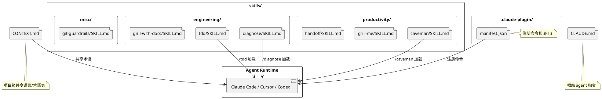

## 简介

AI 编码助手（Claude Code、Cursor、Copilot）正在改变程序员的工作方式。但一个明显的问题是：AI 倾向于"vibe coding"——氛围到了就写，缺乏工程纪律。它会跳过需求澄清、忘记写测试、不做架构思考，直接输出看起来能跑的代码。

Matt Pocock（Total TypeScript 创始人）开源的 `skills` 项目试图解决这个问题。它不是一个框架，也不是一个工具，而是一组 **SKILL.md 文件**——每个文件是一条给 AI 的指令，告诉它"在 TDD 时应该先写失败测试再实现"、"在诊断 bug 时应该先复现再最小化再假设"。

128k stars，本质上是把《Pragmatic Programmer》《DDD》《Extreme Programming Explained》这些经典著作的工程智慧，翻译成了 AI 能直接执行的 prompt。

## 项目概览

| 项目 | 值 |
|------|-----|
| 仓库 | [mattpocock/skills](https://github.com/mattpocock/skills) |
| Stars | 128k（截至 2026-06-14） |
| 许可证 | MIT |
| 语言 | Shell（本质是 Markdown 指令集） |
| 维护者 | Matt Pocock（个人维护，94/102 commits） |
| 创建时间 | 2026-02-03 |
| 兼容 Agent | Claude Code、Cursor、Codex、任何支持 skill 协议的 agent |

## 核心功能

项目包含 **19 个技能**，分为三类：

### Engineering（工程类，10 个）

| 技能 | 用途 |
|------|------|
| `tdd` | 红-绿-重构的测试驱动开发循环 |
| `diagnose` | 纪律化的 bug/性能回归诊断：复现 → 最小化 → 假设 → 插桩 → 修复 → 回归测试 |
| `grill-with-docs` | 面试式需求澄清，同时更新 CONTEXT.md 和 ADR |
| `triage` | 通过状态机处理 issue triage |
| `improve-codebase-architecture` | 发现代码库的"深化"机会，对抗"泥球"架构 |
| `to-issues` | 把计划/PRD 拆成 GitHub issues（垂直切片） |
| `to-prd` | 把当前对话综合成 PRD 并提交为 GitHub issue |
| `zoom-out` | 让 agent 对陌生代码段给出更宏观的上下文 |
| `prototype` | 构建一次性原型来验证设计 |
| `setup-matt-pocock-skills` | 每个仓库运行一次的配置脚手架 |

### Productivity（效率类，5 个）

| 技能 | 用途 |
|------|------|
| `caveman` | 超压缩沟通模式，token 消耗降低约 75% |
| `grill-me` | 对计划/设计进行无情面试，直到决策树每个分支都厘清 |
| `handoff` | 把当前对话压缩成交接文档，便于另一个 agent 接手 |
| `teach` | 跨多个 session 教用户新技能 |
| `write-a-skill` | 创建结构良好的新 skill |

### Misc（杂项，4 个）

| 技能 | 用途 |
|------|------|
| `git-guardrails-claude-code` | 通过 hooks 拦截危险 git 命令 |
| `migrate-to-shoehorn` | 迁移测试中的 `as` 断言到 shoehorn |
| `scaffold-exercises` | 创建练习目录 |
| `setup-pre-commit` | 配置 Husky + lint-staged + pre-commit hooks |

## 快速上手

### 安装（30 秒）

```bash
npx skills@latest add mattpocock/skills
```

安装器会引导选择需要的 skill 和目标 coding agent。完成后在 agent 中运行 `/setup-matt-pocock-skills`，它会：

1. 询问使用的 issue tracker（GitHub / Linear / 本地文件）
2. 询问 triage 标签词汇
3. 询问文档保存位置

### 使用

安装后，在 Claude Code 中直接用斜杠命令调用：

```text
/tdd          # 启动 TDD 循环
/diagnose     # 启动 bug 诊断流程
/grill-me     # 让 agent 面试你的计划
/caveman      # 进入压缩沟通模式
/handoff      # 生成交接文档
```

## 架构与原理

### 技术实现的极简性

整个项目的"代码"本质就是 **Markdown 文件 + Shell 安装脚本**。



每个 SKILL.md 文件的内容是一份**给 AI 的系统提示词扩展**。以 `tdd/SKILL.md` 为例，它大致描述了：

1. 必须先写一个失败的测试
2. 再写最少的代码让测试通过
3. 然后重构，保持测试通过
4. 循环直到功能完成

这些指令被 Claude Code 加载后，会成为 agent 行为的一部分。

### 安装器原理

`npx skills` CLI 的工作流程：

```text
1. 扫描仓库中的 skills/ 目录
2. 列出所有可用的 skill
3. 让用户选择要安装哪些
4. 将选中的 skill 复制到目标项目的 .claude/skills/ 目录
5. 注册 .claude-plugin/manifest.json
```

对于 Cursor 用户，skill 文件会被写入 `.cursor/rules/` 目录。

### CONTEXT.md 的设计

受 DDD（领域驱动设计）中"ubiquitous language"的启发，`CONTEXT.md` 是项目级的术语表。它让 agent 用项目自己的语言来思考和沟通，而不是通用的技术词汇。

例如，在一个电商项目中：

```markdown
## 共享语言

- **SKU**：库存单位，每个商品变体有唯一 SKU
- **Fulfillment**：从下单到发货的完整流程
- **Backorder**：库存为零但允许下单的状态
```

有了这个文件，agent 在写代码时会使用这些术语，而不是自己发明词汇。

### 关键设计决策

**1. 为什么反对 GSD / BMAD / Spec-Kit？**

Matt Pocock 在 README 中明确表达了他的立场：这些框架"接管流程"的思路会让开发者失去控制权。当框架本身有 bug 或者不适合你的项目时，你很难修改它。而 SKILL.md 是纯文本，你可以直接编辑。

**2. 为什么用 Markdown 而不是代码？**

Markdown 是 AI 最容易理解和执行的格式。它不需要运行时，不需要依赖，不需要编译。一个 SKILL.md 文件就是一条清晰的指令。

**3. 为什么强调"面试式澄清"（grill-me）？**

这是整个项目的核心技能之一。核心思想是：在动手写代码之前，让 agent 反问你，把需求、边界条件、决策树全部问清楚。这比"直接开干然后返工"高效得多。

## 适用场景与局限

### 适用场景

- **严肃的工程团队**：希望 AI 编码助手遵循工程纪律
- **TDD 实践者**：让 agent 自动执行红-绿-重构循环
- **需求不清晰的项目**：用 grill-me 先澄清再动手
- **大型代码库**：用 CONTEXT.md 建立共享语言，降低 agent 的理解成本

### 局限

- **模型无关但有差异**：虽然声称对所有 agent 通用，但不同 agent 对 skill 协议的支持程度不同
- **个人维护**：94/102 commits 来自 Matt Pocock 一人，长期可持续性存疑
- **学习曲线**：需要了解每个 skill 的用途和最佳使用时机
- **非万能药**：skill 能规范 agent 行为，但不能替代工程师的判断

## 参考资料

- 官方仓库：[mattpocock/skills](https://github.com/mattpocock/skills)
- Matt Pocock 的 Twitter：[@mattpocock](https://x.com/mattpocock)
- Total TypeScript：[totaltypescript.com](https://www.totaltypescript.com/)
- 安装器源码：[vercel-labs/agent-skills](https://github.com/vercel-labs/agent-skills)
