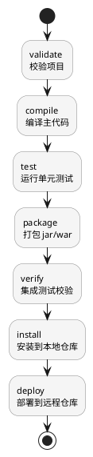
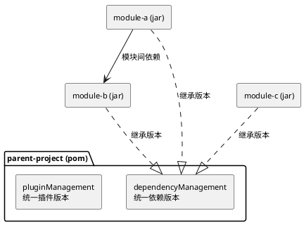

## 简介

Maven 是 Apache 开源的 Java 项目管理和构建工具，基于项目对象模型（POM）管理项目的构建、依赖和文档。本文覆盖安装配置、项目结构、常用命令、依赖管理和多模块项目这些日常使用场景。

几个核心概念：

- **POM (Project Object Model)**：项目对象模型，定义在 `pom.xml` 中
- **坐标 (Coordinates)**：`groupId` + `artifactId` + `version` 唯一标识一个项目
- **仓库 (Repository)**：存储构件的地方，分本地仓库和远程仓库
- **生命周期 (Lifecycle)**：定义构建过程的阶段
- **插件 (Plugin)**：执行具体构建任务的单元
- **依赖 (Dependency)**：项目所需的外部库

Maven 的命令都挂在三套生命周期的「阶段」上，执行某个阶段会自动执行它之前的所有阶段。最常用的 `default` 生命周期主要阶段如下：



执行 `mvn install` 会自动跑完 validate 到 install 的全部阶段；`mvn clean package` 则先清理再打包。理解这一点，后面的命令就不用死记。

## 安装配置

### 安装要求

- JDK 8 或更高版本
- 设置 `JAVA_HOME` 环境变量

### 安装步骤

**macOS (使用 Homebrew)**

```bash
brew install maven
```

**Linux (Ubuntu/Debian)**

```bash
sudo apt update
sudo apt install maven
```

**Windows**

1. 下载 [Maven 二进制包](https://maven.apache.org/download.cgi)
2. 解压到指定目录
3. 添加 `MAVEN_HOME` 环境变量
4. 将 `%MAVEN_HOME%\bin` 添加到 `PATH`

### 验证安装

```bash
mvn -version
```

### 配置镜像

国内用户建议配置阿里云镜像加速，编辑 `~/.m2/settings.xml`：

```xml
<settings>
  <mirrors>
    <mirror>
      <id>aliyun</id>
      <name>Aliyun Maven Mirror</name>
      <url>https://maven.aliyun.com/repository/public</url>
      <mirrorOf>central</mirrorOf>
    </mirror>
  </mirrors>
</settings>
```

## 项目结构

Maven 标准目录结构：

```text
my-project/
├── pom.xml                 # 项目配置文件
├── src/
│   ├── main/
│   │   ├── java/          # 主代码目录
│   │   ├── resources/     # 主资源目录
│   │   └── webapp/        # Web 应用目录（WAR 项目）
│   └── test/
│       ├── java/          # 测试代码目录
│       └── resources/     # 测试资源目录
└── target/                # 构建输出目录
```

## 常用命令

### 项目创建

```bash
# 创建普通 Java 项目
mvn archetype:generate -DgroupId=com.example -DartifactId=my-app -DarchetypeArtifactId=maven-archetype-quickstart -DinteractiveMode=false

# 创建 Web 项目
mvn archetype:generate -DgroupId=com.example -DartifactId=my-webapp -DarchetypeArtifactId=maven-archetype-webapp -DinteractiveMode=false
```

### 构建命令

```bash
# 编译项目
mvn compile

# 打包项目（生成 jar/war）
mvn package

# 清理构建产物
mvn clean

# 清理并打包
mvn clean package

# 安装到本地仓库
mvn install

# 部署到远程仓库
mvn deploy
```

### 测试命令

```bash
# 运行测试
mvn test

# 跳过测试
mvn package -DskipTests

# 跳过测试编译和执行
mvn package -Dmaven.test.skip=true
```

### 依赖管理

```bash
# 查看依赖树
mvn dependency:tree

# 分析依赖
mvn dependency:analyze

# 下载依赖源码
mvn dependency:sources

# 查看有效 POM
mvn help:effective-pom
```

### 其他常用命令

```bash
# 查看项目信息
mvn project-info-reports:dependencies

# 生成项目站点
mvn site

# 验证项目
mvn validate

# 只编译，不打包
mvn compile

# 只编译测试代码
mvn test-compile
```

## pom.xml 配置

### 基本结构

```xml
<?xml version="1.0" encoding="UTF-8"?>
<project xmlns="http://maven.apache.org/POM/4.0.0"
         xmlns:xsi="http://www.w3.org/2001/XMLSchema-instance"
         xsi:schemaLocation="http://maven.apache.org/POM/4.0.0 
         http://maven.apache.org/xsd/maven-4.0.0.xsd">
  <modelVersion>4.0.0</modelVersion>

  <groupId>com.example</groupId>
  <artifactId>my-project</artifactId>
  <version>1.0.0-SNAPSHOT</version>
  <packaging>jar</packaging>

  <name>My Project</name>
  <description>A sample Maven project</description>

  <properties>
    <maven.compiler.source>17</maven.compiler.source>
    <maven.compiler.target>17</maven.compiler.target>
    <project.build.sourceEncoding>UTF-8</project.build.sourceEncoding>
  </properties>

  <dependencies>
    <!-- 依赖声明 -->
  </dependencies>

  <build>
    <plugins>
      <!-- 插件声明 -->
    </plugins>
  </build>
</project>
```

### 坐标说明

| 元素 | 说明 | 示例 |
|------|------|------|
| `groupId` | 组织/公司标识 | `com.example` |
| `artifactId` | 项目名称 | `my-project` |
| `version` | 版本号 | `1.0.0` |
| `packaging` | 打包类型 | `jar`、`war`、`pom` |

### 版本号规范

- **SNAPSHOT**：开发版本，如 `1.0.0-SNAPSHOT`
- **RELEASE**：正式版本，如 `1.0.0`
- **里程碑版本**：`1.0.0-alpha`、`1.0.0-beta`、`1.0.0-RC1`

## 依赖管理

### 依赖声明

```xml
<dependencies>
  <!-- 基本依赖 -->
  <dependency>
    <groupId>org.springframework.boot</groupId>
    <artifactId>spring-boot-starter-web</artifactId>
    <version>3.2.0</version>
  </dependency>

  <!-- scope: 依赖范围 -->
  <dependency>
    <groupId>junit</groupId>
    <artifactId>junit</artifactId>
    <version>4.13.2</version>
    <scope>test</scope>
  </dependency>

  <!-- optional: 可选依赖 -->
  <dependency>
    <groupId>org.projectlombok</groupId>
    <artifactId>lombok</artifactId>
    <version>1.18.30</version>
    <optional>true</optional>
  </dependency>

  <!-- exclusions: 排除传递依赖 -->
  <dependency>
    <groupId>com.example</groupId>
    <artifactId>some-lib</artifactId>
    <version>1.0.0</version>
    <exclusions>
      <exclusion>
        <groupId>org.slf4j</groupId>
        <artifactId>slf4j-log4j12</artifactId>
      </exclusion>
    </exclusions>
  </dependency>
</dependencies>
```

### 依赖范围

| Scope | 编译 | 测试 | 运行 | 打包 | 说明 |
|-------|------|------|------|------|------|
| `compile` | 是 | 是 | 是 | 是 | 默认范围 |
| `provided` | 是 | 是 | 否 | 否 | 容器提供，如 Servlet API |
| `runtime` | 否 | 是 | 是 | 是 | 只在运行时需要 |
| `test` | 否 | 是 | 否 | 否 | 只在测试时需要 |
| `system` | 是 | 是 | 否 | 否 | 需指定本地路径 |
| `import` | - | - | - | - | 用于依赖管理导入 |

### 依赖管理（dependencyManagement）

在父 POM 中统一定义依赖版本：

```xml
<dependencyManagement>
  <dependencies>
    <dependency>
      <groupId>org.springframework.boot</groupId>
      <artifactId>spring-boot-dependencies</artifactId>
      <version>3.2.0</version>
      <type>pom</type>
      <scope>import</scope>
    </dependency>
  </dependencies>
</dependencyManagement>
```

子模块使用时无需指定版本：

```xml
<dependencies>
  <dependency>
    <groupId>org.springframework.boot</groupId>
    <artifactId>spring-boot-starter-web</artifactId>
    <!-- 版本由父 POM 管理 -->
  </dependency>
</dependencies>
```

## 多模块项目

多模块项目用一个父 POM（`packaging` 为 `pom`）聚合多个子模块，统一管理依赖版本和插件配置，子模块之间也可以相互依赖：



### 父 POM

```xml
<project>
  <groupId>com.example</groupId>
  <artifactId>parent-project</artifactId>
  <version>1.0.0</version>
  <packaging>pom</packaging>

  <modules>
    <module>module-a</module>
    <module>module-b</module>
    <module>module-c</module>
  </modules>

  <properties>
    <java.version>17</java.version>
  </properties>

  <dependencyManagement>
    <!-- 统一依赖版本 -->
  </dependencyManagement>

  <build>
    <pluginManagement>
      <!-- 统一插件版本 -->
    </pluginManagement>
  </build>
</project>
```

### 子模块 POM

```xml
<project>
  <parent>
    <groupId>com.example</groupId>
    <artifactId>parent-project</artifactId>
    <version>1.0.0</version>
  </parent>

  <artifactId>module-a</artifactId>
  <packaging>jar</packaging>

  <dependencies>
    <dependency>
      <groupId>com.example</groupId>
      <artifactId>module-b</artifactId>
      <version>${project.version}</version>
    </dependency>
  </dependencies>
</project>
```

## 常用插件

### 编译插件

```xml
<build>
  <plugins>
    <plugin>
      <groupId>org.apache.maven.plugins</groupId>
      <artifactId>maven-compiler-plugin</artifactId>
      <version>3.11.0</version>
      <configuration>
        <source>17</source>
        <target>17</target>
        <encoding>UTF-8</encoding>
      </configuration>
    </plugin>
  </plugins>
</build>
```

### Spring Boot 打包插件

```xml
<build>
  <plugins>
    <plugin>
      <groupId>org.springframework.boot</groupId>
      <artifactId>spring-boot-maven-plugin</artifactId>
      <configuration>
        <excludes>
          <exclude>
            <groupId>org.projectlombok</groupId>
            <artifactId>lombok</artifactId>
          </exclude>
        </excludes>
      </configuration>
    </plugin>
  </plugins>
</build>
```

### 测试插件

```xml
<plugin>
  <groupId>org.apache.maven.plugins</groupId>
  <artifactId>maven-surefire-plugin</artifactId>
  <version>3.0.0</version>
  <configuration>
    <skipTests>false</skipTests>
    <includes>
      <include>**/*Test.java</include>
    </includes>
  </configuration>
</plugin>
```

### 代码生成插件

```xml
<!-- Lombok 注解处理 -->
<plugin>
  <groupId>org.apache.maven.plugins</groupId>
  <artifactId>maven-processor-plugin</artifactId>
  <version>3.3.3</version>
  <executions>
    <execution>
      <goals>
        <goal>process</goal>
      </goals>
    </execution>
  </executions>
  <dependencies>
    <dependency>
      <groupId>org.projectlombok</groupId>
      <artifactId>lombok</artifactId>
      <version>1.18.30</version>
    </dependency>
  </dependencies>
</plugin>
```

## 常见问题

### 依赖冲突

当出现依赖版本冲突时，使用 `dependency:tree` 分析：

```bash
# 查看完整依赖树
mvn dependency:tree

# 查看特定依赖的来源
mvn dependency:tree -Dincludes=groupId:artifactId

# 解决冲突：在 pom 中显式声明需要的版本
```

### 构建失败

```bash
# 强制更新 SNAPSHOT 依赖
mvn clean install -U

# 查看详细错误信息
mvn clean install -X

# 只编译不运行测试
mvn clean install -DskipTests
```

### 本地仓库问题

```bash
# 清理本地仓库中的特定依赖
rm -rf ~/.m2/repository/groupId/artifactId

# 更新依赖
mvn clean install -U
```

### 编码问题

在 `pom.xml` 中添加：

```xml
<properties>
  <project.build.sourceEncoding>UTF-8</project.build.sourceEncoding>
  <project.reporting.outputEncoding>UTF-8</project.reporting.outputEncoding>
</properties>
```

## 最佳实践

### 用 BOM 统一依赖版本

多个模块各自声明依赖版本，迟早会出现「同一个库在不同模块版本不一致」导致的诡异冲突。在父 POM 用 `dependencyManagement` 导入 BOM（Bill of Materials），子模块只写 `groupId` / `artifactId`，版本由 BOM 统一决定：

```xml
<dependencyManagement>
  <dependencies>
    <dependency>
      <groupId>org.springframework.boot</groupId>
      <artifactId>spring-boot-dependencies</artifactId>
      <version>3.2.0</version>
      <type>pom</type>
      <scope>import</scope>
    </dependency>
  </dependencies>
</dependencyManagement>
```

升级版本时只改一处，所有模块同步生效。生产环境锁定 RELEASE 版本，避免 SNAPSHOT 带来的构建不可重现。

### 定期清理依赖

依赖会随项目演进不断累积，未使用的依赖拖慢构建、增大包体积、扩大安全风险面。用 `dependency:analyze` 定期体检：

```bash
mvn dependency:analyze
# Used undeclared dependencies   → 实际用到但没显式声明的，应补上
# Unused declared dependencies   → 声明了但没用到的，应删除
```

「Used undeclared」尤其值得注意：你的代码依赖了某个传递进来的库，一旦上游依赖升级把它去掉，编译就会突然失败。

### 排查并排除传递依赖冲突

依赖冲突的根因是同一个库被多条路径传递进来，Maven 按「最短路径优先」仲裁，结果未必是你要的版本。先定位冲突来源：

```bash
# 查看某个库被哪些路径引入
mvn dependency:tree -Dincludes=org.slf4j:slf4j-api
```

确认要保留的版本后，在引入错误版本的依赖上用 `exclusions` 排除，再显式声明正确版本：

```xml
<dependency>
  <groupId>com.example</groupId>
  <artifactId>some-lib</artifactId>
  <exclusions>
    <exclusion>
      <groupId>org.slf4j</groupId>
      <artifactId>slf4j-log4j12</artifactId>
    </exclusion>
  </exclusions>
</dependency>
```

### 加速构建

大型多模块项目的全量构建很慢，两个常用手段：

```bash
# 多线程并行构建（每核一个线程）
mvn clean install -T 1C

# 只构建改动的模块及其下游（-am 连带构建依赖的模块）
mvn install -pl module-a -am
```

配合 `~/.m2/settings.xml` 配置国内镜像（见前文「配置镜像」），可显著减少依赖下载时间。

### 善用 properties 集中管理

把版本号、编码、JDK 版本等可变项抽到 `<properties>`，避免散落在各处难以维护：

```xml
<properties>
  <java.version>17</java.version>
  <project.build.sourceEncoding>UTF-8</project.build.sourceEncoding>
  <spring-boot.version>3.2.0</spring-boot.version>
</properties>
```

后续引用 `${spring-boot.version}`，升级时只改一处。

## 参考资料

- [Maven 官方文档](https://maven.apache.org/guides/)
- [Maven 中央仓库](https://search.maven.org/)
- [阿里云 Maven 镜像](https://maven.aliyun.com/mvn/guide)