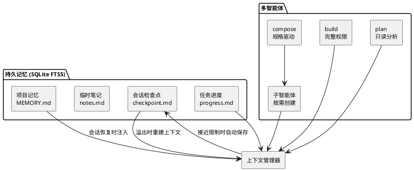

## 简介

MiMoCode 是小米 MiMo 团队开源的终端 AI 编程助手，基于 [OpenCode](https://github.com/anomalyco/opencode) fork 而来。核心特性是跨会话持久记忆和智能上下文管理。MIT 协议，支持接入任意 OpenAI 兼容 API。

## 项目概览

| 属性 | 详情 |
|------|-----|
| 仓库 | [XiaomiMiMo/MiMo-Code](https://github.com/XiaomiMiMo/MiMo-Code) |
| 许可证 | MIT |
| 基础 | fork 自 OpenCode |
| 维护方 | 小米 MiMo 团队 |
| 形态 | 终端 CLI |
| 模型接入 | 任意 OpenAI 兼容 API |
| 核心特性 | 跨会话持久记忆、智能上下文管理、多智能体 |

## 架构与原理

MiMoCode 的核心是「多智能体 + 四层持久记忆 + 上下文自动重建」三者协同——智能体共享会话上下文，记忆在会话间持久化，上下文溢出时自动从记忆重建：



## 核心功能

### 多智能体模式

按 `Tab` 切换三个主智能体：

- **build**：默认模式，拥有完整工具权限，用于日常开发
- **plan**：只读分析模式，用于代码探索和方案设计
- **compose**：编排模式，规格驱动开发，内置规划、执行、代码评审、TDD、调试等技能

系统会按需自动创建子智能体，共享当前会话上下文，可并行工作。

### 持久化记忆

基于 SQLite FTS5 全文搜索，分为四层：

- **项目记忆**（`MEMORY.md`）：项目知识、编码规范、架构决策，可通过 `/dream` 自动更新
- **会话检查点**（`checkpoint.md`）：由子智能体自动维护的结构化状态快照
- **临时笔记**（`notes.md`）：调试过程中的中间记录
- **任务进度**（`tasks/<id>/progress.md`）：每个任务的执行日志

会话恢复时自动注入记忆，无需重新交代项目背景。

### 智能上下文管理

- **自动检查点**：监测上下文使用量，在接近限制前自动保存状态
- **上下文重建**：溢出时从检查点 + 项目记忆 + 任务进度重建上下文
- **预算注入**：用 token 预算控制记忆内容进入上下文的量，按重要性排序

### 任务追踪与 Goal 控制

任务系统采用树形结构（`T1` → `T1.1`、`T1.2`），与检查点系统集成，会话恢复时任务状态完整保留。

`/goal` 命令设置会话停止条件。智能体尝试停止时，由独立的 judge 模型评估目标是否真正达成，避免自主工作时的过早停止。

### Dream & Distill

- **`/dream`**：扫描近期会话，提取持久知识写入项目记忆，清理过时条目
- **`/distill`**：发现重复的手动工作流，打包为可复用技能、子智能体或命令

### 其他功能

- **语音输入**（`/voice`）：TenVAD + MiMo ASR 驱动的实时流式语音输入
- **Max Mode**：配置中启用 `experimental.maxMode`，并行 best-of-N 推理 + judge 选择

## 快速上手

```bash
# 方式一
curl -fsSL https://mimo.xiaomi.com/install | bash

# 方式二
npm install -g @mimo-ai/cli
```

首次启动支持 MiMo Auto（限时免费通道）、小米 MiMo 平台 OAuth、从 Claude Code 导入配置、自定义 OpenAI 兼容 API 四种接入方式。

配置文件位置：项目级 `.mimocode/mimocode.json`，全局 `~/.config/mimocode/mimocode.json`，主要配置项包括 Provider/Model 选择、Agent 权限、Checkpoint 行为、MCP 服务器、Keybindings 和主题。

## 参考资料

- [MiMoCode GitHub 仓库](https://github.com/XiaomiMiMo/MiMo-Code)
- [MiMoCode 官网](https://mimo.xiaomi.com/en/mimocode)
- [OpenCode 原项目](https://github.com/anomalyco/opencode)
