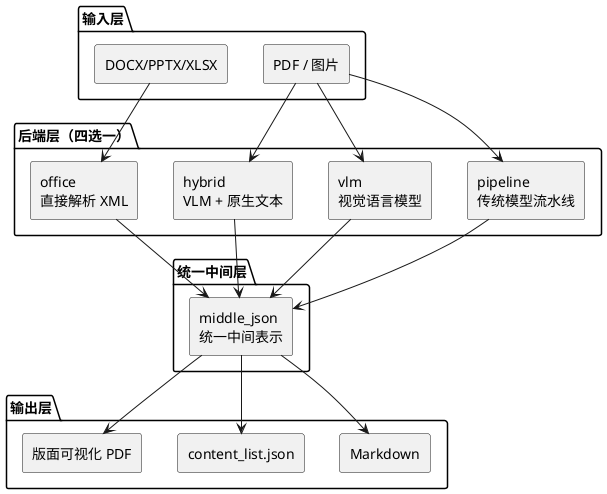
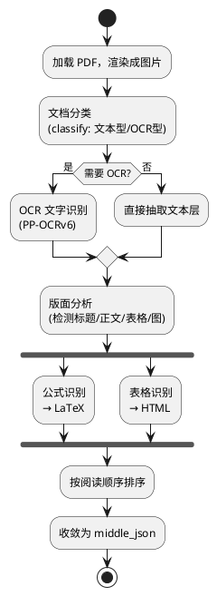

## 它要解决什么问题

RAG 和大模型预训练都绕不开同一个前置步骤：把人类格式的文档变成机器能读的纯文本。PDF 是这里最难啃的一块——它本质是「打印指令的集合」，描述的是「在坐标 (x, y) 画一个字符」，而不是「这是标题、那是表格的第三行」。阅读顺序、栏目划分、跨页表格、公式、图表标注，这些语义在 PDF 里全部丢失了。

直接用 `pdftext` 之类的工具抽取，得到的是一堆位置错乱的文本碎片；扫描件和手写更是连文本层都没有，只能靠 OCR。把这种半成品塞进 RAG，召回的片段往往是断句、串行、表格塌成一行——检索质量从源头就被污染了。

MinerU 要做的就是这道工序：输入复杂文档，输出按人类阅读顺序排列、保留标题层级、公式转 LaTeX、表格转 HTML 的结构化 Markdown 或 JSON。

## 项目概览

| 项目 | 值 |
|------|-----|
| 仓库 | [opendatalab/MinerU](https://github.com/opendatalab/MinerU) |
| Stars | 71.6k（截至 2026-06-29） |
| 许可证 | MinerU 开源许可证（基于 Apache 2.0 附加条款） |
| 语言 | Python（99.3%） |
| 最新版本 | 3.4.0（2026-06-18） |
| 输入格式 | PDF / 图片 / DOCX / PPTX / XLSX |
| 核心架构 | 多后端解析 + 统一中间表示（middle_json） |

项目诞生于 InternLM 的预训练过程，最初是为了解决科学文献里的公式、符号转换问题，后来独立成通用文档解析工具。从 3.x 版本起，许可证从 AGPLv3 迁移到基于 Apache 2.0 的自定义许可证，降低了商用门槛。

## 整体架构：异构后端，同构流水线

MinerU 的架构核心，是把「四种完全不同的解析方式」收敛到「一条统一的数据流水线」上。

无论你用传统 OCR 模型、视觉语言大模型，还是直接读 Office 文件的 XML，最终都会产出同一种数据结构——`middle_json`（中间表示），后续的 Markdown 生成、JSON 导出、版面可视化全部基于它。这意味着前端的解析方式可以随意替换、组合，后端的输出逻辑完全不用改。



这套结构在源码目录里体现得很直白。`mineru/backend/` 下四个后端，每个都遵循同一组文件命名：

```text
mineru/backend/
├── pipeline/
│   ├── pipeline_analyze.py              # 解析入口
│   ├── pipeline_magic_model.py          # 模型输出 → 结构化对象
│   ├── model_json_to_middle_json.py     # → 统一中间表示
│   └── pipeline_middle_json_mkcontent.py # 中间表示 → Markdown
├── vlm/
│   ├── vlm_analyze.py
│   ├── vlm_magic_model.py
│   ├── model_output_to_middle_json.py
│   └── vlm_middle_json_mkcontent.py
├── hybrid/
│   └── ...（同构）
└── office/
    └── ...（同构）
```

四个后端是「平行同构」的：`analyze`（解析）→ `magic_model`（把原始模型输出整理成结构化对象）→ `middle_json`（收敛到统一表示）→ `mkcontent`（生成最终内容）。看懂一个，另外三个的代码组织方式完全一样。

## 四个后端：为什么需要这么多种

后端不是冗余，而是针对不同文档类型和算力条件的取舍。

| 后端 | 解析方式 | 精度 | 算力要求 | 典型场景 |
|------|---------|------|---------|---------|
| pipeline | 多个专用模型串联（版面/OCR/公式/表格） | 较高 | 可纯 CPU | 通用、批量、无 GPU |
| vlm | 单个视觉语言大模型端到端 | 高 | 需 GPU（≥8GB 显存） | 复杂版面、高精度 |
| hybrid | VLM + PDF 原生文本层 | 高 | 需 GPU | 有文本层的 PDF，降幻觉 |
| office | 直接解析 XML，不走视觉模型 | 精确 | 极低 | 原生 Office 文件 |

这里的设计判断很清楚：**没有一种方法能通吃所有文档**。

- 扫描件没有文本层，必须靠 OCR 或视觉模型；
- 原生 DOCX 本身就是结构化 XML，再用视觉模型识别一遍纯属浪费，还会引入识别错误，所以 office 后端直接读 XML；
- VLM 端到端精度高，但纯生成式有「幻觉」风险（模型可能编出原文没有的内容），于是 hybrid 后端把 PDF 里真实存在的文本层和 VLM 的版面理解结合，用真实文本校正生成结果。

### pipeline 后端：传统流水线的拆解

pipeline 是默认且唯一能纯 CPU 跑的后端，也最能体现「文档解析」这件事的复杂度。它不是一个模型，而是一串专用模型的协作：



源码里有个细节值得一提——模型用单例缓存，按 `(语言, 是否启用公式, 是否启用表格)` 作为 key：

```python
class ModelSingleton:
    _instance = None
    _models = {}

    def get_model(self, lang=None, formula_enable=None, table_enable=None):
        key = (lang, formula_enable, table_enable)
        with self._lock:
            if key not in self._models:
                self._models[key] = custom_model_init(
                    lang=lang,
                    formula_enable=formula_enable,
                    table_enable=table_enable,
                )
        return self._models[key]
```

批量解析时不同文档可能用不同配置（比如有的要识别公式、有的不要），单例缓存避免了重复加载几个 GB 的模型权重。这是处理大批量文档时很实际的优化。

3.4 版本把 pipeline 的 OCR 模型升到了 PP-OCRv6，在 OmniDocBench v1.6 上 OCR 指标提升约 11%，处理速度提升约 100%——对批量和 OCR 密集场景影响最大。

## 一次解析产出哪些文件

跑完一次解析，MinerU 不只给你一个 Markdown，而是一整套产物。看 `cli/common.py` 里的写出逻辑，每一项都可以单独开关：

| 文件 | 内容 | 用途 |
|------|------|------|
| `{name}.md` | 最终 Markdown | 喂给 LLM / 人阅读 |
| `{name}_content_list.json` | 按阅读顺序的内容块列表 | 程序化处理、RAG 切块 |
| `{name}_middle.json` | 统一中间表示 | 调试、二次开发 |
| `{name}_model.json` | 原始模型输出 | 排查识别问题 |
| `{name}_layout.pdf` | 版面框可视化 | 肉眼验证版面分析是否正确 |
| `{name}_span.pdf` | 文本块可视化 | 肉眼验证文本切分 |

`_content_list.json` 是做 RAG 时真正该用的——它是结构化的内容块数组，每块带类型（标题/段落/表格/图）和位置，比直接切 Markdown 字符串更可控。而 `_layout.pdf` 和 `_span.pdf` 这两个可视化产物用于排错：解析结果不对时，直接看框画在哪，就知道是版面分析错了还是文本切分错了，不用对着 JSON 猜。

## 5 分钟上手

### 安装

用 `uv` 安装最省心（`all` 会按平台自动选 vLLM / lmdeploy / mlx）：

```bash
pip install uv
uv pip install -U "mineru[all]"
```

### 基本使用

最简单的一条命令：

```bash
mineru -p <输入路径> -o <输出路径>
```

没有 GPU 时，显式指定 pipeline 后端走纯 CPU：

```bash
mineru -p <输入路径> -o <输出路径> -b pipeline
```

`-p` 支持单个文件，也支持目录（批量解析）。

### 接入 RAG / Agent

MinerU 提供了多种集成方式，不用自己包装：

- **MCP Server**：可接入 Cursor、Claude Desktop、Windsurf，让 AI 客户端直接调用解析能力；
- **框架集成**：LangChain、LlamaIndex、RAGFlow、Dify、FastGPT 都有现成对接；
- **服务化**：`mineru-api` 提供异步任务接口 `POST /tasks` 和同步接口 `POST /file_parse`；`mineru-router` 用于多 GPU、多服务的统一入口和负载均衡。

3.4 版本起，`mineru` 命令本身就是基于 `mineru-api` 的编排客户端——不传 `--api-url` 时会自动拉起本地临时服务，本地用和服务化部署是同一套链路。

## 设计上的权衡

| 决策 | 得到的 | 失去的 |
|------|--------|--------|
| 四后端而非单一模型 | 适配不同文档类型和算力，扫描件/原生 Office 各取所需 | 配置和维护复杂度上升，用户需理解该选哪个 |
| 统一 middle_json 中间层 | 后端可插拔、输出逻辑复用，新增后端不动下游 | 中间表示需覆盖所有后端的表达力，设计约束强 |
| hybrid 用原生文本校正 VLM | 降低生成式幻觉，保留真实文本 | 仅对有文本层的 PDF 有效，扫描件用不上 |
| pipeline 默认可纯 CPU | 无 GPU 也能用，降低门槛 | 速度和复杂版面精度不如 VLM |

最核心的判断是中间那条：**用统一中间表示解耦「解析」和「输出」**。这让 MinerU 能在不破坏下游的前提下持续替换前端模型——3.4 换 OCR 模型、引入 hybrid 后端，下游的 Markdown 生成代码几乎不用动。代价是 `middle_json` 这个 schema 成了整个项目的承重墙，它的表达力上限决定了所有后端能表达什么。

## 适用场景与边界

能做的：
- RAG 系统的文档预处理，尤其是 PDF 知识库；
- 大模型预训练 / 微调的数据清洗；
- 企业批量文档数字化；
- 科学文献的公式、表格提取（项目的老本行）。

需要注意的边界：
- VLM 后端要 GPU（≥8GB 显存），内存建议 32GB 以上，高精度不是免费的；
- 复杂版面、扫描件、手写场景结果可能不达预期，官方建议先用在线 Demo 评估再决定；
- Docker 部署仅支持 Linux 和 Windows WSL2；macOS 需 14.0 以上。

如果你的文档就是规整的原生 Office 文件，未必需要 MinerU 这套重型方案——office 后端虽然内置了，但直接用 `python-docx` 之类的库可能更轻。MinerU 的价值集中在「PDF 和扫描件」这类语义已丢失、必须靠模型重建结构的场景。

## 参考资料

- [GitHub 仓库](https://github.com/opendatalab/MinerU)
- [官方文档](https://opendatalab.github.io/MinerU/)
- [模型源配置说明](https://opendatalab.github.io/MinerU/zh/usage/model_source/)
