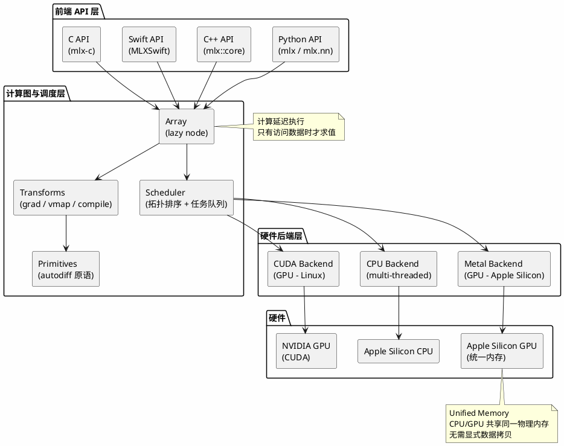

## 简介

MLX 是 Apple 机器学习研究团队开源的数组框架，专为 Apple Silicon 硬件设计。截至 2026 年 6 月，该项目在 GitHub 上积累了超过 27,000 stars，最新版本为 v0.31.2，已扩展支持 CUDA 后端以覆盖 Linux 环境。

本文将从源码结构出发，分析 MLX 的核心设计选择，并与 PyTorch、JAX、NumPy 进行对比。

## 项目概览

| 属性 | 详情 |
|------|-----|
| 仓库 | [ml-explore/mlx](https://github.com/ml-explore/mlx) |
| 主要语言 | C++（核心）+ Python（绑定）+ Swift/C 绑定 |
| 许可证 | MIT |
| 首次发布 | 2023-11-28 |
| 最新版本 | v0.31.2（2026-04-22） |
| Stars / Forks | 27,000+ / 1,900+ |
| 支持设备 | CPU、Metal GPU（Apple Silicon）、CUDA（Linux） |
| 安装方式 | `pip install mlx`（macOS）/ `pip install mlx[cuda]`（Linux） |
| 高层封装 | `mlx.nn`（类 PyTorch）、`mlx.optimizers` |

## 源码结构

MLX 的仓库结构清晰地分离了核心引擎与语言绑定：

```text
mlx/                    # C++ 核心实现
├── array.h / array.cpp # Array 数据结构
├── ops.h / ops.cpp     # 算子定义（矩阵乘法、卷积、FFT 等）
├── transforms.h        # 函数变换（grad、vmap、compile）
├── scheduler.h         # 调度器（lazy evaluation 核心）
├── compile.h           # 计算图编译优化
├── primitives.h        # 基础原语（autodiff 实现）
├── backend/
│   ├── common/         # 公共后端代码
│   ├── cpu/            # CPU 后端
│   ├── metal/          # Metal GPU 后端（Apple Silicon）
│   └── cuda/           # CUDA 后端（Linux，v0.31+ 引入）
└── distributed/        # 分布式计算支持

python/                 # Python 绑定（nanobind）
├── mlx/                # 高层 Python 模块
│   ├── nn/             # 神经网络层（Linear、Conv、Transformer 等）
│   └── optimizers/     # 优化器（SGD、Adam 等）
└── src/                # nanobind C++ 绑定代码
```

从目录结构可以看出，MLX 的核心逻辑完全用 C++ 编写，Python 只是薄薄的一层绑定。这意味着性能关键路径不经过 Python 解释器，而 Swift 和 C 绑定也共享同一套核心，保持行为一致。

## 整体架构

MLX 的架构可以分为三层：前端 API 层、计算图与调度层、硬件后端层。



这个架构的关键设计点是：Array 对象本身不存储计算结果，而是作为计算图中的一个节点，保存生成该数组所需的操作信息。只有当程序实际需要读取数据时（例如打印、转换为 NumPy 数组），调度器才会执行整个计算图。

## 核心设计分析

### Lazy Evaluation（延迟计算）

MLX 中的所有计算都是惰性的。当你执行 `c = a + b` 时，MLX 不会立即计算结果，而是创建一个新的 Array 节点，记录"加法"操作及其输入 `a` 和 `b`。实际的计算被推迟到需要结果时发生。

这种设计带来了两个好处：

**计算融合**。连续的操作可以被合并为单个 GPU kernel。例如 `relu(x @ w) + bias` 可能被融合为一个操作，减少中间结果在内存中的读写次数。

**无用计算消除**。如果某个中间结果最终没有被使用，调度器会跳过它的计算。在条件分支较多的代码中，这可以避免不必要的开销。

代价是调试时无法在每一步操作后立即查看中间值——必须显式调用 `mx.eval()` 强制求值。

### Unified Memory（统一内存）

这是 MLX 与其他框架最显著的差异。在 PyTorch 中，CPU 张量和 GPU 张量位于不同的内存空间，跨设备操作需要显式的 `.to(device)` 或 `.cuda()` 调用。MLX 利用了 Apple Silicon 的统一内存架构——CPU 和 GPU 共享同一块物理内存。

```python
import mlx.core as mx

# 创建数组，不指定设备
a = mx.array([1, 2, 3, 4])

# 数组自动在需要时出现在对应设备上
b = a + 1        # 可以在 GPU 上执行
c = b * mx.array([10, 20, 30, 40])  # 无需手动转移数据
```

这意味着：
- 不需要手动管理 CPU/GPU 数据搬运
- 同一个数组可以被 CPU 和 GPU 交替操作
- 大模型推理时，模型权重只需加载一次，CPU 预处理和 GPU 推理共享数据

对于 MacBook 用户，统一内存的上限就是 GPU 可用内存的上限。M4 Max 最高支持 128GB 统一内存，这意味着可以加载参数量远超消费级 NVIDIA 显卡的模型。

### Dynamic Graph Construction（动态计算图）

与 JAX 的 `jit` 编译不同，MLX 默认采用动态图构建。函数的每次调用都会重新构建计算图，不会因为输入形状变化而触发重新编译。

```python
def process(x):
    if x.shape[0] > 10:
        return mx.sum(x, axis=0)
    else:
        return mx.mean(x, axis=0)

# 不同形状输入，无需 recompile
process(mx.zeros((20, 5)))  # 走 sum 分支
process(mx.zeros((3, 5)))   # 走 mean 分支
```

这使得代码逻辑可以直接使用 Python 控制流，调试时也可以逐行执行。作为对比，JAX 的 `jit` 会在形状变化时触发 trace，产生明显的延迟。

### Composable Function Transformations

MLX 提供三个核心变换函数，可以自由组合：

| 变换 | 功能 | 类比 |
|------|------|------|
| `mx.grad` | 自动微分，返回梯度函数 | `jax.grad` / `torch.autograd.grad` |
| `mx.vmap` | 自动向量化，批量处理 | `jax.vmap` |
| `mx.compile` | 计算图编译优化，融合算子 | `jax.jit` / `torch.compile` |

这些变换可以嵌套使用：

```python
# 对 vmap 后的函数求梯度
grad_fn = mx.grad(mx.vmap(loss_fn))

# 编译优化后的梯度函数
fast_grad = mx.compile(grad_fn)
```

`mx.compile` 是 MLX 的 JIT 编译器，它会分析计算图，将可以融合的操作合并，并在首次调用时生成优化后的 Metal kernel。后续相同形状的调用直接复用编译结果。

### Scheduler（调度器）

调度器是 MLX 延迟求值的核心组件。当需要求值时，调度器会：

1. 从目标数组出发，沿计算图反向遍历所有依赖节点
2. 按拓扑顺序排列所有待执行的操作
3. 将操作分配到对应的设备（CPU 或 GPU）
4. 提交给设备的命令队列异步执行
5. 等待结果就绪

v0.31.2 版本中，调度器新增了完整的线程安全支持，每个线程拥有独立的 Stream，可以在多线程环境中并行执行独立的计算任务。

## 与其他框架的对比

### 功能对比

| 特性 | MLX | PyTorch | JAX | NumPy |
|------|-----|---------|-----|-------|
| 主要语言 | C++ | C++/Python | C++/Python | C/Python |
| 计算模式 | 延迟求值 | 即时求值 | 延迟求值（jit） | 即时求值 |
| GPU 支持 | Metal (Apple), CUDA | CUDA, ROCm, MPS | CUDA, TPU, Metal | 无原生 GPU |
| 内存模型 | 统一内存 | 分离内存（CPU/GPU） | 分离内存 | N/A |
| 自动微分 | `mx.grad` | `torch.autograd` | `jax.grad` | 无 |
| 动态图 | 原生支持 | 原生支持 | 需要 jax.jit 编译 | N/A |
| JIT 编译 | `mx.compile` | `torch.compile` | `jax.jit` | 无 |
| 向量化 | `mx.vmap` | `torch.vmap`（实验性） | `jax.vmap` | 无 |
| 分布式 | 基础支持 | `torch.distributed` | `jax.pmap` | 无 |
| Apple Silicon 优化 | 原生 Metal 后端 | MPS 后端（有限） | 基础支持 | CPU only |

### 设计权衡

每种设计选择都有代价。MLX 的设计权衡可以总结如下：

| 设计选择 | 优势 | 代价 |
|----------|------|------|
| Lazy evaluation | 算子融合、消除无用计算 | 调试时需要手动 eval，错误在求值时才暴露 |
| Unified memory | 无需数据搬运、简化编程 | 受限于 Apple Silicon 硬件，无法跨平台 |
| Dynamic graph | 易于调试、支持 Python 控制流 | 无法像静态图那样做全局优化（除非用 compile） |
| C++ 核心 | 多语言绑定共享核心、性能可预测 | 贡献门槛高，社区扩展需要 C++ 能力 |
| Metal 优先 | 在 Mac 上性能最优 | 生态小于 CUDA，Linux 支持后补 |
| 小团队主导 | 设计一致性强、代码质量高 | 功能迭代速度受限于团队规模 |

### 适用场景

MLX 的能力高度绑定 Apple Silicon，场景适配差异明显：

- **擅长（Mac 本地）**：本地推理 LLM（统一内存可加载大模型，Metal 加速）、LoRA 等模型微调（官方有示例、内存充足）、Stable Diffusion 本地生成、语音识别本地推理（Whisper 示例）。这些是 MLX 的主战场。
- **可用但生态受限**：研究原型开发（API 简洁但生态小于 PyTorch）、替代 NumPy 做数值计算（API 兼容，但 GPU 加速仅在 Mac）。
- **不适合**：大规模分布式训练（多机方案尚在早期）、Linux 服务器训练（CUDA 后端可用但生态不如 PyTorch 成熟）、云端生产部署（缺成熟 serving 框架）。

## 性能特点

MLX 在 Apple Silicon 上的性能来自几个层面的优化：

**Metal kernel 手写优化**。MLX 的 Metal 后端不是通过 Metal Performance Shaders（MPS）间接调用，而是直接编写 Metal Shading Language kernel。这使得团队可以针对 Apple GPU 的具体架构特性做精细优化，例如矩阵乘法的 split-K 分解、量化矩阵乘法的流水线执行等。

**量化模型支持**。随着大模型推理成为主要使用场景，MLX 对量化矩阵乘法做了大量优化。v0.31.2 版本中，CUDA 后端也支持了 3/4/5/6-bit 量化矩阵乘法，Metal 后端则实现了针对小 batch size 的 split-K 优化。

**内存效率**。统一内存避免了 CPU-GPU 之间的数据拷贝开销。对于需要频繁在预处理（CPU）和推理（GPU）之间传递数据的场景，这可以节省可观的时间。

## 生态与扩展

MLX 的生态围绕核心框架向外扩展：

- **mlx-examples**：官方示例仓库，包含 LLM 推理（LLaMA）、LoRA 微调、Stable Diffusion、Whisper 语音识别等
- **mlx-swift**：Swift 绑定，可以在 iOS/macOS 原生应用中直接使用
- **mlx-c**：C 绑定，用于与其他语言集成
- **mlx-lm**：高级 LLM 推理和微调库
- **JACCL**：从核心库分离出的集合通信库（v0.31.2），支持多设备协同

对于希望在 Apple 设备上部署机器学习应用的研究者和开发者，MLX 提供了一条从研究到产品的连续路径：在 Python 中用 MLX 训练或微调模型，通过 mlx-swift 在原生应用中加载和运行。

## 快速上手

安装 MLX：

```bash
pip install mlx
```

基础使用：

```python
import mlx.core as mx

# 创建数组
a = mx.array([[1, 2], [3, 4]])
b = mx.array([[5, 6], [7, 8]])

# 矩阵乘法（延迟执行）
c = a @ b

# 强制求值
mx.eval(c)
print(c)
# array([[19, 22],
#        [43, 50]], dtype=int32)

# 自动微分
def f(x):
    return mx.sum(x ** 2 + 2 * x + 1)

grad_f = mx.grad(f)
print(grad_f(mx.array([1.0, 2.0, 3.0])))
# array([4, 6, 8], dtype=float32)
```

使用高层 API 构建简单模型：

```python
import mlx.nn as nn
import mlx.optimizers as optim

class SimpleModel(nn.Module):
    def __init__(self, input_dim, hidden_dim, output_dim):
        super().__init__()
        self.fc1 = nn.Linear(input_dim, hidden_dim)
        self.fc2 = nn.Linear(hidden_dim, output_dim)

    def __call__(self, x):
        x = nn.relu(self.fc1(x))
        return self.fc2(x)

model = SimpleModel(768, 256, 10)
optimizer = optim.Adam(learning_rate=1e-3)

# 计算损失和梯度
def loss_fn(model, x, y):
    pred = model(x)
    return mx.mean((pred - y) ** 2)

grad_fn = mx.grad(loss_fn)
grads = grad_fn(model, x_batch, y_batch)
optimizer.update(model, grads)
```

## 总结

MLX 不是一个通用目的的机器学习框架，而是针对 Apple Silicon 硬件特性深度优化的数组计算库。它的价值在于：让 Mac 用户拥有一个原生的、高效的、API 友好的机器学习工具，而不再依赖 PyTorch 的 MPS 后端或 TensorFlow 的 Metal 插件。

unified memory 是 MLX 的核心竞争力——在 Mac 上运行大模型时，统一内存意味着不需要操心显存不够的问题，模型权重只需加载一次。对于本地推理和轻量级微调场景，MLX 提供了目前 Mac 平台上最流畅的体验。

如果你的工作流以 Mac 为主要开发环境，且需要在本地训练或推理中等规模的模型，MLX 值得纳入工具箱。但如果你需要大规模分布式训练或成熟的云端部署方案，PyTorch 和 JAX 仍然是更成熟的选择。

## 参考资料

- [MLX GitHub 仓库](https://github.com/ml-explore/mlx)
- [MLX 官方文档](https://ml-explore.github.io/mlx/build/html/index.html)
- [MLX Examples 仓库](https://github.com/ml-explore/mlx-examples)
- [MLX Swift 绑定](https://github.com/ml-explore/mlx-swift)
- [MLX v0.31.2 Release Notes](https://github.com/ml-explore/mlx/releases/tag/v0.31.2)
