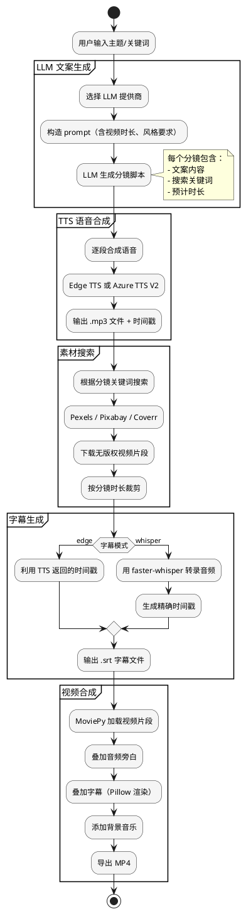

## 简介

短视频的生产流程通常是：选题 → 写脚本 → 找素材 → 配音 → 加字幕 → 剪辑 → 导出。每一步都需要人力投入。MoneyPrinterTurbo 把这条链路完全自动化了——你只需要给它一个主题关键词。

它的工作流程是：LLM 根据主题生成视频文案（分镜脚本），TTS 合成语音旁白，从 Pexels/Pixabay 搜索无版权视频素材，生成字幕，最后用 MoviePy 把所有元素合成一个 MP4 短视频。

87.6k stars，15+ 种 LLM 提供商，3 种视频素材源，支持 Web UI / API / CLI 三种使用方式。这是一个功能完整的端到端自动化系统。

## 项目概览

| 项目 | 值 |
|------|-----|
| 仓库 | [harry0703/MoneyPrinterTurbo](https://github.com/harry0703/MoneyPrinterTurbo) |
| Stars | 87.6k（截至 2026-06-14） |
| 许可证 | MIT |
| 语言 | Python（97.9%） |
| 维护者 | harry0703 |
| 最新版本 | v1.3.0（2026-06-10） |
| 架构 | MVC（Streamlit Web UI + FastAPI 后端） |

## 核心功能

- **端到端自动化**：输入主题 → 输出完整短视频
- **多 LLM 支持**：OpenAI、Azure、Gemini、Ollama、通义千问、文心一言、DeepSeek 等 15+ 种
- **多素材源**：Pexels、Pixabay、Coverr（均无版权）+ 本地素材导入
- **两种 TTS**：Edge TTS（免费）和 Azure TTS V2（付费，更自然）
- **两种字幕模式**：edge（快，利用 TTS 时间戳）和 whisper（慢但精确）
- **批量生成**：可一次生成多个视频
- **横竖屏**：9:16（1080×1920）和 16:9（1920×1080）
- **Web UI + API + CLI**：三种使用方式

## 快速上手

### 系统要求

| 组件 | 最低 | 推荐 |
|------|------|------|
| CPU | 4 核 | 6-8 核 |
| 内存 | 4 GB | 8 GB |
| GPU | 不必需 | 4+ GB VRAM（加速 whisper） |

### 安装（Docker，最简单）

```bash
git clone https://github.com/harry0703/MoneyPrinterTurbo.git
cd MoneyPrinterTurbo
cp config.example.toml config.toml
# 编辑 config.toml，填入 LLM API key 等配置
docker-compose up -d
```

### 安装（本地，用 uv）

```bash
git clone https://github.com/harry0703/MoneyPrinterTurbo.git
cd MoneyPrinterTurbo
cp config.example.toml config.toml
uv sync --frozen
```

### 三种使用方式

#### 1. Web UI（推荐新手）

```bash
uv run streamlit run ./webui/Main.py
# 访问 http://127.0.0.1:8501
```

在 Web 界面中输入视频主题、选择 LLM、选择 TTS、选择素材源，点击"生成"即可。

#### 2. API 服务

```bash
uv run python main.py
# API 文档：http://127.0.0.1:8080/docs
```

#### 3. CLI 命令行

```bash
uv run python cli.py --video-subject "金钱的作用"

# 指定本地素材
uv run python cli.py --video-subject "旅行日记" \
  --video-source local \
  --video-materials "1.mp4,2.mp4,3.mp4"

# 在指定步骤停止（调试用）
uv run python cli.py --video-subject "AI 简介" --stop-at video
```

## 架构与原理

### 整体流水线



### 核心模块

| 模块 | 路径 | 职责 |
|------|------|------|
| 后端核心 | `app/` | 业务逻辑（MVC 的 Model + Controller） |
| Web UI | `webui/` | Streamlit 前端（MVC 的 View） |
| 配置 | `config.toml` | LLM、TTS、素材源等配置 |
| 字体 | `resource/fonts/` | 字幕字体文件 |
| 音乐 | `resource/songs/` | 内置背景音乐库 |
| 模型 | `models/` | whisper 模型（可选下载） |

### LLM 文案生成

MoneyPrinterTurbo 支持 15+ 种 LLM，通过统一的适配器模式接入。每种 LLM 只需要实现一个 `generate_response()` 方法。

文案生成的 prompt 大致如下：

```text
请为以下主题生成一个 {duration} 秒的短视频脚本：
主题：{subject}

要求：
1. 分成 {segment_count} 个分镜
2. 每个分镜包含：文案内容、搜索关键词、预计时长
3. 语言：{language}
4. 风格：{style}

请以 JSON 格式返回。
```

LLM 返回的 JSON 被解析后，驱动后续所有步骤。

### TTS 语音合成

| 方案 | 费用 | 质量 | 说明 |
|------|------|------|------|
| Edge TTS | 免费 | 标准 | 微软 Edge 浏览器的 TTS API，通过逆向工程获取 |
| Azure TTS V2 | 付费 | 更高 | 官方 API，9 种声音，更自然 |

Edge TTS 的一个优势是**返回时间戳**，可以直接用于字幕生成，不需要额外的语音识别。

### 字幕生成

两种模式各有取舍：

| 模式 | 速度 | 精度 | 需要 GPU |
|------|------|------|---------|
| `edge` | 快 | 复杂句子偶尔有误 | 否 |
| `whisper` | 慢（数十秒到 1 分钟） | 高精度 | 推荐 |

`config.toml` 中切换：

```toml
[app]
subtitle_provider = "edge"   # 或 "whisper"
```

whisper 模式使用 `faster-whisper` 库，默认加载 `large-v3-turbo` 模型（约 250MB）。

### 视频合成

MoviePy 2.x 负责最终的视频合成。流程是：

1. 加载每个分镜的视频片段
2. 按分镜时长裁剪
3. 叠加对应的音频旁白
4. 用 Pillow 渲染字幕并叠加
5. 叠加背景音乐（降低音量）
6. 导出为 MP4（H.264 编码）

升级 MoviePy 2.x 后，字幕渲染不再依赖 ImageMagick，简化了安装。

## 关键设计决策

**1. 为什么用 Streamlit 而非 React/Vue？**

Streamlit 可以在纯 Python 中快速构建 Web UI，不需要前端工程化知识。对于一个工具类项目，这大大降低了贡献门槛。

**2. 为什么支持这么多 LLM？**

不同用户有不同的偏好和预算。有人愿意用 GPT-4o，有人想用本地的 Ollama，有人需要国内的通义千问。统一适配器模式让每种 LLM 都能即插即用。

**3. 为什么用免费素材源？**

版权问题会阻碍商用。Pexels、Pixabay、Coverr 都提供无版权的高清视频素材，可以安全地用于商业场景。

**4. 为什么字幕有两种模式？**

Edge 模式快但精度有限，whisper 模式慢但精确。用户可以根据场景选择——快速验证用 edge，正式发布用 whisper。

## 适用场景与局限

### 适用场景

- **自媒体批量生产**：快速生成大量主题相近的短视频
- **知识科普**：把文字内容转化为视频形式
- **营销素材**：快速产出产品展示视频
- **教育内容**：将知识点做成短视频

### 局限

- **素材匹配度**：自动搜索的素材可能与文案不完全匹配
- **缺乏创意**：LLM 生成的文案可能千篇一律
- **不支持人物出镜**：只能用素材视频，不能用真人拍摄的内容
- **长视频效果差**：超过 3 分钟的视频，素材拼接会显得生硬
- **TTS 声音机械**：Edge TTS 的声音缺乏情感变化

## 参考资料

- 官方仓库：[harry0703/MoneyPrinterTurbo](https://github.com/harry0703/MoneyPrinterTurbo)
- MoviePy 文档：[zulko.github.io/moviepy](https://zulko.github.io/moviepy/)
- Edge TTS：[rany2/edge-tts](https://github.com/rany2/edge-tts)
- faster-whisper：[SYSTRAN/faster-whisper](https://github.com/SYSTRAN/faster-whisper)
