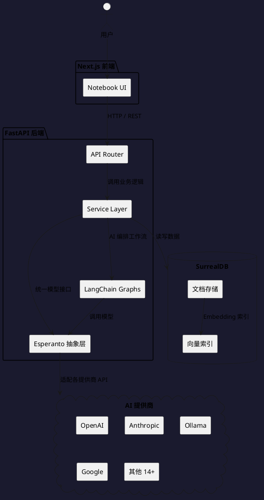

## 简介

Open Notebook 是一个自托管的知识笔记工具，定位为 Google NotebookLM 的开源替代。项目于 2024 年 10 月启动，截至 2026 年 6 月已积累超过 31,000 GitHub Stars，最新版本为 v1.9.0。

本文不讲"为什么你应该用它"，而是拆解它的架构设计、多模型抽象层的实现思路，以及与 NotebookLM 的差异背后反映出的工程取舍。

---

## 项目概览

| 属性 | 详情 |
|------|-----|
| 仓库 | [lfnovo/open-notebook](https://github.com/lfnovo/open-notebook) |
| Stars | 31,000+ |
| 许可证 | MIT |
| 后端语言 | Python（FastAPI） |
| 前端 | Next.js + React + Tailwind CSS |
| 数据库 | SurrealDB |
| AI 抽象层 | Esperanto（自建库，支持 18+ 提供商） |
| 编排框架 | LangChain |
| 部署方式 | Docker Compose（后端 + SurrealDB 两个容器） |
| 最新版本 | v1.9.0（2026-06-02） |
| 官网 | [open-notebook.ai](https://www.open-notebook.ai) |

项目的技术栈选择值得关注：后端用 Python（FastAPI）处理 AI 编排和文档解析，前端用 Next.js 提供现代 SPA 体验，数据库选择了 SurrealDB 而非更常见的 PostgreSQL + pgvector。这三个选择各自有明确的设计动机，下面逐一分析。

---

## 目录结构与模块划分

```text
open-notebook/
├── open_notebook/        # Python 后端核心
│   ├── ai/               # AI 抽象层（Esperanto 集成）
│   ├── database/         # SurrealDB 连接与查询
│   ├── domain/           # 领域模型
│   ├── graphs/           # LangChain 工作流图
│   ├── podcasts/         # 播客生成模块
│   └── utils/            # 工具函数
├── api/                  # FastAPI 路由入口
│   ├── routers/          # 各业务域路由
│   ├── *_service.py      # 业务逻辑层
│   └── main.py           # 应用入口
├── frontend/             # Next.js 前端
│   └── src/
├── docs/                 # 用户文档
├── examples/             # 部署示例（含 Ollama 本地配置）
└── docker-compose.yml
```

后端的 service 文件命名直接反映了业务域：`notebook_service.py`、`sources_service.py`、`notes_service.py`、`chat_service.py`、`podcast_service.py`、`search_service.py`、`transformations_service.py`。每个 service 对应一个前端功能模块，职责划分清晰。

---

## 核心架构：三层请求流转



整个系统的数据流可以归纳为三步：前端发起 REST 请求，FastAPI 路由分发到对应 service，service 通过 Esperanto 抽象层调用 AI 模型，结果写入 SurrealDB。这个结构本身并不复杂，难点在于 Esperanto 抽象层如何屏蔽 18 家提供商的 API 差异。

---

## 多模型抽象层的设计

Open Notebook 使用了一个名为 Esperanto 的库来统一不同 AI 提供商的接口。从仓库的 Provider Support Matrix 来看，Esperanto 需要同时处理四种能力：LLM 对话、Embedding 生成、语音转文字（STT）、文字转语音（TTS）。

这四类 API 在不同提供商之间的差异很大。OpenAI 的接口事实上成了行业标准——大多数提供商（Azure OpenAI、Mistral、DeepSeek 等）都提供 OpenAI 兼容接口。但 Anthropic、Google GenAI 的接口格式完全不同，Ollama 本地部署又有自己的协议。

Esperanto 的解法是提供统一的抽象接口，让上层 service 代码不需要关心调用的是哪个提供商。这带来的直接好处是：用户可以在 UI 里自由切换模型，甚至可以混合使用——用 OpenAI 做对话，用 Voyage 做 Embedding，用 ElevenLabs 做 TTS，用 Deepgram 做 STT。

这种设计的代价是：每次新增一个提供商，都需要在 Esperanto 中实现四类能力的适配（即使某些能力该提供商不支持）。从 Provider Support Matrix 可以看到，大部分提供商只支持 LLM，少数（OpenAI、Google、Azure OpenAI、Mistral）支持全部四种能力。

---

## 数据库选择：SurrealDB 的权衡

项目选择 SurrealDB 而非更主流的 PostgreSQL + pgvector，是一个值得分析的决策。

SurrealDB 是一个多模型数据库，同时支持文档存储和向量搜索。对于 Open Notebook 这类项目，优势在于：

1. **部署简单**：Docker Compose 只需两个容器（应用 + 数据库），不需要额外部署一个向量数据库
2. **文档模型灵活**：Notebook、Source、Note、Podcast 这些实体之间有复杂的关系，文档数据库天然适合
3. **内置向量搜索**：不需要维护额外的 embedding 索引服务

但 SurrealDB 也有明显的劣势：

| 维度 | SurrealDB | PostgreSQL + pgvector |
|------|-----------|----------------------|
| 社区规模 | 较小，文档和教程相对有限 | 庞大，几乎任何问题都能找到解答 |
| 向量搜索性能 | 满足中小规模需求 | HNSW 索引在大规模下性能更优 |
| 运维经验 | 运维资料少，排障依赖社区 | 成熟的运维工具和监控方案 |
| 生态工具 | 较少 | 丰富（ORM、迁移工具、备份方案） |

对于一个个人知识管理工具，数据量通常在几千到几万条记录的规模，SurrealDB 的性能完全够用，而部署简单性的收益更大。如果是一个企业级产品，PostgreSQL + pgvector 可能是更稳妥的选择。

---

## 与 NotebookLM 的核心差异

| 维度 | Open Notebook | Google NotebookLM |
|------|---------------|-------------------|
| 部署 | 自托管（Docker / 源码） | Google 托管，无需部署 |
| 数据存储 | 本地，完全自主控制 | Google Cloud |
| AI 模型 | 18+ 提供商可选，可混用 | 仅 Google 模型 |
| 播客生成 | 1-4 个说话人，可自定义角色 | 固定 2 个说话人 |
| API 访问 | 完整 REST API | 无公开 API |
| 二次开发 | 源码完全开放 | 不可 |
| 引用准确性 | 基础引用，仍在改进中 | 较成熟，带来源定位 |
| 使用成本 | 按 AI API 调用量付费 | 免费 / 订阅制 |
| 上手门槛 | 需要 Docker 环境 | 打开浏览器即用 |

这些差异的核心矛盾在于：NotebookLM 是一个消费级产品，优先保证易用性；Open Notebook 是一个开发者工具，优先保证灵活性和数据主权。两者解决的问题相同，但面向的用户画像不同。

NotebookLM 的优势（零配置、Google 模型质量稳定、引用系统成熟）恰好是 Open Notebook 的劣势。反过来，Open Notebook 的优势（本地部署、模型自由切换、完整 API、播客自定义）也是 NotebookLM 无法提供的。

---

## 播客生成的设计思路

播客生成是 Open Notebook 的亮点功能。与 NotebookLM 固定的两人对话格式不同，Open Notebook 支持 1-4 个说话人，并通过 Episode Profiles 机制让每个说话人有独立的语音特征和对话风格。

播客生成的技术链路大致是：Source 内容 → 通过 LangChain Graph 生成多角色对话脚本 → 调用 TTS 提供商分别生成各角色的语音 → 合并音频。这条链路涉及 LLM（脚本生成）和 TTS（语音合成）两类模型的协同。

由于 Esperanto 统一了 TTS 接口，用户可以选择 ElevenLabs（语音质量高）、Deepgram（速度快）或 Google / OpenAI 的 TTS 服务，而不需要修改播客生成的业务逻辑。

---

## 设计权衡总结

| 设计决策 | 收益 | 代价 |
|---------|------|------|
| FastAPI 后端 + Next.js 前端 | 前后端独立演进，API 可被第三方集成 | 部署需要两个服务协同 |
| SurrealDB | 单容器数据库，部署简单 | 社区小，大规模场景存疑 |
| Esperanto 统一抽象层 | 模型可自由切换，不受供应商锁定 | 每新增一个提供商需要实现完整适配 |
| LangChain 编排 | 复用成熟的 AI 工作流工具 | 引入额外依赖，调试复杂度增加 |
| Docker Compose 部署 | 一条命令启动 | 不如单二进制分发便捷 |
| 加密存储 API Key | 密钥不明文落盘 | 需要用户自行管理 encryption key |

这些权衡没有绝对的对错，只有适合与否。对于一个面向个人用户和小团队的开源项目，当前的选择是合理的。

---

## 适用场景与局限

它的定位是自托管、可自由组合多模型的知识工具，这决定了它的能力边界：

- **适合**：注重隐私的个人研究笔记（数据完全本地，不依赖 Google）、需要混合使用多家 AI 模型（18+ 提供商自由组合）、需要通过 API 自动化工作流（提供完整 REST API）。
- **需谨慎**：对引用准确性要求极高的学术研究（引用功能仍在改进中）；纯离线使用搭配 Ollama 可完全本地化，但文档解析能力受限。
- **不适合**：想要零配置浏览器体验的用户（需自行部署 Docker）、企业级多用户协作（当前版本无多用户权限管理）。

---

## 快速部署

项目提供了最小化的 Docker Compose 配置，核心步骤：

```bash
# 下载 compose 文件
curl -o docker-compose.yml \
  https://raw.githubusercontent.com/lfnovo/open-notebook/main/docker-compose.yml

# 修改 encryption key（必须）
sed -i 's/change-me-to-a-secret-string/your-secret-key/' docker-compose.yml

# 启动
docker compose up -d

# 访问 http://localhost:8502
```

启动后需要在 UI 中配置 AI 提供商的 API Key，然后就可以创建 Notebook、添加 Source、进行对话和生成播客。

如果希望完全免费本地运行，项目提供了 Ollama 的 compose 配置（`examples/docker-compose-ollama.yml`），可以使用本地模型替代商业 API。

---

## 值得关注的工程问题

**SurrealDB 的采用**。在 AI 应用开发中，向量数据库的选择往往决定了系统的扩展上限。SurrealDB 目前够用，但如果项目需要支持更大规模的知识库，可能需要提供 PostgreSQL + pgvector 作为备选后端。

**Esperanto 抽象层的维护成本**。支持 18+ 提供商意味着每个提供商的 API 变更都需要及时跟进。这是一个持续的人力投入，也是此类项目最常见的维护瓶颈。

**引用系统的成熟度**。NotebookLM 的核心价值之一是"每个回答都有来源引用"。Open Notebook 的引用功能标注为"will improve"，这意味着在需要严格引用溯源的场景下，它还不能完全替代 NotebookLM。

**社区规模与项目可持续性**。31k Stars 是一个可观的数字，但 Stars 不等于活跃贡献者。项目的长期维护依赖于核心团队的持续投入和社区贡献的健康度。

---

## 参考资料

- GitHub 仓库：[lfnovo/open-notebook](https://github.com/lfnovo/open-notebook)
- 项目官网：[open-notebook.ai](https://www.open-notebook.ai)
- Esperanto 库：[lfnovo/esperanto](https://github.com/lfnovo/esperanto)
- SurrealDB：[surrealdb.com](https://surrealdb.com)
- 最新版本：v1.9.0（2026-06-02）
