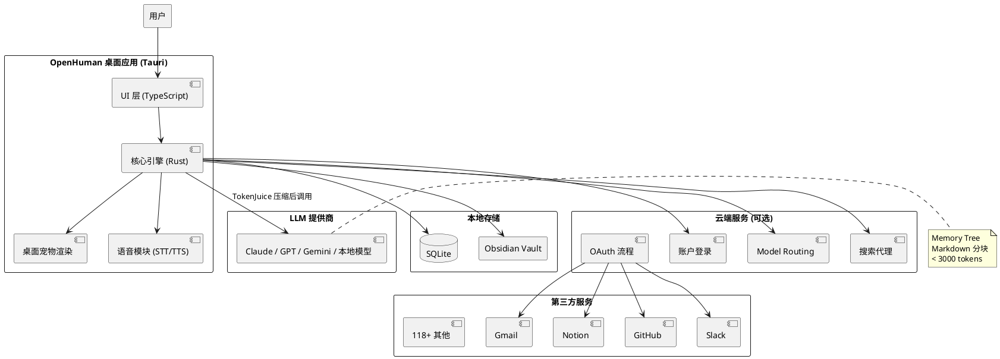
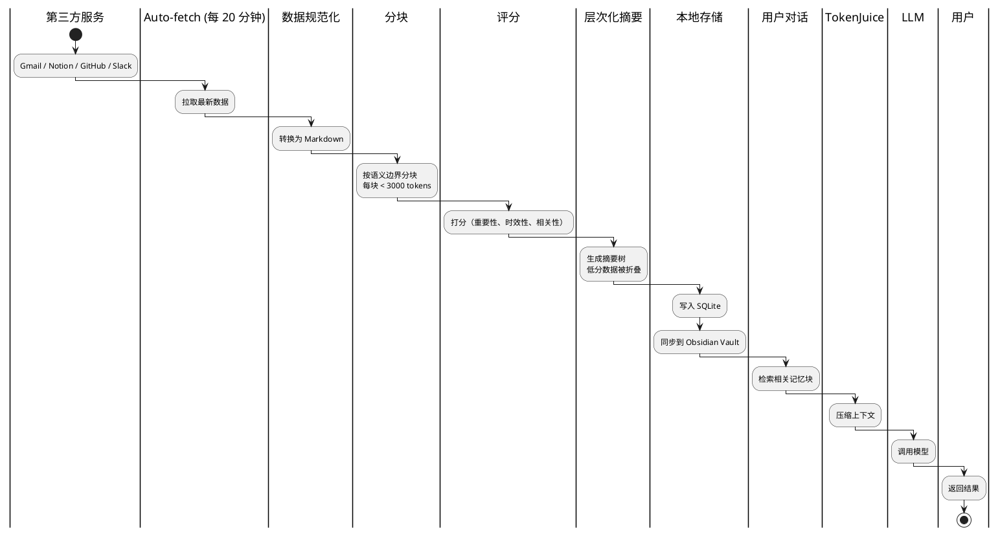

## 简介

个人 AI 助手有一个根本性的矛盾：它需要访问你的所有数据（邮件、日历、笔记、聊天记录）才能有用，但把数据交给云端服务又让人不放心。

OpenHuman 的做法是**本地优先**。它的核心记忆系统（Memory Tree）把用户数据规范化为 Markdown 分块，存储在本地 SQLite 中，同时兼容 Obsidian vault 格式。云端服务只用于账户登录、模型路由、搜索代理和 OAuth 流程——用户也可以自带模型和搜索凭证实现完全本地化。

32k stars，Rust + Tauri 构建，118+ 第三方集成（Gmail、Notion、GitHub、Slack、Stripe 等），还有桌面宠物和原生语音。这是一个野心勃勃的项目。

## 项目概览

| 属性 | 详情 |
|------|-----|
| 仓库 | [tinyhumansai/openhuman](https://github.com/tinyhumansai/openhuman) |
| Stars | 32k（截至 2026-06-14） |
| 许可证 | GPL-3.0 |
| 语言 | Rust（61.5%）、TypeScript（35.6%） |
| 维护团队 | Tiny Humans AI |
| 最新版本 | v0.57.40（2026-06-12） |
| 总提交数 | 3,018 |
| 创建者 | @senamakel |
| 官网 | [tinyhumans.ai/openhuman](https://tinyhumans.ai/openhuman) |
| 阶段 | Early Beta |

## 核心功能

### Memory Tree + Obsidian Wiki

用户数据被规范化为**不超过 3000 token 的 Markdown 分块**，存储在本地 SQLite 中，同时兼容 Obsidian vault 格式。用户可以直接在 Obsidian 中浏览自己的记忆树。

### 118+ 第三方集成

通过 Composio 连接器层，支持一键 OAuth 接入：

- **邮件**：Gmail、Outlook
- **笔记**：Notion、Obsidian
- **开发**：GitHub、GitLab、Linear、Jira
- **沟通**：Slack、Discord
- **日历**：Google Calendar
- **存储**：Google Drive、Dropbox
- **支付**：Stripe
- 等等

### Auto-fetch 自动拉取

每 20 分钟自动从已连接服务拉取最新数据，注入 Memory Tree，并生成**层次化摘要树**（灵感来自 Karpathy 的 obsidian-wiki 工作流）。

### TokenJuice 智能压缩

自研 token 压缩技术，号称可将 LLM 调用成本和延迟降低最高 80%。

### 桌面宠物（Desktop Mascot）

带有面部表情的桌面角色，能说话、对周围环境做出反应，甚至可以以真实参与者身份加入 Google Meet 会议。

### 原生语音

- **输入**：STT（语音转文字）
- **输出**：ElevenLabs TTS（文字转语音）
- 支持宠物口型同步和 Google Meet 实时代理

### Model Routing 模型路由

OpenHuman 后端自动选择并代理最合适的 LLM，用户无需手动选模型。

## 快速上手

### 安装

#### macOS（Homebrew，官方推荐）

```bash
brew tap tinyhumansai/core
brew install openhuman
```

#### Linux（Debian/Ubuntu APT）

```bash
sudo apt-get install -y --no-install-recommends gnupg2 curl ca-certificates
curl -fsSL https://tinyhumansai.github.io/openhuman/apt/KEY.gpg \
  | sudo gpg --dearmor -o /etc/apt/keyrings/openhuman.gpg
echo "deb [signed-by=/etc/apt/keyrings/openhuman.gpg arch=amd64] \
  https://tinyhumansai.github.io/openhuman/apt stable main" \
  | sudo tee /etc/apt/sources.list.d/openhuman.list
sudo apt-get update && sudo apt-get install -y openhuman
```

#### Linux（Arch AUR）

```bash
yay -S openhuman-bin
```

#### Windows

从 [GitHub Releases](https://github.com/tinyhumansai/openhuman/releases) 下载签名的 `.msi` 安装包。

### 首次使用

1. 启动 OpenHuman
2. 登录账户（或跳过，使用本地模式）
3. 连接服务（Gmail、Notion 等）
4. 等待首次数据同步（可能需要几分钟）
5. 开始对话

## 架构与原理

### 整体架构



### Memory Tree 机制

Memory Tree 是 OpenHuman 的核心。它的工作流程：

```text
1. 数据拉取
   └─ Auto-fetch 每 20 分钟从已连接服务拉取最新数据

2. 数据规范化
   └─ 将不同格式的数据（邮件、笔记、代码提交等）转换为 Markdown

3. 分块
   └─ 按语义边界分块，每块不超过 3000 tokens

4. 评分
   └─ 对每块数据打分（重要性、时效性、相关性）

5. 层次化摘要
   └─ 生成摘要树，低分数据被折叠为摘要

6. 存储
   └─ 写入本地 SQLite + Obsidian vault

7. 检索
   └─ 对话时，根据上下文检索相关记忆块
```

### TokenJuice 压缩

TokenJuice 是 OpenHuman 的自研压缩技术。它的核心思路是：

```text
原始上下文（可能数万 tokens）
  ↓
识别冗余信息（重复、无关、低重要性）
  ↓
压缩为关键信息（保留语义，减少 tokens）
  ↓
发送给 LLM（成本降低 80%）
  ↓
LLM 返回结果
```

具体实现未公开，但据 README 描述，它结合了：
- 语义去重
- 重要性过滤
- 摘要压缩
- 上下文窗口优化

### 数据流



### Model Routing

OpenHuman 不绑定特定的 LLM。它的 Model Routing 机制会根据任务类型自动选择最合适的模型：

- **简单对话**：用小模型（快速、低成本）
- **复杂推理**：用大模型（Claude Opus、GPT-4o）
- **代码生成**：用代码特化模型
- **本地模型**：支持 Ollama、LM Studio 等

用户也可以手动指定模型，或完全使用本地模型实现离线使用。

## 关键设计决策

**1. 为什么用 Rust + Tauri？**

Rust 性能优秀，内存安全，适合处理大量数据的本地应用。Tauri 比 Electron 更轻量（内存占用小 50%+），且可以用系统原生 WebView。

**2. 为什么兼容 Obsidian？**

Obsidian 是一个流行的本地优先笔记工具，拥有大量忠实用户。兼容 Obsidian vault 格式意味着用户可以直接在 Obsidian 中浏览自己的记忆树，不需要额外工具。

**3. 为什么用 Composio 做集成？**

Composio 是一个统一的 OAuth 连接器层，支持 118+ 服务。用它而不是自己实现每个集成，大大降低了开发成本。

**4. 为什么每 20 分钟拉取一次？**

频率太低，数据不新鲜；频率太高，消耗 API 配额和带宽。20 分钟是一个折中。

**5. 为什么桌面宠物是核心功能？**

桌面宠物不只是一个"可爱"的功能，它是 OpenHuman 的"人格化"界面。通过宠物的表情和动作，用户可以直观地感知 AI 的状态（思考中、空闲、兴奋等）。

**6. 为什么是 GPL-3.0？**

GPL-3.0 要求衍生作品也必须开源，这保护了项目的开源性质，但可能阻碍商业采用。

## 适用场景与局限

### 适用场景

- **个人知识管理**：把所有数据整合到一个 AI 助手中
- **隐私敏感用户**：数据存储在本地，不上传到云端
- **Obsidian 用户**：无缝集成现有的笔记库
- **多服务重度用户**：同时使用 Gmail、Notion、GitHub、Slack 等
- **桌面宠物爱好者**：想要一个有个性的 AI 助手

### 局限

- **Early Beta 阶段**：功能可能不稳定
- **GPL-3.0 许可证**：商业场景需要额外考虑
- **资源占用**：Rust + Tauri 虽然轻量，但持续运行仍会消耗系统资源
- **集成依赖 Composio**：如果 Composio 服务中断，集成会受影响
- **桌面宠物不是所有人喜欢**：有些人可能觉得分心
- **macOS / Linux / Windows 体验差异**：某些功能在不同平台上可能有差异

## 参考资料

- 官方仓库：[tinyhumansai/openhuman](https://github.com/tinyhumansai/openhuman)
- 官网：[tinyhumans.ai/openhuman](https://tinyhumans.ai/openhuman)
- 文档：[tinyhumans.gitbook.io/openhuman](https://tinyhumans.gitbook.io/openhuman/)
- Composio：[composio.dev](https://composio.dev/)
- Tauri：[tauri.app](https://tauri.app/)
