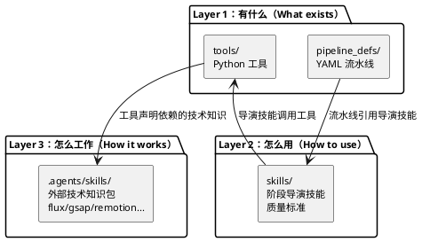
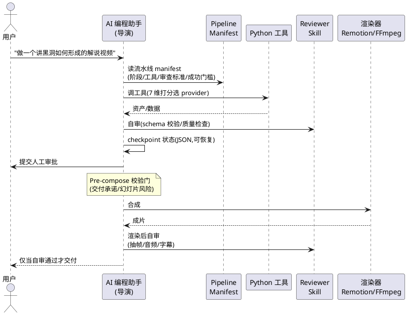

## OpenMontage：把 AI 编程助手变成视频制作工作室

OpenMontage 是一个开源的 agentic 视频制作系统，让 Claude Code、Cursor、Copilot 等 AI 编程助手充当"制片人"，从选题调研、脚本、资产生成一路做到剪辑合成。它最不一样的地方是：**整个系统没有一行编排代码，AI 编程助手本身就是编排器**，所有创意决策和质量标准都写在人类可读的指令文件里。

## 它要解决什么问题

大多数 AI 视频工具的工作方式是「一个 prompt → 一个片段」：你描述画面，模型吐出几秒钟视频，剩下的拼接、配音、字幕、调色全靠人工。这条路有两个硬伤：

1. **没有制作流程**。真实的视频制作是调研→脚本→分镜→素材→剪辑→合成的流水线，每一步都有审查和返工。单次生成跳过了所有中间环节。
2. **"免费 AI 视频"常常名不副实**。很多号称免费的方案，本质是"把静态图片加 Ken Burns 运镜假装成视频"。真正的运动镜头要么靠付费视频模型，要么没有。

OpenMontage 的回应是把制作团队的完整流程搬进 AI 编程助手，并且提供两条产出路径：图片驱动（生成 AI 图 + Remotion 动画化）和真实素材驱动（从开放档案库语义检索真实镜头剪进时间线，全程不需要付费视频模型）。

README 列出的真实成片可以作为成本参照：60 秒皮克斯风格短片（6 个 Kling 镜头 + 旁白 + 字幕）总成本 $1.33；吉卜力风格动画（12 张 FLUX 图 + 运镜，无视频生成 API）单片 $0.15。

## 项目概览

| 属性 | 详情 |
|------|-----|
| 仓库 | [calesthio/OpenMontage](https://github.com/calesthio/OpenMontage) |
| Stars | 约 22.1k（截至 2026-06-26） |
| 许可证 | AGPL-3.0（强 copyleft） |
| 语言 | Python |
| 形态 | 接入 AI 编程助手的指令 + 工具集合 |
| LLM 后端 | 可配置 anthropic / openai / gemini / openrouter / ollama 等 |
| 规模 | 12 条生产流水线、约 50 个工具、数百个 skill 指令文件 |

> 关于数字：仓库描述写"52 tools / 500+ skills"，README 正文写"48 tools / 400+ skills"，官方两处自己就不一致。本文统一用"约 50 个工具""数百个 skill 指令文件"这类量级表述，流水线数量 12 是准确的。

## 核心设计：agent-first，没有编排器

README 原文：**"There is no code orchestrator. Your AI coding assistant IS the orchestrator."**

这句话是理解整个项目的钥匙。传统的自动化系统会写一个 Python 主程序去调度各个步骤；OpenMontage 反其道而行——**Python 只负责两件事：提供工具（tools）和持久化检查点（checkpoints）**。所有的创意决策、编排逻辑、审查标准、质量门禁，全部写在人类可读、可定制的指令文件里（YAML manifest + Markdown skill）。

入口契约也极简：根目录的 `CLAUDE.md`（或 `CURSOR.md`/`COPILOT.md`）只有一句强制要求——回应任何用户消息前，必须先读 `AGENT_GUIDE.md`（38KB 的 agent 操作契约）。

### 三层知识架构

这是系统的组织骨架，把"有什么能力"、"OpenMontage 要怎么用"、"底层技术细节"三件事拆成三层：



- **Layer 1（有什么）**：`tools/` 是 Python 工具（agent 的"手"），`pipeline_defs/` 是 YAML 编排剧本。
- **Layer 2（怎么用）**：`skills/` 是 Markdown 指令，写明 OpenMontage 的惯例和质量门槛，包括每条流水线的阶段导演技能、创意技巧、审查协议。
- **Layer 3（怎么工作）**：`.agents/skills/` 是数百个外部技术知识包，比如 FLUX 的提示词工程、GSAP 动画、Remotion 最佳实践、WhisperX 字幕等 provider 专属知识。

每个工具声明它依赖哪些 Layer 3 知识包。系统有一条"Rule Zero"强制规则：**调用任何带 `agent_skills` 字段的工具前，必须先读对应的 Layer 3 skill**。这样 agent 不会凭训练数据里过时的参数去硬调 API。

### 端到端执行流

一句话指令进来后，agent 按流水线 manifest 一步步走，每一步都有检查点和人工审批：



## 工具与流水线的组织

### 12 条生产流水线

每条流水线对应一种产出形态，统一遵循 `research → proposal → script → scene_plan → assets → edit → compose` 的阶段流：

| 流水线 | 产出 |
|--------|------|
| Animated Explainer | AI 生成的讲解视频（调研+旁白+视觉+音乐） |
| Documentary Montage | 从 CLIP 索引的免费素材库剪出主题蒙太奇 |
| Cinematic | 预告片、teaser、情绪驱动剪辑 |
| Clip Factory | 从一条长视频批量产出短片 |
| Talking Head / Avatar | 讲者出镜 / 数字人主持 |
| Screen Demo | 软件录屏走查 |
| Localization & Dub | 字幕、配音、翻译已有视频 |
| Animation / Character | 动态图形 / SVG 骨骼绑定角色动画 |

每个 YAML manifest 不只列阶段，还声明每个阶段的 `skill`（对应导演技能）、`required_artifacts_in`、`produces`、`tools_available`、`checkpoint_required`、`human_approval_default`、`success_criteria`。比如 research 阶段的成功标准是"schema 合规的 research_brief，至少 3 个数据点、3 个角度、5 个带 URL 的来源"——这是机器可校验的契约。

### 工具契约与自动发现

每个工具继承 `BaseTool` 抽象基类，强制统一接口。工具按 `ToolRuntime` 分为四类，这个分类直接决定了花不花钱：

- `LOCAL`：纯本地，免费（如 Piper TTS）
- `LOCAL_GPU`：需要显存（如本地视频生成模型 wan2.1）
- `API`：需要 key，花钱（如 Kling、ElevenLabs）
- `HYBRID`：本地或 API 皆可

`ToolRegistry` 提供自动发现——扫描 `tools/` 包自动注册，新增工具无需手动登记。agent 可以用一行命令实测当前环境有哪些能力可用：

```bash
python -c "from tools.tool_registry import registry; import json; registry.discover(); print(json.dumps(registry.support_envelope(), indent=2))"
```

## 5 分钟上手

前置条件：Python 3.10+、FFmpeg、Node.js 18+，以及一个 AI 编程助手。

```bash
git clone https://github.com/calesthio/OpenMontage.git
cd OpenMontage
make setup
```

`make setup` 会安装 Python 依赖、`remotion-composer` 的 npm 依赖、免费离线 TTS（piper-tts），预热 hyperframes 缓存，并从 `.env.example` 复制出 `.env`。

然后在 AI 编程助手里打开项目，直接说人话：

```text
"Make a 60-second animated explainer about how neural networks learn"
```

真实素材路径：

```text
"Make a 75-second documentary montage about city life in the rain. Use real footage only, no narration, elegiac tone, with music."
```

API key 全部可选，`.env` 里有几个填几个——key 越多，可用工具越多：

```bash
FAL_KEY=your-key               # FLUX 图 + Veo/Kling/MiniMax 视频
PEXELS_API_KEY=your-key        # 免费库存素材
ELEVENLABS_API_KEY=your-key    # 高级 TTS / AI 音乐
OPENAI_API_KEY=your-key        # OpenAI TTS / DALL-E 3
```

零 key 也能跑：Piper 离线 TTS + Archive.org/NASA/Wikimedia 开放档案素材 + Remotion 合成 + 内置逐词字幕，足以产出一支完整视频。

## 几个值得注意的设计

**7 维打分式 provider 选择**。同一个能力（比如生成图片）往往有多个 provider，agent 按 task fit (30%)、output quality (20%)、control (15%)、reliability (15%)、cost (10%)、latency (5%)、continuity (5%) 加权打分，胜出者和所有备选分数一并记入决策审计轨迹。这让"为什么选这个模型"可追溯。

**质量门禁防"动画 PPT"**。渲染前有 pre-compose 校验：如果声称"运动主导"却 80% 是静图、或幻灯片风险评分过高，直接阻断渲染。渲染后有自审：用 ffprobe 校验 + 4 个位置抽帧查黑帧 + 音频电平分析查静音/削波，不过审不出片。

**两个合成引擎，proposal 阶段锁定**。Remotion（React，数据驱动讲解、弹簧动画）和 HyperFrames（HTML/CSS/GSAP，动态排版、网页转视频）。硬规则：两个都可用时，agent 必须把两个选项都呈现给用户，**静默选默认算治理违规**。

**预算治理**。`cost_tracker.py` 走"估算→预留→对账"流程，单动作审批阈值默认 $0.50，总预算默认 $10，新增付费工具需审批。

## 适用场景与边界

OpenMontage 的差异化在于"制作流程"而非"生成质量"——它适合需要结构化、可审查、可复现产出的批量内容生产，而不是追求单个镜头极致画质的场景。

几个需要诚实面对的边界：

- **本地 LLM 仍是"即将到来"**。config 里列了 ollama 选项，但 README 明确标注 Ollama/LM Studio 支持尚未就绪，当前完整流水线仍需云端 LLM 大脑。
- **没有正式 release**，纯 main 分支分发，稳定性自负。
- **AGPL-3.0 是强 copyleft**，商用或 SaaS 集成（网络使用也触发开源义务）需评估法律风险。
- **架构的脆弱点在 agent 是否守约**。整个系统的智能在 skill 文件里，如果 agent 不读导演技能、直接写临时脚本调 API（Rule Zero 明令禁止），质量会显著下降。
- **官方文档数字不自洽**，引用具体数量时建议以实测为准。

如果你想理解"agent-first 架构"——把智能放进可读可改的指令文件、让通用编程 agent 充当编排器——OpenMontage 是一个规模足够大、设计足够完整的样本，这一点的参考价值可能超过它生成视频本身。

## 参考资料

- [GitHub 仓库](https://github.com/calesthio/OpenMontage)
- 关键文件：`AGENT_GUIDE.md`、`tools/base_tool.py`、`tools/tool_registry.py`、`pipeline_defs/animated-explainer.yaml`
