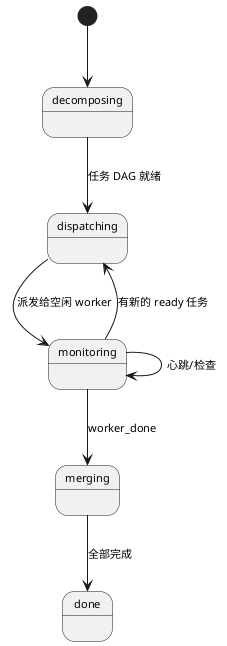
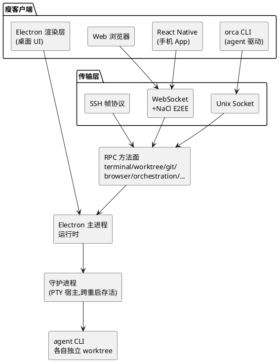

## Orca：管理并行 agent 舰队的 ADE 架构解读

Orca 是一个 ADE（Agent Development Environment，agent 开发环境），用来同时管理一支并行运行的编码 agent 舰队。它的两个核心设计值得拆解：一是用 **git worktree 隔离**让多个 agent 并行干活而不互相冲突，二是用**一套 RPC 方法面 + 多传输层**让桌面客户端、`orca` CLI、手机 App、远程 SSH 主机都能驱动同一个运行时。本文从源码角度看它怎么实现。

## 它要解决什么问题

当你想让多个编码 agent 同时干活时，立刻会撞上三个问题：

1. **它们会互相踩踏**——同一个工作目录里，两个 agent 同时改文件就乱套了。
2. **看不过来**——五个 agent 在五个终端里跑，进度、产出、谁卡住了，没有统一视图。
3. **绑在一台机器上**——agent 跑在你的开发机上，人离开工位就失联了。

Orca 把这三件事一起解决：每个 agent 在自己的 git worktree（独立检出、共享一个 `.git`）里跑，物理隔离避免冲突；保留 IDE 的全套家当（Monaco 编辑器、终端、内嵌浏览器、git diff 审查）但围绕"agent 舰队"重新组织；并通过客户端/服务端拆分，让你能从手机上盯着桌面上跑的 agent。

它给自己的定位是"**面向 100x builder 的 AI 编排器，让 Codex、Claude Code、OpenCode 等并排运行，各自在独立 worktree 里，在一处统一追踪**"。

## 项目概览

| 属性 | 详情 |
|------|-----|
| 仓库 | [stablyai/orca](https://github.com/stablyai/orca) |
| Stars | 约 7.5k（截至 2026-06-26） |
| 许可证 | MIT |
| 语言 | TypeScript（Electron 应用） |
| 形态 | 桌面 App（Mac/Win/Linux）+ 手机 App + Web + CLI |
| 隔离模型 | git worktree（非容器、非云沙箱） |
| 支持 agent | Claude Code/Codex/Gemini/OpenCode 等，"任何能跑在终端里的 CLI agent" |
| 计费模式 | BYO 订阅（用你自己的账号，Orca 不在计费链路上） |
| 最新版本 | v1.4.97（持续发 RC，"每天发版"） |

## 并行 agent 编排：worktree + 协调器

### 隔离用 worktree，不是容器

Orca 的隔离模型是 **git worktree**，不是 Docker 容器、也不是云沙箱。README 说得直接："把一个 prompt 扇给五个 agent，每个在自己隔离的 git worktree 里——对比结果，合并胜出者。"

每个 agent 就是一个跑在 PTY（`node-pty`）里的 CLI 进程，它的工作目录是一个专属 worktree。冲突之所以不会发生，是因为每个 agent 编辑的是物理上独立的工作目录；之后你 diff/merge 胜出的那份。这比容器轻量得多——没有镜像、没有启动开销，共享同一个 `.git`。

### 协调器是一个轮询状态机

编排引擎在 `src/main/runtime/orchestration/`，核心是 `coordinator.ts` 里的 `Coordinator` 类，跑一个轮询循环（默认 `pollIntervalMs = 2000`，`maxConcurrent = 4`）：



任务 DAG 持久化在 SQLite 里，任务状态有 `pending / ready / dispatched / completed / failed / blocked`。派发循环找到空闲、已连接、可写的 worker 终端，分配一个 ready 任务，并注入一段 **preamble**（worker 契约）。

### Worker 契约：约束 agent 怎么汇报

`preamble.ts` 生成的 worker 契约是个有意思的设计——它给被派发的 agent 一段文本，告诉它"你是一个被派发的 worker"，给出协调器的句柄、taskId，以及汇报用的 CLI 命令：`worker_done`（必须且仅调一次，失败也要调）、`heartbeat`（每 5 分钟）、`ask`（阻塞提问）、`escalation`。

有一条硬规则：**绝不使用 AskUserQuestion**——因为那会打开一个本地 TUI 提示框，协调器看不见，会让会话永久挂起。所有提问必须走 `orca orchestration ask` 路由回协调器。这是把"agent 的交互行为"约束成"协调器可观测"的关键。

### 几个可靠性机制

源码注释里写明了这些机制的设计权衡，很见功力：

- **熔断器**：连续 3 次失败，派发上下文熔断，任务标记 `failed`。
- **陈旧基线守卫**（阈值 20）：派发前检查 worktree 是否落后基线 20+ 个 commit，是则**静默跳过**（而非 `failDispatch`，避免烧掉熔断器预算），任务留在 `ready` 等重试——除非 spec 里有 `allow-stale-base: true` 覆盖。
- **挂起检测**（10 分钟 = 心跳周期的 2 倍）：发警告但**故意不自动 fail**——"误杀一个慢但正确的 worker，代价比放它跑完更高"。
- **决策门**：审批检查点，协调器永不自动放行。

一个关键洞察是**递归**：agent 通过 `orca` CLI 自己驱动 Orca（`orca worktree create`、`orca terminal send`、`orca orchestration dispatch`）。所以一个编码 agent 可以*成为*协调器，把活扇给子 agent。

```bash
orca terminal create --worktree active --command "claude" --json
orca orchestration task-create --spec "Fix the login button CSS" --json
orca orchestration dispatch --task <task_id> --to <handle> --inject --json
orca orchestration check --wait --types worker_done,escalation --timeout-ms 900000 --json
```

## BYO 订阅，不是转售

需要澄清一个常见误解：Orca 的 "Run any coding agent with your own subscription" 是真正的 **BYO（自带账号）**，不是计费转售。

机制上：Orca 把 agent 自己的登录流程作为 PTY 拉起（`claude login` / `codex login`），凭证存进**操作系统的 Keychain**（在你自己机器上），并追踪你的用量和限流重置。你可以热切换多个账号而无需重新登录。Orca 本身是免费的 MIT 软件，**不在计费链路上**——用的是你的 Claude/Codex 订阅。

## 桌面 + 手机：一套方法面，多个传输层

这是 Orca 架构上最值得学的部分。它**不是 monorepo**，而是一个 electron-vite 应用，但关键在于：**同一套 RPC 方法面，通过多个传输层暴露给不同的瘦客户端**。



### 守护进程让终端跨重启存活

终端/agent 跑在一个独立 fork 出的守护进程里（`child_process.fork`），通过 Unix domain socket 跟 Electron 主进程通信，用长度前缀的二进制帧承载 JSON-RPC 2.0。

设计理由（源码注释）很巧妙：**"一个协议健康的守护进程能比启动它的 app 包活得更久"**——打包应用更新时，`/Applications/Orca.app` 路径会被替换，但守护进程持有的活动终端会话不应该被杀掉。所以 Orca 启动时会探测已有守护进程，活着就复用，从而在 app 重启/更新时保住正在跑的 agent 会话。

### 手机通过 E2EE 配对连桌面

手机端是独立的 React Native + Expo 项目，通过 `ws://<桌面-ip>:6768` 连接桌面。配对用**二维码**：二维码编码一个 `PairingOffer`（端点、设备 token、公钥），做成 `orca://pair?code=...` 深链。

通信是**端到端加密**的——用 NaCl box（Curve25519 ECDH，`tweetnacl`）：桌面公钥随配对 offer 发出，手机派生共享密钥，之后每个 RPC payload 都用随机 nonce 密封。手机端的 RPC 是**白名单子集**——只能读取、切换、移除账号，**交互式登录仍限桌面**（因为需要浏览器）。

还有个细节体现了对移动端的理解：WebSocket 有 15 秒心跳，专门为了应对"手机客户端经常在后台挂起 socket 却不发 TCP FIN/RST"。

### 远程 SSH：独立部署的 relay

worktree/agent 可以跑在三种执行宿主上：`local`、`ssh:<target>`、`runtime:<env>`。SSH 模式下，Orca 会构建一个**自包含的 relay**（无 Electron 依赖）部署到远程机器，在单条 SSH 连接上多路复用多个逻辑通道，用的是和本地守护进程同样的 JSON-RPC-over-帧协议。这样你可以"在一台强力远程机器上跑 agent，带完整的文件编辑、git、终端"。

## 技术栈

| 层 | 选型 |
|----|------|
| 外壳 | Electron 42 + electron-vite + Node 24 + pnpm |
| UI | React 19 + Zustand + Radix/shadcn + Tailwind 4 + Monaco |
| 终端 | @xterm/xterm 6（WebGL 渲染）+ node-pty |
| 传输/加密 | ws（WebSocket）+ ssh2 + tweetnacl（E2EE）+ qrcode |
| 数据 | SQLite（编排 DB + 持久化）+ zod |
| 其他 | sherpa-onnx（端上语音）、内嵌 Chromium、i18n（含中文）|

## 适用场景与边界

Orca 适合需要同时驱动多个编码 agent、并希望在一处统一观测和合并的工作流——尤其是"扇出一个 prompt 给多个 agent、对比择优"这种用法。它的 worktree 隔离 + 协调器 + CLI 递归驱动的组合，也是研究多 agent 编排架构的好样本。

需要清楚的边界（来自真实源码，非宣传）：

- **编排功能仍是实验性的**，藏在 Settings > Experimental 后面。
- **还没有 AI 任务拆解**。协调器注释明说：任务必须预先创建好再调 `run()`，"AI 驱动的拆解属于未来阶段——那时协调器本身是一个 LLM agent"。当前 DAG 由调用方构建。
- **手机端不能登录/重新认证账号**（登录 PTY 需要桌面浏览器），手机 RPC 只能读/切换/移除。
- **挂起检测只告警不自动 fail**，陈旧派发只跳过不报错——都是有意为之，但意味着需要人工关注。
- **手机需与桌面同一局域网**（或可达端点）。
- 官方建议依赖链不超过 3-4 步；编码任务常跑 15-60 分钟，协调用滚动的 `check --wait` 窗口而非密集轮询。

如果你在设计任何"多个长时运行的 agent + 跨设备观测"的系统，Orca 这套"一套方法面、多传输层、守护进程跨重启存活、worktree 物理隔离"的架构，比它的 UI 更值得借鉴。

## 参考资料

- [GitHub 仓库](https://github.com/stablyai/orca)
- 关键文件：`src/main/runtime/orchestration/coordinator.ts`、`preamble.ts`、`src/main/daemon/`、`src/shared/pairing.ts`、`src/relay/protocol.ts`
