## PlantUML 时序图绘制完全指南

时序图（Sequence Diagram）是 UML 中用于描述对象之间交互行为的图形化工具。它**按时间顺序**展示对象之间的消息传递，是系统设计、接口文档和团队协作中非常实用的可视化工具。

本指南结合 UML 时序图的核心概念与 PlantUML 的具体语法，帮助你从零开始绘制专业级时序图。

---

## 一、时序图的核心概念

### 什么是时序图？

时序图提供了"对象或组件之间交互的详细可视化，聚焦于它们的顺序和时间关系"。它通过垂直的生命线和水平的消息箭头，清晰地展示了**谁**在**什么时候**向**谁**发送了**什么消息**。

### 为什么使用时序图？

- **可视化动态行为** — 展示对象之间如何按顺序交互
- **清晰沟通** — 为系统行为提供直观的展示
- **用例分析** — 帮助分析和可视化用例流程
- **设计系统架构** — 定义组件或服务之间的通信方式
- **文档化系统行为** — 为开发者和维护团队记录交互流程
- **调试和排查** — 帮助识别瓶颈和错误

### 时序图的关键元素

| 元素 | 说明 |
|------|------|
| **参与者（Actor）** | 与系统交互的外部角色，用火柴人表示 |
| **生命线（Lifeline）** | 表示时序图中的单个参与者，由头部（名称）和垂直虚线（生命线）组成 |
| **消息（Message）** | 对象之间的通信，用箭头表示 |

参与者之间的区别：**生命线**描述系统内部对象，**参与者**描述系统外部实体。

### 消息类型

| 消息类型 | 说明 | PlantUML 表示 |
|----------|------|---------------|
| **同步消息** | 发送方等待响应后才继续 | `->` 实线箭头 |
| **异步消息** | 发送方不等待响应，继续执行 | `-->` 虚线箭头 |
| **返回消息** | 接收方回复发送方 | `<--` 虚线开放箭头 |
| **创建消息** | 实例化新对象 | `create` + 虚线箭头 |
| **销毁消息** | 销毁对象 | 箭头末端 `x` |
| **自消息** | 对象向自己发消息 | 指向自身的箭头 |

---

## 二、PlantUML 基础语法

### 最简单的时序图

这就是一个完整的时序图！`->` 表示同步消息，`-->` 表示异步/返回消息。

示例代码：

```text
@startuml
Alice -> Bob: Authentication Request
Bob --> Alice: Authentication Response
@enduml
```

渲染效果：

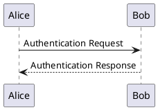

### 反向箭头

箭头方向可以反过来写，效果相同。

示例代码：

```text
@startuml
Alice <- Bob: Response
Alice <-- Bob: Async Response
@enduml
```

渲染效果：

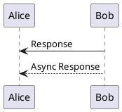

---

## 三、声明参与者

PlantUML 支持多种参与者类型，不同类型有不同的图形符号和语义含义。下面逐一介绍：

### actor（参与者）

**功能**：表示系统外部的角色，是与系统交互的人或其他系统。图形为火柴人（stick figure），直观表达"人"的概念。

**使用场景**：用户、管理员、第三方系统、外部服务调用者。

示例代码：

```text
@startuml
actor User
actor Admin
participant System

User -> System : 发起请求
Admin -> System : 管理操作
@enduml
```

渲染效果：

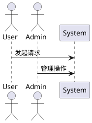

### boundary（边界）

**功能**：表示系统边界，通常是接收外部请求的入口点。图形为圆形边框，象征"入口"或"接口"。

**使用场景**：API 接口、控制器（Controller）、网关、前端入口、REST Endpoint。

示例代码：

```text
@startuml
actor User
boundary "API Gateway" as Gateway
participant Service

User -> Gateway : HTTP Request
Gateway -> Service : 路转发
@enduml
```

渲染效果：

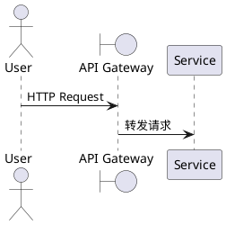

### control（控制）

**功能**：表示控制逻辑，负责协调和调度业务流程。图形为圆形带箭头，象征"控制者"或"协调者"。

**使用场景**：业务控制器、Service 层、流程编排器、服务协调层。

示例代码：

```text
@startuml
boundary Controller
control "OrderService" as Service
entity Order
database DB

Controller -> Service : 创建订单
Service -> Order : 构建订单对象
Service -> DB : 保存订单
@enduml
```

渲染效果：

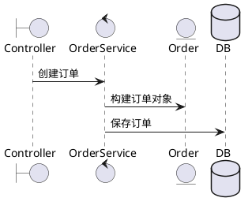

### entity（实体）

**功能**：表示业务实体或领域对象，承载业务数据。图形为圆形，象征"数据载体"。

**使用场景**：业务对象、领域模型、DTO（Data Transfer Object）、POJO。

示例代码：

```text
@startuml
control Service
entity "UserDTO" as User
entity "OrderDTO" as Order

Service -> User : 填充用户数据
Service -> Order : 填充订单数据
@enduml
```

渲染效果：

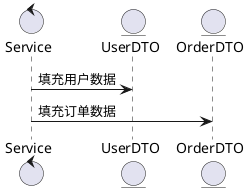

### database（数据库）

**功能**：表示数据存储层，负责数据的持久化。图形为圆柱形，经典数据库图标。

**使用场景**：MySQL、PostgreSQL、Redis、MongoDB、文件存储。

示例代码：

```text
@startuml
control Service
database MySQL
database Redis

Service -> MySQL : 写入主数据
Service -> Redis : 缓存热点数据
@enduml
```

渲染效果：

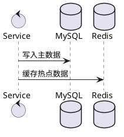

### collections（集合）

**功能**：表示集合或批量数据，多条记录的集合。图形为多个矩形堆叠，象征"一堆数据"。

**使用场景**：数据列表、分页数据、批量处理、消息队列。

示例代码：

```text
@startuml
control Service
collections "OrderList" as Orders
collections "MessageQueue" as MQ

Service -> Orders : 批量查询订单
Service -> MQ : 发送批量消息
@enduml
```

渲染效果：

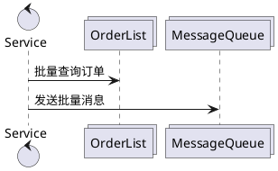

### participant（通用参与者）

**功能**：通用参与者，无特定语义，图形为矩形。适用于任何无法归类的对象。

**使用场景**：服务、模块、组件、中间件、工具类。

示例代码：

```text
@startuml
participant "AuthService" as Auth
participant "LogService" as Log
participant "Utils"

Auth -> Log : 记录日志
Log -> Utils : 格式化时间
@enduml
```

渲染效果：

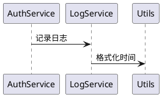

### 类型对比总览

| 类型 | 图形 | 核心语义 | 典型代表 |
| ------ | ------ | ------ | ------ |
| actor | 火柴人 | 外部角色 | User、Admin |
| boundary | 圆形边框 | 系统入口 | Controller、Gateway |
| control | 圆形带箭头 | 业务协调 | Service、Orchestrator |
| entity | 圆形 | 数据载体 | DTO、Entity |
| database | 圆柱形 | 数据存储 | MySQL、Redis |
| collections | 堆叠矩形 | 批量数据 | List、Queue |
| participant | 矩形 | 通用对象 | Module、Component |

### 别名和颜色

- 使用 `as` 关键字设置别名，简化后续引用
- 使用 `#颜色` 设置背景色

示例代码：

```text
@startuml
participant "这是一个很长的名字" as A #99FF99
actor User as U #LightBlue
A -> U: Hello
@enduml
```

渲染效果：

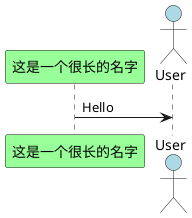

### 自定义显示顺序

使用 `order` 控制参与者的排列顺序。

示例代码：

```text
@startuml
participant C order 30
participant B order 20
participant A order 10

C -> B: 消息1
B -> A: 消息2
@enduml
```

渲染效果：

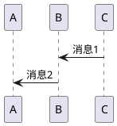

---

## 四、箭头样式大全

PlantUML 提供了丰富的箭头样式，不同的箭头表达不同的消息语义。先看总览：

### 箭头样式总览

| 样式 | 语法 | 效果 | 适用场景 |
| ------ | ------ | ------ | ------ |
| 基本箭头 | `->` | 实线同步消息 | 日常使用 |
| 异步箭头 | `-->` | 虚线异步消息 | 返回响应 |
| 丢失消息 | `->x` | 末端带 × | 网络故障、超时 |
| 细箭头 | `->>` | 头部更细 | 日志、心跳 |
| 半箭头 | `-\` / `/-` | 只显示一半 | 异步回调 |
| 开放箭头 | `->o` | 末端空心圆 | 消息入队 |
| 双向箭头 | `<->` | 两端都有头 | 实时通信 |
| 彩色箭头 | `-[#颜色]>` | 指定颜色 | 区分消息类型 |
| 外部消息 | `[->` / `->]` | 来自/发送到外部 | 系统边界交互 |

下面逐一详细介绍每种箭头样式：

### 基本箭头（->）

**功能**：实线箭头，表示同步消息。发送方发出消息后会等待接收方响应，才能继续执行。

**使用场景**：函数调用、API 请求、方法调用、需要等待结果的操作。

示例代码：

```text
@startuml
Alice -> Bob : 同步请求
@enduml
```

渲染效果：

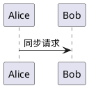

### 异步箭头（-->）

**功能**：虚线箭头，表示异步消息或返回消息。发送方发出消息后不等待响应，直接继续执行。

**使用场景**：返回响应、异步通知、事件触发、不阻塞的操作。

示例代码：

```text
@startuml
Alice -> Bob : 同步请求
Bob --> Alice : 异步响应
@enduml
```

渲染效果：

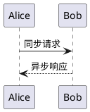

### 丢失消息（->x）

**功能**：箭头末端带 `x`，表示消息丢失或未到达目标。常用于表示网络故障、超时、异常中断等情况。

**使用场景**：请求超时、网络断开、消息发送失败、连接中断。

示例代码：

```text
@startuml
Client -> Server : 发送请求
Server ->x Client : 响应丢失
note right: 网络中断
@enduml
```

渲染效果：

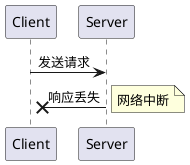

### 细箭头（->>）

**功能**：箭头头部更细，视觉上更轻量。可用于表示次要消息或轻量级通知。

**使用场景**：日志记录、心跳检测、通知消息、非关键通信。

示例代码：

```text
@startuml
Service ->> Logger : 记录日志
Service ->> Monitor : 发送心跳
@enduml
```

渲染效果：

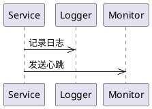

### 半箭头（-\ 和 /-）

**功能**：箭头只显示一半，用于表示"试探性"或"部分"的消息。

- `-\` 左斜半箭头
- `/-` 右斜半箭头

**使用场景**：试探性请求、异步回调、部分响应、非完整交互。

示例代码：

```text
@startuml
Client -\ Server : 试探请求
Server /- Client : 异步回调
@enduml
```

渲染效果：

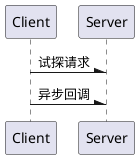

### 开放箭头（->o）

**功能**：箭头末端为空心圆圈，表示"开放"的消息。常用于表示消息被接收但未完全处理。

**使用场景**：消息入队、待处理状态、缓冲接收、延迟处理。

示例代码：

```text
@startuml
Producer ->o Queue : 消息入队
note right: 等待消费
@enduml
```

渲染效果：

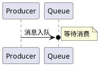

### 双向箭头（<->）

**功能**：箭头两端都有头部，表示双向通信或即时交互。双方同时发送和接收。

**使用场景**：WebSocket 通信、电话通话、实时对话、双向数据流。

示例代码：

```text
@startuml
Client <-> Server : WebSocket 连接
PhoneA <-> PhoneB : 语音通话
@enduml
```

渲染效果：

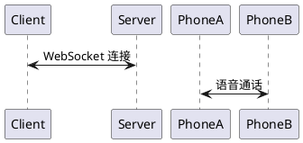

### 彩色箭头（-[#颜色]>）

**功能**：为箭头添加颜色，用于突出重要消息或区分不同类型的消息。

**使用场景**：错误消息用红色、成功消息用绿色、警告消息用黄色、调试信息用蓝色。

示例代码：

```text
@startuml
Alice -> Bob : 正常请求
Alice -[#red]> Bob : 错误请求
Alice -[#green]> Bob : 成功响应
Alice -[#blue]> Bob : 调试信息
@enduml
```

渲染效果：

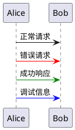

### 外部消息（[-> 和 ->]）

**功能**：使用 `[` 和 `]` 表示消息来自或发送到系统外部（不在图中显示的参与者）。方括号代表"外部边界"。

**使用场景**：外部系统输入、输出到外部、与未绘制的系统交互、系统边界交互。

示例代码：

```text
@startuml
[-> System : 外部请求
System -> Service : 处理请求
Service ->] : 输出到外部
@enduml
```

渲染效果：

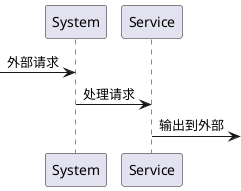

---

## 五、激活与销毁生命线

生命线激活表示对象正在执行操作（在生命线上显示一个矩形条）：

### 显式方式

示例代码：

```text
@startuml
Alice -> Bob: hello
activate Bob
Bob -> Charlie: hi
activate Charlie
return done
deactivate Charlie
return ok
deactivate Bob
@enduml
```

渲染效果：

```plantuml
@startuml
Alice -> Bob: hello
activate Bob
Bob -> Charlie: hi
activate Charlie
return done
deactivate Charlie
return ok
deactivate Bob
@enduml
```

### 简写语法（推荐）

示例代码：

```text
@startuml
Alice -> Bob ++ : hello     ' ++ 激活 Bob
Bob -> Charlie --++ : hi    ' -- 反激活 Bob，++ 激活 Charlie
return done                 ' return 自动反激活
@enduml
```

渲染效果：

```plantuml
@startuml
Alice -> Bob ++ : hello     ' ++ 激活 Bob
Bob -> Charlie --++ : hi    ' -- 反激活 Bob，++ 激活 Charlie
return done                 ' return 自动反激活
@enduml
```

| 简写 | 含义 |
|------|------|
| `++` | 激活目标生命线 |
| `--` | 反激活源生命线 |
| `**` | 创建实例 |
| `!!` | 销毁实例 |

### 创建和销毁对象

使用 `create` 声明要创建的参与者，用 `destroy` 或 `!!` 销毁。

示例代码：

```text
@startuml
participant Alice
participant Bob

Bob -> Alice ++: 请求
create Other
Alice -> Other **: 创建实例
Alice -> Bob !!: 销毁实例
@enduml
```

渲染效果：

```plantuml
@startuml
participant Alice
participant Bob

Bob -> Alice ++: 请求
create Other
Alice -> Other **: 创建实例
Alice -> Bob !!: 销毁实例
@enduml
```

### 入口和出口消息

示例代码：

```text
@startuml
[-> A: 外部输入
A -> B: 内部处理
B ->]: 输出到外部
@enduml
```

渲染效果：

```plantuml
@startuml
[-> A: 外部输入
A -> B: 内部处理
B ->]: 输出到外部
@enduml
```

---

## 六、分组框（控制流）

PlantUML 支持多种分组框，用于表达条件、循环等控制流：

| 关键字 | 用途 |
|--------|------|
| `alt` / `else` | 条件分支（if-else） |
| `opt` | 可选分支（if，无 else） |
| `loop` | 循环 |
| `par` | 并行执行 |
| `break` | 中断 |
| `critical` | 关键区域 |
| `group` | 通用分组 |

### 条件分支

示例代码：

```text
@startuml
Alice -> Bob: 认证请求
alt 认证成功
  Bob -> Alice: OK
else 认证失败
  Bob -> Alice: Fail
end
@enduml
```

渲染效果：

```plantuml
@startuml
Alice -> Bob: 认证请求
alt 认证成功
  Bob -> Alice: OK
else 认证失败
  Bob -> Alice: Fail
end
@enduml
```

### 可选流程

示例代码：

```text
@startuml
Alice -> Bob: 请求数据
opt 数据已缓存
  Bob --> Alice: 返回缓存数据
end
@enduml
```

渲染效果：

```plantuml
@startuml
Alice -> Bob: 请求数据
opt 数据已缓存
  Bob --> Alice: 返回缓存数据
end
@enduml
```

### 循环

示例代码：

```text
@startuml
loop 重试 3 次
Alice -> Bob: 发送请求
Bob --> Alice: 响应
end
@enduml
```

渲染效果：

```plantuml
@startuml
loop 重试 3 次
Alice -> Bob: 发送请求
Bob --> Alice: 响应
end
@enduml
```

### 并行执行

示例代码：

```text
@startuml
Alice -> Bob: 开始
par 并行任务1
Alice -> Charlie: 任务 A
else 并行任务2
Alice -> Dave: 任务 B
end
Bob --> Alice: 完成
@enduml
```

渲染效果：

```plantuml
@startuml
Alice -> Bob: 开始
par 并行任务1
Alice -> Charlie: 任务 A
else 并行任务2
Alice -> Dave: 任务 B
end
Bob --> Alice: 完成
@enduml
```

### 自定义分组

示例代码：

```text
@startuml
group 用户认证流程 #LightBlue
  Alice -> Bob: 登录请求
  Bob --> Alice: 返回 Token
end
@enduml
```

渲染效果：

```plantuml
@startuml
group 用户认证流程 #LightBlue
  Alice -> Bob: 登录请求
  Bob --> Alice: 返回 Token
end
@enduml
```

---

## 七、添加注释（Note）

示例代码：

```text
@startuml
Alice -> Bob: 登录请求

note left of Alice: Alice 是客户端
note right of Bob: Bob 是服务端
note over Alice, Bob: 这是双方之间的交互
end note

note left: 这是一条独立注释
note right
  多行注释
  可以写详细说明
end note

@enduml
```

渲染效果：

```plantuml
@startuml
Alice -> Bob: 登录请求

note left of Alice: Alice 是客户端
note right of Bob: Bob 是服务端
note over Alice, Bob: 这是双方之间的交互
end note

note left: 这是一条独立注释
note right
  多行注释
  可以写详细说明
end note

@enduml
```

| 语法 | 效果 |
|------|------|
| `note left of X` | 在 X 左侧 |
| `note right of X` | 在 X 右侧 |
| `note over X, Y` | 跨 X 和 Y |
| `hnote` | 六边形注释 |
| `rnote` | 矩形注释 |
| `note across` | 跨越所有参与者 |

---

## 八、自动编号

示例代码：

```text
@startuml
autonumber
Alice -> Bob: 第一条消息
Bob --> Alice: 第二条消息
autonumber 15 10
Alice -> Bob: 从 15 开始，每次加 10
autonumber stop
Alice -> Bob: 不编号的消息
autonumber resume
Bob --> Alice: 继续编号
autonumber "<b>[000]"
Alice -> Bob: 自定义编号格式
@enduml
```

渲染效果：

```plantuml
@startuml
autonumber
Alice -> Bob: 第一条消息
Bob --> Alice: 第二条消息
autonumber 15 10
Alice -> Bob: 从 15 开始，每次加 10
autonumber stop
Alice -> Bob: 不编号的消息
autonumber resume
Bob --> Alice: 继续编号
autonumber "<b>[000]"
Alice -> Bob: 自定义编号格式
@enduml
```

- `autonumber` — 开启自动编号，从 1 开始
- `autonumber 起始值 步长` — 自定义起始和步长
- `autonumber stop / resume` — 暂停/恢复编号
- `autonumber "格式"` — 自定义编号格式

---

## 九、分割线和延迟

示例代码：

```text
@startuml
Alice -> Bob: 第一阶段
== 阶段完成 ==
Bob -> Charlie: 第二阶段
...                 ' 延迟/时间流逝
Charlie --> Bob: 响应
|||                 ' 空白间距
||50||              ' 50 像素间距
Bob --> Alice: 最终响应
@enduml
```

渲染效果：

```plantuml
@startuml
Alice -> Bob: 第一阶段
== 阶段完成 ==
Bob -> Charlie: 第二阶段
...                 ' 延迟/时间流逝
Charlie --> Bob: 响应
|||                 ' 空白间距
||50||              ' 50 像素间距
Bob --> Alice: 最终响应
@enduml
```

| 语法 | 效果 |
|------|------|
| `== 文字 ==` | 分割线 |
| `...` | 延迟 |
| `|||` | 间距 |
| `||N||` | N 像素间距 |

---

## 十、Stereotypes（构造型）

示例代码：

```text
@startuml
participant Bob << (C,#ADD1B2) 可测试 >>
participant Alice << 数据库 >>
@enduml
```

渲染效果：

```plantuml
@startuml
participant Bob << (C,#ADD1B2) 可测试 >>
participant Alice << 数据库 >>
@enduml
```

Stereotypes 可以为参与者添加标签和图标。

---

## 十一、对参与者分组（Box）

示例代码：

```text
@startuml
box "服务层" #LightBlue
  participant ServiceA
  participant ServiceB
end box
box "数据层" #LightGreen
  participant DB
  participant Cache
end box
@enduml
```

渲染效果：

```plantuml
@startuml
box "服务层" #LightBlue
  participant ServiceA
  participant ServiceB
end box
box "数据层" #LightGreen
  participant DB
  participant Cache
end box
@enduml
```

使用 `box` 将相关参与者分组并添加背景色。

---

## 十二、标题、页眉和页脚

示例代码：

```text
@startuml
title 用户登录时序图
header 系统架构文档 - 认证模块
footer 第 %page% 页，共 %lastpage% 页
@enduml
```

渲染效果：

```plantuml
@startuml
title 用户登录时序图
header 系统架构文档 - 认证模块
footer 第 %page% 页，共 %lastpage% 页
@enduml
```

---

## 十三、外观定制

PlantUML 提供了丰富的 `skinparam` 配置：

示例代码：

```text
@startuml
skinparam sequenceMessageAlign right        ' 消息文本右对齐
skinparam responseMessageBelowArrow true     ' 响应消息显示在箭头下方
skinparam actorStyle awesome                 ' 火柴人风格（或 hollow）
skinparam lifelineStrategy solid             ' 生命线使用实线
skinparam style strictuml                    ' 严格 UML 风格
hide footbox                                 ' 隐藏底部参与者框
hide unlinked                                ' 隐藏未连接的参与者
@enduml
```

渲染效果：

```plantuml
@startuml
skinparam sequenceMessageAlign right        ' 消息文本右对齐
skinparam responseMessageBelowArrow true     ' 响应消息显示在箭头下方
skinparam actorStyle awesome                 ' 火柴人风格（或 hollow）
skinparam lifelineStrategy solid             ' 生命线使用实线
skinparam style strictuml                    ' 严格 UML 风格
hide footbox                                 ' 隐藏底部参与者框
hide unlinked                                ' 隐藏未连接的参与者
@enduml
```

---

## 十四、分组着色

可以为分组框添加不同的背景色：

示例代码：

```text
@startuml
alt #LightBlue 认证成功
Bob -> Alice: Token
else #Pink 认证失败
Bob -> Alice: Error
end
@enduml
```

渲染效果：

```plantuml
@startuml
alt #LightBlue 认证成功
Bob -> Alice: Token
else #Pink 认证失败
Bob -> Alice: Error
end
@enduml
```

---

## 十五、实战示例：用户登录流程

结合以上语法，绘制一个完整的用户登录时序图：

示例代码：

```text
@startuml
title 用户登录流程
hide footbox
autonumber

actor User as U
boundary Gateway
participant "Auth Service" as Auth
participant "User Service" as UserService
database "User DB" as DB

box "认证模块" #LightBlue
Auth
DB
end box

U -> Gateway ++ : 输入账号密码
Gateway -> Auth ++ : 转发登录请求

Auth -> UserService ++ : 查询用户信息
UserService -> DB ++ : SELECT * FROM users
DB --> UserService -- : 返回用户数据
UserService --> Auth -- : 验证结果

alt 登录成功
Auth -> Auth : 生成 JWT Token
Auth --> Gateway -- : 返回 Token
Gateway --> U -- : 登录成功，跳转首页
else 登录失败
Auth --> Gateway -- : 返回失败原因
Gateway --> U -- : 显示错误信息
end

@enduml
```

渲染效果：

```plantuml
@startuml
title 用户登录流程
hide footbox
autonumber

actor User as U
boundary Gateway
participant "Auth Service" as Auth
participant "User Service" as UserService
database "User DB" as DB

box "认证模块" #LightBlue
Auth
DB
end box

U -> Gateway ++ : 输入账号密码
Gateway -> Auth ++ : 转发登录请求

Auth -> UserService ++ : 查询用户信息
UserService -> DB ++ : SELECT * FROM users
DB --> UserService -- : 返回用户数据
UserService --> Auth -- : 验证结果

alt 登录成功
Auth -> Auth : 生成 JWT Token
Auth --> Gateway -- : 返回 Token
Gateway --> U -- : 登录成功，跳转首页
else 登录失败
Auth --> Gateway -- : 返回失败原因
Gateway --> U -- : 显示错误信息
end

@enduml
```

---

## 十六、快速参考表

| 功能 | 语法 |
|------|------|
| 同步消息 | `A -> B: 消息` |
| 异步消息 | `A --> B: 消息` |
| 反向箭头 | `A <- B` / `A <-- B` |
| 激活/反激活 | `++` / `--` |
| 创建对象 | `create X` |
| 销毁对象 | `!!` 或 `->x` |
| 左侧注释 | `note left of A: 内容` |
| 跨参与者注释 | `note over A, B: 内容` |
| 分割线 | `== 标题 ==` |
| 延迟 | `...` |
| 条件分支 | `alt ... else ... end` |
| 可选流程 | `opt ... end` |
| 循环 | `loop ... end` |
| 并行 | `par ... and ... end` |
| 自动编号 | `autonumber` |
| 声明类型 | `actor` / `participant` / `database` / `boundary` / `control` / `entity` |
| 分组框 | `box "标题" #颜色 ... end box` |

---

**提示：** 可以使用 [PlantUML 在线编辑器](https://www.plantuml.com/plantuml/uml/) 实时预览和导出时序图。
