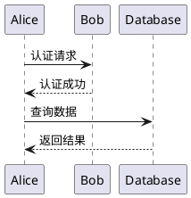
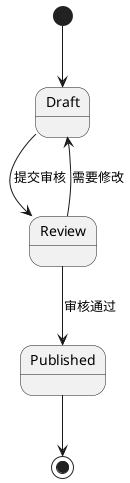

## 序列图示例

```plantuml
@startuml
Alice -> Bob: 认证请求
Bob --> Alice: 认证成功
Alice -> Database: 查询数据
Database --> Alice: 返回结果
@enduml
```

## 状态图示例

```plantuml
@startuml
[*] --> Draft
Draft --> Review: 提交审核
Review --> Published: 审核通过
Review --> Draft: 需要修改
Published --> [*]
@enduml
```
