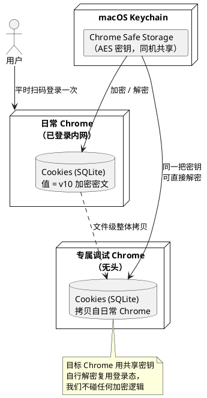
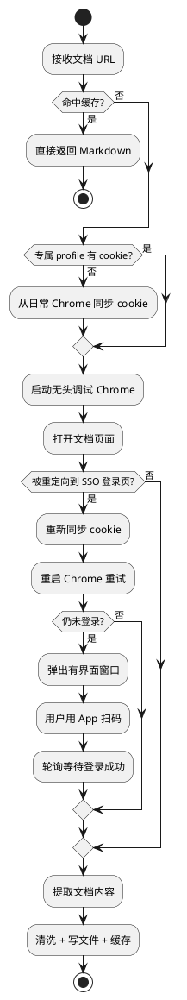
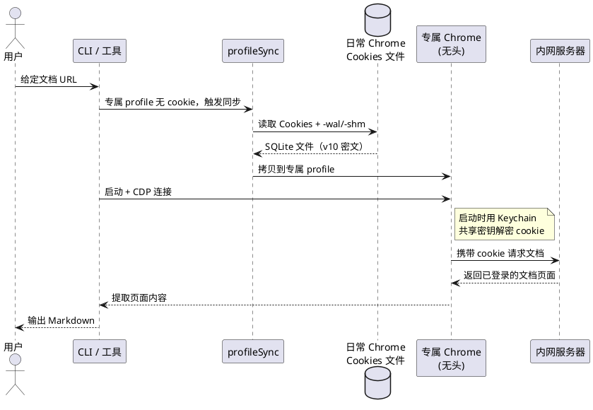

## 简介

用 Puppeteer / Playwright 这类自动化浏览器去抓取需要登录的内网文档时，第一道坎永远是登录态：页面背后是企业 SSO，没有有效会话就会被重定向到统一登录页，什么内容都拿不到。

常见做法是每次启动一个全新的浏览器实例，然后人工扫码登录一次。这在偶尔跑一次时还能忍，但如果想把抓取做成一个随手可调的工具（比如一个 CLI 或 MCP 服务），每次都要扫码就完全不可接受了。

本文介绍一种零扫码方案，它的核心不是"自动登录"，而是**复用你日常 Chrome 里已经存在的登录态**。整个方案不解密任何 cookie，也不调用任何 Keychain API，只做文件拷贝——却能让一个独立的无头 Chrome 直接以"已登录"状态打开内网文档。方案来自一个实际项目 `jd-reader`（把京东内网文档转 Markdown），但原理对任何 macOS + Chrome + SSO 的场景都通用。

---

## 要解决的问题

把"自动化抓取内网文档"做成可随时调用的工具，需要同时跨过三道坎：

**第一，登录态从哪来。** 自动化浏览器是全新的实例，没有任何会话 cookie。手动扫码能解决一次，但工具化场景下不能每次都扫。

**第二，不能直接用日常 Chrome 的 profile。** 一个看似自然的想法是：既然日常 Chrome 已经登录了，那就直接对它开远程调试端口，让 Puppeteer 连上去用。但 **Chrome 136+ 出于安全考虑，禁止对默认 profile（默认 user-data-dir）开启远程调试端口**。这条路被官方堵死了。

**第三，自己解密 cookie 太脆弱。** 另一个想法是：读出日常 Chrome 的 cookie，解密后注入到自动化浏览器。但 macOS 上 Chrome 的 cookie 是加密存储的，自己解密意味着要：调用 Keychain API 取密钥、处理 `v10` 加密格式、做 AES 解密、再按目标浏览器的格式重新注入。代码复杂不说，**一旦 Chrome 升级改了加密方案，整套逻辑就得跟着改**，维护成本很高。

理想方案应该是：复用现成登录态、绕开默认 profile 的限制、且不依赖任何会随 Chrome 版本变化的加密细节。

---

## 核心原理：同机 Keychain 密钥共享

突破口在于理解 macOS 上 Chrome 是怎么加密 cookie 的。

Chrome 把 cookie 存在一个 SQLite 数据库文件里（路径形如 `Default/Network/Cookies`），但 cookie 的**值**不是明文，而是用 AES 加密后的密文，密文带一个 `v10` 前缀标识加密版本。加密用的密钥不在文件里，而是存放在 **macOS Keychain 的一个名为 `Chrome Safe Storage` 的条目**中。

关键事实是：**这把密钥是同机、同用户共享的**。也就是说，同一台 Mac、同一个登录用户下，无论哪个 Chrome 实例（哪怕是另起的、用不同 user-data-dir 的实例），向 Keychain 要 `Chrome Safe Storage` 时拿到的都是**同一把密钥**。

这就推出了一个关键结论：

> 既然密钥是共享的，那么把日常 Chrome 的 Cookies 数据库文件**整个拷贝**给另一个 Chrome 实例，那个实例用同一把 Keychain 密钥，就能就地解密、直接复用这些 cookie——**完全不需要我们自己去解密**。

我们要做的只是文件拷贝，解密这件事交给目标 Chrome 自己用共享密钥完成。

下图说明这个"一把密钥，两个 Chrome"的关系：



这个方案的好处在第三道坎上体现得最明显：因为我们从不接触加密格式，**Chrome 以后无论怎么升级加密方案，方案都自动兼容**——加密和解密始终是同一台机器上同版本 Chrome 的事，密钥永远自洽。

---

## 整体架构

方案的落地需要一个"专属调试 Chrome"来绕开默认 profile 的限制。它用一个独立的 user-data-dir（与日常 Chrome 完全隔离），因此可以放心地对它开远程调试端口，再用 `puppeteer-core` 通过 CDP（Chrome DevTools Protocol）连上去操控。

代价是：这个专属 profile 一开始是空的、没有任何登录态。于是就有了"按需把日常 Chrome 的 cookie 同步过来"这一步。整体模块划分如下：

| 模块 | 职责 |
|------|------|
| `profileSync` | 把日常 Chrome 的 Cookies 文件拷贝到专属 profile |
| `browser` | 启动专属调试 Chrome、用 CDP 连接、检测登录态 |
| 主流程编排 | 缓存 → 登录态（按需同步 + 扫码兜底）→ 提取 → 落盘 |

数据流向是：日常 Chrome 的 Cookies 文件 →（拷贝）→ 专属 profile → 专属 Chrome 启动时加载 →（携带 cookie）→ 请求内网文档 → 拿到已登录页面 → Puppeteer 提取内容。

---

## 实现细节

### Cookie 同步：拷贝文件，而非解密

同步逻辑只做一件事：把源 Cookies 文件拷到专属 profile。但有几个工程细节决定它是否可靠。

**定位源文件**。新版 Chrome 把 cookie 放在 `Default/Network/Cookies`，旧版放在 `Default/Cookies`，需要都探测一遍：

```typescript
const srcNetwork = join(CHROME_DEFAULT_PROFILE, "Network", "Cookies");
const srcLegacy = join(CHROME_DEFAULT_PROFILE, "Cookies");

let src: string;
if (existsSync(srcNetwork)) {
  src = srcNetwork;
} else if (existsSync(srcLegacy)) {
  src = srcLegacy;
} else {
  throw new Error("未找到日常 Chrome 的 Cookies 文件，请确认已登录过内网。");
}
```

**连带拷贝 SQLite 的伴随文件**。SQLite 在 WAL 模式下，最新写入可能还在 `-wal`（预写日志）里，没合并进主文件。如果只拷主文件，可能读到旧快照、丢掉最近的登录。所以要把 `-wal` 和 `-shm` 一起拷：

```typescript
function copyWithSidecars(src: string, dest: string): void {
  copyFileSync(src, dest);
  for (const ext of ["-wal", "-shm"]) {
    const s = src + ext;
    if (existsSync(s)) {
      try {
        copyFileSync(s, dest + ext);
      } catch {
        // 伴随文件拷贝失败不致命
      }
    }
  }
}
```

**目标位置写两份**。为兼容不同版本 Chrome 的读取位置，新旧两个路径（`Default/Network/Cookies` 和 `Default/Cookies`）都写一份。

**关于 Local State**。在 Windows/Linux 上，cookie 解密密钥（经 DPAPI 等加密后）存在 `Local State` 文件里；但**在 macOS 上，真正的密钥在 Keychain，`Local State` 只是兜底**，拷不拷都不影响解密。代码里顺手同步它，失败也不当回事。

还有一个容易踩的坑：**同步必须在专属 Chrome 关闭时进行**。一是 Chrome 运行时会锁定 Cookies 文件，二是 **Chrome 只在启动时加载一次 cookie**——所以"同步 cookie"和"重启 Chrome"必须成对出现，先拷文件再启动才生效。

### 启动专属调试 Chrome 并用 CDP 连接

用独立 user-data-dir 启动 Chrome，开调试端口，无头模式下加 `--headless=new`：

```typescript
const args = [
  `--remote-debugging-port=${DEBUG_PORT}`,
  `--user-data-dir=${PROFILE_DIR}`,   // 独立 profile，绕开默认 profile 限制
  "--no-first-run",
  "--no-default-browser-check",
  "--remote-allow-origins=*",
];
if (!headed) args.unshift("--headless=new");
```

启动后轮询 `http://127.0.0.1:<port>/json/version` 等 CDP 就绪，再用 `puppeteer.connect({ browserURL })` 连上去。`--user-data-dir` 指向我们自己的目录，这正是绕开"默认 profile 不许开调试端口"限制的关键。

### 登录态检测

未登录时，内网页面会被重定向到统一 SSO 登录页。检测方法很朴素——看最终 URL 和页面标题是否命中登录页特征：

```typescript
export function isLoginPage(url: string, title: string): boolean {
  const u = (url || "").toLowerCase();
  if (LOGIN_URL_MARKERS.some((m) => u.includes(m.toLowerCase()))) return true;
  if (LOGIN_TITLE_MARKERS.some((m) => (title || "").includes(m))) return true;
  return false;
}
```

`LOGIN_URL_MARKERS` 是 `passport.jd.com`、`/passport/` 之类的登录域名片段，`LOGIN_TITLE_MARKERS` 是"统一登录"等标题关键词。

### 三级登录态兜底

主流程把登录态处理设计成三级递进，越往后越"重"，尽量让用户无感：

1. **首次同步**：专属 profile 没有 cookie，就先从日常 Chrome 同步一次。
2. **重定向后重试**：打开文档若被重定向到 SSO（可能是同步前 profile 是空的），重新同步 cookie 再重启重试一次。
3. **扫码兜底**：若仍未登录（说明日常 Chrome 的 SSO 会话也真过期了），才弹出有界面窗口让用户扫码；扫码成功后登录态持久化在专属 profile 里，之后又能无感复用。

完整工作流如下：



### 首次抓取的完整交互

把首次抓取（专属 profile 还是空的）的各方交互串成时序图，能更直观地看到 cookie 是如何"平移"的：



---

## 关键设计决策

**为什么是文件拷贝，而不是自己解密 cookie？**
自己解密要调 Keychain、处理 `v10` 格式、做 AES 解密，代码复杂且随 Chrome 升级而失效。文件拷贝把解密这件事完全交给目标 Chrome——我们不碰加密逻辑，因此天然兼容任何 Chrome 版本。

**为什么要一个专属 profile，而不是直接用日常 Chrome？**
Chrome 136+ 禁止对默认 profile 开远程调试端口。用独立 user-data-dir 另起一个 Chrome，既能开调试端口供 Puppeteer 操控，又与日常 Chrome 隔离、互不干扰。

**为什么同步要连带 `-wal` / `-shm`？**
SQLite 的 WAL 模式下，最近写入可能还在 `-wal` 日志里没合并进主库。只拷主文件可能读到旧快照、丢掉最新登录态。

**为什么同步必须在专属 Chrome 关闭时做？**
运行中的 Chrome 会锁定 Cookies 文件；且 Chrome 只在启动时加载 cookie。所以"同步 + 重启"必须成对，先拷文件，再启动才生效。

**为什么留扫码兜底？**
密钥共享只能复用**有效**的登录态。如果日常 Chrome 的 SSO 会话本身过期了，拷过来的 cookie 也是失效的，这时只能让用户重新扫码一次——之后登录态持久化在专属 profile，又恢复无感。

---

## 适用范围与局限

**适用范围**。这套方案对"macOS + Chrome + SSO 内网系统"普遍适用。同一套登录态甚至能覆盖同一 SSO 体系下的多个子站点——只要它们共享同一份会话 cookie，同步一次全都能登。

**局限**。

- **平台绑定 macOS**。原理依赖 macOS Keychain 的密钥共享机制。Windows 用 DPAPI、Linux 用 `kwallet`/`gnome-keyring` 或明文，密钥的存取方式不同，方案要相应调整。
- **依赖日常 Chrome 已登录**。它复用的是现成登录态，不是自动登录。前提是你确实在日常 Chrome 登录过目标系统。
- **会话过期需扫码一次**。cookie 真过期时绕不开人工扫码，这是 SSO 安全设计使然，无法也不应规避。
- **调试端口可能被占用**。残留的 Chrome 进程会占着调试端口，需要工具自己做端口探测和清理。

这套方案的价值，本质上是把一件"看起来要写一堆解密代码"的事，化简成了"拷几个文件 + 借一把现成的密钥"。它不绕过任何安全机制——登录还是你本人扫的码，密钥还是系统管的——只是省掉了重复劳动。

---

## 参考资料

- Puppeteer：[pptr.dev](https://pptr.dev/)
- Chrome DevTools Protocol：[chromedevtools.github.io/devtools-protocol](https://chromedevtools.github.io/devtools-protocol/)
- Chromium cookie 加密说明（os_crypt）：[chromium.googlesource.com](https://chromium.googlesource.com/chromium/src/+/main/components/os_crypt/)
