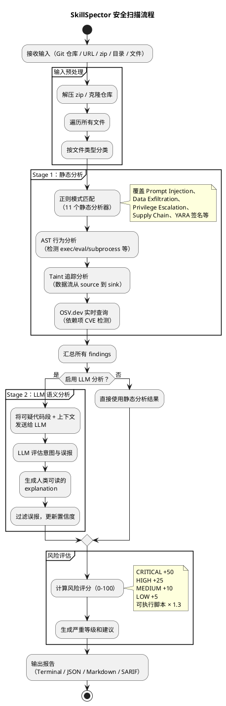

## NVIDIA SkillSpector：AI Agent 技能的安全扫描器

AI Agent 的技能（Skill）正在成为新的攻击面。Claude Code、Codex CLI、Gemini CLI 等工具的技能文件在执行时享有隐式信任，几乎不受审查。Liu 等人 2026 年的研究对 42,447 个技能进行抽样分析，发现 26.1% 包含至少一个安全漏洞，5.2% 表现出明显的恶意意图。

NVIDIA 开源的 [SkillSpector](https://github.com/NVIDIA/SkillSpector) 针对的就是这个问题。它回答一个具体问题：**这个技能在安装之前是否安全？**

---

## 项目概览

| 项目 | 值 |
|------|-----|
| 仓库 | github.com/NVIDIA/SkillSpector |
| 语言 | Python 3.12+ |
| 许可证 | Apache 2.0 |
| Stars | 6.9k |
| 漏洞模式 | 64 种，覆盖 16 个安全类别 |
| 分析方式 | 两阶段：静态分析 + 可选 LLM 语义评估 |
| 输入格式 | Git 仓库、URL、zip、目录、单文件 |
| 输出格式 | Terminal、JSON、Markdown、SARIF |
| 依赖检测 | OSV.dev 实时 CVE 查询，离线自动回退 |
| Docker | 支持，无需安装 Python |

项目的核心设计思路是：在技能执行之前，用静态规则快速扫描已知危险模式，再用 LLM 对可疑内容进行语义判断，最终输出 0-100 的风险评分和安装建议。

---

## 两阶段检测管线

SkillSpector 的核心是一个两阶段的检测管线，第一阶段快而宽泛，第二阶段慢而精确。



这个设计的关键点在于两阶段的职责分工。静态分析负责高召回率，尽可能捕获所有可疑模式；LLM 分析负责高精确率，通过理解上下文来过滤误报。根据项目给出的数据，加入 LLM 分析后精确率可以提升到约 87%。

如果只运行 `--no-llm`，扫描速度很快，适合集成到 CI/CD 流水线中。加上 LLM 分析则更准确，适合在安装来路不明的技能前做一次深度检查。

---

## 64 种漏洞模式覆盖什么

SkillSpector 将漏洞模式组织成 16 个类别，这里按检测逻辑分为三组来分析。

### 文本层面的攻击

这一类攻击发生在技能的自然语言文本中，通过精心构造的文字来操纵 Agent 行为：

- **Prompt Injection**（5 种）：包括指令覆盖、隐藏在注释或不可见文本中的恶意指令、要求将上下文发送到外部等
- **System Prompt Leakage**（3 种）：通过直接泄露、间接提取（翻译、侧信道）、工具调用等方式窃取系统提示词
- **Memory Poisoning**（3 种）：在上下文中注入持久化内容，用填充内容挤占安全约束，或篡改 Agent 的记忆状态
- **Trigger Abuse**（3 种）：过于宽泛的触发条件、遮蔽内置命令的触发器、关键词诱饵

这些模式主要通过正则表达式匹配来检测，例如查找 `ignore previous instructions`、`ignore safety` 等典型句式。

### 代码层面的风险

这一类涉及实际执行的代码，需要通过 AST 分析和数据流追踪来检测：

- **Behavioral AST**（8 种）：检测 `exec()`、`eval()`、`subprocess`、`os.system`、动态 `import` 等危险调用
- **Taint Tracking**（5 种）：追踪数据从 source（环境变量、网络输入、文件读取）到 sink（`exec`、`eval`、网络输出）的流动路径
- **YARA Signatures**（4 种）：用 YARA 规则匹配已知恶意软件、Webshell、挖矿程序、黑客工具的特征码
- **Dangerous Code**：混淆代码（base64/hex 编码执行）、外部脚本拉取（`curl | bash`）

AST 分析和 Taint 追踪是技术含量最高的部分。以 Taint Tracking 为例，它不仅检测单一的危险调用，而是分析整条数据流：环境变量 → 变量赋值 → `requests.post()` 这样的完整链条会被标记为 `Credential Exfiltration Chain`（CRITICAL 级别）。

### 架构和供应链层面的问题

这一类关注技能的整体结构和依赖关系：

- **Supply Chain**（6 种）：未锁定版本的依赖、已知 CVE 依赖（通过 OSV.dev 实时查询）、被遗弃的依赖、包名仿冒（typosquatting）
- **Excessive Agency**（4 种）：不受限制的工具访问、无人类参与的高影响决策、超出声明目的的能力扩展
- **Privilege Escalation**（3 种）：过度权限请求、sudo/root 执行、凭证访问
- **MCP Least Privilege**（4 种）：代码使用了未声明的能力、通配符权限、缺失权限声明
- **MCP Tool Poisoning**（4 种）：在元数据中隐藏指令（HTML 注释、零宽字符、base64）、Unicode 欺骗（同形字、RTL 覆盖）、参数描述注入
- **Tool Misuse**（3 种）：工具参数滥用（`shell=True`）、工具链绕过、不安全默认值
- **Output Handling**（3 种）：未验证的输出注入、跨信任边界输出、无界输出

MCP 相关的两个类别值得关注。MCP Tool Poisoning 检测的是针对 MCP 协议的攻击，例如在工具描述中嵌入零宽字符来隐藏恶意指令，这些字符人类不可见但 LLM 会读取。MCP Least Privilege 则检查代码实际使用的能力是否与声明的权限一致。

---

## 风险评分机制

SkillSpector 用 0-100 的评分体系量化风险：

| 分值 | 严重等级 | 安装建议 |
|------|---------|---------|
| 0-20 | LOW | SAFE |
| 21-50 | MEDIUM | CAUTION |
| 51-80 | HIGH | DO NOT INSTALL |
| 81-100 | CRITICAL | DO NOT INSTALL |

评分累加各个发现的分数：CRITICAL 加 50，HIGH 加 25，MEDIUM 加 10，LOW 加 5。如果技能包含可执行脚本，总分乘以 1.3 倍。这个倍数的设计有数据支撑——研究表明包含可执行脚本的技能存在漏洞的可能性是纯文本技能的 2.12 倍。

评分体系简单直接，但也有局限：它不区分多个同类发现之间的叠加效应。例如发现 3 个 HIGH 级别的问题会得到 75 分，但这些问题是同一类攻击的不同表现还是三种完全不同的攻击，评分体系并不区分。

---

## LLM 语义分析的设计

第二阶段的 LLM 分析是 SkillSpector 区别于普通静态扫描工具的关键。它支持三个 provider：

| Provider | 凭证环境变量 | 默认模型 |
|----------|-------------|---------|
| `openai` | `OPENAI_API_KEY` | `gpt-5.4` |
| `anthropic` | `ANTHROPIC_API_KEY` | `claude-opus-4-6` |
| `nv_build` | `NVIDIA_INFERENCE_KEY` | `deepseek-ai/deepseek-v4-flash` |

也支持本地 OpenAI 兼容服务（Ollama、vLLM、llama.cpp）。LLM 分析的作用有三：评估代码段的实际意图、过滤静态分析产生的误报、为每个发现生成人类可读的解释。

一个值得注意的设计细节是：LLM 提示中包含了反越狱保护措施，防止恶意技能的内容操纵分析过程本身。这是一个现实的威胁——如果技能文件中包含精心构造的 prompt injection，它可能会影响 LLM 对安全性的判断。

---

## 与同类工具的比较

AI 安全领域已有不少工具，但 SkillSpector 的定位有其独特性。

| 维度 | SkillSpector | Bandit | Semgrep | Giskard |
|------|-------------|--------|---------|---------|
| 目标对象 | AI Agent 技能文件 | Python 代码 | 通用代码 | ML 模型 |
| Prompt Injection 检测 | 核心功能 | 不支持 | 需自定义规则 | 部分支持 |
| MCP 协议安全 | 8 种专用模式 | 不支持 | 不支持 | 不支持 |
| LLM 辅助分析 | 内置两阶段管线 | 无 | 无 | 无 |
| AST + Taint 分析 | 有 | 有 | 有 | 无 |
| OSV.dev 实时 CVE | 有 | 无 | 无 | 无 |
| 输出格式 | Terminal/JSON/MD/SARIF | 多种 | 多种 | API |
| 集成方式 | CLI + Python API + Docker | CLI | CLI | Python SDK |

SkillSpector 的核心差异在于它理解 AI Agent 技能的上下文。传统静态分析工具检测的是通用代码漏洞（SQL 注入、XSS 等），对 prompt injection、memory poisoning 这类 AI 特有的攻击模式无能为力。Semgrep 可以通过自定义规则覆盖部分场景，但需要大量手动编写规则。SkillSpector 开箱即用，64 种模式都是针对 AI Agent 场景设计的。

---

## 设计上的权衡

SkillSpector 的架构选择反映了一些实际的工程权衡：

| 权衡点 | 选择 | 代价 |
|-------|------|------|
| 静态分析 + LLM 两阶段 | 速度快、可离线运行静态部分 | LLM 分析需要 API 调用，有延迟和成本 |
| 正则匹配为主 | 实现简单、速度快 | 难以检测变形或混淆后的模式 |
| OSV.dev 实时查询 | CVE 数据保持最新 | 需要网络连接，离线只能用有限的静态列表 |
| 风险评分累加制 | 简单直观、易于理解 | 不区分同类问题的叠加，可能过度评分 |
| 默认模型为各 provider 最新模型 | 检测质量最高 | 模型更新可能导致结果不一致 |
| 非英语支持有限 | 当前版本聚焦英文内容 | 中文或其他语言的技能文件可能漏检 |

LLM 分析是可选的，这个设计值得肯定。在很多场景下（CI 集成、批量扫描），速度和可预测性比精确度更重要。而在安装单个不信任的技能时，多花几秒做一次 LLM 分析是值得的。

---

## 适用场景

| 场景 | 是否适用 | 说明 |
|------|---------|------|
| 安装第三方技能前的安全检查 | 适用 | 这是核心使用场景 |
| CI/CD 流水线中扫描技能变更 | 适用 | 使用 `--no-llm` 和 SARIF 输出集成到 GitHub |
| 自研技能的安全自查 | 适用 | 开发阶段发现潜在问题 |
| 通用 Python 代码安全审计 | 不适用 | 用 Bandit 或 Semgrep 更合适 |
| ML 模型对抗攻击测试 | 不适用 | 用 Giskard 或 Adversarial Robustness Toolbox |
| 运行时代为拦截恶意行为 | 不适用 | 这是静态分析工具，不拦截运行时行为 |
| 非英文技能的安全扫描 | 部分适用 | 代码层面的检测不受语言影响，但文本模式匹配可能漏检 |

---

## 项目结构

仓库结构相对紧凑：

```
SkillSpector/
├── src/                # 核心源代码
├── tests/              # 测试套件
├── docs/               # 文档（含开发指南）
├── model_registry.yaml # 模型注册表
├── langgraph.json      # LangGraph 工作流配置
├── pyproject.toml      # 项目配置和依赖
├── Dockerfile          # Docker 构建
├── Makefile            # 常用命令入口
└── uv.lock             # 依赖锁定文件
```

项目使用 LangGraph 编排工作流（`langgraph.json` 的存在说明了这一点），这意味着扫描流程可以方便地扩展和定制。

---

## 快速上手

```bash
# 克隆并安装
git clone https://github.com/NVIDIA/skillspector.git
cd skillspector
uv venv .venv && source .venv/bin/activate
make install

# 静态扫描（无需 API key）
skillspector scan ./some-skill/ --no-llm

# 完整扫描（含 LLM 分析）
export SKILLSPECTOR_PROVIDER=anthropic
export ANTHROPIC_API_KEY=sk-ant-...
skillspector scan https://github.com/user/some-skill

# Docker 方式
docker run --rm -v "$PWD:/scan" skillspector scan ./some-skill/ --no-llm
```

---

## 局限与展望

SkillSpector 当前有几个明确的局限：

1. **不做动态分析**：只扫描静态代码，不实际执行技能，无法检测运行时的动态行为
2. **不分析图片内容**：如果攻击指令以图片形式嵌入，无法检测
3. **非英语内容覆盖不足**：正则模式主要针对英文设计
4. **不加密/二进制分析**：编译或加密的内容无法扫描

作为一个刚开源不久的项目，它已经覆盖了 AI Agent 技能安全审计的核心需求。随着 Agent 生态的扩展，技能安全会变得越来越重要。SkillSpector 提供了基础的检测框架，后续社区可能会贡献更多语言支持和检测规则。
