## 简介

AI 编码 Agent 现在可以写代码了——但"可以写"和"写得好"是两回事。

常见的场景：你告诉 Agent "实现用户注册功能"，它直接开始写代码，没有设计文档，没有测试，写完就宣布完成。代码能跑，但没有遵循项目的设计规范，没有考虑边界情况，没有写测试。这和一个"有天赋但没有工程训练的实习生"的工作方式没有区别。

superpowers 的核心洞察是：**Agent 的问题不在于生成代码的能力，而在于缺乏软件工程的流程约束**。它不是另一个代码生成工具，而是一套方法论框架——告诉 Agent 在写代码之前先做设计，在做设计之后先写计划，在写代码之前先写测试，在完成任务后做代码审查。

## 项目概览

| 属性 | 详情 |
|------|-----|
| 仓库 | [obra/superpowers](https://github.com/obra/superpowers) |
| Stars | 232.5k（截至 2026-06-19） |
| 许可证 | MIT |
| 语言 | Shell（本质是提示词工程 + 技能文件） |
| 最新版本 | v6.0.3（2026-06-18） |
| 核心架构 | 技能系统 + 会话启动钩子 + 子 Agent 驱动开发 |
| 支持 Agent | Claude Code、Cursor、Codex CLI、Gemini CLI、KiloCode 等 11 种 |
| 技能数量 | 14 个核心技能 |

## 架构与原理

```plantuml
@startuml
skinparam componentStyle rectangle
skinparam backgroundColor transparent

agent "用户" as user
agent "主 Agent" as main
agent "实现者子 Agent" as impl1
agent "实现者子 Agent" as impl2
agent "审查者子 Agent" as reviewer

rectangle "Superpowers 技能层" {
  [brainstorming\n设计精炼] as bs
  [writing-plans\n任务拆解] as wp
  [test-driven-development\nTDD] as tdd
  [subagent-driven-development\n子 Agent 派发] as sdd
  [requesting-code-review\n代码审查] as cr
  [using-git-worktrees\n分支隔离] as wt
}

database "设计文档" as design
database "实现计划" as plan
database ".superpowers/sdd/\n进度台账" as ledger

user -> main : 需求描述
main -> bs : 触发设计流程
bs -> design : 输出设计文档
design -> wp : 触发计划流程
wp -> plan : 输出任务列表
plan -> sdd : 触发执行
sdd -> impl1 : 任务 1
sdd -> impl2 : 任务 2
impl1 -> tdd : RED-GREEN-REFACTOR
impl2 -> tdd : RED-GREEN-REFACTOR
impl1 --> sdd : 实现报告
impl2 --> sdd : 实现报告
sdd -> reviewer : 提交审查
reviewer -> ledger : 记录结果
sdd -> wt : 清理/合并分支
@enduml
```



superpowers 的架构不是传统意义上的"代码架构"——它本质上是一组**精心设计的提示词（技能文件）**，通过会话启动钩子注入到 Agent 的系统提示中，改变 Agent 的行为模式。

这种设计有一个重要的隐含特征：**superpowers 不运行任何代码，它只影响 Agent 的决策过程**。技能文件里是自然语言的方法论描述，而不是程序逻辑。

### 机制 1：技能自动触发

每个技能文件（`SKILL.md`）的头部包含触发条件描述。Agent 在接到任务时，会检查当前上下文是否匹配某个技能的触发条件。如果匹配，技能内容被加载到 Agent 的上下文中，成为当前工作流的约束。

关键设计：**技能是约束，不是建议**。README 里明确写了："The agent checks for relevant skills before any task. Mandatory workflows, not suggestions."

这和普通提示词的区别在于：普通提示词是"你可以这样做"，superpowers 的技能是"你必须按这个流程做"。后者来自对 Agent 行为的系统性约束——如果 Agent 跳过 TDD 直接写代码，技能文件里明确写了"delete code written before tests"。

### 机制 2：子 Agent 驱动开发（SDD）

这是 superpowers 最有特色的能力。当实现计划准备好后，主 Agent 不自己写代码，而是为每个任务派发一个**全新的子 Agent**。每个子 Agent 带着任务描述独立工作，完成后提交实现报告。

```text
主 Agent 的职责：
1. 派发任务给子 Agent
2. 等待子 Agent 返回实现报告
3. 审查子 Agent 的工作（两阶段审查：规范合规 + 代码质量）
4. 决定合并或要求重做

子 Agent 的职责：
1. 阅读任务描述
2. 按 TDD 流程实现
3. 返回实现报告（改了哪些文件、测试是否通过）
```

这个设计的关键作用是**上下文隔离**。如果一个 Agent 持续工作 2 小时，它的上下文窗口会被大量中间状态占满，导致后续决策质量下降。子 Agent 每个都是干净的上下文，只带着当前任务需要的信息开始工作。

v6.0.3 的更新（SDD 暂存文件从 `.git/` 移到 `.superpowers/sdd/`）反映了一个实际遇到的问题：Claude Code 把 `.git/` 视为受保护路径，拒绝 Agent 写入。这种工程细节只有真实使用后才能发现。

### 机制 3：Git Worktree 隔离

每个开发分支使用独立的 git worktree，避免工作过程中的改动污染主分支。这意味着 Agent 可以大胆尝试，如果不满意可以直接丢弃 worktree，主分支完全不受影响。

## 14 个核心技能

superpowers 的技能分为四个类别：

**测试**
- `test-driven-development` — RED-GREEN-REFACTOR 循环，包含测试反模式参考

**调试**
- `systematic-debugging` — 4 阶段根因分析流程
- `verification-before-completion` — 确认问题真的修复了，而不是"看起来好了"

**协作/工作流**
- `brainstorming` — 苏格拉底式设计精炼，通过提问探索需求
- `writing-plans` — 把设计拆成 2-5 分钟的小任务，每个任务有精确的文件路径和验证步骤
- `executing-plans` — 分批执行，带人类检查点
- `dispatching-parallel-agents` — 并行子 Agent 工作流
- `subagent-driven-development` — 快速迭代，两阶段审查
- `requesting-code-review` — 预审查清单
- `receiving-code-review` — 响应审查反馈
- `using-git-worktrees` — 并行开发分支
- `finishing-a-development-branch` — 合并/PR 决策流程

**元技能**
- `writing-skills` — 如何写新技能
- `using-superpowers` — 技能系统介绍

## 快速上手

### 安装（以 Claude Code 为例）

官方市场：
```bash
/plugin install superpowers@claude-plugins-official
```

或者通过 Superpowers 市场：
```bash
/plugin marketplace add obra/superpowers-marketplace
/plugin install superpowers@superpowers-marketplace
```

### 基本使用

安装后不需要额外配置。下次启动 Agent 时，superpowers 的会话启动钩子会自动加载技能系统。

试着说："帮我实现一个用户注册功能"

Agent 会（按设计）：
1. **不会直接写代码**——而是先进入 brainstorming 流程，问你一系列问题：注册需要邮箱验证吗？密码策略是什么？要不要 OAuth？
2. 讨论清楚后，输出一份设计文档让你确认
3. 然后拆解成实现计划（每个任务 2-5 分钟）
4. 确认后开始派发子 Agent 实现，每个子 Agent 遵循 TDD
5. 子 Agent 完成后，审查者 Agent 做两阶段审查
6. 最后提供分支处理选项（合并/PR/保留/丢弃）

### 关键配置

- 关闭遥测：`export SUPERPOWERS_DISABLE_TELEMETRY=true`
- 技能文件位于仓库的 `skills/` 目录，可以 fork 后自定义

## 与同类方案对比

| 维度 | superpowers | CLAUDE.md / AGENTS.md | 手动提示词 |
|------|-------------|----------------------|-----------|
| 方法论 | 内置完整 SDLC | 需要自己写 | 每次手动组织 |
| 触发方式 | 自动（上下文匹配） | 手动（每次加载） | 手动粘贴 |
| 子 Agent 编排 | 内置 SDD + 两阶段审查 | 需要自己实现 | 无 |
| 测试约束 | 强制 TDD（跳过会删代码） | 无 | 取决于提示词 |
| 多 Agent 兼容 | 11 种（Claude/Cursor/Codex 等） | 通常绑定单个 Agent | 单个 Agent |

superpowers 和 CLAUDE.md/AGENTS.md 不是竞争关系——CLAUDE.md 描述的是项目特定的约束（技术栈、代码风格），superpowers 描述的是通用的软件工程方法论。两者可以共存：CLAUDE.md 告诉 Agent "用什么技术"，superpowers 告诉 Agent "怎么按工程规范工作"。

## 设计上的权衡

| 决策 | 得到的 | 失去的 |
|------|--------|--------|
| 纯提示词实现，不运行代码 | 零运行时依赖，跨 Agent 兼容 | 无法强制约束（Agent 可以忽略技能） |
| 强制 TDD 流程 | 代码质量有保障 | 简单任务也被流程拖慢 |
| 子 Agent 驱动开发 | 上下文隔离，长时间工作质量稳定 | 子 Agent 间无法共享中间上下文 |
| 不内置项目特定规则 | 通用性强 | 每个项目需要搭配 CLAUDE.md 补充 |
| 14 个固定技能 | 覆盖完整 SDLC | 不容易扩展新的工作流阶段 |

## 适用场景与局限

流程约束的价值在复杂度上升时才显现，因此项目规模决定了它划不划算：

- **中大型功能开发（多天工作量）、多人协作**：标准化工作流能减少沟通成本，流程约束的收益随复杂度放大。
- **简单 bug 修复**：流程开销往往超过收益。
- **探索性原型开发**：TDD 约束可能拖慢原型迭代速度，视情况取舍。
- **CI/CD 自动化**：`kilo run --auto` 模式支持无监督执行。

## 参考资料

- [GitHub 仓库](https://github.com/obra/superpowers)
- [作者博客：原始发布公告](https://blog.fsck.com/2025/10/09/superpowers/)
- [Prime Radiant 商业支持](https://primeradiant.com)
- [Discord 社区](https://discord.gg/35wsABTejz)
