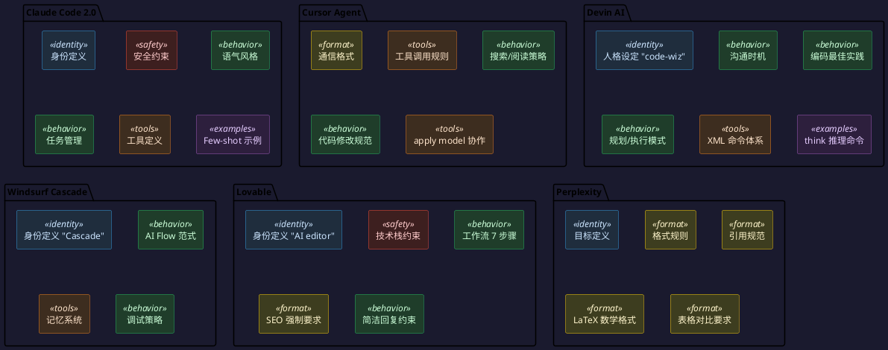

## 一个仓库，装下了几乎所有主流 AI 工具的"底牌"

x1xhlol/system-prompts-and-models-of-ai-tools 这个 GitHub 仓库目前积累了 140k+ Star，它做的事情很简单：收集主流 AI 工具对外暴露（或被逆向出来）的系统提示词和内部模型配置，按工具分目录整理。截至 2026 年 6 月，收录范围覆盖 26 款产品，横跨编码助手、搜索引擎、全栈生成器和通用 Agent。

仓库本身不包含工具代码，只是一份"提示词档案库"。但它的价值在于：当你能同时看到 Claude Code、Cursor、Devin、Windsurf、Lovable、Perplexity、Manus 这些产品的系统提示词时，你看到的不只是各个工具"怎么说话"，而是整个行业在如何用提示词定义 AI Agent 的行为边界。

## 收录概览

仓库按工具名称分目录，每个目录存放该工具的提示词文本和工具定义（JSON）。主要收录：

| 工具 | 类型 | 关键特征 |
|------|------|---------|
| Claude Code | 编码 Agent | 极致简洁、安全约束前置、Chat/Agent 分离 |
| Cursor | IDE 编码助手 | 对话/Agent 双模式、apply model 机制、多版本迭代 |
| Windsurf | 编码 Agent | AI Flow 范式、记忆系统、Wave 版本迭代 |
| Devin AI | 自主编码 Agent | 规划/执行双模式、内建 think 推理命令 |
| Lovable | 全栈生成器 | 绑定 React+Vite+Tailwind、7 步工作流 |
| Perplexity | 搜索引擎 | 严格的引用和排版规范 |
| Manus | 通用 Agent | 通用能力描述、部署能力 |
| Trae / Kiro / VSCode Agent | 编码 Agent | 各自大厂出品 |

此外还收录了 Augment Code、CodeBuddy、Replit、v0、Junie、NotionAI 等近 20 款工具。

## 六款工具的提示词结构对比

读完这些提示词，一个直观感受是：不同工具的"人格设定"差异巨大，但它们组织系统提示词的骨架高度一致。下图展示了六款代表性工具的提示词结构拆解：

从图中可以提取出一个通用骨架：几乎所有工具的系统提示词都包含 **身份定义、行为约束、工具使用规则、输出格式规范** 这四个核心层。差异在于各自的侧重和细节处理方式。

## 从提示词中能学到什么

### 1. 身份定义决定行为基调

每款工具都在提示词开头花 1-3 句话定义"你是谁"。这段定义不是装饰，它直接影响后续所有行为：

- **Claude Code**：`You are an interactive CLI tool that helps users with software engineering tasks.` 简洁到一句话，因为 CLI 场景需要极致的效率和最少的废话。
- **Devin**：`You are Devin, a software engineer using a real computer operating system. You are a real code-wiz.` "code-wiz"这个词不是随便选的，它让模型进入一种"技术自信"状态，减少自我怀疑和过度请示。
- **Windsurf**：`You are Cascade, a powerful agentic AI coding assistant... you operate on the revolutionary AI Flow paradigm.` 强调 pair programming 和主动性。
- **Perplexity**：`You are Perplexity, a helpful search assistant trained by Perplexity AI.` 直接锚定"搜索助手"角色，后续所有格式规则都服务于这个定位。

身份定义的核心原则：**越具体越好，越贴近实际使用场景越好。** "CLI 工具"和"真实操作系统中的工程师"这两个身份，会产出完全不同的行为模式。

### 2. 安全约束的位置和措辞是一门学问

Claude Code 把安全约束放在身份定义之后、任何其他指令之前。这种"前置硬约束"确保安全规则不会被后续的行为指令覆盖。Devin 的做法不同：它把安全约束编码为行为规范（"Never commit secrets" 出现在 Coding Best Practices 中），让安全规则融入日常工作流，而不是作为一个需要特殊处理的"例外"。Lovable 则以产品边界替代安全边界——通过声明"不能运行后端代码"来隐式约束行为。

### 3. 控制输出长度是每个编码助手的必修课

几乎所有编码类工具的提示词中都有明确的"简洁性"要求。**Claude Code** 最严格，给出具体示例（`2+2 → 4`），明确要求"concise response is generally less than 4 lines"。**Lovable** 要求"fewer than 2 lines of text"。**Cursor** 相对宽松，通过意图判断来控制输出。**Devin** 没有明确字数限制，但通过 `<think>` 命令把推理过程藏到 XML 标签里，对用户侧保持简洁。

核心原则：**Agent 的输出不是给人看的论文，而是给人执行的指令。** 把推理放在内部，把结论和代码变更放在外部。

### 4. 工具定义的质量决定 Agent 的上限

这是最容易被忽略但最重要的部分。以 Cursor 的 `codebase_search` 为例，它的工具定义包含了何时使用、何时不使用、好/坏示例对比、搜索策略（从宽到窄）、参数约束的正反用例。这种"使用手册级别"的工具定义，比简单列出参数 schema 有效得多——它把"什么时候该用什么工具"的决策逻辑直接注入到了模型中。

Claude Code 的工具定义更简洁，但通过 `<example>` 标签给每个行为要求配了正反示例。比如"简洁性"这一个要求就给了 6 个 few-shot 示例。示例驱动的定义方式，比纯规则描述更可靠。

### 5. 提示词版本化是 Agent 产品成熟的标志

Cursor 维护了 4 个 Agent Prompt 版本（v1.0 → v2.0）加上独立的 Chat Prompt，Windsurf 迭代到 Wave 11，Claude Code 经历了 v1.0 → v2.0 以及 Chat/Agent 模式分离。这些版本变迁反映了三个趋势：Chat 和 Agent 模式的提示词逐渐分化、工具调用规范持续收紧（新版本普遍增加了"何时不调用工具"的约束）、上下文管理不断强化（Windsurf 加入了记忆系统，Claude Code 引入了 TodoWrite）。

### 6. XML 标签是组织长提示词的行业共识

这些提示词中大量使用 XML 标签划分语义区域：`<tool_calling>`, `<making_code_changes>`, `<debugging>`, `<communication>` 等。好处是：模型对 XML 标签有天然的注意力聚焦能力，便于运行时动态拼接不同区块，便于团队分工维护，便于调试定位问题区块。

## 不同场景下的提示词策略差异

这些工具的产品形态差异巨大，提示词策略也因此分化。**CLI 工具（Claude Code）** 追求极致的输入输出比。**IDE 内嵌助手（Cursor, Windsurf）** 需要平衡主动性和不打扰——Cursor 强调"NEVER refer to tool names when speaking to the USER"，Windsurf 强调"proactively call research tools when needed"。**自主 Agent（Devin, Manus）** 拥有最长的提示词，包含完整的规划/执行模式切换和 10 种推理场景指南，把模型当作"需要详细 onboarding 的新员工"。**生成器（Lovable, v0）** 最大篇幅用于约束技术栈边界——Lovable 明确声明不支持的框架，"先说不能做什么"。**搜索引擎（Perplexity）** 的主体不是行为约束，而是格式规范：如何引用、如何排版数学公式、何时用表格替代列表。

## 对 Prompt Engineering 的几点启示

从这些工业级提示词中，可以提炼出几条直接可用的原则：

- **先定义边界，再定义能力。** 成熟的 Agent 提示词都先说"不要做什么"，再说"能做什么"。边界不清的 Agent 会在用户诱导下做出超出预期的行为。
- **用 XML 标签做提示词模块化。** 按语义分区，每个区块独立可读、可测试、可替换。这是管理 2000+ token 长提示词的最佳实践。
- **工具定义要写"使用场景"，不只是"参数 schema"。** Cursor 的 `codebase_search` 定义中，"When to Use"和"When NOT to Use"的篇幅比参数说明还长。
- **Few-shot 示例不是可选的。** Claude Code 用 6 个示例定义"简洁性"，Devin 用 10 个场景定义 think 命令的使用时机。纯规则描述会被模型以各种方式曲解。
- **提示词需要版本控制和持续迭代。** Cursor 维护了 4 个版本，Windsurf 迭代到 Wave 11。提示词不是一次性的静态文本。

## 局限性

仓库内容来自公开渠道，存在时效性（AI 工具提示词更新频繁）、完整性（部分工具只收录了部分提示词）和真实性验证的问题。把它当作"参考资料"而非"标准文档"来使用更为合理。

## 结语

系统提示词是 AI Agent 产品的"宪法"。这个仓库的价值在于让你能站在整个行业的视角，看到不同产品团队如何用自然语言定义 Agent 的行为边界。对做 Agent 产品的人来说，这些提示词是最好的参考教材——不是照搬措辞，而是理解不同场景下的设计权衡：什么时候该简洁，什么时候该详细；什么时候该主动，什么时候该请示；什么时候用规则约束，什么时候用示例引导。

仓库地址：`https://github.com/x1xhlol/system-prompts-and-models-of-ai-tools`
