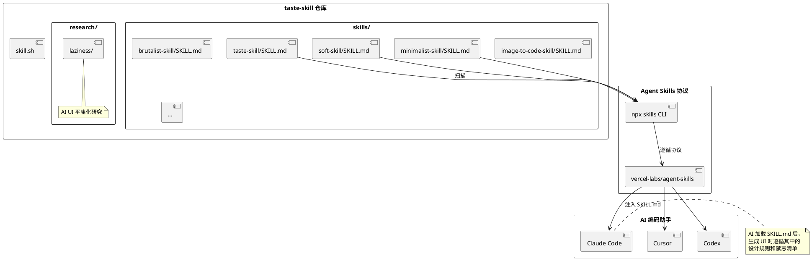

## 简介

让 AI 编码助手（Claude Code、Cursor、Copilot）生成前端界面时，有一个普遍的问题：产出的 UI 千篇一律——居中对齐、平庸配色、缺乏层次、到处是 em-dash 和渐变按钮。这不是 AI 的错，而是它的训练数据决定了它的"审美偏好"。

Taste-Skill 的做法是给 AI 注入一套**设计品味规则**。它不是 UI 组件库，不是 CSS 框架，而是一组 SKILL.md 文件——每个文件告诉 AI"不要居中万能布局"、"禁止 em-dash"、"用不对称的现代排版"。

43.5k stars，本质上是 prompt engineering 的胜利——通过精心撰写的 Markdown 指令，改变 AI 生成前端 UI 时的审美偏好。

## 项目概览

| 属性 | 详情 |
|------|-----|
| 仓库 | [Leonxlnx/taste-skill](https://github.com/Leonxlnx/taste-skill) |
| Stars | 43.5k（截至 2026-06-14） |
| 许可证 | MIT |
| 语言 | Shell（100%，本质是 Markdown 指令集） |
| 主要作者 | Leon Lin（101/107 commits） |
| 官网 | [tasteskill.dev](https://tasteskill.dev) |
| 创建时间 | 2026-02-19 |
| 兼容 Agent | Claude Code、OpenAI Codex、Cursor，以及任何能加载 SKILL.md 的 agent |

## 核心功能

项目包含 **13 个技能**，分为代码类和图像生成类：

### 代码类技能（输出前端代码）

| 技能 | 安装名 | 说明 |
|------|--------|------|
| **taste-skill** (v2) | `design-taste-frontend` | 默认技能。三旋钮系统 + GSAP 骨架代码 + 反 em-dash 规则 |
| **taste-skill-v1** | `design-taste-frontend-v1` | 原版 v1，为兼容性保留 |
| **gpt-tasteskill** | `gpt-taste` | 针对 GPT/Codex 的更严格变体 |
| **image-to-code-skill** | `image-to-code` | 图生代码流水线：先生成参考图 → 分析 → 实现前端 |
| **redesign-skill** | `redesign-existing-projects` | 对已有项目做 UI 审计并修复 |
| **soft-skill** | `high-end-visual-design` | 高端、柔和、留白多的"贵价感" UI |
| **minimalist-skill** | `minimalist-ui` | Notion/Linear 风格的编辑式产品 UI |
| **brutalist-skill** | `industrial-brutalist-ui` | 瑞士排版风格、强对比、实验性布局 |
| **output-skill** | `full-output-enforcement` | 防止 AI 输出截断、占位符注释 |
| **stitch-skill** | `stitch-design-taste` | 兼容 Google Stitch 的规则 |

### 图像生成类技能（只输出参考图）

| 技能 | 安装名 | 说明 |
|------|--------|------|
| **imagegen-frontend-web** | 同名 | 网页端设计稿（hero、landing、多区块） |
| **imagegen-frontend-mobile** | 同名 | 移动端屏幕和流程 |
| **brandkit** | 同名 | 品牌工具包：logo 方向、色板、字体、VI 应用 |

## 快速上手

### 安装

```bash
# 安装所有技能
npx skills add https://github.com/Leonxlnx/taste-skill

# 安装单个技能
npx skills add https://github.com/Leonxlnx/taste-skill --skill "design-taste-frontend"

# 也可以直接复制 SKILL.md 到项目中，或粘贴到 ChatGPT/Codex 对话里
```

### 使用（Claude Code）

安装后，在 Claude Code 中让 AI 生成 UI 时，它会自动加载 taste-skill 的规则：

```text
> "帮我设计一个 SaaS landing page"
```

AI 会遵循 taste-skill 的规则：
- 不用居中万能布局
- 不用 em-dash
- 用不对称的现代排版
- 用 GSAP 做动效
- 根据三旋钮系统调整设计方差

### 三旋钮系统

taste-skill 的核心是三个 1-10 的可调参数：

```markdown
// SKILL.md 顶部

DESIGN_VARIANCE: 7     // 布局实验性（低 = 居中整洁，高 = 不对称现代）
MOTION_INTENSITY: 5    // 动效强度（低 = 仅 hover，高 = 滚动/磁性效果）
VISUAL_DENSITY: 4      // 信息密度（低 = 留白多，高 = 密集仪表盘）
```

用户可以根据项目需求调整这三个旋钮，AI 会相应地调整生成风格。

## 架构与原理

### 技术实现的极简性

整个项目是 **100% Shell/Markdown**，没有任何 JavaScript/TypeScript 运行时。



### SKILL.md 的内容结构

以 `taste-skill/SKILL.md` 为例，它大致包含：

```markdown
# Taste Skill v2

## 设计规则

### 禁止清单
- 禁止 em-dash（—）
- 禁止居中万能布局
- 禁止渐变按钮（除非有充分理由）
- 禁止 "Learn More" 作为 CTA

### 排版层级
- H1: 48-72px, letter-spacing: -0.02em
- H2: 32-48px, letter-spacing: -0.01em
- Body: 16-18px, line-height: 1.6

### 动效策略
- 使用 GSAP 做滚动触发动画
- 磁性效果（magnetic hover）用于 CTA 按钮
- 页面过渡用 View Transitions API

## 三旋钮

DESIGN_VARIANCE: 7
MOTION_INTENSITY: 5
VISUAL_DENSITY: 4

## 重新设计审计协议

如果用户要求重新设计现有项目：
1. 先截图当前 UI
2. 列出 5 个最大的设计问题
3. 提出改进方案
4. 实现改进后的版本
5. 对比截图
```

这些规则被 AI 加载后，会成为它生成 UI 时的约束。

### Agent Skills 协议

taste-skill 遵循 [vercel-labs/agent-skills](https://github.com/vercel-labs/agent-skills) 规范。`npx skills` CLI 的工作流程：

```text
1. 扫描仓库中的 skills/ 目录
2. 列出所有可用的 skill（每个 skill 目录下有 SKILL.md）
3. 让用户选择要安装哪些
4. 将选中的 skill 复制到目标项目的 .claude/skills/ 或 .cursor/rules/ 目录
5. AI 编码助手在生成 UI 时自动加载对应的 SKILL.md
```

### 研究基础

`research/laziness/` 目录包含一份研究报告，分析了 AI 生成 UI 的"平庸化"倾向。核心观点是：

- AI 倾向于选择"安全"的设计（居中、对称、标准配色）
- 这是因为训练数据中"标准"UI 的数量远多于"实验性"UI
- 通过显式注入规则，可以打破这种偏好

## 关键设计决策

**1. 为什么用 Markdown 而非代码？**

Markdown 是 AI 最容易理解和执行的格式。它不需要运行时，不需要依赖，不需要编译。一个 SKILL.md 文件就是一条清晰的指令。

**2. 为什么有三旋钮系统？**

不同项目有不同的设计需求。一个企业官网需要稳重（低方差、低动效），一个创意机构网站需要实验性（高方差、高动效）。三旋钮让用户可以微调 AI 的设计偏好。

**3. 为什么要反 em-dash？**

em-dash（—）是 AI 生成文本的常见特征之一。在 UI 中过度使用 em-dash 会让界面看起来"机器味"很重。禁止它是"去 AI 化"的一部分。

**4. 为什么有多个风格技能？**

不同项目需要不同的设计语言。soft-skill 适合高端品牌，minimalist-skill 适合工具类产品，brutalist-skill 适合创意机构。用户可以根据项目选择合适的技能。

**5. 为什么框架无关？**

规则针对"设计意图"而非特定框架 API。无论用户用 React、Vue 还是 Svelte，设计原则是通用的。

## 适用场景与局限

### 适用场景

- **Landing Page 设计**：让 AI 生成有设计感的营销页面
- **产品官网**：告别千篇一律的 Bootstrap 风格
- **创意项目**：用 brutalist-skill 做实验性设计
- **UI 重设计**：用 redesign-skill 审计并改进现有界面
- **设计系统构建**：用 brandkit 建立品牌视觉规范

### 局限

- **本质是 prompt engineering**：技术门槛不高，核心是设计品味的沉淀
- **个人项目**：99% 代码由一人贡献，长期维护存在风险
- **v2 仍在实验阶段**：API 和行为可能变动
- **不能替代设计师**：能提升 AI 生成 UI 的质量，但不能替代专业设计
- **需要手动调整旋钮**：三旋钮系统需要用户根据项目需求调整

## 参考资料

- 官方仓库：[Leonxlnx/taste-skill](https://github.com/Leonxlnx/taste-skill)
- 官网：[tasteskill.dev](https://tasteskill.dev)
- Agent Skills 协议：[vercel-labs/agent-skills](https://github.com/vercel-labs/agent-skills)
- 作者 Twitter：[@lexnlin](https://x.com/lexnlin)
