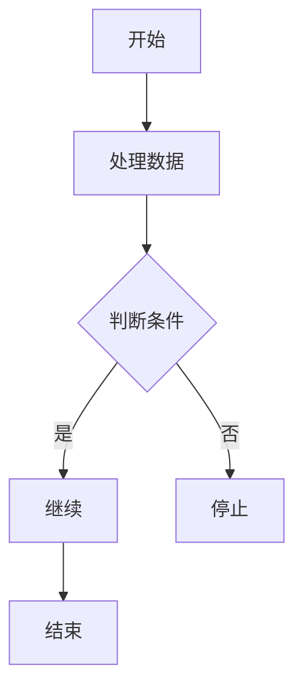
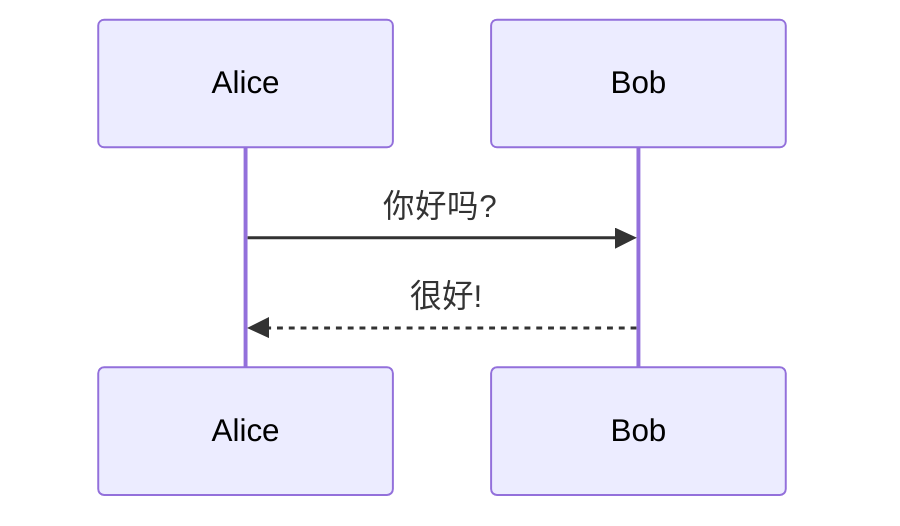

## 流程图测试

点击下方图表应该可以放大查看：

```mermaid
graph TD
    A[开始] --> B[处理数据]
    B --> C{判断条件}
    C -->|是| D[继续]
    C -->|否| E[停止]
    D --> F[结束]
```

## 序列图测试

```mermaid
sequenceDiagram
    Alice->>Bob: 你好吗?
    Bob-->>Alice: 很好!
```

**提示**: 点击图表查看放大效果，可以按 ESC 或点击背景关闭。