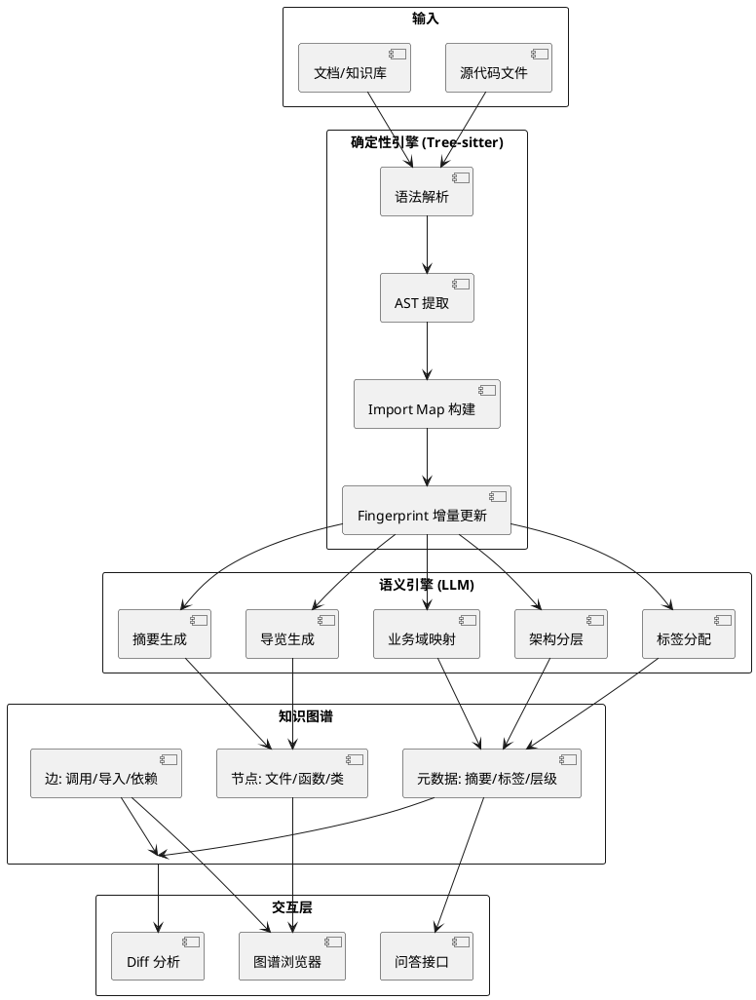
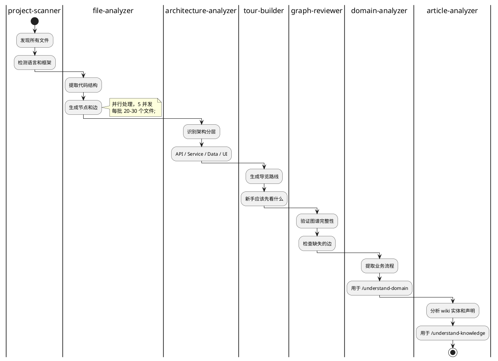

## 简介

接手一个陌生代码库时，真正费时的不是读代码本身，而是理解代码之间的关系——哪个函数调用了哪个、数据从哪来、业务逻辑如何串联。传统的代码搜索和 IDE 跳转能解决局部问题，但缺少全局视图。

Understand-Anything 的做法是把代码转化为**可交互的知识图谱**。文件、函数、类成为节点，调用关系、导入关系成为边。你可以在图谱上点击、搜索、探索，甚至直接向 AI 提问"一个 HTTP 请求是如何到达数据库的"。

59k stars，支持 13+ 个 AI 编码平台（Claude Code、Cursor、VS Code + Copilot、Codex、Gemini CLI 等），它的口号是"Graphs that teach, not graphs that impress"——教人的图，而非取悦人的图。

## 项目概览

| 属性 | 详情 |
|------|-----|
| 仓库 | [Egonex-AI/Understand-Anything](https://github.com/Egonex-AI/Understand-Anything) |
| Stars | 59k（截至 2026-06-14） |
| 许可证 | MIT |
| 语言 | TypeScript（70.5%）、JavaScript（16.2%）、Python（9.5%） |
| 原作者 | Lum1104（林宇翔） |
| 所属组织 | Egonex-AI |
| 最新版本 | v2.7.3（2026-05-19） |
| 兼容平台 | Claude Code、Cursor、VS Code + Copilot、Codex、Gemini CLI、Kimi、Trae 等 13+ 个 |

## 核心功能

### 9 大核心能力

1. **交互式结构图谱**：文件、函数、类作为节点，支持点击、搜索、探索
2. **业务逻辑视图**：将代码映射到真实业务流程
3. **知识库分析**：基于 Karpathy 模式 LLM wiki 生成力导向图，支持社区聚类
4. **自动引导导览**：自动生成架构导览路线（Guided Tours）
5. **模糊/语义搜索**：按名称或语义查找代码
6. **Diff 影响分析**：提交前预览代码变更的连锁影响
7. **Persona-Adaptive UI**：根据用户角色（初级开发、PM、高级用户）自适应界面
8. **分层可视化**：自动按架构层（API、Service、Data、UI、Utility）分组
9. **语言概念解释**：内置 12 种语言模式的情景化解释

### 支持的命令

以 Claude Code 为例：

| 命令 | 用途 |
|------|------|
| `/understand` | 分析当前项目，构建知识图谱 |
| `/understand-dashboard` | 打开交互面板 |
| `/understand-chat` | 基于图谱的问答 |
| `/understand-diff` | 差异影响分析 |
| `/understand-explain <file>` | 深入解析某个文件 |
| `/understand-onboard` | 生成新手引导 |
| `/understand-domain` | 提取业务域 |
| `/understand-knowledge <path>` | 分析知识库/文档 |

## 快速上手

### 安装（Claude Code）

```bash
# 1. 安装插件
/plugin marketplace add Egonex-AI/Understand-Anything
/plugin install understand-anything

# 2. 分析项目
/understand

# 3. 打开交互面板
/understand-dashboard
```

### 安装（Cursor）

```bash
# 一键安装脚本
curl -fsSL https://raw.githubusercontent.com/Egonex-AI/Understand-Anything/main/install-cursor.sh | sh
```

### 使用流程

1. 在项目根目录运行 `/understand`，工具会扫描代码库，构建知识图谱
2. 运行 `/understand-dashboard`，打开交互式图谱浏览器
3. 在图谱上点击节点，查看函数源码、调用关系
4. 使用 `/understand-chat` 提问，如"一个 HTTP 请求从路由到数据库的完整路径是什么"

## 架构与原理

### 双引擎架构

Understand-Anything 的核心设计是 **Tree-sitter（确定性层）+ LLM（语义层）** 的混合方案。



### Tree-sitter：确定性层

Tree-sitter 负责语法解析。它为每种编程语言生成一个精确的 AST（抽象语法树），从中提取：

- **函数/类/方法定义**
- **Import/Export 关系**
- **变量作用域**
- **调用关系**

Tree-sitter 的优势是**确定性和增量更新**。它通过 fingerprint 机制，只重新解析发生变化的文件，而不是整个代码库。这对大型项目至关重要。

### LLM：语义层

Tree-sitter 能告诉你"函数 A 调用了函数 B"，但不能告诉你"函数 A 的作用是处理用户登录"。这层语义理解由 LLM 完成。

LLM 负责：

- **生成摘要**：每个函数/类一句话描述
- **打标签**：frontend / backend / database / auth / api 等
- **分配架构层级**：API 层、Service 层、Data 层、UI 层
- **映射业务域**：用户管理、订单处理、支付等
- **生成导览路线**：新手应该先看哪些文件

### 多 Agent 流水线

Understand-Anything 用 **7 个专业 Agent** 协作完成分析：



每个 Agent 有明确的职责边界，流水线支持并行执行。默认 5 并发，每批处理 20-30 个文件。

### 增量更新机制

每次代码变更后，Understand-Anything 不需要重新分析整个代码库。它通过 **fingerprint（指纹）** 机制，只更新发生变化的文件：

```text
1. 计算每个文件的 hash
2. 对比上次分析时的 hash
3. 只重新解析 hash 变化的文件
4. 增量更新知识图谱
```

这让大型项目（数万文件）的分析也能在几秒内完成。

## 关键设计决策

**1. 为什么用 Tree-sitter + LLM 混合，而不是纯 LLM？**

纯 LLM 分析代码有几个问题：
- 不确定性：同样的代码可能生成不同的分析结果
- Token 成本：把整个代码库塞进 context window 太贵
- 速度慢：LLM 推理比 Tree-sitter 解析慢几个数量级

Tree-sitter 解决结构和关系的确定性提取，LLM 只负责语义理解（摘要、标签、分层）。这种分工既快又准。

**2. 为什么作为插件而非独立 IDE？**

独立 IDE 的迁移成本太高。作为插件嵌入 Claude Code、Cursor、VS Code 等现有工具，用户不需要改变工作习惯，只需安装一个插件。

**3. 为什么需要 7 个 Agent？**

每个 Agent 专注一个子任务，职责清晰，可以独立优化。file-analyzer 可以并行处理数百个文件，architecture-analyzer 可以用更复杂的模型来理解架构，domain-analyzer 可以针对业务领域做特殊处理。

**4. 为什么支持 Persona-Adaptive UI？**

初级开发者需要更多解释和导览，高级用户需要快速定位和影响分析。同一个图谱，不同角色看到的视图不同。

## 适用场景与局限

### 适用场景

- **接手陌生代码库**：快速理解整体架构和关键模块
- **新人 onboarding**：自动生成导览路线，减少 mentor 负担
- **代码审查**：在提交前预览变更的影响范围
- **文档缺失的项目**：从代码反向生成架构文档
- **知识库分析**：把 Markdown/文档转化为可交互的知识图谱

### 局限

- **依赖 LLM API**：语义分析需要调用 LLM，有成本
- **语言支持差异**：Tree-sitter 对主流语言（TS/JS/Python/Go/Java）支持好，对小语种支持有限
- **大型项目首次分析慢**：数万文件的项目，首次分析可能需要几分钟
- **业务域映射不完美**：LLM 对业务逻辑的理解可能不准确
- **图谱可视化有信息密度上限**：超大项目的图谱可能过于密集

## 参考资料

- 官方仓库：[Egonex-AI/Understand-Anything](https://github.com/Egonex-AI/Understand-Anything)
- Tree-sitter：[tree-sitter.github.io](https://tree-sitter.github.io/)
- Egonex-AI 组织：[github.com/Egonex-AI](https://github.com/Egonex-AI)
- 原作者：[Lum1104](https://lum.is-a.dev/)
