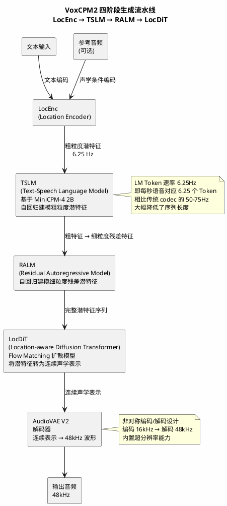

## 项目概览

VoxCPM 是 OpenBMB 团队开源的语音合成系统，当前版本 VoxCPM2 是一个 2B 参数的模型，在超过 200 万小时的多语言语音数据上训练，支持 30 种语言的文本转语音、基于自然语言描述的声音设计、可控声音克隆，以及 48kHz 高质量音频输出。底层语言模型基于 MiniCPM-4 构建。

| 属性 | 值 |
|------|-----|
| 仓库 | [OpenBMB/VoxCPM](https://github.com/OpenBMB/VoxCPM) |
| Stars | 30.0k |
| 许可证 | Apache-2.0 |
| 语言 | Python（PyTorch） |
| 最新版本 | v2.0.3（2026-05-11） |
| 模型参数 | 2B（VoxCPM2） |
| 训练数据 | 200 万+ 小时多语言语音 |
| 支持语言 | 30 种语言 + 9 种中文方言 |
| 输出采样率 | 48kHz（输入参考音频 16kHz） |
| 安装方式 | `pip install voxcpm` |
| 技术报告 | [arXiv:2606.06928](https://arxiv.org/abs/2606.06928) |

---

## 核心设计：无 Tokenizer 的扩散自回归架构

VoxCPM 与其他 TTS 系统最根本的区别在于它完全绕过了离散 Tokenization 这一步骤。传统 TTS 方案（如 CosyVoice、VALL-E 系列）通常先将连续音频波形编码为离散声学 Token，再用语言模型对这些 Token 做自回归预测，最后通过声码器将 Token 还原为波形。这条路径存在一个固有的信息瓶颈：离散化过程不可避免地引入量化误差，尤其在高频细节和瞬态特征上。

VoxCPM 选择了一条不同的路径——直接在连续潜空间（latent space）中建模和生成语音。模型运行在 AudioVAE V2 的潜空间中，采用四阶段流水线：



### 四个阶段的具体职责

**LocEnc（Location Encoder）**：同时处理文本和参考音频（如果有的话），将它们编码为统一的潜特征表示。对于纯 TTS 任务，它负责将文本序列映射到潜空间；对于声音克隆任务，它还负责从参考音频中提取说话人声学特征作为条件。

**TSLM（Text-Speech Language Model）**：基于 MiniCPM-4 的 2B 参数语言模型，以自回归方式生成粗粒度的语音潜特征。LM Token 速率为 6.25Hz——即每秒语音对应 6.25 个 Token 帧。这个数字值得注意：传统神经声码器（如 EnCodec、DAC）的 Token 速率通常在 50-75Hz，VoxCPM 通过让每个 Token 帧承载更多信息（连续向量而非离散 ID），将序列长度压缩了一个数量级，降低了自回归建模的计算量。

**RALM（Residual Autoregressive Model）**：对 TSLM 输出的粗粒度特征进行细粒度补充。TSLM 生成的潜特征只包含语音的宏观结构，RALM 通过自回归方式逐帧预测残差，补充细节信息。这种"粗到细"的两级自回归策略，在保证生成质量的同时控制了计算开销。

**LocDiT（Location-aware Diffusion Transformer）**：基于 Flow Matching 的扩散 Transformer，将 RALM 输出的离散帧潜特征转换为连续的声学表示。LocDiT 在每一帧内部执行扩散去噪过程，同时感知帧间位置信息，确保输出的连续性。

**AudioVAE V2**：最终的解码器，将连续的声学潜表示解码为 48kHz 波形。AudioVAE V2 采用了非对称设计——编码端接受 16kHz 输入，解码端输出 48kHz，内置超分辨率能力，不需要额外的上采样器。

### 为什么绕过 Tokenizer

离散 Tokenization 的核心问题在于信息损失。将连续频谱量化为有限码本中的离散 ID，本质上是做了一次有损压缩。这带来几个直接后果：

- **高频细节丢失**：量化过程倾向于保留频谱的宏观结构，对高频泛音、瞬态冲击等细微特征的表达力有限。
- **码本-模型耦合**：离散 Token 的质量高度依赖声学 Tokenizer（如 EnCodec、DAC）的训练质量和码本大小。码本太小表达力不足，码本太大自回归建模困难。
- **误差级联**：自回归模型基于离散 Token 做预测，每一步的离散化误差会在后续步骤中累积。

VoxCPM 的思路是：既然语言模型已经能处理连续向量（embedding），为什么不直接在连续空间里做自回归？这样避免了量化环节，理论上可以保留更丰富的声学信息。

代价也是明显的：连续空间的自回归不像离散 Token 那样可以简单地用交叉熵损失做 next-token prediction，需要引入扩散模型来逐步生成每一帧的连续向量，推理时需要多步去噪，这直接影响推理速度。

---

## 版本演进

VoxCPM 项目经历了三个主要版本：

| 特性 | VoxCPM2 | VoxCPM1.5 | VoxCPM-0.5B |
|------|---------|-----------|-------------|
| 状态 | 最新推荐 | 稳定版 | 遗留版 |
| 参数量 | 2B | 0.6B | 0.5B |
| 音频采样率 | 48kHz | 44.1kHz | 16kHz |
| LM Token 速率 | 6.25Hz | 6.25Hz | 12.5Hz |
| 支持语言数 | 30 | 2（中英） | 2（中英） |
| 声音设计 | 支持 | 不支持 | 不支持 |
| 可控声音克隆 | 支持 | 不支持 | 不支持 |
| SFT / LoRA | 支持 | 支持 | 支持 |
| VRAM 占用 | ~8 GB | ~6 GB | ~5 GB |
| RTF（RTX 4090） | ~0.30 | ~0.15 | ~0.17 |
| RTF（Nano-vLLM） | ~0.13 | ~0.08 | ~0.10 |

VoxCPM2 在 VoxCPM1.5 基础上做了三个关键升级：语言覆盖从 2 种扩展到 30 种，新增了声音设计和可控克隆能力，输出采样率从 44.1kHz 提升到 48kHz 并内置超分辨率。

---

## 与其他 TTS 方案的对比

以下对比聚焦架构层面的差异，而非单纯的跑分高低：

| 维度 | VoxCPM2 | CosyVoice2 | F5-TTS | VALL-E 系列 |
|------|---------|------------|--------|-------------|
| 声学表示 | 连续潜向量 | 离散 codec Token + Flow Matching | 连续 mel 谱（Flow Matching） | 离散 codec Token |
| 自回归策略 | 两级（粗+残差） | 单级 Token 自回归 | 非自回归（一次性 Diffusion） | 单级 Token 自回归 |
| 声码器依赖 | 无（AudioVAE 直接输出波形） | 需要（HiFi-GAN 等） | 需要 | 需要 |
| 参数量 | 2B | 0.5B | 0.3B | 1B+ |
| 多语言 | 30 语言 | 多语言 | 中英 | 中英 |
| 声音克隆方式 | 参考音频 + 文本描述 | 参考音频 | 参考音频 | 参考音频 |
| 输出采样率 | 48kHz | 24kHz | 24kHz | 24kHz |
| 开源许可 | Apache-2.0 | Apache-2.0 | MIT | 部分开源 |

几个值得关注的结构性差异：

**VoxCPM2 vs F5-TTS**：F5-TTS 采用纯非自回归的 Flow Matching 方案，推理时一次性生成整段音频的 mel 谱，不需要逐步解码，因此推理速度快。但非自回归方案的代价是长文本生成质量下降，因为模型需要在一个很大的状态空间里同时规划所有帧。VoxCPM2 的自回归方案在长文本生成上更稳定，但推理延迟更高。

**VoxCPM2 vs CosyVoice 系列**：CosyVoice 使用离散 Token + Flow Matching 的混合方案，先用 codec 将音频离散化为 Token，再用自回归模型预测 Token，最后用 Flow Matching 将 Token 还原为连续频谱。VoxCPM2 跳过了中间的离散化步骤，直接在连续空间建模。CosyVoice 的优势在于模型更轻量（0.5B vs 2B），推理更快（RTF ~0.15 vs ~0.30）；劣势在于离散化带来的信息损失，以及需要额外维护 codec 模型。

**VoxCPM2 vs Qwen3-Omni**：Qwen3-Omni 是 30B-A3B 的多模态模型，TTS 只是其能力之一。VoxCPM2 是专用 TTS 模型，在声音克隆的相似度和自然度上通常优于通用模型，且模型体积和推理成本小得多。

---

## 设计权衡

VoxCPM 的无 Tokenizer 方案不是免费的午餐，每个设计选择都有对应的代价：

| 设计选择 | 收益 | 代价 |
|---------|------|------|
| 无离散 Tokenizer | 避免量化损失，保留更多声学细节 | 无法复用成熟的 codec 生态（EnCodec、DAC 等） |
| 连续空间扩散自回归 | 生成质量高，表达力强 | 推理需要多步去噪，RTF ~0.30（比离散方案慢） |
| 两级自回归（TSLM + RALM） | 粗到细，兼顾效率和细节 | 模型结构复杂度增加，调试和优化的难度更高 |
| AudioVAE V2 非对称编解码 | 内置超分辨率，输入 16kHz 输出 48kHz | 解码端计算量更大，VRAM 占用 ~8GB |
| 6.25Hz LM Token 速率 | 序列长度短，自回归计算量可控 | 每帧承载信息量大，对单帧建模能力要求高 |
| 2B 参数规模 | 模型表达力强，benchmark 表现好 | VRAM 需求 8GB，在消费级 GPU 上偏紧 |
| Flow Matching（LocDiT） | 训练稳定，生成质量高 | 推理步数（默认 10 步）是额外开销 |

其中推理速度是最直接的代价。RTF 0.30 意味着生成 1 秒语音需要 0.3 秒计算——对于离线批量生成场景不是问题，但对实时对话场景来说，还需要依赖 Nano-vLLM 或 vLLM-Omni 做推理加速（RTF 可降到 ~0.13）。

---

## 功能特性详解

### 声音设计（Voice Design）

不需要参考音频，仅通过自然语言描述来创建声音。用法是在文本开头用括号包裹描述：

```python
wav = model.generate(
    text="(A young woman, gentle and sweet voice)Hello, welcome to VoxCPM2!",
    cfg_value=2.0,
    inference_timesteps=10,
)
```

在 InstructTTSEval 基准上，VoxCPM2 在中英文声音设计指标上均达到开源模型最佳水平（中文 APS 85.2，英文 APS 84.2、DSD 83.2、RP 71.4）。

### 可控声音克隆（Controllable Voice Cloning）

提供一段参考音频，模型克隆其音色，同时可以通过文本指令调整语速、情感和风格。与纯粹的"照搬"式克隆不同，这种方式允许在保持音色的前提下改变说话方式。

### 极致克隆（Ultimate Cloning）

同时提供参考音频及其文本转录，模型会从参考音频"续写"，完整保留音色、节奏、情感等所有声学细节。这是相似度最高的克隆方式，本质上是一种音频续写（audio continuation）。

### 流式生成

支持流式 API，通过 `generate_streaming` 方法分块输出音频，适合需要低延迟的场景：

```python
for chunk in model.generate_streaming(text="Hello world"):
    # 处理每个音频块
    pass
```

v2.0.3 版本引入了 `StreamingVAEDecoder`，通过状态化解码避免了重叠区域的冗余计算，降低了流式推理的延迟。

---

## 适用场景

| 场景 | 适配度 | 说明 |
|------|--------|------|
| 多语言 TTS 应用 | 高 | 30 语言覆盖广，无需语言标签自动切换 |
| 声音克隆产品 | 高 | 三种克隆模式覆盖不同精度需求 |
| 有声书/配音制作 | 高 | 48kHz 输出质量满足专业需求 |
| 实时语音对话 | 中 | 标准推理 RTF ~0.30，需搭配 vLLM 加速才能满足实时性 |
| 低资源设备部署 | 中低 | 2B 参数 + 8GB VRAM，不适合移动端或嵌入式场景 |
| 低资源语言 TTS | 中 | 部分语言（如缅甸语、老挝语）在第三方评测中表现一般 |
| 个性化语音定制 | 高 | 支持 LoRA 微调，5-10 分钟音频即可适配 |
| 声音创意/设计 | 高 | Voice Design 功能允许纯文本创建声音，无需录音 |

---

## 微调与生态

VoxCPM 支持全参数微调（SFT）和 LoRA 微调，最低 5-10 分钟音频即可适配特定说话人、语言或领域。v2.0.3 新增了 `voxcpm validate` 命令用于训练数据预检，支持在训练前发现 JSONL 格式、采样率、音频文件路径等问题。

推理部署方面有三个选项：标准 PyTorch 推理（`pip install voxcpm`），适合开发调试；Nano-vLLM（`pip install nano-vllm-voxcpm`），支持并发请求和 FastAPI 服务；vLLM-Omni，提供 OpenAI 兼容的 `/v1/audio/speech` 接口，适合生产环境多租户部署。

社区生态方面，已有 VoxCPM.cpp（GGML/GGUF CPU 推理）、VoxCPM-ONNX（ONNX 导出）、voxcpm_rs（Rust 重写）、ComfyUI 集成等多个第三方项目。

---

## 几个值得关注的技术细节

**LM Token 速率的权衡**：6.25Hz 意味着 10 秒语音只需要 62.5 个 Token 帧。作为对比，EnCodec 在 24kHz 采样率下使用 8 个码本时，Token 速率约为 75Hz。更低的 Token 速率直接降低了自回归解码的计算量，但要求每个 Token 帧编码更多的声学信息。VoxCPM 的做法是用连续向量（而非离散 ID）来表示每一帧，信息容量理论上不受码本大小限制。

**AudioVAE V2 的非对称设计**：编码端接受 16kHz（大多数训练数据的采样率），解码端输出 48kHz。这个设计很实用——训练数据的采样率参差不齐，强制重采样到 48kHz 既浪费存储又可能引入混叠失真。让模型在 16kHz 空间编码、在 48kHz 空间解码，相当于把超分辨率融入了 VAE 的训练目标中。

**MPS 后端支持**：v2.0.3 修复了 Apple Silicon 上的 MPS 音频质量问题，通过将低精度 dtype 自动提升为 float32 来避免精度问题。这意味着在 M 系列芯片的 Mac 上可以直接推理，虽然速度不如 CUDA，但足够做开发验证。
